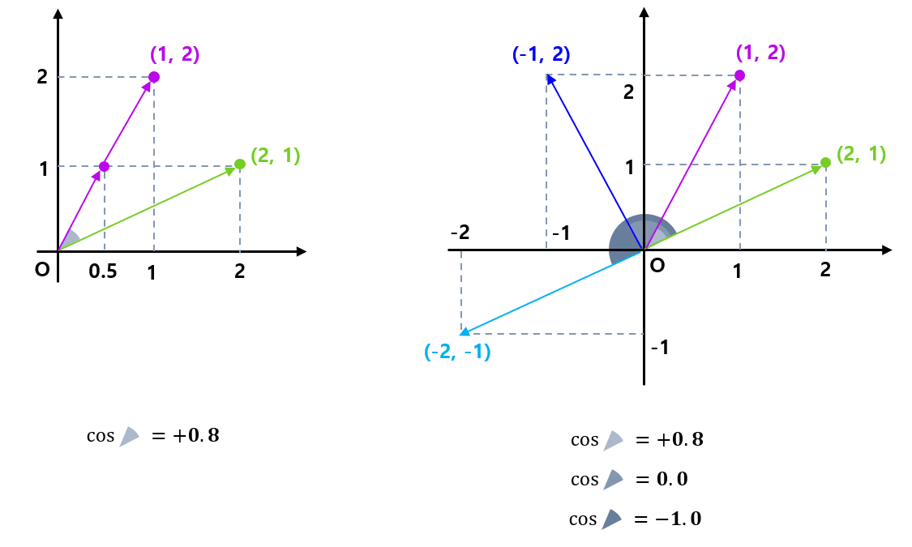
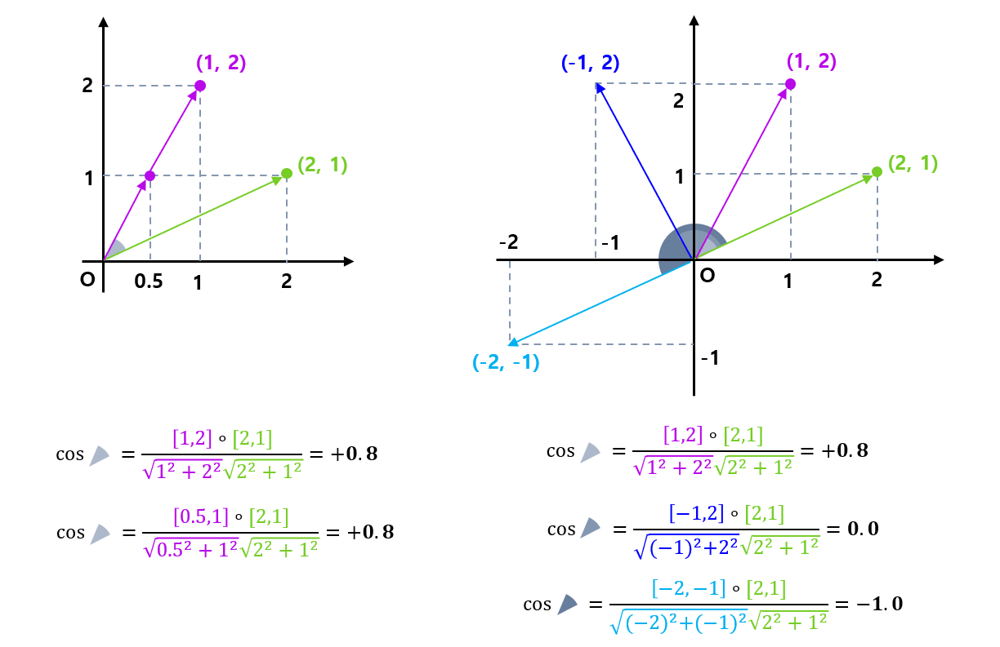

## 목차

* [1. Cosine Similarity 의 핵심 아이디어](#1-cosine-similarity-의-핵심-아이디어)
* [2. Cosine Similarity 의 정의](#2-cosine-similarity-의-정의)
* [3. Cosine Similarity 의 용도](#3-cosine-similarity-의-용도)

## 1. Cosine Similarity 의 핵심 아이디어

Cosine Similarity 의 핵심 아이디어는 다음과 같다.

* **벡터의 크기는 중요하지 않고, 방향을 중요하게 본다.**
* 두 벡터의 방향이 비슷한지, 아니면 반대 방향인지를 -1.0 ~ +1.0 의 값으로 나타낸다.
  * 이 점에서 상관계수와 일정 부분 유사한 개념이라고 할 수 있다.

## 2. Cosine Similarity 의 정의

Cosine Similarity 는 다음과 같이 정의한다.

* **차원 (원소 개수) 이 같은 두 벡터** $v_1 = [v_{11}, v_{12}, ..., v_{1n}]$ 과 $v_2 = [v_{21}, v_{22}, ..., v_{2n}]$ 가 있을 때,
* $v_1$ 과 $v_2$ 의 Cosine Similarity 는 다음과 같다.
  * 두 벡터 간의 **각도의 코사인 (cos) 값** 
  * $\displaystyle \frac{v_1 · v_2}{\parallel v_1 \parallel \parallel v_2 \parallel}$ 
* Cosine Similarity 의 특징은 다음과 같다.
  * 서로 **방향이 일치** 하는 두 벡터의 경우, **+1.0**
  * 서로 **수직** 인 두 벡터의 경우, **0.0**
  * 서로 **정반대 방향** 의 두 벡터의 경우, **-1.0**

Cosine Similarity 의 실제 계산 결과를 예로 들면 위와 같다.

* left : **코사인 유사도 값은 계산 대상 벡터의 크기의 영향을 받지 않는다**
* right : **한 벡터와, 여러 가지 서로 다른 벡터 간의 코사인 유사도 값**

## 3. Cosine Similarity 의 용도

Cosine Similarity 는 다음과 같이 다양한 용도로 사용된다.

* Cosine Similarity 사용 가능 조건
  * 비교하려는 **2개의 대상** 을 **여러 개의 숫자로 이루어진 벡터** 로 나타낼 수 있어야 함 (embedding 등)

* Cosine Similiarity 실제 사용 예시

| 분야                      | Cosine Similarity 사용 예시                                                                                                                    |
|-------------------------|--------------------------------------------------------------------------------------------------------------------------------------------|
| NLP                     | [S-BERT (Sentence BERT) 모델](../../Natural%20Language%20Processing/Basics_BERT,%20SBERT%20모델.md#sbert-모델)                                   |
| Vision + 언어 멀티모달 생성형 모델 | [StyleCLIP](../../Paper%20Study/Vision%20Model/%5B2025.06.20%5D%20StyleCLIP%20-%20Text-Driven%20Manipulation%20of%20StyleGAN%20Imagery.md) |
| 추천 시스템                  | 상품을 vector 로 임베딩하여, 고객의 상품 구매 패턴에 따른 상품 추천                                                                                                 |
