## 목차
* [1. 파악해야 하는 상관관계의 유형](#1-파악해야-하는-상관관계의-유형)
* [2. Numerical과 Numerical의 상관관계](#2-numerical과-numerical의-상관관계)
  * [2-1. 전체 Numerical Feature 의 상관계수 (Correlation) 분석 차트](#2-1-전체-numerical-feature-의-상관계수-correlation-분석-차트)
* [3. Numerical과 Categorical의 상관관계](#3-numerical과-categorical의-상관관계)
  * [3-1. Category 별 특정 Numerical feature 의 box plot](#3-1-category-별-특정-numerical-feature-의-box-plot) 
  * [3-2. Category 별 특정 Numerical feature 의 density chart](#3-2-category-별-특정-numerical-feature-의-density-chart) 
  * [3-3. Category 별 2개의 Numeric feature 산점도](#3-3-category-별-2개의-numeric-feature-산점도)
* [4. Categorical과 Categorical의 상관관계](#4-categorical과-categorical의-상관관계)
  * [4-1. 막대그래프](#4-1-막대그래프) 
* [5. 탐구](#5-탐구)
  * [5-1. 종합 결론 (라이브러리 선택)](#5-1-종합-결론-라이브러리-선택) 
  * [5-2. 라이브러리 비교 분석](#5-2-라이브러리-비교-분석)

## 1. 파악해야 하는 상관관계의 유형

일반적으로 feature의 종류는 Numerical feature, Categorical feature로 구분할 수 있다. 따라서, 파악해야 하는 상관관계의 유형은 일반적으로 다음과 같이 나눌 수 있다.
* Numerical - Numerical
* Numerical - Categorical
* Categorical - Categorical

**예시로 사용할 데이터셋**

* 여기서는 [이 데이터셋](https://www.kaggle.com/competitions/titanic/data?select=train.csv)을 예시로 한다.
  * Titanic Dataset은 Kaggle 데이터 분석 입문용으로 널리 알려진 유명한 데이터셋이며, 이에 따라 **도전자 및 노하우 공유** 도 많기에 해당 데이터셋으로 선정했다.
* 분포 파악 예시 선정은 해당 데이터셋의 [이 검색 결과 (2025.02.21)](https://www.kaggle.com/competitions/titanic/code?competitionId=3136&searchQuery=EDA&excludeNonAccessedDatasources=true) 의 최근 2년간 게시물 중 TOP 3에 해당하는 게시물을 참고한다.
  * **최신 EDA 트렌드** 를 파악하기 위해 게시물의 최신성을 고려한다.
  * [TOP 1 게시물](https://www.kaggle.com/code/computervisi/titanic-eda)
  * [TOP 2 게시물](https://www.kaggle.com/code/ravi20076/titanic-eda-model-custompipelines)
  * [TOP 3 게시물](https://www.kaggle.com/code/frankmollard/interactive-eda)

## 2. Numerical과 Numerical의 상관관계
### 2-1. 전체 Numerical Feature 의 상관계수 (Correlation) 분석 차트

```python
# pandas default

numerical = data[['PassengerId', 'Survived', 'Age', 'SibSp', 'Parch', 'Fare']]
corr = numerical.corr()
corr.style.background_gradient(cmap='coolwarm')
```

결과 :

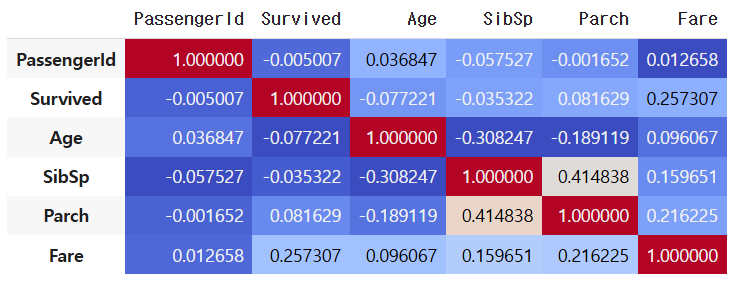

----

```python
# seaborn

numerical = data[['PassengerId', 'Survived', 'Age', 'SibSp', 'Parch', 'Fare']]
sns.heatmap(numerical.corr(), annot=True, cmap='RdYlGn', linewidths=0.2)
fig=plt.gcf()
fig.set_size_inches(7, 5)
plt.show()
```

결과 :

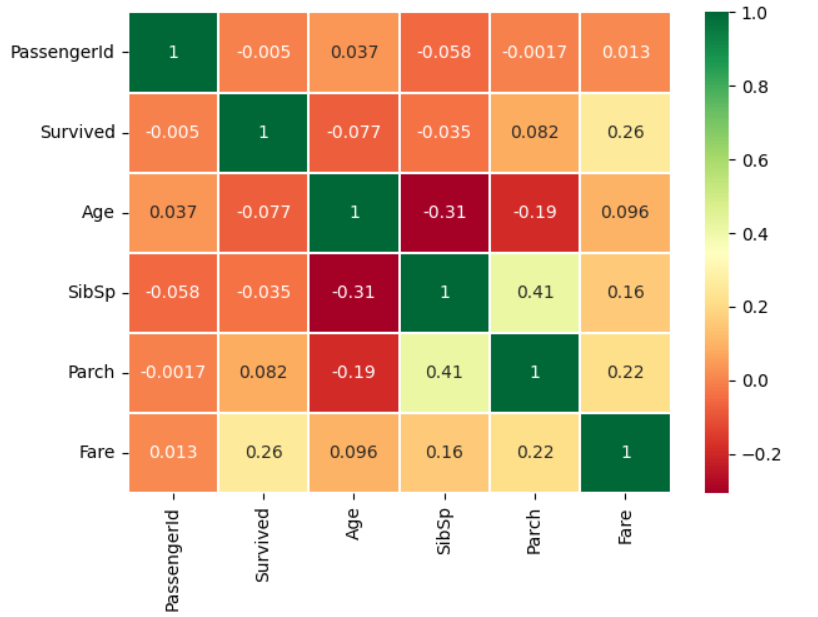

----

```python
# plotly

fig = ff.create_annotated_heatmap(
            z=corr.round(decimals=3).to_numpy(),
            x=corr.columns.tolist(),
            y=corr.index.tolist(),
            zmax=1, zmin=-1,
            showscale=True,
            hoverongaps=True)

fig.update_layout(title='correlation', width=700, height=450)
```

* heatmap 작성 시 rounding을 하지 않으면 소수점 아래 약 15자리까지 표시되어서 가독성이 좋지 않음.
* 따라서, ```corr.round(decimals=3)``` 과 같은 코드 필요

결과 :

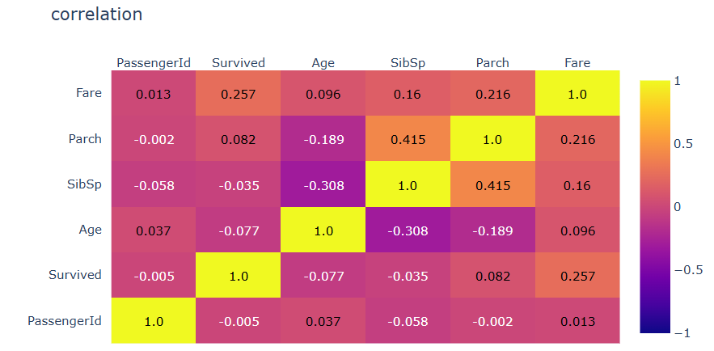

## 3. Numerical과 Categorical의 상관관계
### 3-1. Category 별 특정 Numerical feature 의 box plot

```python
# pandas default

data.boxplot(by='Embarked', column=['Age'], grid=False) 
```

결과 :

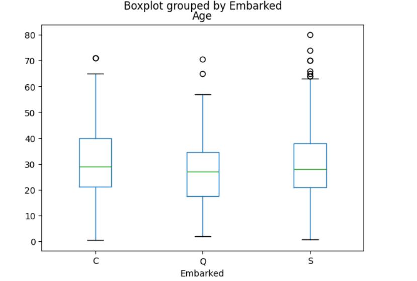

----

```python
# seaborn

sns.boxplot(data=data, x='Embarked', y='Age')
```

결과 :

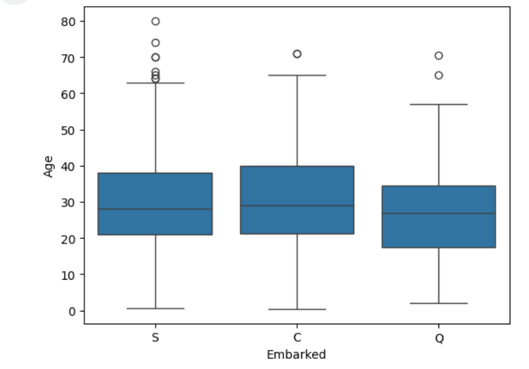

----

```python
# plotly

fig = px.box(data, x='Embarked', y='Age', title='Age Distribution by Embarked')
fig.update_layout(width=750, height=550)
fig.show()
```

결과 :

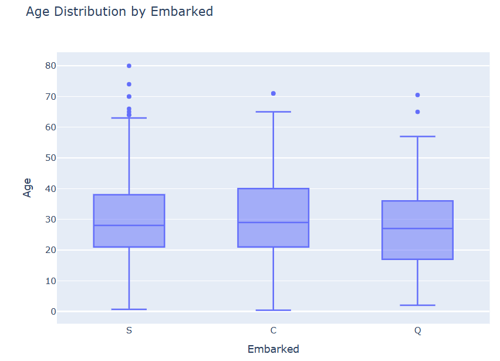

---

```python
# plotly

fig = px.violin(data, x='Embarked', y='Age', title='Age Distribution by Embarked')
fig.update_layout(width=750, height=550)
fig.show()
```

결과 :

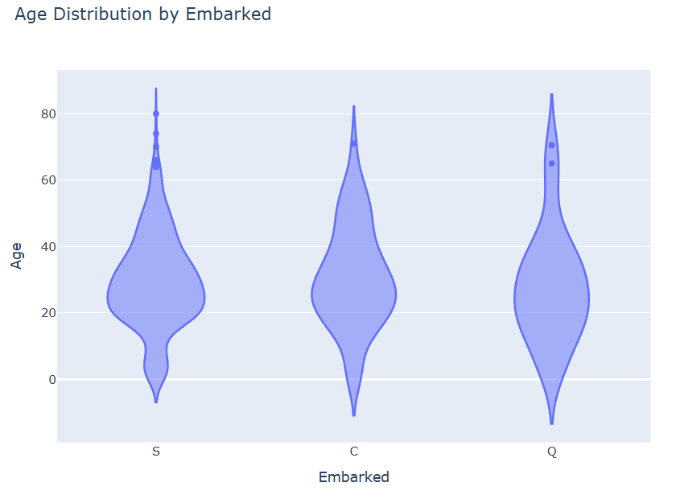

### 3-2. Category 별 특정 Numerical feature 의 density chart

```python
# matplotlib

kwargs = dict(alpha=0.5, bins=30)
colors = ['g', 'b', 'r']
age_by_embarked = {}

for embarked in ['S', 'C', 'Q']:
    age_by_embarked[embarked] = data.loc[data['Embarked'] == embarked, 'Age']

for idx, embarked in enumerate(['S', 'C', 'Q']):
    plt.hist(age_by_embarked[embarked], **kwargs, color=colors[idx], label=embarked)

plt.gca().set(title='Age per Embarked', ylabel='Passengers')
plt.legend()
```

결과 :

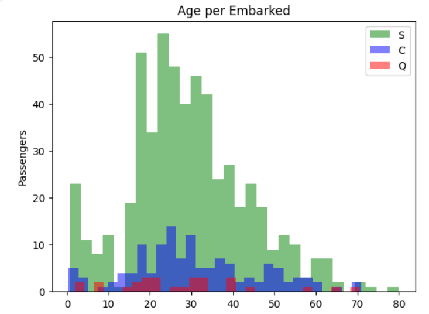

----

```python
# seaborn

age_by_embarked = {}

for embarked in ['S', 'C', 'Q']:
    age_by_embarked[embarked] = data.loc[data['Embarked'] == embarked, 'Age']

fig, ax = plt.subplots(1, 1, figsize=(6,4))

for embarked in ['S', 'C', 'Q']:
    sns.histplot(x = age_by_embarked[embarked], kde=True, bins=30)

ax.set_title(f"Numerical Feature : Age", color = 'tab:blue', fontsize=12)
ax.set_xlabel('Age value', color= 'tab:blue')
ax.set_ylabel('Passengers', color= 'tab:blue')
```

결과 :

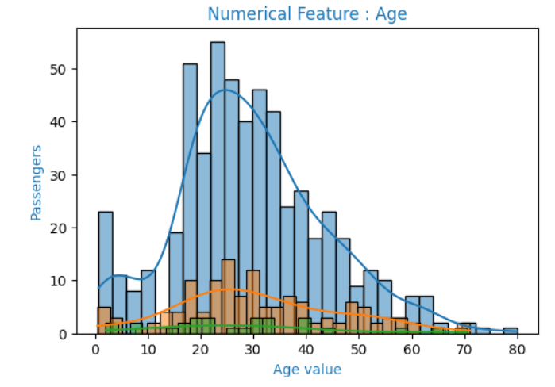

----

```python
# plotly (histogram only)

import plotly.express as px
fig = px.histogram(age_by_embarked, nbins=30)
fig.update_layout(width=700, height=450)
fig.show()
```

결과 :

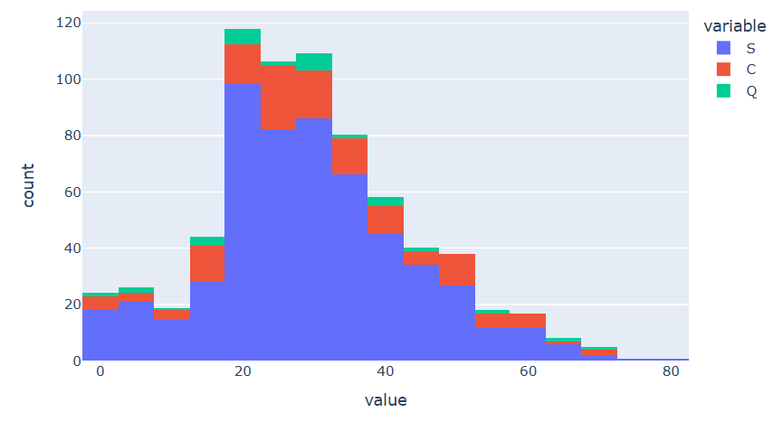

----

```python
# plotly (histogram + KDE chart)

import plotly.figure_factory as ff
fig = ff.create_distplot(hist_data=[age_by_embarked[embarked].dropna().values for embarked in ['S', 'C', 'Q']],
                         group_labels=['S', 'C', 'Q'],
                         bin_size=2.5)
fig.update_layout(width=700, height=560)
fig.show()
```

결과 :

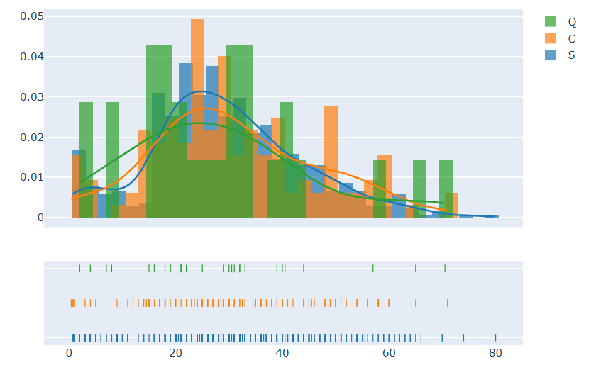

### 3-3. Category 별 2개의 Numeric feature 산점도

```python
# matplotlib

age_by_embarked = {}
fare_by_embarked = {}

for embarked in ['S', 'C', 'Q']:
    age_by_embarked[embarked] = data.loc[data['Embarked'] == embarked, 'Age']
    fare_by_embarked[embarked] = data.loc[data['Embarked'] == embarked, 'Fare']

for idx, embarked in enumerate(['S', 'C', 'Q']):
    plt.scatter(age_by_embarked[embarked], fare_by_embarked[embarked],
                color=colors[idx],
                s=5,
                label=embarked)

plt.gca().set(title='Age, Fare per Embarked', xlabel='Age', ylabel='Fare')
plt.legend()
```

결과 :

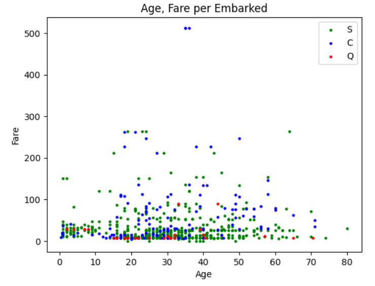

----

```python
# seaborn

ax = sns.scatterplot(data=data, x="Age", y="Fare", hue="Embarked", style="Embarked")
plt.title("Age, Fare per Embarked")
plt.xlabel('Age', color= 'tab:blue')
plt.ylabel('Fare', color= 'tab:blue')
plt.show()
```

결과 :

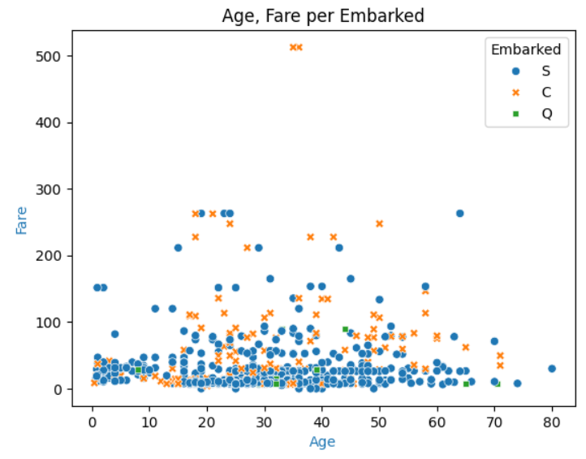

----

```python
# plotly

fig = px.scatter(data, x="Age", y="Fare", color="Embarked", title="Age and Fare Distribution by Embarked")
fig.update_layout(width=800, height=500)
fig.show()
```

결과 :

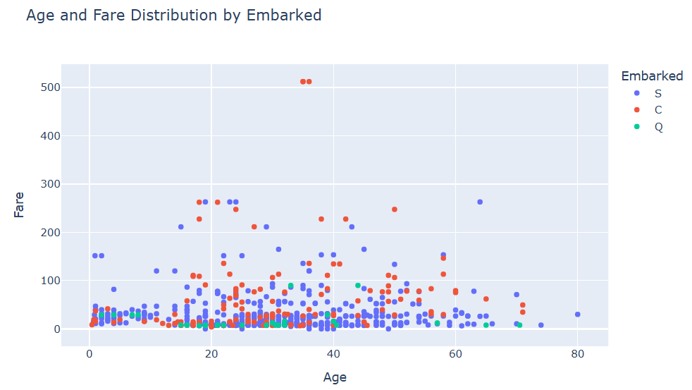

----

```python
# ggplot

from plotnine import *
data_embarked_not_null = data[data['Embarked'].notnull()]
 
(ggplot(data_embarked_not_null)
   + aes(x='Age', y='Fare', color='Embarked')
   + geom_point()
   + stat_smooth()
   + ggtitle('Age and Fare Distribution by Embarked')
)
```

결과 :

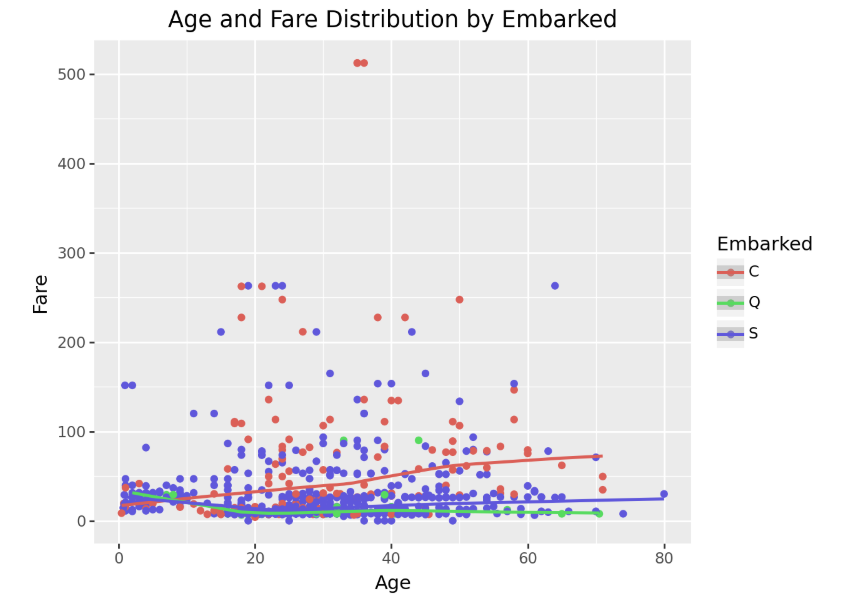

## 4. Categorical과 Categorical의 상관관계
### 4-1. 막대그래프

```python
# matplotlib

pclass_per_embarked = data.groupby(['Embarked', 'Pclass']).size().unstack()
pclass_per_embarked.plot(kind='bar', stacked=True)

plt.xlabel('Embarked')
plt.ylabel('count for each Pclass')
plt.title('count for each Pclass per Embarked')
plt.legend(title='Pclass')
plt.show()
```

결과 :

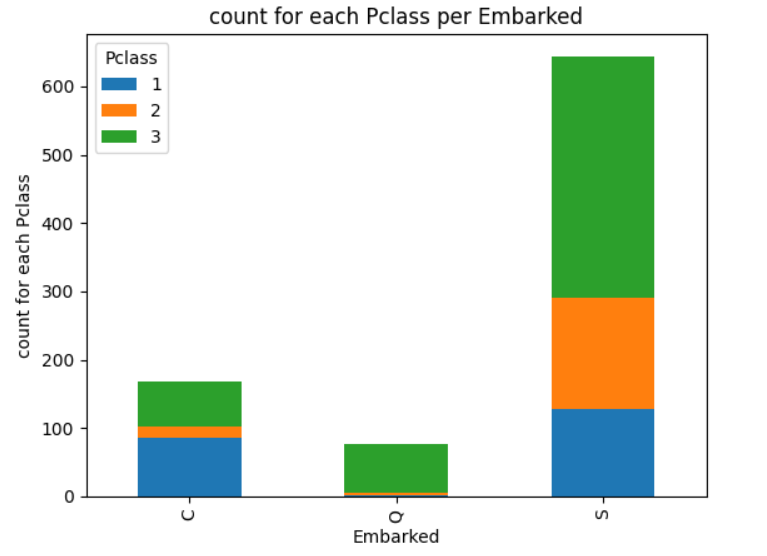

----

```python
# seaborn

sns.histplot(data=data, binwidth=0.5, x="Embarked", hue="Pclass", stat="count", multiple="stack")
plt.title("count for each Pclass per Embarked")
plt.xlabel('Embarked', color= 'tab:blue')
plt.ylabel('count for each Pclass', color= 'tab:blue')
```

결과 :

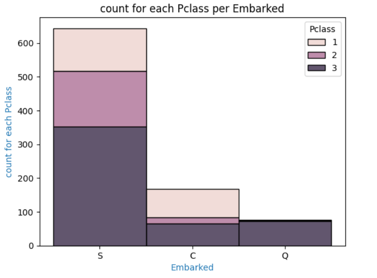

----

```python
# plotly

count_data = data.groupby(by=['Embarked', 'Pclass'], as_index=False)['PassengerId'].count()

fig = px.bar(count_data, x='Embarked', y='PassengerId',
             color='Pclass',
             barmode='stack',
             title='count for each Pclass per Embarked')
fig.update_layout(width=700, height=500)
fig.show()
```

결과 :

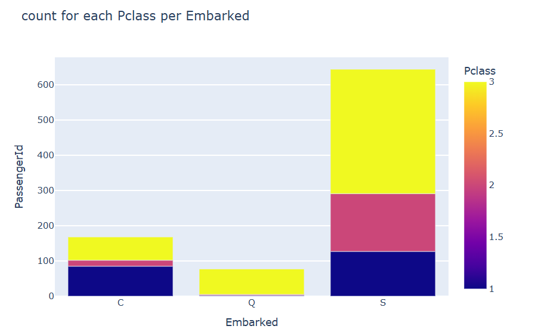

----

```python
# ggplot

from plotnine import *
 
(ggplot(data.sort_values(by='Pclass'))
   + aes(x='Embarked', y=1, fill='Pclass')
   + geom_col()
)
```

결과 :

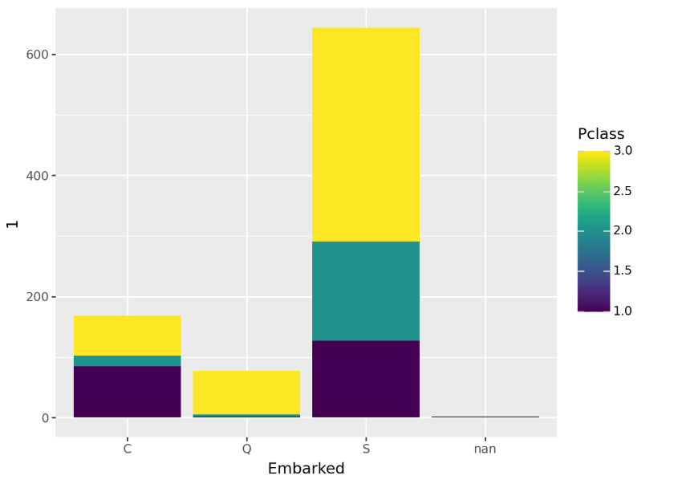

## 5. 탐구
### 5-1. 종합 결론 (라이브러리 선택)
* 다음과 같은 측면에서 **Plotly를 강력히 추천**
  * 결과물 (그래프 등) 의 디자인
  * 마우스를 hover 하면 자동으로 값 표시 (실무적으로, 보고서 작성 시 정확한 값을 알아야 할 때 중요)
* 단, **plotnine 라이브러리의 ggplot** 을 병행 사용하는 것을 추천
  * ggplot의 경우 Category 별 2개의 Numeric feature 산점도에서 추세선을 자동으로 표시하는 등 편리한 점 있음 


### 5-2. 라이브러리 비교 분석
| 평가 항목                                           | Matplotlib      | Seaborn | Plotly                      |
|-------------------------------------------------|-----------------|---------|-----------------------------|
| 결과물 디자인                                         | 보통         | 보통      | **매우 깔끔함**                  |
| 코드의 간결성<br>(전체 상관관계, box plot)                  | 보통         | 보통      | 보통                          |
| 코드의 간결성<br>(density chart, scatter plot, 막대그래프) | 보통         | **높음**  | 보통                          |
| 기타                                              | -          | -       | **마우스를 hover 하면 자동으로 값 표시** |