## 목차
상위 문서 : [EDA의 개념](https://github.com/WannaBeSuperteur/AI-study/blob/main/AI%20Basics/Data%20Science%20Basics/데이터_사이언스_기초_EDA.md)

* [1. 파악해야 하는 분포](#1-파악해야-하는-분포)
* [2. Numerical Feature 분포 파악](#2-Numerical-Feature-분포-파악)
  * [2-1. Feature 값의 분포 파악](#2-1-feature-값의-분포-파악)
  * [2-2. 상자 수염 그림 (box plot)](#2-2-상자-수염-그림-box-plot)
* [3. Categorical Feature 분포 파악](#3-Categorical-Feature-분포-파악)
  * [3-1. 각 Category 별 데이터 개수 파악](#3-1-각-category-별-데이터-개수-파악)
* [4. 탐구](#4-탐구)
  * [4-1. 종합 결론 (라이브러리 선택)](#4-1-종합-결론-라이브러리-선택) 
  * [4-2. Numerical Feature 분포 파악에 사용할 라이브러리 선택](#4-2-numerical-feature-분포-파악에-사용할-라이브러리-선택)
  * [4-3. Categorical Feature 분포 파악에 사용할 라이브러리 선택](#4-3-categorical-feature-분포-파악에-사용할-라이브러리-선택)

## 1. 파악해야 하는 분포
대부분의 머신러닝 문제에서는 input feature와 output feature가 주어지며, EDA 과정에서는 이들의 분포를 파악해야 한다.

일반적으로 feature의 종류는 다음과 같이 구분할 수 있다.
* Numerical Feature
  * 날짜/시간 역시 연속 변수라는 특성상 Numerical Feature로 간주할 수 있음 
* Categorical Feature
  * binary feature 역시 이산 변수라는 특성상 Categorical Feature로 간주할 수 있음

**예시로 사용할 데이터셋**

* 여기서는 [이 데이터셋](https://www.kaggle.com/competitions/titanic/data?select=train.csv)을 예시로 한다.
  * Titanic Dataset은 Kaggle 데이터 분석 입문용으로 널리 알려진 유명한 데이터셋이며, 이에 따라 **도전자 및 노하우 공유** 도 많기에 해당 데이터셋으로 선정했다.
* 분포 파악 예시 선정은 해당 데이터셋의 [이 검색 결과 (2025.02.21)](https://www.kaggle.com/competitions/titanic/code?competitionId=3136&searchQuery=EDA&excludeNonAccessedDatasources=true) 의 최근 2년간 게시물 중 TOP 3에 해당하는 게시물을 참고한다.
  * **최신 EDA 트렌드** 를 파악하기 위해 게시물의 최신성을 고려한다.
  * [TOP 1 게시물](https://www.kaggle.com/code/computervisi/titanic-eda)
  * [TOP 2 게시물](https://www.kaggle.com/code/ravi20076/titanic-eda-model-custompipelines)
  * [TOP 3 게시물](https://www.kaggle.com/code/frankmollard/interactive-eda)

## 2. Numerical Feature 분포 파악
Numerical Feature 분포 EDA를 Matplotlib, Seaborn, Plotly 의 총 3가지 라이브러리를 이용하여 실시하고 그 결과를 비교 분석한다.

### 2-1. Feature 값의 분포 파악
각 Numerical Feature 에 대해 그 값의 분포를 파악해야 하는 이유
* 이상 값 (outlier) 탐지
* 각 feature 별 적절한 데이터 정규화 방법 선택

```python
# matplotlib.pyplot

fig, ax = plt.subplots(1,1,figsize= (6,4))
feature = data[['Age']]
num_bins = 30

n, bins, patches = ax.hist(feature, num_bins)

ax.set_title("Numerical Feature : Age", color = 'tab:blue', fontsize= 12)
ax.set_xlabel('Age value', color= 'tab:blue')
ax.set_ylabel('Passengers', color= 'tab:blue')
plt.xticks(rotation = 0)
plt.show()
```

결과 :

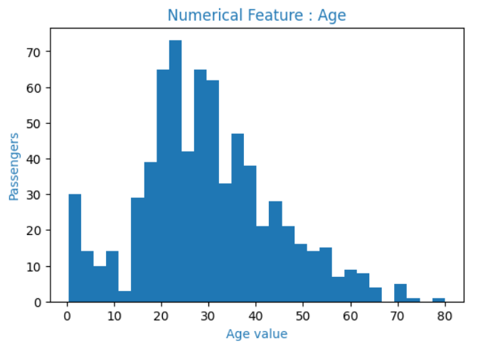

----

```python
# seaborn

fig, ax = plt.subplots(1, 1, figsize=(6,4))

sns.histplot(x = data['Age'], kde=True, bins=30)
ax.set_title(f"Numerical Feature : Age", color = 'tab:blue', fontsize=12)
ax.set_xlabel('Age value', color= 'tab:blue')
ax.set_ylabel('Passengers', color= 'tab:blue')
```

결과 :

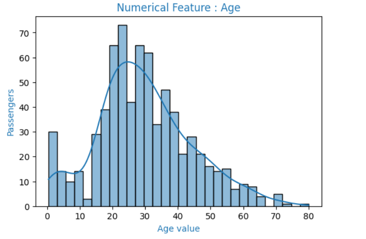

----

```python
# plotly (histogram only)

import plotly.express as px
fig = px.histogram(data[['Age']], nbins=30)
fig.update_layout(width=700, height=450)
fig.show()
```

결과 :

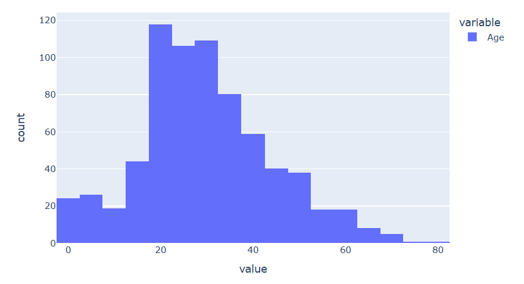

----

```python
# plotly (histogram with KDE, Kernel Density Estimation)

import plotly.figure_factory as ff
fig = ff.create_distplot(hist_data=[data['Age'].dropna().values.tolist()],
                         group_labels=['Age value'],
                         bin_size=2.5)
fig.update_layout(width=900, height=520)
fig.show()
```

결과 :

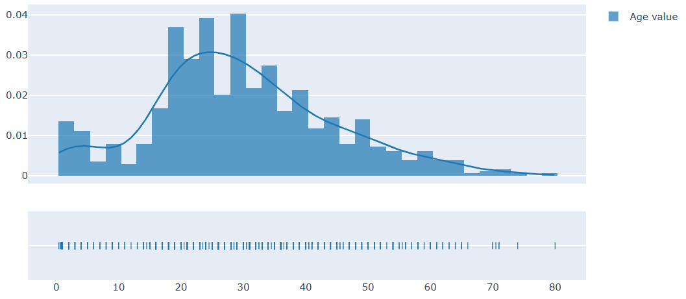

### 2-2. 상자 수염 그림 (box plot)
자세한 것은 [해당 문서](https://github.com/WannaBeSuperteur/AI-study/blob/main/AI%20Basics/Data%20Science%20Basics/데이터_사이언스_기초_상자수염그림.md) 참고.

```python
# matplotlib.pyplot

plt.boxplot([data['Age'].dropna().values.tolist()],
            labels=['Age value'])
plt.title('Age Distribution')
plt.show()
```

결과 :

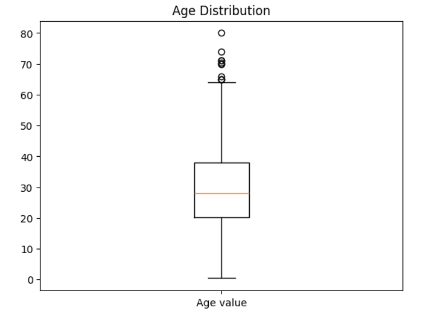

----

```python
# seaborn

fig, ax = plt.subplots(1, 1, figsize=(6,4))
sns.boxplot(y = data['Age'])

ax.set_title(f"Age Distribution", color = 'tab:blue', fontsize=12)
ax.set_ylabel('Age value', color= 'tab:blue')
```

결과 :

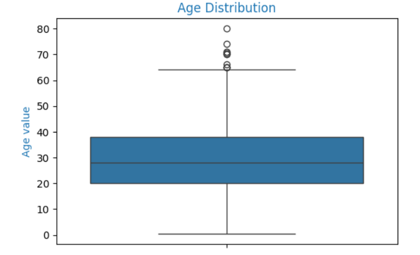

----

```python
# plotly

fig = px.box(data['Age'], title='Age Distribution')
fig.update_layout(width=600, height=550)
fig.show()
```

결과 :

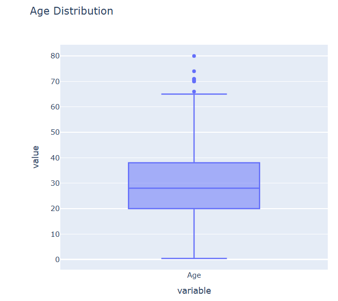

----

```python
# plotly (violin chart)

fig = px.violin(data['Age'], title='Age Distribution')
fig.update_layout(width=600, height=550)
fig.show()
```

결과 :

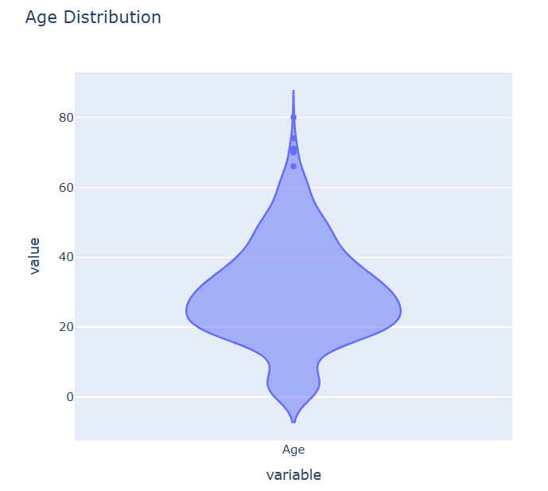

## 3. Categorical Feature 분포 파악
Categorical Feature 분포 EDA를 Matplotlib, Seaborn, Plotly 의 총 3가지 라이브러리를 이용하여 실시하고 그 결과를 비교 분석한다.

### 3-1. 각 Category 별 데이터 개수 파악 
각 Category 별 데이터 개수를 파악해야 하는 이유
* 데이터 불균형 확인 및 이에 대응
* 각 Category 별 적용할 모델링 전략 수립

```python
# matplotlib.pyplot

plt.subplots(1,1,figsize= (6,4))
feature = data[['Embarked']]

ax = feature.value_counts().plot.bar(color= 'tab:blue')
ax.set_title("Categorical Feature : Embarked", color = 'tab:blue', fontsize= 12)
ax.set_xlabel('Embarked status', color= 'tab:blue')
ax.set_ylabel('Passengers', color= 'tab:blue')
plt.xticks(rotation = 0)
plt.show()
```

결과 :

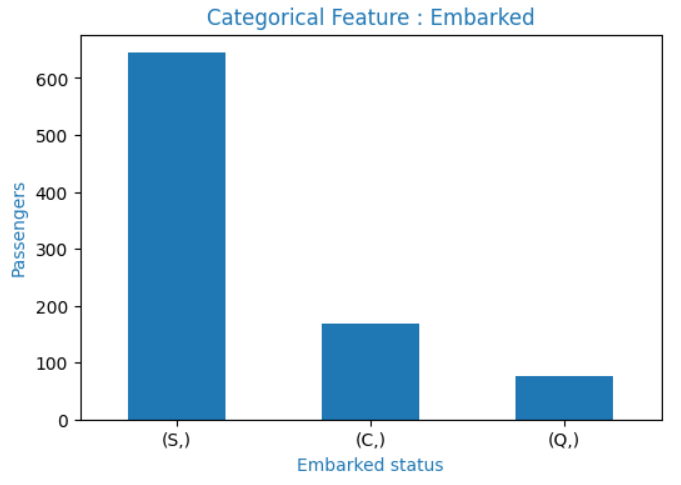

----

```python
# seaborn

ax = sns.catplot(data=data, x="Embarked", kind="count")
ax.fig.suptitle("Categorical Feature : Embarked", color = 'tab:blue', fontsize= 12)
plt.xlabel('Embarked status', color= 'tab:blue')
plt.ylabel('Passengers', color= 'tab:blue')
plt.show()
```

결과 :

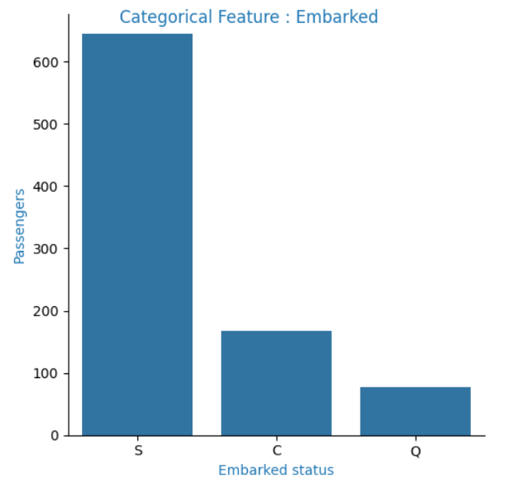

----

```python
# plotly

fig = px.histogram(data,
                   x="Embarked",
                   category_orders=dict(Embarked=["S", "Q", "C"]),
                   color='Embarked',
                   title='Categorical Feature : Embarked',
                   labels=dict(Embarked="Embarked status"))

fig.update_layout(width=700, height=450)
fig.show()
```

결과 :

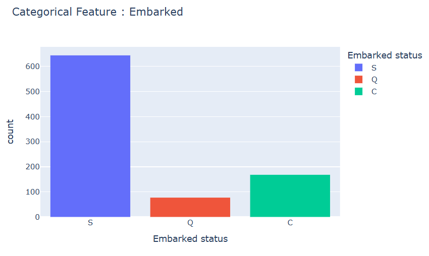

## 4. 탐구
### 4-1. 종합 결론 (라이브러리 선택)
* 다음과 같은 측면에서 **Plotly를 강력 추천**
  * 결과물 (그래프 등) 의 디자인
  * 코드의 간결성
  * 마우스를 hover 하면 자동으로 값 표시 (실무적으로, 보고서 작성 시 정확한 값을 알아야 할 때 중요)
* 단, [KDE (Kernel Density Estimation)](https://github.com/WannaBeSuperteur/AI-study/blob/main/AI%20Basics/Data%20Science%20Basics/데이터_사이언스_기초_KDE.md) 그래프를 표시하기 위해 **Seaborn을 병행** 사용하는 것도 좋은 대안임

### 4-2. Numerical Feature 분포 파악에 사용할 라이브러리 선택

| 평가 항목          | Matplotlib      | Seaborn         | Plotly                                    |
|----------------|-----------------|-----------------|-------------------------------------------|
| 결과물 디자인        | 보통              | 보통              | **매우 깔끔함**                                |
| bin (막대) 개수 설정 | 설정한 nbins 값 그대로 | 설정한 nbins 값 그대로 | 설정한 nbins 보다 작은 값으로 자동 조정                 | 
| 코드의 간결성        | 보통              | 보통              | **높음**                                    |
| KDE 표시         | 불가능             | **Null 처리 불필요** | - Null 처리 필요<br>- y축이 count가 아닌 확률밀도함수 값임 |
| box-plot 표시    | Null 처리 필요      | Null 처리 불필요     | **- Null 처리 불필요**                         |
| 기타             | -               | -               | **마우스를 hover 하면 자동으로 값 표시**               |

### 4-3. Categorical Feature 분포 파악에 사용할 라이브러리 선택

| 평가 항목   | Matplotlib | Seaborn | Plotly                      |
|---------|------------|---------|-----------------------------|
| 결과물 디자인 | 보통         | 보통      | **매우 깔끔함**                  |
| 코드의 간결성 | 보통         | 보통      | **높음**                      |
| 기타      | -          | -       | **마우스를 hover 하면 자동으로 값 표시** |