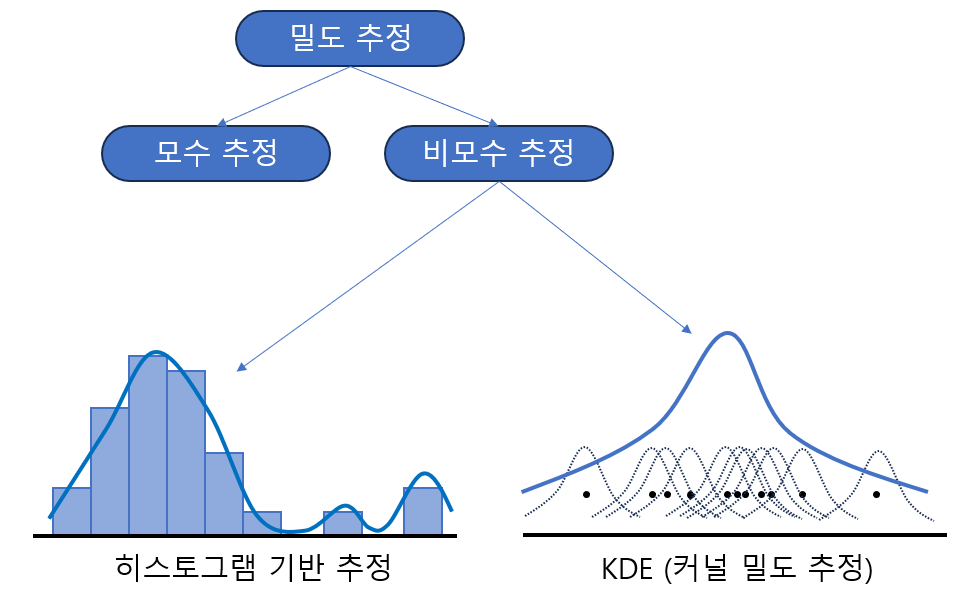
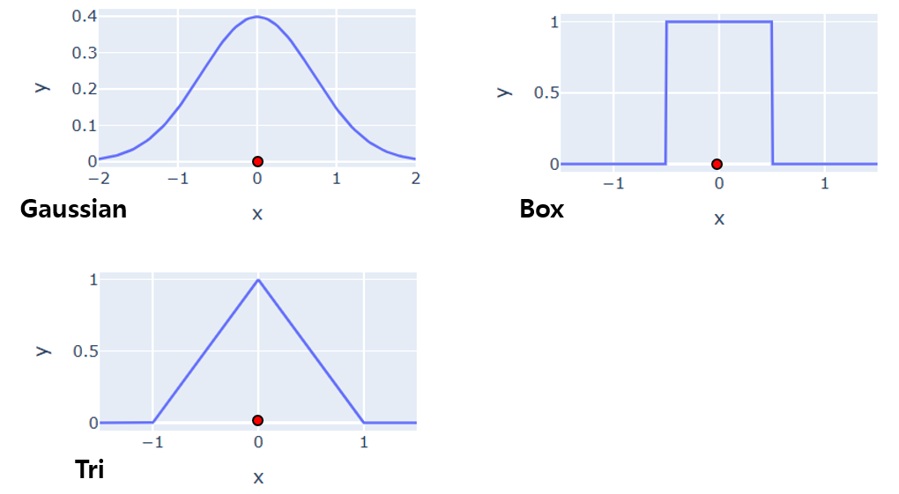
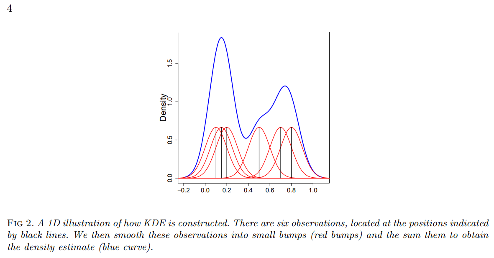
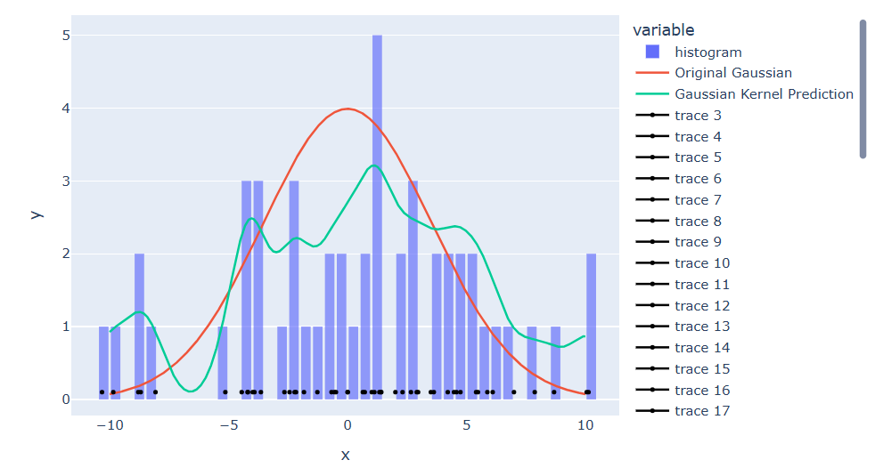
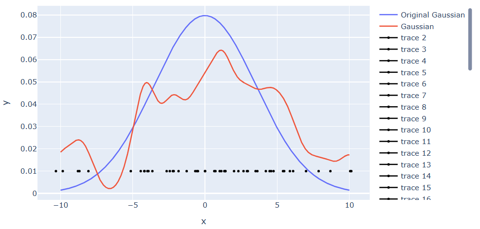
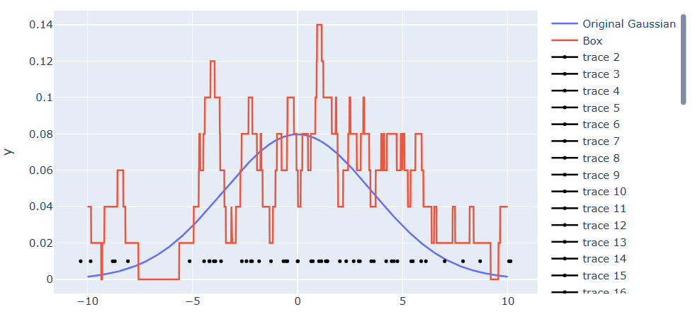
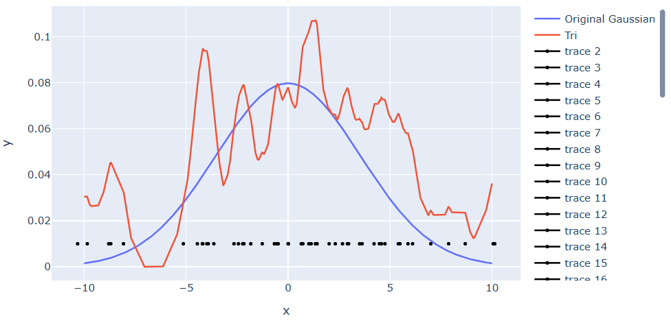

## 목차
* [1. 개요](#1-개요)
* [2. Density Estimation (밀도 추정)](#2-density-estimation-밀도-추정)
* [3. Kernel Function (커널 함수)](#3-kernel-function-커널-함수)
* [4. KDE (Kernel Density Estimation, 커널 밀도 추정)](#4-kde-kernel-density-estimation-커널-밀도-추정)
  * [4-1. 히스토그램 기반 추정과 비교한 장점](#4-1-히스토그램-기반-추정과-비교한-장점)
  * [4-2. 각 커널 함수의 안정성 비교](#4-2-각-커널-함수의-안정성-비교)

## 코드
* [본 문서의 그래프 생성에 사용한 실험 코드 (ipynb)](codes/KDE_example.ipynb)

## 1. 개요
**커널 밀도 추정 (Kernel Density Estimation)** 이란, 특정 변수에 대한 데이터 값의 집합으로부터, 해당 각 데이터 값을 중심으로 하는 확률분포 곡선인 **커널 함수 (Kernel function)** 곡선의 **총합 (또는 평균)** 으로 해당 변수의 실제 확률분포를 추정하는 것이다.

* 즉, 각 데이터 값을 **커널 함수 확률곡선으로 대체** 한 후, 이를 합산하는 방식이다.

## 2. Density Estimation (밀도 추정)
**밀도 추정 (Density Estimation)** 이란, 관측된 데이터 값들에 대해 그 분포를 분석하여, 해당 변수에 대한 확률분포 (확률밀도함수) 를 추정하는 것이다.

밀도 추정은 다음과 같이 구분된다.

* **Parametric Estimation (모수 추정)**
  * 우리가 이미 알고 있는 확률분포곡선 (정규분포 등) 을 따른다고 가정할 수 있을 때 사용 
  * 예: 앞면과 뒷면이 있는 일반적인 동전을 10번 던질 때 앞면이 나오는 횟수
* **Non-parametric Estimation (비모수 추정)**
  * 우리가 아는 확률분포곡선을 따른다고 가정할 수 없을 때 사용
  * 예: 매일 오전 10시에 측정한, 하늘에 떠 있는 구름의 양

이 중에서도 비모수 추정은 다음과 같이 구분된다.

* 히스토그램 기반 추정
  * 관측된 값을 히스토그램으로 만든 후, 해당 히스토그램을 정규화하여 밀도 추정
* 커널 밀도 추정
  * 커널 함수라는 곡선을 이용하여 밀도 추정

## 3. Kernel Function (커널 함수)
**커널 함수 (Kernel Function)** 란, 데이터 값마다 해당 값을 중심으로 하는 확률 곡선을 만들기 위한 함수이다.
* 대표적으로 아래와 같은 Gaussian, Box, Tri 함수가 사용된다.

## 4. KDE (Kernel Density Estimation, 커널 밀도 추정)
**커널 밀도 추정 (KDE, Kernel Density Estimation)** 이란, 비모수 밀도 추정 방법 중 하나로, 앞서 말한 **커널 함수** 를 이용하여 밀도를 추정하는 방법이다.

커널 밀도 추정의 과정은 다음과 같다.
* 각 데이터 값에 대해 해당 데이터 값을 중심으로 하는 커널 함수 곡선을 생성
* 생성된 커널 함수 곡선들을 모두 합산
* 전체 데이터 개수로 나누어, **생성된 커널 함수 곡선의 평균값** 을 계산

([출처](https://arxiv.org/pdf/1704.03924): Yen-Chi Chen, A Tutorial on Kernel Density Estimation and Recent Advances, 2017)

### 4-1. 히스토그램 기반 추정과 비교한 장점
**히스토그램이 있는데, 왜 커널 밀도 추정을 할까?**

커널 밀도 추정은 히스토그램 기반 추정의 다음과 같은 문제점을 보완한 것이다.
* bin의 경계에서 나타나는 불연속성
  * bin이 많은 경우 (1개의 bin의 크기가 작은 경우) 이 불연속성이 커짐
* bin의 시작 위치에 따라서 히스토그램이 달라지므로, 히스토그램은 기준점에 따라 일관적인 결과를 보여주지 못함
  * 커널 밀도 추정의 경우, data point의 값 자체를 기준으로 하므로 항상 일관적인 결과를 보여줄 수 있음 
* 2차원이 아닌 고차원 데이터에서는 [계산량 및 메모리 문제 (차원의 저주)](https://github.com/WannaBeSuperteur/AI-study/blob/main/AI%20Basics/Data%20Science%20Basics/데이터_사이언스_기초_차원의_저주.md) 발생 가능

### 4-2. 각 커널 함수의 안정성 비교
* 평균 0, 표준편차 5인 Gaussian Distribution을 데이터 포인트 50개로 추정했을 때의 결과를 볼 때, **각 커널 함수의 예측 안정성은 Gaussian > Tri > Box 로 추정** 된다. 
  * 여기서 예측 안정성이란, 데이터 포인트 50개를 생성하는 것을 반복 시행했을 때, 각 시행에서의 커널 함수를 이용한 추정 결과의 확률분포의 변동이 작을수록 안정성이 높다고 간주한다.

**Gaussian 함수**

**Box 함수**

**Tri 함수**

