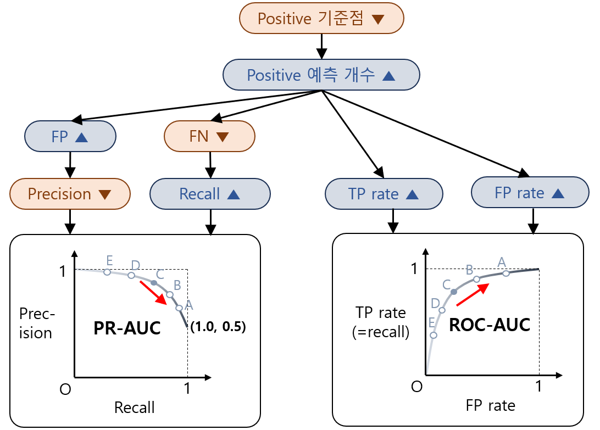
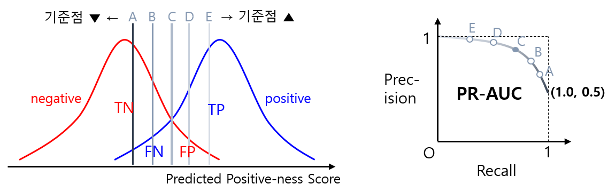
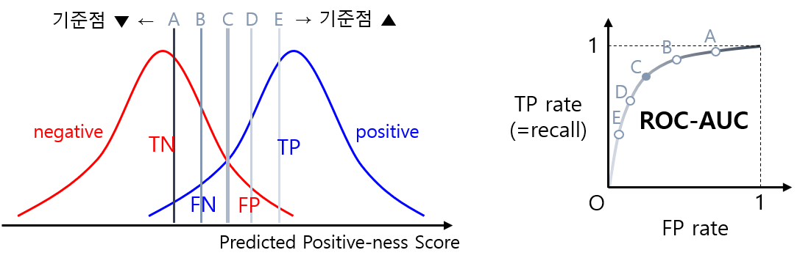

## 목차
여기서는 Class가 Positive / Negative의 2가지인 경우에 대해 다룬다. Class가 3가지 이상일 때에 대해서는 [해당 문서](https://github.com/WannaBeSuperteur/AI-study/blob/main/AI%20Basics/Data%20Science%20Basics/데이터_사이언스_기초_Metrics_MultiClass.md) 참고.

* [1. 기본 Metric](#1-기본-metric)
  * [1-1. True Positive, True Negative, False Positive, False Negative](#1-1-true-positive-true-negative-false-positive-false-negative)
  * [1-2. Accuracy, Recall, Precision](#1-2-accuracy-recall-precision)
  * [1-3. F1 Score](#1-3-f1-score)
  * [1-4. 탐구 (어떤 metric이 좋을까?)](#1-4-탐구-어떤-metric이-좋을까)
* [2. 추가 Metric](#2-추가-metric)
  * [2-1. IoU](#2-1-iou)
  * [2-2. DICE Score](#2-2-dice-score)
  * [2-3. 특이도 (Sensitivity)](#2-3-특이도-sensitivity)
  * [2-4. F1 Score, IOU, DICE의 관계](#2-4-f1-score-iou-dice의-관계)
* [3. Curve를 이용한 지표](#3-curve를-이용한-지표)
  * [3-1. Area Under Precision-Recall Curve (PR-AUC)](#3-1-area-under-precision-recall-curve-pr-auc)
  * [3-2. Area Under ROC Curve (ROC-AUC)](#3-2-area-under-roc-curve-roc-auc)
  * [3-3. PR-AUC, ROC-AUC 를 왜 사용하는가?](#3-3-pr-auc-roc-auc-를-왜-사용하는가)
* [4. Confusion Matrix](#4-confusion-matrix)
* [5. Type 1 Error, Type 2 Error](#5-type-1-error-type-2-error)

## 1. 기본 Metric
### 1-1. True Positive, True Negative, False Positive, False Negative
* True Positive (TP) : 모델의 예측이 **참**, 실제 값이 **참** 인 것
* True Negative (TN) : 모델의 예측이 **거짓**, 실제 값이 **거짓** 인 것
* False Positive (FP) : 모델의 예측이 **참**이지만, 실제 값이 **거짓** 인 것
* False Negative (FN) : 모델의 예측이 **거짓**이지만, 실제 값이 **참** 인 것

즉, 정리하면 다음 표와 같다. True/False는 **모델의 예측이 정확**한지, Positive/Negative는 **모델의 예측값**이 무엇인지를 말한다.

|예측/실제|True|False|
|---|---|---|
|True|TP|FP|
|False|FN|TN|

예를 들어, 정량품을 True, 불량품을 False로 판단하여 선별하는 것이 중요한 AI 모델을 통해 불량률을 줄여야 한다면, 실제로는 불량품(False)이지만 모델은 정량품(True)으로 인식한 케이스의 개수 (FP) 를 최대한 줄여야 한다.

### 1-2. Accuracy, Recall, Precision
* Accuracy (정확도) : (TP + TN) / (TP + TN + FP + FN)
* **Recall (재현율)** : TP / (TP + **FN**)
  * **실제 값이 True**인 것들 중 모델이 True로 분류한 것의 비율
* **Precision (정밀도)** : TP / (TP + **FP**)
  * **모델이 True로 분류**한 것들 중 실제 값이 True인 것의 비율

Recall은 **False Negative**, Precision은 **False Positive**인 것을 고려한 것이다.

따라서 위에서 언급한 AI 모델을 통해 불량률을 줄여야 한다면, False Positive의 개수를 고려한 측정 지표인 Precision이 Recall보다 중요하다.

### 1-3. F1 Score
* F1 Score : 2 * Precision * Recall / (Precision + Recall)

즉, Precision과 Recall의 조화 평균값이다.

### 1-4. 탐구 (어떤 metric이 좋을까?)
각 metric이 적절한 경우는 다음과 같다.
* **Accuracy (정확도)** : [Data imbalance](https://github.com/WannaBeSuperteur/AI-study/blob/main/AI%20Basics/Data%20Science%20Basics/데이터_사이언스_기초_데이터_불균형.md)가 충분히 작을 때 사용
  * 예를 들어 Positive 가 90%, Negative 가 10%인 경우, 모든 데이터를 Positive 로 예측하는 모델은 실질적인 의미가 없지만 **정확도가 무려 90%** 에 달함
  * TP >> TN 일 때, 단순히 Positive와 Negative인 class를 서로 바꾸기만 해도 TP의 개수가 급감하여 Accuracy가 급감함

* **Recall (재현율)** : Abnormal = Positive, Normal = Negative 로 간주할 때 불량률 감소
  * 일반적으로 Normal이 Abnormal보다 훨씬 많으므로, Data imbalance가 큼 
  * 재현율에 부정적인 영향을 미치는 것은 **False Negative (정량품으로 예측, 실제로는 불량품)** 이고, 이것을 줄이는 것이 곧 성능 향상을 의미

* **Precision (정밀도)** : Abnormal = Negative, Normal = Positive 로 간주할 때 불량률 감소
  * 일반적으로 Normal이 Abnormal보다 훨씬 많으므로, Data imbalance가 큼 
  * 정밀도에 부정적인 영향을 미치는 것은 **False Positive (정량품으로 예측, 실제로는 불량품)** 이고, 이것을 줄이는 것이 곧 성능 향상을 의미

* **F1 Score** : 다음 두 조건을 모두 만족시킬 때 사용하면 최적
  * False Positive와 False Negative가 모두 중요할 때
    * Recall 또는 Precision으로는 이 둘 중 한 가지를 커버할 수 없다.
  * Data imbalance가 클 때
    * Accuracy를 이용할 수 없다. 

예를 들어, 어느 공장에서 불량품 검출 모델의 성능 테스트를 한다. 이 성능 테스트에서 **Abnormal = Positive, Normal = Negative** 일 때, 다음 표를 보자.

| 구분                  | 의미                                                  | 개수 |
|---------------------|-----------------------------------------------------|----|
| True Positive  (TP) | 불량품으로 예측, 실제로도 불량품                                  | 50 |
| True Negative  (TN) | 정량품으로 예측, 실제로도 정량품                                  | 900 |
| False Positive (FP) | 불량품으로 예측, 실제로는 정량품                                  | 5  |
| False Nositive (FN) | 정량품으로 예측, 실제로는 불량품 **(안정적인 공정을 위해서는 최대한 줄여야 함)** | 45 |
| 전체 | | 1,000 |

| 성능지표 | 값                             | 의미 |
|------|-------------------------------|-|
| Accuracy | (50 + 900) / 1000 = **95.0%** | 단순 정확도 |
| Precision | 50 / (50 + 5) = **90.9%** | 불량품 예측 중 실제로 불량품인 비율 |
| Recall | 50 / (50 + 45) = **52.6%** | **불량품 중 모델에 의해 검출된 비율** |
| F1 Score | 2 * 0.909 * 0.526 / (0.909 + 0.526) = **66.7%** | |

제품 생산의 불량률을 줄여서 안정적인 공정을 만드는 것이 공장의 목표라면, **불량품을 모델을 통해 검출해야 하므로, Recall이 실질적인 정확도를 의미** 한다.

## 2. 추가 Metric
### 2-1. IoU
주로 Image Segmentation과 같은 task의 정확도를 구하기 위해 사용되는 값으로, 예측 영역과 실제 영역의 **(교집합의 크기) / (합집합의 크기)**, 즉 **Intersection over Union** 을 의미한다.

수식으로 나타내면 **IoU = TP / (TP + FP + FN)** 이다.

### 2-2. DICE Score
**DICE Score (또는 DICE Coefficient)** 는 **(2 x 예측 영역과 실제 영역의 교집합의 크기) / (예측 영역의 크기 + 실제 영역의 크기)** 로 나타낼 수 있다.

즉, DICE Score는 다음과 같은 식으로 나타낼 수 있다.
* (2 * TP) / (2 * TP + FP + FN) = (2 * TP) / ((TP + FP) + (TP + FN))

딥러닝에서 loss를 감소하도록 학습시키기 위해서 DICE Score를 이용하여 Loss를 정의하기도 한다. DICE Score를 이용한 Loss function은 다음과 같다.
* (DICE Loss) = 1 - (DICE Score)

### 2-3. 특이도 (Sensitivity)
특이도 (Sensitivity) 는 **TN / (FP + TN)** 의 값으로, 실제로 False인 데이터 중 머신러닝 모델이 False로 예측하는 비율을 의미한다.

### 2-4. F1 Score, IOU, DICE의 관계
F1 Score, IOU, DICE Score 간에는 다음 관계가 성립한다. **(단, 계산식의 분모가 0이 되지 않는다.)**
* F1 Score = DICE Score
* F1 Score = a / (a + b) 일 때, IOU = a / (a + 2b) 
* 따라서, F1 Score, DICE Score, IOU 중 하나만 알고 있으면 나머지 2개를 모두 알 수 있다.

**증명: F1 Score = DICE Score**
* (F1 Score) = 2 * Precision * Recall / (Precision + Recall)
* = 2 * {TP / (TP + FP) * TP / (TP + FN)} / (TP / (TP + FP) + TP / (TP + FN))
* = 2 * (TP * TP) / (TP * (TP + FN) + TP * (TP + FP)) **... (분자와 분모에 각각 (TP + FP)(TP + FN) 을 곱함)**
* = 2 * TP / (2 * TP + FN + FP) **... (분자와 분모를 각각 TP 로 나눔)**
* = 2 * TP / (2 * TP + FP + FN)
* = (DICE Score)

**증명: F1 Score = a / (a + b) 일 때, IOU = a / (a + 2b)**
* (F1 Score) = (DICE Score) = 2 * TP / (2 * TP + FP + FN) = a / (a + b)
  * 여기서 **2 * TP = a, FP + FN = b** 라고 할 수 있음
* 이때, (IoU Score) = TP / (TP + FP + FN)
* = (a / 2) / {(a / 2) + b}
* = a / (a + 2b) 
* 따라서, IOU = a / (a + 2b) 가 성립한다.

## 3. Curve를 이용한 지표
* **binary classification task** 에서 사용하는 지표들이다.
* 핵심 아이디어
  * **각 테스트 데이터를 Positive로 판단하는 기준점 (threshold) 을 조절해 나가면서** Recall, Precision, FP rate 등 성능지표들을 좌표로 한 점을 연결하면 곡선이 된다.
  * **이 곡선 아래의 넓이를 성능 metric으로 하여** 모델의 성능을 평가하는 방법들이다.
* 특징
  * Positive 판단 기준점을 **특정 값으로 정하지 않으면서도 모델의 성능을 측정** 할 수 있다.  
  * 기준점을 조절해 나가는 방식이므로, 각 테스트 데이터에 대해 **얼마나 Positive 한지를 나타내는 일종의 점수/확률** 이 정의되어 있으면 적용 가능하다.

| 성능지표                                       | 개념                                                                      |
|--------------------------------------------|-------------------------------------------------------------------------|
| Area Under Precision-Recall Curve (PR-AUC) | **(Recall, Precision)** 을 좌표평면에 찍은 점들을 연결한 곡선 아래의 넓이                    |
| Area Under ROC Curve (ROC-AUC)             | **(FP rate, TP rate) = (FP rate, Recall)** 를 좌표평면에 찍은 점들을 연결한 곡선 아래의 넓이 |

### 3-1. Area Under Precision-Recall Curve (PR-AUC)
**Area Under Precision-Recall Curve (PR-AUC, AU-PRC)** 는 x축을 recall, y축을 precision으로 했을 때, 이 측정값들을 연결한 그래프의 아래쪽 면적이다.
* 0~1의 값을 가지며, 1에 가까울수록 성능이 좋은 것이다.

PR-AUC의 기반이 되는 아이디어는 다음과 같다.
* Precision, Recall 모두 0~1의 값을 가지며, **1에 가까울수록 성능이 좋다.**
* 동일한 데이터셋, 동일한 모델에서 일반적으로 **Precision이 커질수록 Recall은 작아진다.** 
  * 동일한 데이터셋, 동일한 모델에서 **False Positive가 늘어날수록 False Negative가 줄어들기** 때문이다.
  * 특정 데이터를 Positive로 분류하기 위한 '기준점'이 높아질수록 False Positive의 비율이 줄어들고, False Negative의 비율이 늘어난다.

예를 들어 다음과 같다.

| 기준점                 | TP      | TN      | FP      | FN      | Recall    | Precision    | Point              |
|---------------------|---------|---------|---------|---------|-----------|--------------|--------------------|
| **모두 Positive로 예측** | **500** | **0**   | **500** | **0**   | **1.000** | **0.500**    | **(1.000, 0.500)** |
| A                   | 490     | 250     | 250     | 10      | 0.980     | 0.662        | (0.980, 0.662)     |
| B                   | 475     | 400     | 100     | 25      | 0.950     | 0.826        | (0.950, 0.826)     |
| C                   | 450     | 450     | 50      | 50      | 0.900     | 0.900        | (0.900, 0.900)     |
| D                   | 400     | 475     | 25      | 100     | 0.800     | 0.941        | (0.800, 0.941)     |
| E                   | 250     | 490     | 10      | 250     | 0.500     | 0.962        | (0.500, 0.962)     |
| **모두 Negative로 예측** | **0**   | **500** | **0**   | **500** | **0.000** | **(1.0 수렴)** | **(0.000, 1.000)** |

따라서, Precision-Recall Curve는 (0, 1) 을 지나지만, 직관과는 다르게 **(1, 0) 을 지나지 않고, (1, (실제 Positive data의 비율)) 을 지남** 을 알 수 있다.

### 3-2. Area Under ROC Curve (ROC-AUC)
**Area Under ROC Curve (ROC-AUC)** 는 x축을 FP rate (False Positive Rate), y축을 TP rate (True Positive Rate) 라고 할 때, 이 측정값들을 연결한 곡선의 아래쪽의 넓이이다.
* 0~1의 값을 가지며, 1에 가까울수록 성능이 좋은 것이다.
  * 실질적인 최악의 성능 (random prediction 시) 인 경우, 값은 0.5 이다. 
* TP rate = TP / (TP + FN) = Recall
* FP rate = FP / (FP + TN)

ROC-AUC의 기반이 되는 아이디어는 다음과 같다.
* 모델의 정확도가 높을수록, 0에 가까운 낮은 FP rate로도 1에 가까운 높은 TP rate가 나올 수 있다.
  * ROC-AUC의 값이 1이면 해당 모델의 ROC curve는 (0, 1) 을 지난다.
    * 즉, FP rate = 0 일 때 TP rate = 1 이 된다.
* 동일한 데이터셋, 동일한 모델에서 일반적으로 **TP rate (=Recall) 가 커질수록 FP rate도 커진다.** 
  * 특정 데이터를 Positive로 분류하기 위한 '기준점'이 낮을수록, 즉 **Positive가 많을수록, TP rate와 FP rate가 함께 커지기 때문** 이다.

예를 들어 다음과 같다.

| 기준점                 | TP      | TN      | FP      | FN      | FP rate   | TP rate (=Recall) | Point              |
|---------------------|---------|---------|---------|---------|-----------|----------------------|--------------------|
| **모두 Positive로 예측** | **500** | **0**   | **500** | **0**   | **1.000** | **1.000**            | **(1.000, 1.000)** |
| A                   | 490     | 250     | 250     | 10      | 0.500     | 0.980                | (0.500, 0.980)     |
| B                   | 475     | 400     | 100     | 25      | 0.200     | 0.950                | (0.200, 0.950)     |
| C                   | 450     | 450     | 50      | 50      | 0.100     | 0.900                | (0.100, 0.900)     |
| D                   | 400     | 475     | 25      | 100     | 0.050     | 0.800                | (0.050, 0.800)     |
| E                   | 250     | 490     | 10      | 250     | 0.020     | 0.500                | (0.020, 0.500)     |
| **모두 Negative로 예측** | **0**   | **500** | **0**   | **500** | **0.000** | **0.000**            | **(0.000, 0.000)** |

따라서, ROC-AUC Curve 는 (0, 0) 과 (1, 1) 을 지난다.

### 3-3. PR-AUC, ROC-AUC 를 왜 사용하는가?
* 각 테스트 데이터에 대해 얼마나 Positive 한지를 나타내는 score (확률 등) 가 정의될 때, **구분 기준점 (threshold) 의 영향을 받지 않는, 보다 일관된 모델 성능 평가** 를 위해 사용
  * Accuracy, F1 Score 등은 기준점에 따라 그 값이 달라질 수밖에 없다.
  * 반면, PR-AUC, ROC-AUC는 기준점의 값이 달라져도 그 값이 달라지지 않는다.

* ROC-AUC 의 경우, Positive 가 훨씬 많은 [데이터 불균형](데이터_사이언스_기초_데이터_불균형.md)이 있을 때도 신뢰성 있게 모델의 성능을 평가할 수 있다.
  * 예를 들어, 다음을 가정하자.
    * Positive 900개, Negative 100개가 있는 어떤 테스트 데이터셋
    * 모델은 이 데이터셋의 모든 데이터에 대해 얼마나 Positive한지를 나타내는 score를 모두 동일한 값으로 예측한다. 즉, **학습이 전혀 안 된 모델** 이다.
  * 이때, 다음과 같다.
    * 아래 표와 같이 Accuracy, F1 Score 는 모두 Positive로 예측했을 때를 기준으로 상당히 높다.
    * 아래 그림과 같이, PR-AUC 역시 0.95 로 높지만 ROC-AUC 는 **0.5 (최악의 성능을 나타냄)** 이다.

| 기준점                 | TP      | TN      | FP      | FN      | Accuracy  | Precision    | Recall (= TP rate) | F1 Score     | FP rate   |
|---------------------|---------|---------|---------|---------|-----------|--------------|-----------------------|--------------|-----------|
| **모두 Positive로 예측** | **900** | **0**   | **100** | **0**   | **0.900** | **0.900**    | **1.000**             | **0.947**    | **1.000** |
|                     | 900     | 0       | 100     | 0       | 0.900     | 0.900        | 1.000                 | 0.947        | 1.000     |
|                     | 0       | 100     | 0       | 900     | 0.100     | (1.0 수렴)     | 0.000                 | (0.0 수렴)     | 0.000     |
| **모두 Negative로 예측** | **0**   | **100** | **0**   | **900** | **0.100** | **(1.0 수렴)** | **0.000**             | **(0.0 수렴)** | **0.000** |

## 4. Confusion Matrix
**Confusion Matrix** 란, TP, TN, FP, FN의 개수 및 Recall, Precision 등의 성능 Metric 계산값을 직관적으로 보여주기 위한 표로, 일반적으로 다음과 같은 형식을 띈다.

|            | 실제 값 = True    | 실제 값 = False | Preicsion     |
|------------|----------------|--------------|---------------|
| 예측 = True  | TP             | FP           | TP / (TP + FP) |
| 예측 = False | FN             | TN           |               |
| Recall     | TP / (TP + FN) |              | (Accuracy)    |        

예를 들어, "1-4. 탐구 (어떤 metric이 좋을까?)" 에 있는 표를 이 형식으로 정리하면 다음과 같다.

|            | 실제 값 = True | 실제 값 = False | Preicsion |
|------------|-------------|--------------|-----------|
| 예측 = True  | **50**      | 5            | 90.9%     |
| 예측 = False | 45          | **900**      |           |
| Recall     | 52.6%       |              | 95.0%     |

* Confusion Matrix의 기본 성질
  * 실제 값과 예측 값이 일치하는 성분, 즉 **주대각선 위의 성분**은 정답의 개수를 나타낸다.
  * **주대각선 외의 성분**은 오답의 개수를 나타낸다.
  * (전체 정답의 개수) = (주대각선 성분의 총합)
  * (전체 오답의 개수) = (주대각선 외의 성분의 총합)
  * (Accuracy) = (주대각선 성분의 총합) / (모든 성분의 총합)

## 5. Type 1 Error, Type 2 Error
* Type 1 Error (1종 오류) : False Negative에 의한 오류
* Type 2 Error (2종 오류) : False Positive에 의한 오류

즉, 정리하면 다음 표와 같다.

|예측/실제|True|False|
|---|---|---|
|True||Type 2 Error|
|False|Type 1 Error||

예를 들어 직원 채용 문제에서는 다음과 같다.
* Type 1 Error (FN) : 실제로 회사에서 일하기 적합한 직원이지만, 서류, 코딩/과제 테스트, 면접 등 전형 결과 최종 불합격한 경우
* Type 2 Error (FP) : 실제로 회사에서 일하기 부적합한 직원이지만, 전형에서 최종 합격한 경우

일반적으로 Type 2 Error를 범하는 경우, 문제가 많은 직원이 최종 입사하여 회사에 큰 손해를 입힐 수 있으므로 Type 1 Error보다 회사에 피해가 크다.
