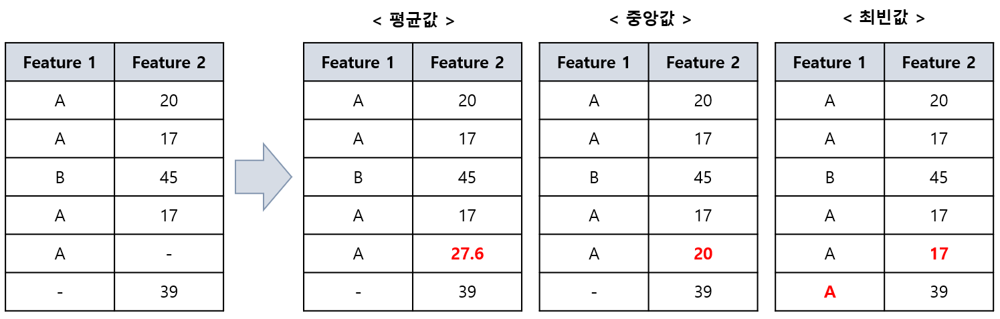

## 목차

* [1. 결측값 (Missing Value)](#1-결측값-missing-value)
* [2. 결측값으로 인한 문제점](#2-결측값으로-인한-문제점)
* [3. 결측값 채우는 알고리즘](#3-결측값-채우는-알고리즘)
  * [3-1. 모델 자체 처리](#3-1-모델-자체-처리)
  * [3-2. 평균, 중앙, 최빈값으로 대체](#3-2-평균-중앙-최빈값으로-대체)
  * [3-3. k-NN 알고리즘으로 대체](#3-3-k-nn-알고리즘으로-대체)
  * [3-4. 딥러닝 기반 대체](#3-4-딥러닝-기반-대체)
  * [3-5. 기타](#3-5-기타)

## 1. 결측값 (Missing Value)

**결측값 (Missing Value)** 는 데이터셋에서 **특정 feature 의 값이 일부분 누락된 것** 을 의미한다.

결측값은 현실 세계의 데이터에서 자주 발생할 수 있는데, 그 이유는 다음과 같다.

* 서버 오류와 같은, 데이터 수집 중 오류
* 설문 조사 결과 등을 바탕으로 데이터셋을 만들 때, 조사 대상자의 무응답
* 데이터 손실

## 2. 결측값으로 인한 문제점

이러한 결측값으로 인해 다음과 같은 문제점이 발생한다.

| 문제점         | 설명                                                                                                                                                                                                                                         |
|-------------|--------------------------------------------------------------------------------------------------------------------------------------------------------------------------------------------------------------------------------------------|
| 데이터의 편향성 증가 | - Missing Value 가 모든 target class 의 값에 골고루 분포하지 않고, **특정 target class 값에 몰려 있다면** 데이터의 편향성이 증가할 수 있다. - feature 간 상관관계를 분석하는 경우, target class 뿐만 아니라 **다른 특정 feature 의 값이 특정 구간 또는 특정 Class 인 경우** 에 Missing Value 가 몰려 있어도 문제가 될 수 있다. |
| 모델 성능 저하    | - Missing Value 는 근본적으로 **모델의 학습 데이터가 일부 누락** 되었다는 것을 의미하므로, 모델의 성능 저하 요인이다. - 특히, 이로 인해 **데이터 편향성이 증가하는 경우** 라면 성능 저하가 심해질 수 있다.                                                                                                       |

## 3. 결측값 채우는 알고리즘

일반적으로 알려진 **결측값을 채우는 방법 및 알고리즘** 은 다음과 같다.

| 알고리즘, 방법론        | 설명                                                                                               |
|------------------|--------------------------------------------------------------------------------------------------|
| 모델 자체 처리         | [XGBoost](../Machine%20Learning%20Models/머신러닝_모델_XGBoost.md) 와 같은 모델에는 자체적으로 결측치를 처리하는 알고리즘이 있다. |
| 평균, 중앙, 최빈값으로 대체 | 통계적 대푯값으로 잘 알려진 평균 / 중앙 / 최빈값을 이용한다.                                                             |
| k-NN 알고리즘으로 대체   | [k-NN (k-Nearest Neighbors)](../Machine%20Learning%20Models/머신러닝_모델_KNN.md) 알고리즘에 의한 예측값을 이용한다.  |
| 딥러닝 기반 대체        | 다른 feature의 값들에 근거하여 딥러닝에 기반하여 결측값을 채운다.                                                         |
| 기타               | EM (Expectation-Maximization) 알고리즘 등                                                             |

### 3-1. 모델 자체 처리

일부 모델의 경우에는 **모델 자체적으로 결측값을 처리하는 알고리즘** 이 있다.

* 대표적으로 [XGBoost](../Machine%20Learning%20Models/머신러닝_모델_XGBoost.md) 모델의 [Sparsity-aware Split Finding](../Machine%20Learning%20Models/머신러닝_모델_XGBoost.md#4-4-결측치-데이터-처리) 을 예로 들 수 있다.

### 3-2. 평균, 중앙, 최빈값으로 대체

통계학에서 대푯값으로 잘 알려진 **평균값, 중앙값 또는 최빈값으로 결측값을 대체** 하는 방법이다.

그 장단점은 다음과 같다.

* 장점
  * 통계학에서의 대푯값으로 대체하기 때문에 직관적이고 간단하다.
  * 데이터셋의 특성에 따라 장단점을 고려하여 3가지 중 하나를 적절히 선택할 수 있다.
    * 예를 들어 Outlier 가 많은 경우, 중앙값을 이용하여 그 영향을 최소화할 수 있다. 
* 단점
  * 세 방법 공통으로, 각 feature 별로 모든 결측값을 동일한 값으로 대체하므로 데이터가 편향될 수 있다. 
  * 각 방법 별 아래와 같은 단점이 존재한다.

| 구분          | 단점                                                                                                                     |
|-------------|------------------------------------------------------------------------------------------------------------------------|
| 평균값, 중앙값 공통 | - Categorical Feature 에 적용할 수 없다.                                                                                      |
| 평균값         | - Feature 값의 분포가 양 극단에 몰려 있는 등의 경우, 그 중간인 평균값은 Outlier 일 수 있다.                                                         |
| 최빈값         | - 데이터 개수가 비교적 적을 때, 경우에 따라 평균값이나 중앙값과 거리가 먼 값이 최빈값일 수 있다. - Feature 가 연속적인 값인 경우 이산적인 값으로 변환하지 않으면 최빈값 자체를 찾을 수 없다. |

### 3-3. k-NN 알고리즘으로 대체

결측값을 [k-NN (k-Nearest Neighbors)](../Machine%20Learning%20Models/머신러닝_모델_KNN.md) 알고리즘을 이용하여 채우는 것이다. 그 방법은 다음과 같다.

* **Missing Value 가 존재하는 sample** 에 대해, 나머지 feature 의 값들을 기반으로 그 이웃한 sample 들을 찾는다.
* 이웃한 sample 들의 해당 feature 의 값에 기반하여 Missing Value 를 채운다.

그 장단점은 다음과 같다.

* 장점
  * k개 (여러 개) 의 이웃 sample 을 고려하므로 Outlier 에 대해 robust 하다.
  * **각 feature 별로 결측치가 있는 모든 sample 에 대해 동일한 값** 이 아닌, 다른 변수에 대한 정보를 이용하여 **각 sample 별로 보다 합리적으로** 결측값을 추정할 수 있다.
* 단점
  * k-NN 알고리즘의 특성상, 데이터셋이 큰 경우 연산량이 많다.
  * k-NN 알고리즘이 정상적으로 동작하게 하기 위해 [정규화](데이터_사이언스_기초_Normalization.md) 등 Scaling이 필요하다.

### 3-4. 딥러닝 기반 대체

결측값을 딥러닝을 이용하여 추정하고, 이렇게 추정된 값으로 대체하는 방법이다.

* 장점
  * 딥 러닝을 통해 보다 복잡한 패턴을 학습하여, **이를 바탕으로 보다 정교하게 결측값을 추정** 할 수 있다.
* 단점
  * 딥 러닝의 특성상 소규모 데이터셋에서는 사용하기 어려울 수 있다.
  * 연산량이 매우 많다.

### 3-5. 기타

이 외의 방법으로 **EM (Expectation-Maximization) 알고리즘** 등이 있다.

* EM 알고리즘의 핵심 아이디어는 다음의 **E-step 과 M-step 을 수렴할 때까지 반복** 하는 것이다.

| Step                  | 설명                                                              |
|-----------------------|-----------------------------------------------------------------|
| E-step (Expectation)  | 결측값이 특정 값 (Class 등) 일 확률을 계산하고, 이를 바탕으로 결측값을 채운다.               |
| M-step (Maximization) | E-step 에서 채운 결측값을 포함한 전체 데이터를 바탕으로, 결측값을 예측하는 알고리즘의 파라미터를 갱신한다. |
 
* EM 알고리즘의 동작 원리는 [Gaussian Mixture Model 의 EM 알고리즘에 대한 설명](../Machine%20Learning%20Models/머신러닝_모델_Gaussian_Mixture.md#2-gaussian-mixture의-알고리즘-em-algorithm) 과 근본적으로 유사하다.