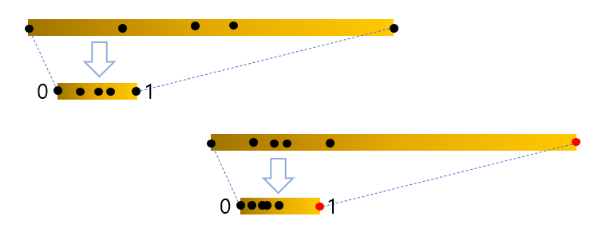
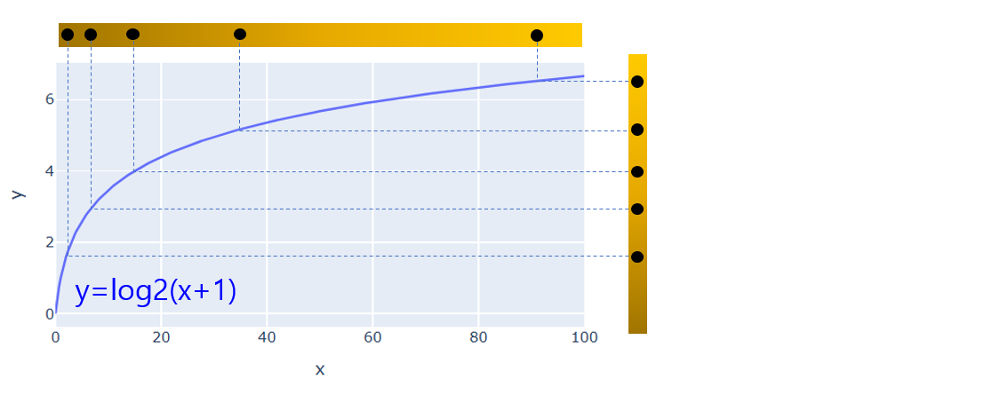
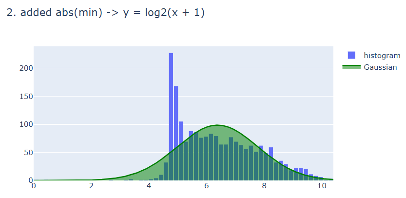

## 목차
* [1. Normalization 이란? 그 필요성은?](#1-normalization-이란-그-필요성은)
* [2. 다양한 Normalization 방법](#2-다양한-normalization-방법)
  * [2-1. Min-max Normalization](#2-1-min-max-normalization)
  * [2-2. Standarization (Z-score normalization)](#2-2-standarization-z-score-normalization)
  * [2-3. Clipping](#2-3-clipping)
  * [2-4. 로그 스케일로 변환](#2-4-로그-스케일로-변환)
  * [2-5. 기타](#2-5-기타)
* [3. 정규화 실전](#3-정규화-실전)

## 코드
* [본 문서의 '3. 정규화 실전' 에서 사용한 실험 코드 (ipynb)](codes/Normalization_example.ipynb)

## 1. Normalization 이란? 그 필요성은?
**Normalization (정규화)** 는 데이터 전처리의 방법 중 하나로, 데이터를 일정한 수식을 통해서 특정 범위로 변환하는 방법을 의미한다.

데이터 전처리 시 정규화의 필요성은 다음과 같다.
* 머신러닝 모델에 맞는 입력 및 출력 데이터
  * **데이터가 정규분포에 가까울 때 최적의 성능을 발휘** 하는 머신러닝 알고리즘에서는 **입력 데이터** 의 각 열을 정규화할 수 있다.
  * 특정 범위, 예를 들어 0부터 1까지의 값을 출력하는 모델의 경우, **출력 데이터** 를 정규화해야 한다.
  * 이미지 데이터의 경우 픽셀 값을 255로 나누어 0부터 1까지로 linear 하게 정규화하는 경우가 많다. 
* 데이터 feature 간 **표준편차 차이에 의한 스케일 차이** 해결
  * 예를 들어 두 입력 변수 A, B에 대해, 변수 A의 값의 평균이 100, 표준편차가 50이고, 변수 B의 값의 평균이 1, 표준편차가 0.25이다. 이때 변수 A, B의 값의 scale을 맞춰 주지 않으면 머신러닝 모델이 변수 A의 값에 근거하여 출력값을 결정하려는 경향이 클 것이다.
  * [kNN 머신러닝 모델에서 각 feature에 대해 Z-score 정규화를 하는 것](https://github.com/WannaBeSuperteur/AI-study/blob/main/AI%20Basics/Machine%20Learning%20Models/%EB%A8%B8%EC%8B%A0%EB%9F%AC%EB%8B%9D_%EB%AA%A8%EB%8D%B8_KNN.md) 을 예로 들 수 있다.
* outlier 의 기준을 정의했을 때, 이를 처리하기 보다 편리해진다.
  * 예를 들어 Z-score normalization (Z점수에 의한 표준화) 적용 시, [상자 수염 그림의 정의에 따라 Z 값의 절댓값이 2.7보다 큰 경우를 outlier라고 할 수 있다.](https://github.com/WannaBeSuperteur/AI-study/blob/main/AI%20Basics/Data%20Science%20Basics/%EB%8D%B0%EC%9D%B4%ED%84%B0_%EC%82%AC%EC%9D%B4%EC%96%B8%EC%8A%A4_%EA%B8%B0%EC%B4%88_%EC%83%81%EC%9E%90%EC%88%98%EC%97%BC%EA%B7%B8%EB%A6%BC.md)

## 2. 다양한 Normalization 방법

### 2-1. Min-max Normalization

**Min-max Normalization** 은 다음 수식을 이용하여 $X$ 를 $Y$ 로 변환시키는 방법으로 데이터를 정규화하는 것을 말한다.
* $\displaystyle Y = \frac{X - MIN}{MAX - MIN}$
* 여기서 $MIN$ 은 데이터의 최솟값, $MAX$ 는 데이터의 최댓값을 말한다.
* 쉽게 생각하면, 데이터 값을 **데이터가 최솟값과 최댓값 사이 어느 지점에 위치해 있는지의 값** 으로 변환하는 것이라고 할 수 있다.

예를 들어 보자.

| 상태            | 데이터                              |
|---------------|----------------------------------|
| Min-max 정규화 전 | 1, 3, 7, 2, 5, 6                 |
| Min-max 정규화 후 | 0, 0.333, 1, 0.167, 0.667, 0.833 |

Min-max Normalization의 특징 및 장단점은 다음과 같다.
* 특징 : 선형 변환이며, 변환값이 모두 0과 1 사이의 값이다.
* 단점 : 극단적인 값을 갖는 [outlier](데이터_사이언스_기초_Outlier.md)에 의해 MIN, MAX의 값이 큰 영향을 받으며, 따라서 outlier에 취약하다. 예를 들어 다음과 같다.

| 상태            | 데이터                                    |
|---------------|----------------------------------------|
| Min-max 정규화 전 | 1, 3, 7, 2, 5, 6, **101**              |
| Min-max 정규화 후 | 0, 0.02, 0.06, 0.01, 0.04, 0.05, **1** |

위 표를 보면 101이라는 극단적인 outlier 때문에 나머지 값들이 모두 0.1 미만의 값으로 변환된 것을 확인할 수 있다.

### 2-2. Standarization (Z-score normalization)

**Standarization (표준화)** 는 데이터를 평균이 0, 표준편차가 1인 정규분포로 정규화하는 방법으로, 마찬가지로 식을 쓰면 다음과 같다.
* $\displaystyle Y = \frac{X - MEAN}{STD}$
* 여기서 $MEAN$ 은 데이터의 평균값, $STD$ 는 표준편차를 나타낸다.

표준화의 특징 및 장단점은 다음과 같다.
* 특징 : 선형 변환이며, 변환 이후의 데이터는 평균이 0, 표준편차가 1인 정규분포를 이룬다.
  * 일반적으로 약 95% 이상의 값이 -2 ~ +2 사이의 값으로 변환된다.
* 장점 : 극단적인 값을 갖는 [outlier](데이터_사이언스_기초_Outlier.md)가 있을 때도 나머지 데이터의 값의 변환값의 변동폭이 작다. 즉 outlier에 대해 강건 (robust) 하다.

### 2-3. Clipping

**Clipping** 은 데이터를 **특정 범위 내에 속하게** 변환시키는 것을 말한다. 즉, 다음과 같다.
* $X$ 가 지정된 $MIN$ 값과 $MAX$ 값 사이에 있는 경우 그 값을 그대로 둔다.
* $X > MAX$ 인 경우, $X$를 $MAX$ 로 변환한다.
* $X < MIN$ 인 경우, $X$를 $MIN$ 으로 변환한다.

예를 들어 다음과 같다. ($MAX=10, MIN=1$)

| 상태         | 데이터                                 |
|------------|-------------------------------------|
| Clipping 전 | -1, 0, 1, 3, 5, 7, 9, 11, 12        |
| Clipping 후 | **1, 1, 1,** 3, 5, 7, 9, **10, 10** |

Clipping 역시 outlier의 영향을 적게 받는다. 왜냐하면 outlier의 경우 clipping에 의해 $MAX$ 또는 $MIN$ 값으로 변환되기 때문이다.

### 2-4. 로그 스케일로 변환

값이 커질수록 길이가 일정한 구간을 지정할 때 **그 구간 내의 값의 빈도수가 줄어드는** 형태 (예: 주택 가격 등) 의 데이터를 로그 스케일로 변환하면 정규분포에 가까워지는 경우, 이를 다음과 같이 로그 스케일로 변환할 수 있다.
* $Y = log(X)$ (최솟값이 0보다 큰 경우)
* $Y = log(X + 1)$ (최솟값이 -1보다 큰 경우)

예를 들어 다음과 같다. (단, $Y = log(X + 1)$ 을 이용, 로그의 밑은 2)

| 상태      | 데이터                                       |
|---------|-------------------------------------------|
| 로그 변환 전 | 0, 1, 3, 3, 7, 7, 15, 15, 15, 31, 63, 127 |
| 로그 변환 후 | 0, 1, 2, 2, 3, 3, 4, 4, 4, 5, 6, 7        |

특징은 다음과 같다.
* **비선형** 이다. 즉 데이터의 분포 자체가 달라진다.
* log 안에 들어가는 값은 양수여야 하기 때문에, 최솟값이 반드시 특정 값 이상 (예: 0 이상) 임이 보장되는 데이터에서 사용해야 한다.

### 2-5. 기타
로그 스케일로 변환 이후 Standarization을 적용하는 등 여러 가지 Normalization을 합성함수처럼 합성해서 사용할 수 있다.

## 3. 정규화 실전
다음과 같은 데이터를 표준정규분포에 가깝게 정규화하는 것을 목표로 한다.

여기서는 **제곱근을 이용한 변환 -> 최솟값을 더함 -> 로그 스케일 변환 -> Standardization (Z-score Normalization)** 을 차례로 적용했다. 전체 시도 과정은 다음과 같다.

**1. 로그 스케일 변환을 즉시 적용**

수식 $Y = log(X + 1)$ 를 적용한 결과, 아래와 같이 -1.0 이하의 값을 처리할 수 없어서 실패했다.

**2. 최솟값을 더한 후, 로그 스케일 변환 적용**

수식 $Y = log(X + 1)$ 를 적용했을 때 오류를 방지하기 위해, 먼저 데이터의 최솟값을 더한다.

그 후 해당 수식을 적용하여 로그 스케일로 변환한다.

이후 Z-score normalization을 적용한 결과, 정규분포와는 차이가 큰 모습을 보인다. 즉, 이 방법은 최선과는 거리가 멀다는 것을 알 수 있다.

**3. 제곱근 수식을 적용**

음수에 대해서도 처리가 가능한 제곱근 수식을 적용해야 하기 때문에, 정규화 방법은 다음과 같다.
* 양수인 경우, 그 값의 제곱근으로 변환
* 음수의 경우, 그 절댓값의 제곱근에 -1 을 곱한 값으로 변환

제곱근 수식을 적용한 결과는 다음과 같다.

이후 Z-score normalization을 적용한 결과, 정규분포에 비해 다소 왼쪽으로 치우친 모습을 보인다. 아직까지는 정규분포와 매우 가깝다고 할 수 없다.

**3a. 제곱근 수식 + 로그 스케일 적용**

제곱근 수식만을 적용한 결과가 다소 왼쪽으로 치우친 데이터셋이므로, 그 결과에 로그 스케일로 변환하면 이를 해결할 수 있다.

제곱근 수식을 적용한 결과물에 $Y = log(X + 1)$ 를 이용하여 먼저 로그 스케일 변환을 하면 다음과 같다. 이때 음수 값이 있으므로, 먼저 최솟값을 더해 주면 다음과 같다.

로그 스케일 변환 결과:

이후 Z-score Normalization을 적용하면 아래와 같이 정규분포와 상당히 가까운 모습을 보인다. 이후 outlier를 제거하는 등 추가적인 작업을 해야 한다.

