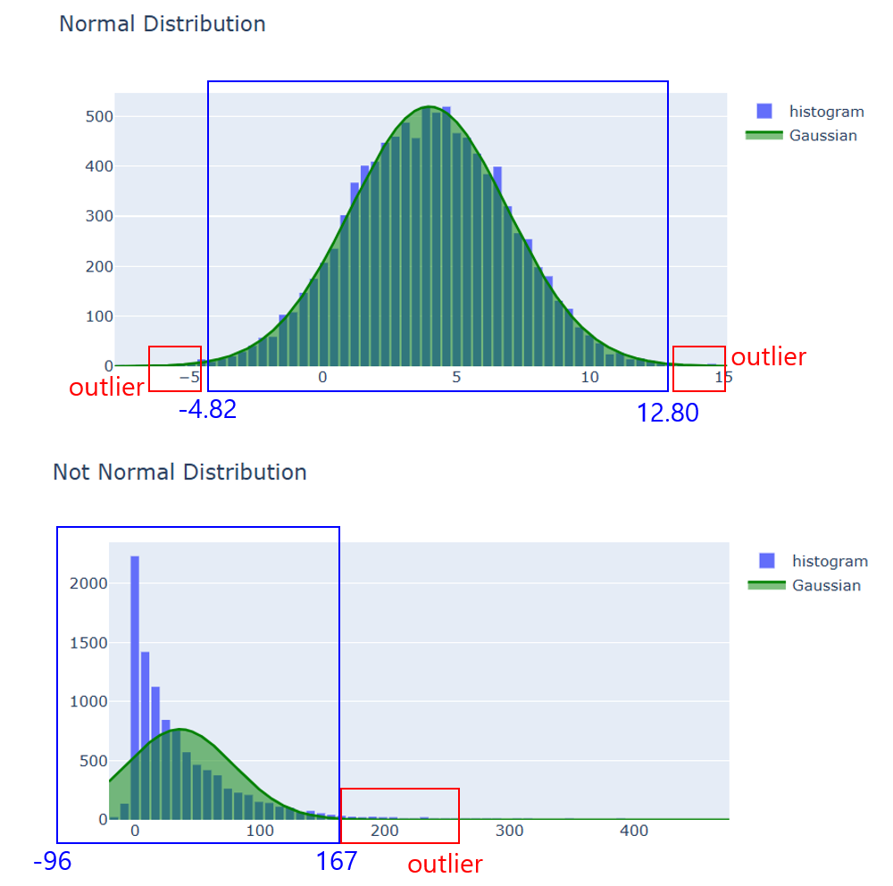

## 목차
* [1. Outlier의 정의](#1-outlier의-정의)
* [2. Outlier를 제거해야 하는 이유](#2-outlier를-제거해야-하는-이유)
* [3. Outlier 제거 방법](#3-outlier-제거-방법)
  * [3-1. 사분위수 및 상자 수염 그림](#3-1-사분위수-및-상자-수염-그림) 
  * [3-2. 평균 및 표준편차 이용](#3-2-평균-및-표준편차-이용)
  * [3-3. 백분위수 이용](#3-3-백분위수-이용)
  * [3-4. 기타](#3-4-기타)

## 1. Outlier의 정의
**Outlier (아웃라이어, 이상치)** 는 데이터셋에서 일반적인 분포 범위에서 벗어난 값을 말한다.

Outlier의 발생 원인은 일반적으로 다음과 같다.
* 데이터 자체의 오류
* 데이터 수집 중 해당 데이터와 관련된 중요한 변수의 변동으로 인한 이상치
* 정규분포를 따르는 데이터의 경우에도, 매우 낮은 확률로 발생하는 특이한 값

## 2. Outlier를 제거해야 하는 이유
* 데이터 분포를 시각화했을 때, outlier로 인해 시각화 결과물에서 전반적인 데이터 분포를 나타낸 부분을 확인하는 데 지장이 있을 수 있음
* 다음과 같은 [Normalization 방법](데이터_사이언스_기초_Normalization.md) 에서 문제 발생
  * Min-max normalization
  * Standarization (Z-score normalization)
* 머신러닝 학습 시, outlier가 학습 데이터에 포함됨으로써 학습 과정에 지장을 줄 수 있음

## 3. Outlier 제거 방법

요약 :

|방법론|개념|사분위수/백분위수 이용 여부| Outlier 비율  |
|---|---|---|-------------|
|사분위수 (IQR)|- (IQR) = (3사분위 수) - (1사분위 수) - Q1, Q3과 IQR을 이용하여 outlier 결정|O| 분포에 따라 변동   |
|평균 및 표준편차|평균 대비 3표준편차 이상 떨어진 값을 outlier로 지정|X| 분포에 따라 변동   |
|백분위수 이용|상위 몇 %, 하위 몇 %의 값을 outlier로 지정|O| 분포에 무관하게 일정 |

### 3-1. 사분위수 및 상자 수염 그림
* [해당 문서](데이터_사이언스_기초_상자수염그림.md) 참고.
* (IQR) = (3사분위 수) - (1사분위 수) 값을 이용하여, 상자 수염 그림에서 범위를 벗어나는 outlier를 제거한다.

### 3-2. 평균 및 표준편차 이용
**사용하기 적절한 경우 : 정규분포에 가까운 데이터 분포**

* Outlier를 다음 2가지 조건 중 하나를 만족하는 값으로 정의한다.
  * (평균) - 3 * (표준편차) 이하의 값
  * (평균) + 3 * (표준편차) 이상의 값
* 이 경우, 정규분포에서 0.25% 정도의 데이터가 Outlier로 분류된다.
* 3의 값은 경우에 따라 변경할 수 있다.
* **단, 데이터 값의 분포가 정규분포가 아닌 경우, 일반적인 범위 내의 데이터가 outlier로 분류되어 outlier의 비율이 매우 높아질 수 있다.**

### 3-3. 백분위수 이용
**사용하기 적절한 경우 : Outlier의 비율이 일정 수준 이상으로 높으면 안 되는 경우**

* 상위 몇 %, 하위 몇 % 이내의 값을 outlier로 간주하는 방법이다.
* 사분위수 또는 정규분포를 이용하는 방법이 가지고 있는 **Outlier의 비율이 분포에 따라 달라지는 문제가 해결** 된다.

### 3-4. 기타
* DBSCAN (Density-Based Spatial Clustering of Applications with Noise) 알고리즘
  * 밀도가 일정 수준에 미달하여 클러스터에 속하지 않는 data point 를 outlier 로 지정