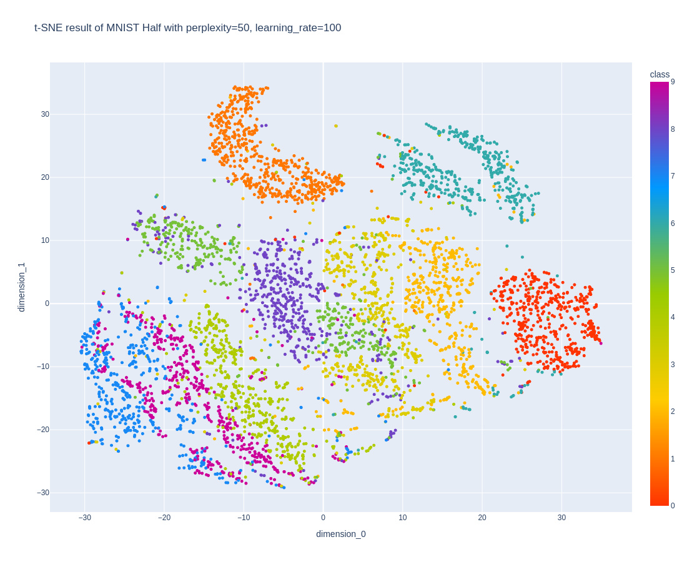

## 목차

* [1. PCA 와 t-SNE 의 개념](#1-pca-와-t-sne-의-개념)
* [2. PCA 와 t-SNE 의 특징 요약](#2-pca-와-t-sne-의-특징-요약)
  * [2-1. t-SNE 알고리즘 요약](#2-1-t-sne-알고리즘-요약) 
* [3. 실험 : PCA vs. t-SNE (데이터 시각화 관점)](#3-실험--pca-vs-t-sne-데이터-시각화-관점)
  * [3-1. 실험 설계](#3-1-실험-설계)
  * [3-2. 실험 결과](#3-2-실험-결과)

## 실험 코드

* 실험 코드 : [Experiment Code (ipynb)](codes/PCA_vs_tSNE_experiment.ipynb)

## 1. PCA 와 t-SNE 의 개념

**PCA (Principal Component Analysis)** 와 **t-SNE (t-distributed Stochastic Neighbor Embedding)** 의 기본 개념은 다음과 같다.

* [PCA (Principal Component Analysis)](../Machine%20Learning%20Models/머신러닝_모델_PCA.md)
  * 데이터셋의 **분산을 최대한 보존** 하는 "feature의 결합" 인 **주성분 (Principal Component)** 을 추출
  * 이를 통해 **데이터셋의 차원을 축소**
* t-SNE
  * data point 의 **상대적 거리를 유지** (멀리 떨어진 data point 는 t-SNE 결과에서도 상대적으로 멀리 떨어짐)
  * 머신러닝을 위한 차원 축소보다는 **데이터 시각화** 에 보다 중점

## 2. PCA 와 t-SNE 의 특징 요약

PCA 와 t-SNE 의 특징을 요약하면 다음과 같다.

| 구분                                 | PCA                       | t-SNE                   |
|------------------------------------|---------------------------|-------------------------|
| [차원의 저주](데이터_사이언스_기초_차원의_저주.md) 해결 | O (차원 축소)                 | O (차원 축소)               |
| 기본 목적                              | 분산을 최대한 보존 → **머신러닝에 적용** | 상대적 거리 유지 → **시각화에 중점** |
| 상대적 거리 유지                          | X                         | O                       |
| 축 계산이 항상 일정                        | O (분산이 최대인 축)             | X                       |
| 지원하는 차원                            | 몇 차원이든 지원                 | 2, 3 차원으로의 축소만 지원       |
| data point 개수 N 에 따른 연산량           |                           | $O(N^2)$                |

### 2-1. t-SNE 알고리즘 요약

* 핵심 정리
  * 고차원 feature space 에서 가까운 거리의 data point 는 **2~3 차원 feature space 에서도 거리가 가깝게** 한다.
  * [Gradient Descent](../Machine%20Learning%20Models/머신러닝_모델_Linear_Logistic_Regression.md#2-2-regression-최적화-과정) 를 이용한, 전체 data point 의 **KL Divergence (Kullback-Leibler Divergence)** 합을 최소화
* KL Divergence
  * 두 확률분포 P, Q 가 **얼마나 차이가 있는지** 를 나타내는 값
  * $\displaystyle D_{KL}(P || Q) = \Sigma_{x \in X} P(x) log (\frac{P(x)}{Q(x)})$

## 3. 실험 : PCA vs. t-SNE (데이터 시각화 관점)

### 3-1. 실험 설계

* 실험 목표
  * PCA 에 비해 **t-SNE 가 데이터 시각화 관점에서 더 우수함을 증명** 

* 실험 데이터셋
  * MNIST 숫자 데이터셋 (총 60,000 개 중 **랜덤하게 5,000 개** 선정)
  * Cifar-10 이미지 데이터셋 (전체 중 **랜덤하게 5,000 개** 선정)

* 실험 방법
  * 각 데이터셋 별, 다음과 같이 PCA 및 t-SNE 를 적용하여, 그 결과를 비교 

| 적용 방법 | 기본 설정                  | 상세 하이퍼파라미터                                                                                                                                                                                                                           |
|-------|------------------------|--------------------------------------------------------------------------------------------------------------------------------------------------------------------------------------------------------------------------------------|
| 공통    | -                      | 이미지를 먼저 축소한 후 PCA, t-SNE 적용<br>- 원본 (28 x 28, 32 x 32)<br>- 1/2 로 축소 (14 x 14, 16 x 16)<br> - 1/4 로 축소 (7 x 7, 8 x 8)                                                                                                                |                                                                                                               |
| PCA   | 2차원으로 차원 축소            | ```whiten``` : 분산에 대한 1 로의 정규화 여부<br>```svd_solver``` : SVD (Singular Value Decomposition) 설정값<br>- ```full``` : SVD 를 정확히 계산<br>- ```arpack``` : 희소 행렬에서 사용하는 SVD 알고리즘<br>- ```randomized``` : Random Projection 기반으로, 일부 정확도 손실 가능 |
| t-SNE | 2차원으로 차원 축소 & 500 회 반복 | ```perplexity``` : 값이 클수록 Cluster 간 데이터가 뭉쳐지고, Cluster 개수가 작아짐 (보통 5 ~ 50)<br>```learning_rate``` : [Learning Rate](../Deep%20Learning%20Basics/딥러닝_기초_Learning_Rate.md) 로 딥러닝의 학습률과 유사한 개념 (보통 10 ~ 1000)                           |

### 3-2. 실험 결과

**1. 실험 결과 요약**

* PCA 결과의 경우, MNIST 와 Cifar-10 모두에서 서로 다른 각 class 의 데이터가 속한 부분들이 상당히 겹쳐 있다.
* t-SNE 결과의 경우, **서로 다른 class 의 영역끼리 비교적 시각적으로 명확히 구분되는 편** 이다. (특히 MNIST 데이터셋에서)

**2. MNIST 숫자 데이터셋의 TOP 5 시각화 결과**

* PCA 결과의 경우, 서로 다른 각 class 의 데이터가 속한 부분들이 상당히 겹쳐 있다.
* t-SNE 결과의 경우, 이와 같이 겹치는 부분이 거의 없다.

|       | PCA                                                             | t-SNE                                                                                                                |
|-------|-----------------------------------------------------------------|----------------------------------------------------------------------------------------------------------------------|
| TOP 1 | 이미지 크기 = **Original**<br><br> | { img_size = **Quarter**, perplexity = **30**, learning_rate = **100** }<br><br>   |
| TOP 2 | 이미지 크기 = **Half**<br><br>     | { img_size = **Quarter**, perplexity = **50**, learning_rate = **100** }<br><br>   |
| TOP 3 | 이미지 크기 = **Quarter**<br><br>  | { img_size = **Half**, perplexity = **30**, learning_rate = **100** }<br><br>      |
| TOP 4 |                                                                 | { img_size = **Half**, perplexity = **50**, learning_rate = **100** }<br><br>     |
| TOP 5 |                                                                 | { img_size = **Original**, perplexity = **30**, learning_rate = **100** }<br><br> |

**3. Cifar-10 이미지 데이터셋의 TOP 5 시각화 결과**

* PCA 결과의 경우, 서로 다른 각 class 의 데이터가 속한 부분들이 상당히 겹쳐 있다.
* t-SNE 결과의 경우, 서로 다른 각 class 의 데이터 간 겹치는 부분이 상당히 있지만 PCA 결과에 비해서는 덜 겹친다.

|       | PCA                                                             | t-SNE                                                                                                               |
|-------|-----------------------------------------------------------------|---------------------------------------------------------------------------------------------------------------------|
| TOP 1 | 이미지 크기 = **Original**<br><br> | { img_size = **Original**, perplexity = **5**, learning_rate = **25** }<br><br>  |
| TOP 2 | 이미지 크기 = **Half**<br><br>     | { img_size = **Original**, perplexity = **5**, learning_rate = **100** }<br><br> |
| TOP 3 | 이미지 크기 = **Quarter**<br><br>  | { img_size = **Original**, perplexity = **5**, learning_rate = **400** }<br><br> |
| TOP 4 |                                                                 | { img_size = **Half**, perplexity = **15**, learning_rate = **25** }<br><br>     |
| TOP 5 |                                                                 | { img_size = **Quarter**, perplexity = **5**, learning_rate = **25** }<br><br>   |