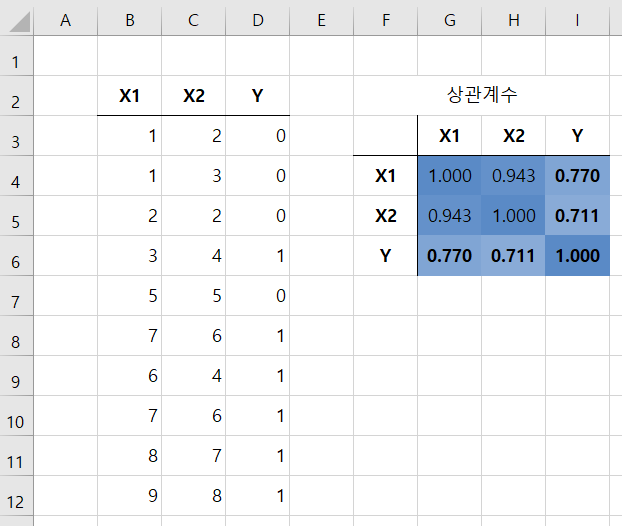
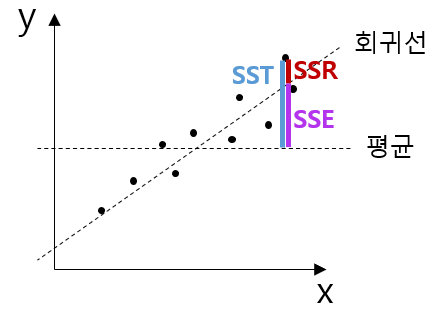

## 목차
* [1. 다중공선성 (multicollinearity) 및 그 문제점](#1-다중공선성-multicollinearity-및-그-문제점)
* [2. 다중공선성의 확인 방법](#2-다중공선성의-확인-방법)
  * [2-1. R-squared 값 (결정계수)](#2-1-r-squared-값-결정계수)
  * [2-2. 분산팽창지수 (VIF)](#2-2-분산팽창지수-vif)
* [3. 다중공선성의 해결 방법](#3-다중공선성의-해결-방법)

## 1. 다중공선성 (multicollinearity) 및 그 문제점
**다중공선성 (multicollinearity)** 이란 **2개의 feature (독립변수) 가 상호간에 강력한 상관관계를 갖는 것** 을 의미한다. 다중공선성이 있으면 다음과 같은 문제가 발생한다.
* 특정 변수가 target 값에 미치는 영향을 제대로 파악할 수 없다.
* 두 변수 간의 상관계수의 절댓값이 1에 가까울 정도로 상관관계가 높다면 **같은 변수를 불필요하게 중복** 하여 사용한 셈이 된다.
* 독립변수 (feature) 가 X1, X2, ... 이고 종속변수 (target) 가 Y일 때, $Y = a(X1) + b(X2) + ...$ 의 모델 수식에서 계수 a, b, ... 와 같은 회귀계수를 측정하기 어려워진다.

다중공선성이 있는 데이터의 예시. X1과 X2 사이의 상관계수가 0.943이다.

## 2. 다중공선성의 확인 방법
다중공선성은 다음과 같은 방법으로 확인할 수 있다.
* 두 독립변수의 상관계수가 일정 값 (예: 절댓값이 0.8 이상) 일 때
* 분산팽창지수 (VIF, Variance Inflation Factor)
* R-squared 값: 두 독립변수 중 하나를 독립변수 (feature), 하나를 종속변수 (target)로 하는 회귀분석 시의 값 파악

### 2-1. R-squared 값 (결정계수)
분산팽창지수를 계산하기 위해서는 먼저 **결정계수**라고도 하는 **R-squared 값**에 대해 알아야 한다. R-squared 값은 다음과 같이 계산한다.
* (R-squared 값) = (SSE) / (SST) = **1 - (SSR) / (SST)**

여기서 SSE, SSR, SST 값은 각각 다음과 같이 계산한다.
* $$(SSE) = \sum_{i=1}^n (\hat{Y}_i - Y_m)^2$$
* $$(SSR) = \sum_{i=1}^n (Y_i - \hat{Y}_i)^2$$
* $$(SST) = \sum_{i=1}^n (Y_i - Y_m)^2$$

즉, 다음과 같다.
* SSE = **(추정값) - (평균값)** 의 제곱의 합
* SST = **(실제 값) - (평균값)** 의 제곱의 합
* SSR = **(실제 값) - (추정값)** 의 제곱의 합

SSE, SST, SSR을 나타낸 그림

따라서, R-squared 값은 SST 값이 일정할 때 SSR 값이 커질수록 작아지므로, 실제 값과 추정 값의 차이가 커질수록 작아진다. 즉, **실제 값이 추정 값과 차이가 작을수록** 커진다.

따라서 R-squared 값은 두 독립변수 중 하나를 독립변수, 다른 하나를 종속변수로 했을 때, **종속변수의 값을 예측하는 머신러닝 모델의 성능이 좋을수록** 커진다고 이해할 수 있다.

예시 데이터에서 SSE, SST, SSR 값은 다음과 같다.
* 회귀선 : X2 = 0.655 * (X1) + 1.489
* **R-squared 값 : 0.889158**

### 2-2. 분산팽창지수 (VIF)
**분산팽창지수 (VIF, Variance Inflation Factor)** 는 다음 수식을 이용하여 계산한다.
* 1 / (1 - (R-sqaured 값))

분산팽창지수가 클수록 다중공선성이 크다는 의미이며, 보통 5~10 이상이면 다중공선성으로 인해 문제가 발생한다고 할 수 있다.

예시 데이터에서 분산팽창지수를 계산하면 다음과 같다.
* 1 / (1 - 0.889158) = **9.021851**

따라서 예시 데이터에서 두 feature X1, X2 간에는 다중공선성이 있다고 할 수 있다.

## 3. 다중공선성의 해결 방법
다중공선성을 해결하는 방법은 다음과 같다.
* 상관계수가 매우 높은 feature 중 중복되는 것을 제거
  * target 변수와의 상관계수가 낮은 변수를 제거하는 것이 좋음
* 차원 축소
  * [PCA (Principle Component Analysis)](../Machine%20Learning%20Models/머신러닝_모델_PCA.md) : 연속되는 숫자 데이터에서 사용 가능
