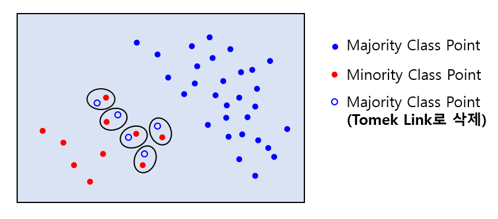

## 목차
* [1. 데이터 불균형 (Data Imbalance)](#1-데이터-불균형-data-imbalance)
* [2. 데이터 불균형의 문제점](#2-데이터-불균형의-문제점)
* [3. 데이터 불균형의 해결 방법](#3-데이터-불균형의-해결-방법)
  * [3-1. Minority Class 데이터 추가 수집](#3-1-minority-class-데이터-추가-수집)
  * [3-2. Data Augmentation](#3-2-data-augmentation)
  * [3-3. Undersampling & Oversampling](#3-3-undersamplingoversampling)
  * [3-4. 성능 평가 지표 선정](#3-4-성능-평가-지표)
  * [3-5. Class 별 가중치 조정](#3-5-class-별-가중치-조정)

## 1. 데이터 불균형 (Data Imbalance)
데이터 불균형이란 Classification Task에서 **특정 Class의 데이터가 다른 Class의 데이터보다 훨씬 많은 것** 을 가리킨다. 실무적으로는 다음과 같은 예시가 있다.
* 공정 분석에서의 **정량품 (양품) vs. 불량품**
* 의료 분야에서의 **정상 세포 vs. 암 세포**
* 채팅 등 NLP 관련 분야에서의 **올바른 언어 표현 vs. 욕설/비속어**
* 게임 유저 행동 패턴 중 **정상 패턴 vs. 비정상 (핵 프로그램 사용 등) 패턴**

데이터 불균형 상황에서 다음과 같은 용어를 사용한다.
* Majority Class : 데이터가 많은 클래스
* Minority Class : 데이터가 적은 클래스

## 2. 데이터 불균형의 문제점
* 모델의 실제 성능이 낮은데도 [Accuracy 등 특정 성능지표](데이터_사이언스_기초_Metrics)가 높게 나올 수 있음
  * Class A, B, C가 각각 90%, 5%, 5%인 Classification task에서, 모든 데이터를 Class A로 예측하는 모델은 정확도가 90%임 
  * AI 비전문가와 커뮤니케이션 시, "이 모델은 정확도가 90%나 되는데 왜 Class B, C를 예측하지 못하지?" 라는 혼란이 생길 수 있음 
* 머신러닝 모델의 학습에 지장
  * 딥러닝 등 오차 함수 (Loss Function) 를 최소화하는 모델을 이용하는 경우, **모든 데이터를 특정 Class로 예측하는 모델로 수렴** 할 수 있음

## 3. 데이터 불균형의 해결 방법
데이터 불균형 해결 방법을 요약하면 다음과 같다.

* **데이터를 새로 추가/제거** 하는 방법
  * Minority Class 데이터 추가 수집
  * Data Augmentation
  * Undersampling & Oversampling
* 데이터 추가/제거 없이 **학습 환경만 바꾸는** 방법
  * 적절한 성능 평가 지표 선택
  * Loss Function 등에서 Class 별 가중치 조정

## 3-1. Minority Class 데이터 추가 수집
Minority Class 데이터를 추가 수집하여 불균형을 어느 정도 해결한다.

## 3-2. Data Augmentation
이미지 분류 문제에서 자주 사용하는 방법으로, Minority Class에 속하는 데이터를 변형하여 같은 Class를 갖는 새로운 데이터를 만드는 것이다.
* Vision 분야에서는 Image Augmentation이라고 하며, 한 장의 이미지를 상하좌우 반전, 회전 등의 방법으로 새로운 이미지를 만드는 것을 의미한다.
* Image Augmentation의 자세한 방법론은 [해당 문서](../../Image%20Processing/Basics_Image%20Augmentation.md) 참고.

## 3-3. Undersampling/Oversampling
* **Undersampling** : Majority Class의 데이터 중 일부만을 선정하여 학습 데이터에 포함시키는 방법
  * Random Sampling
  * **Tomek Links** : Majority Class와 Minority Class의 데이터가 모두 분포하고 있는 일종의 '경계선' 상의 Majority Class 데이터를 삭제한다.
    * 구체적으로는 Majority Class의 1st nearest neighbor point가 Minority Class일 때, 경계선상에 있는 것으로 간주하고 이를 삭제한다. 

* 위 예시에서 검은색 타원이 Tomek Link 및 이로 인해 삭제되는 Majority Class Point를 나타낸다.

----

* **Oversampling** : Minority Class의 데이터를 새로 생성하는 것
  * **SMOTE (Synthetic Minority Oversampling Technique)** : Minority Class의 데이터인 벡터 2개를 선택한 후, 이들 벡터의 가중 합을 새로운 Minority Class의 데이터로 추가
    * 데이터가 vector (또는 2차원 행렬, 3차원 이상의 텐서 등 숫자 값) 형태로 표현 가능할 때만 사용 가능하다.
    * 가중치를 적용하여 생성한 결과 벡터가 Majority Class에 속할 가능성이 높거나, 어떤 Class에도 속할 가능성이 낮은 데이터인 경우 사용하기 어렵다.

* 위 예시에서 Minority Class의 2개의 벡터 A, B의 가중 합을 이용하여 Minority Class에 새로운 point C, D를 추가했다.
  * 가중치 수식 : C = 0.1A + 0.9B, D = 0.6A + 0.4B
* C는 큰 문제가 없지만, D는 그 위치가 Majority Class의 영역임에도 불구하고 Minority Class로 분류되고 있다. 
  * 가능한 해결 방법 : **거리가 가까운 Minority Class Point 를 선택하여 이들의 가중 합으로 새로운 point를 생성** 한다.

## 3-4. 성능 평가 지표
모델 학습에는 큰 지장이 없지만 성능 평가 지표에서 문제가 되는 경우, 다음과 같이 **불균형한 데이터에 대한 성능도 신뢰성 있게 측정할 수 있는 성능지표**를 이용한다.
* [F1 Score](데이터_사이언스_기초_Metrics.md#1-3-f1-score)
* [Precision-Recall AUC (PR-AUC)](데이터_사이언스_기초_Metrics.md#3-1-area-under-precision-recall-curve-pr-auc)
* [Area Under ROC Curve (ROC-AUC)](데이터_사이언스_기초_Metrics.md#3-2-area-under-roc-curve-roc-auc)

## 3-5. Class 별 가중치 조정
Minority Class 의 데이터를 추가 수집 또는 생성할 수 없는 경우, Loss Function 등에서 **Minority Class 일수록 높은 가중치를 부여하는 방식** 으로 보정한다.
* 예를 들어, 모든 Class에 대해 균동한 학습을 위해 Loss Function의 각 데이터에 대한 가중치를 (해당 데이터가 속한 Class의 전체 데이터 개수의 역수) 로 설정할 수 있다.