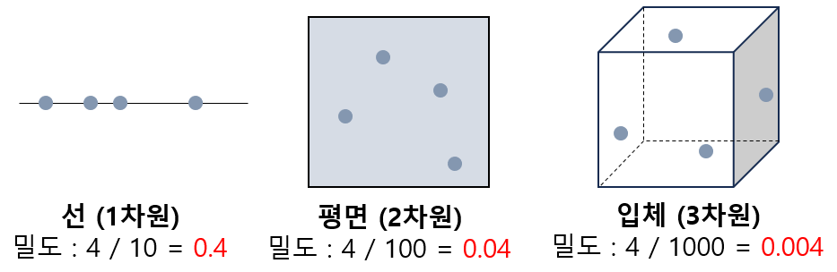

## 목차
* [1. 차원의 저주](#1-차원의-저주)
* [2. 학습 데이터의 차원이 많으면 모델 성능이 감소하는 이유](#2-학습-데이터의-차원이-많으면-모델-성능이-감소하는-이유)
* [3. 차원의 저주 해결 방법](#3-차원의-저주-해결-방법)
  * [3-1. 데이터 개수 늘리기](#3-1-데이터-개수-늘리기)
  * [3-2. 차원 축소 - Feature Selection](#3-2-차원-축소---feature-selection)
  * [3-3. 차원 축소 - Feature Extraction](#3-3-차원-축소---feature-extraction)
  * [3-4. 차원 축소 방법 비교](#3-4-차원-축소-방법-비교)

## 1. 차원의 저주
**차원의 저주 (The curse of dimensionality)** 는 학습 데이터의 차원, 즉 feature의 개수가 과도하게 증가하여, 다음과 같은 문제가 발생하는 것을 말한다.
* 알고리즘 관점에서의 이슈
  * 계산량 증가 및 이로 인한 학습 시간 증가
  * 메모리 사용량 증가
* 모델 학습 관점에서의 이슈
  * 학습된 모델의 성능 감소

## 2. 학습 데이터의 차원이 많으면 모델 성능이 감소하는 이유
feature space 에서의 데이터의 밀도가 **차원이 증가함에 따라 기하급수적으로** 낮아지므로, 다음과 같은 이유로 모델 성능이 저하됨
* 어떤 data point와 이웃한 data point 간의 거리가 멀어짐
  * **새로운 테스트 데이터가 기존 학습 데이터와 멀리 떨어지게** 되므로, 잘못 예측하거나 Class를 오분류할 가능성이 높아짐 
  * 특히, 최근접 이웃을 이용하여 테스트 데이터의 Class를 판단하는 [k-Nearest-Neighbors](../Machine%20Learning%20Models/머신러닝_모델_KNN.md) 알고리즘을 사용할 때 문제가 큼
* 데이터의 밀도가 낮아진 것이 빈 공간이 많이 생겼다는 것을 의미하므로, 빈 공간의 발생 자체로 인해 모델 성능이 저하됨 
  * 빈 공간을 메우기 위해 데이터를 추가하는 경우에도 성능 향상에 한계가 있음

## 3. 차원의 저주 해결 방법
차원의 저주를 해결하는 방법은 다음과 같이 구분할 수 있다.

| 구분         | 설명                                                                                                                          |
|------------|-----------------------------------------------------------------------------------------------------------------------------|
| 데이터 개수 늘리기 | - 학습 데이터로 사용할 데이터를 추가 수집 - 차원이 커짐에 따라 기하급수적으로 늘어나는 빈 공간을 채우기에는 현실적으로 데이터가 부족할 가능성 높음                                     |
| 차원 축소      | **차원이 늘어남에 따라 문제가 발생하므로, 근본적인 원인인 '차원' 자체 관점에서 해결** - Feature Selection (특성 선택) 및 Feature Extraction (압축을 통한 특성 추출) 로 구분 |

### 3-1. 데이터 개수 늘리기
데이터를 추가 수집하는 등 데이터 개수를 늘리는 것도 해결 방법이지만, 다음과 같은 한계가 있다.
* 현실적으로 데이터를 추가 수집하기 어려울 수 있음
* 데이터를 추가하기 위해 기존의 여러 데이터 벡터를 선택, 평균하여 새로운 데이터 벡터를 만드는 등의 방법도 있지만, 성능 향상을 보장할 수 없음

### 3-2. 차원 축소 - Feature Selection
**차원 축소 방법 중 Feature Selection (특성 선택)** 은 기존의 feature들 중 일부만을 선택하여 학습에 사용하는 것이다.
* 핵심 아이디어
  * 불필요하거나 중복된 feature를 제거하고, 데이터의 중요한 특징을 나타내는 feature만 남긴다.
* 방법론

| 방법론                        | 설명                                                                                                                                                                                                 |
|----------------------------|----------------------------------------------------------------------------------------------------------------------------------------------------------------------------------------------------|
| Information Gain (정보량)     | - 데이터 값의 다양성을 의미하는 Entropy의 값이 클수록 Information Gain이 큼 - 따라서, **정보량이 큰, 즉 Entropy의 값이 큰 feature** 를 선택 - 참고 : [Decision Tree 모델 설명](../Machine%20Learning%20Models/머신러닝_모델_Decision_Tree.md) |                                                                                                       |
| Chi-Square Test (카이 제곱 검정) | - 2개의 feature 간 독립성을 검정한 후, 그 결과를 차원 축소에 이용                                                                                                                                                        |
| 상관계수 이용                    | - 모델이 예측하려는 target feature를 포함한 다른 feature와의 상관계수가 매우 낮은 feature 제거 - target이 아니지만 서로 상관계수가 매우 높은 feature를 중복으로 간주하여 제거 - 참고 : [다중공선성 및 그 해결 방법](데이터_사이언스_기초_다중공선성_VIF.md)                   |
| Wrapper Method             | - 여러 가지 feature 조합으로 "학습 - 성능 테스트"의 일련의 과정을 반복 - 이를 통해 최적의 feature 조합 탐색                                                                                                                        |

### 3-3. 차원 축소 - Feature Extraction
**차원 축소 방법 중 Feature Extraction (특성 추출)** 은 기존 feature들을 조합하여 **데이터셋의 특징을 잘 나타내는 새로운 feature를 생성** 하는 것이다.
* 핵심 아이디어
  * feature 간의 관계를 분석하여, 여러 개의 feature를 결합한 새로운 feature 생성
* 방법론

| 방법론                                                            | 알고리즘 분류 | 설명                                                                                                                                      |
|----------------------------------------------------------------|---------|-----------------------------------------------------------------------------------------------------------------------------------------|
| Principal Component Analysis (주성분 분석, PCA)                     | 비지도학습   | - 기존 feature의 조합들 중, 데이터셋에서 분산이 가장 큰 축 (axis) 에 해당하는 **주성분 (Principal Component)** 을 추출 - 주성분은 결국 **기존 데이터의 분산을 최대한 보존** 하는 feature임 |
| Linear Discriminant Analysis (선형 판별 분석, LDA)                   | 지도학습    | feature의 조합 중 **두 Class를 가장 잘 구분** 하는, 다음 조건을 만족시키는 것을 찾음 - 서로 같은 class에 속한 data point들의 분산 최소화 - class의 중심점 간 거리 최대화             |
| [Auto-Encoder](../../Generative%20AI/Basics_Auto%20Encoder.md) | 비지도학습   | 딥러닝에 사용되는 인공신경망의 일종                                                                                                                     |
| T-Stochastic Neighbor Embedding (t-SNE)                        | 비지도학습   | - **data point 간의 상대적 거리를 유지** 하는 것에 초점 - 고차원의 데이터를 2~3차원으로 변환하여 시각화 가능                                                              |

### 3-4. 차원 축소 방법 비교
|           | Feature Selection                                      | Feature Extraction                |
|-----------|--------------------------------------------------------|-----------------------------------|
| 설명/해석 용이성 | **높음**                                                 | **낮음** (결합된 feature를 해석하기 어려움) |
| 정보 보존     | **낮음** (feature 결합이 없으므로, 선택되지 않은 feature의 정보는 손실됨) | **높음** (feature의 결합을 사용하므로)    |
| 계산량       | **낮음**                                                 | **높음** (feature 결합을 위한 계산 필요)  |
