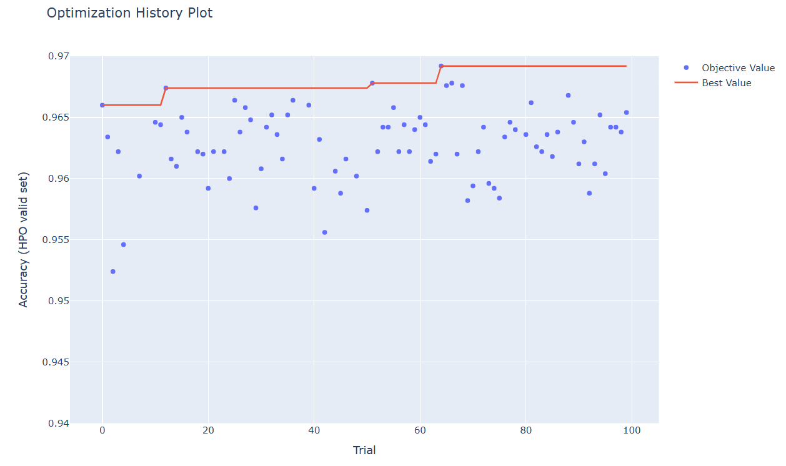
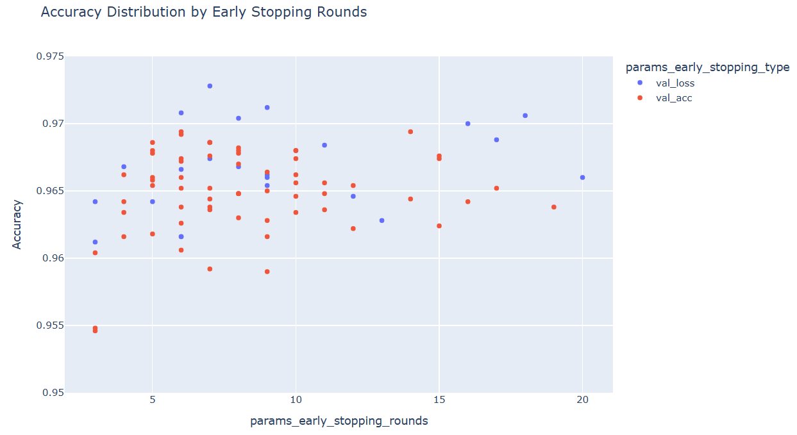

## 목차

* [1. Early Stopping](#1-early-stopping)
* [2. Early Stopping 의 기준 (Metric vs. Loss)](#2-early-stopping-의-기준-metric-vs-loss)
* [3. 실험 (최적 Early Stopping 기준 및 횟수)](#3-실험-최적-early-stopping-기준-및-횟수)
  * [3-1. 실험 설계](#3-1-실험-설계)
  * [3-2. 실험 결과](#3-2-실험-결과)
  * [3-3. 실험 결과에 대한 이유 분석](#3-3-실험-결과에-대한-이유-분석)
  * [3-4. 보충 실험: 학습 수행 시간 페널티 적용 시](#3-4-보충-실험-학습-수행-시간-페널티-적용-시)

## 코드

* [최적 Early Stopping 기준 및 횟수 실험](#3-실험-최적-early-stopping-기준-및-횟수) 코드 : [code (ipynb)](codes/Early_Stopping_experiment.ipynb)
* [보충 실험](#3-4-보충-실험-학습-수행-시간-페널티-적용-시) 코드 : [code (ipynb)](codes/Early_Stopping_experiment_2.ipynb)

## 1. Early Stopping

**Early Stopping** 은 딥러닝 학습 중 [overfitting](딥러닝_기초_Overfitting_Dropout.md#2-딥러닝에서의-오버피팅-overfitting) 을 방지하기 위한 방법 중 하나로, **valid dataset 의 성능지표의 최고/최저 기록이 일정 epoch 횟수 동안 갱신되지 않으면 학습을 조기 종료** 하는 것이다.

* 이때, best model 은 **Early Stopping 되는 순간까지 학습된 모델** 이 아닌, 그 이전의 **Highest Performance Metric 또는 Lowest Loss** 를 기록한 모델이다.
* 자세한 것은 [Overfitting 과 Early Stopping](../Machine%20Learning%20Models/머신러닝_방법론_Train_Valid_Test.md#3-overfitting-과-early-stopping) 참고.

예를 들어 다음과 같다.

* **[A]** Valid set Accuracy (정확도) 의 **최고 기록**이 5 회 이상 갱신되지 않으면 학습을 조기 종료하는 경우
* **[B]** Valid Loss 의 **최저 기록**이 10 회 이상 갱신되지 않으면 학습 조기 종료


## 2. Early Stopping 의 기준 (Metric vs. Loss)

Early Stopping 의 기준으로 다음을 생각해 볼 수 있다.

* Valid data 에 대한 [Metric (Accuracy, Recall, F1 Score 등)](../Data%20Science%20Basics/데이터_사이언스_기초_Metrics.md)
* Valid data [Loss](딥러닝_기초_Loss_function.md)

각 기준의 특징은 다음과 같다. 일반적으로는 **Accuracy나 F1 Score 등 모델 성능 평가 지표보다는 미세한 변화를 포착할 수 있는 Loss 를 사용하는 것이 비교적 권장** 되고 있다.

| 기준             | Accuracy, F1 Score 등                                   | Loss                                                  |
|----------------|--------------------------------------------------------|-------------------------------------------------------|
| 본질             | 모델을 최종 평가하기 위한 **성능지표**                                | 이 성능지표를 올리기 위해 모델이 학습을 통해 줄여야 할 **최적화 목표**            |
| 이산/연속          | 이산적인 값                                                 | 연속적인 값                                                |
| 미세한 변화 반영      | X (계단식 변화하는 지표. valid data 개수가 많을수록 보다 작은 변화를 반영하기는 함) | O                                                     |
| overfitting 탐지 | Loss 에 비해 다소 늦을 수 있음                                   | Loss 가 감소에서 미세한 증가 추이로 변하는 것은 overfitting이 시작되었다는 의미임 |

## 3. 실험 (최적 Early Stopping 기준 및 횟수)

**실험 목표**

* Early Stopping 의 기준으로 성능지표 (Accuracy 등) 와 Loss 중 무엇이 더 적합한지 알아본다.
  * 최종 성능지표뿐만 아니라, 전체 epoch 수 등 학습 시간 관련 지표까지 고려한다. 
* 데이터셋에서 최적의 Early Stopping epoch 횟수 (해당 횟수만큼 신기록이 나오지 않으면 학습 종료) 를 찾는다.

### 3-1. 실험 설계

**데이터셋**

* **MNIST 숫자 이미지 분류 데이터셋 (train 60K / test 10K)**
  * 10 개의 Class 가 있는 Classification Task
  * 학습 시간 절약을 위해, train dataset 중 일부만을 샘플링하여 학습
* 선정 이유
  * 데이터셋이 28 x 28 size 의 작은 이미지들로 구성
  * 이로 인해 비교적 간단한 신경망을 설계할 수 있으므로, 간단한 딥러닝 실험에 적합하다고 판단
* 데이터셋 분리
  * 학습 데이터가 조금 부족한 편이어야지 **Early Stopping 설정에 따른 overfitting 여부의 변별이 가능** 할 것으로 판단

| 학습 데이터  | Valid 데이터 (Epoch 단위) | Valid 데이터 (Trial 단위) | Test 데이터          |
|---------|----------------------|----------------------|-------------------|
| 1,000 장 | 2,000 장              | 5,000 장              | 10,000 장 (원본 그대로) |

**성능 Metric**

* **Accuracy**
* 선정 이유
  * Accuracy 로 성능을 측정해도 될 정도로, [각 Class 간 데이터 불균형](../Data%20Science%20Basics/데이터_사이언스_기초_데이터_불균형.md) 이 적음 

**신경망 구조**

* 신경망 구조가 비교적 복잡해야지 **Early Stopping 설정에 따른 overfitting 여부의 변별이 가능** 할 것으로 판단하여, 다른 실험에 비해 **모델 구조를 복잡하게** 함

```python
# 신경망 구조 출력 코드

from torchinfo import summary

model = CNN()
print(summary(model, input_size=(BATCH_SIZE, 1, 28, 28)))
```


* [Dropout](딥러닝_기초_Overfitting_Dropout.md#3-dropout) 미 적용
* [Learning Rate Scheduler](딥러닝_기초_Learning_Rate_Scheduler.md) 미 적용
* Optimizer 는 [AdamW](딥러닝_기초_Optimizer.md#2-3-adamw) 를 사용
  * 해당 Optimizer 가 [동일 데이터셋을 대상으로 한 성능 실험](딥러닝_기초_Optimizer.md#3-탐구-어떤-optimizer-가-적절할까) 에서 최상의 정확도를 기록했기 때문

**상세 학습 방법**

* 다음과 같이 하이퍼파라미터 최적화를 실시하여, **최적화된 하이퍼파라미터를 기준으로 한 성능을 기준** 으로 최고 성능의 Optimizer 를 파악
  * **Early Stopping 기준** ```early_stopping_type```
    * Valid data Accuracy
    * Valid data Loss
      * 아주 미세한 Loss 감소의 반복으로 학습이 매우 길어지는 것을 방지하기 위해, Loss 를 **소수점 이하 4째 자리까지 반올림한 값**을 이용한다.
      * 성능 향상의 최소 기준인 'Minimum Delta' 를 설정하여, 해당 값 이상으로 Valid data Loss 가 감소해야 성능 개선으로 인정하는 아이디어에서 착안했다.
  * **Early Stopping epoch 횟수** ```early_stopping_rounds```
    * 탐색 범위 : 3 ~ 20 범위의 자연수 
  * **learning rate** ```learning_rate```
    * 탐색 범위 : 0.0005 ~ 0.01 (= 5e-4 ~ 1e-2)

* 하이퍼파라미터 최적화
  * [하이퍼파라미터 최적화 라이브러리](../Machine%20Learning%20Models/머신러닝_방법론_HyperParam_Opt.md#4-하이퍼파라미터-최적화-라이브러리) 중 Optuna 를 사용
  * 하이퍼파라미터 탐색 100 회 반복 (= 100 Trials) 실시

### 3-2. 실험 결과

**1. 실험 결론**

* **Loss 기준으로 Early Stopping** 하는 경우가 Accuracy 기준일 때보다 정확도가 높다.
* Early Stopping 을 위한 **epoch 횟수는 10 ~ 18 정도** 가 최고 정확도를 달성할 수 있다.
* Loss 기준으로 Early Stopping 하면서, 동시에 Early Stopping 을 위한 epoch 횟수가 10 이상일 때, **학습 시간이 매우 오래 걸린다.**
  * 따라서 Early Stopping 기준을 valid loss 로 하는 경우, 정확도를 기준으로 하는 하이퍼파라미터 최적화 시 학습 수행 시간에 따른 페널티를 주는 것을 고려할 필요가 있다. [(관련 추가 실험)](#3-4-보충-실험-학습-수행-시간-페널티-적용-시)

**2. Best Hyper-param 및 그 성능 (정확도)**

| 구분                   | 값                                                                                                                                       |
|----------------------|-----------------------------------------------------------------------------------------------------------------------------------------|
| 최종 테스트셋 정확도          | 97.47%                                                                                                                                  |
| HPO Valid set 최고 정확도 | 96.88%                                                                                                                                  |
| Best Hyper-param     | ```early_stopping_type``` : ```val_loss``` (Valid Dataset Loss 기준)<br>```early_stopping_rounds``` : 16<br>```learing_rate``` : 0.001629 |

**3. 하이퍼파라미터 최적화 진행에 따른 정확도 추이**



**4. 각 하이퍼파라미터의 값에 따른 성능 분포**

* (Early Stopping Type 별) Learning Rate 에 따른 Accuracy 분포
  * Learning Rate 가 0.003 이상으로 크면 **모델의 학습이 아예 되지 않는다.**
  * Loss 기준으로 Early Stopping 하는 경우가 Accuracy 기준일 때보다 전반적으로 성능이 좋다.


* (Early Stopping Type 별) Early Stopping epoch 횟수에 따른 Accuracy 분포
  * 모델의 학습이 잘 된 경우에 한해서, **7 이하의 낮은 값** 인 경우 최고 수준의 정확도를 달성하기 어렵다. 
  * Loss 기준으로 Early Stopping 하는 경우가 Accuracy 기준일 때보다 전반적으로 성능이 좋다.


* (Early Stopping Type 별) Early Stopping epoch 횟수에 따른 Epoch 횟수 분포
  * Loss 기준으로 Early Stopping 하는 경우, Early Stopping epoch 횟수가 10 이상이면 **150 epochs ~ 최대 400 epochs 이상으로 학습 시간이 매우 많이 소요** 된다.


### 3-3. 실험 결과에 대한 이유 분석

**Early Stopping 기준이 valid loss 이면서 Early Stopping epoch 횟수가 10 이상일 때, 학습 시간이 매우 오래 걸림**

* Early Stopping 기준이 valid data loss 이므로, 정확도에 반영이 안 될 정도의 미세한 loss 감소도 신기록 갱신으로 판단함
* 여기에 Learning rate 가 작으면 학습 자체가 느리며, 또한 이로 인해 valid loss 가 안정적으로 수렴하기 때문에 미세한 loss 감소가 계속 발생함
* Early Stopping epoch 횟수 자체가 많으므로, 학습 종료 조건에 이르는 데 오래 걸림

### 3-4. 보충 실험: 학습 수행 시간 페널티 적용 시

**1. 실험 목적**

* [원래 실험 결론](#3-2-실험-결과) 에서 Early Stopping 기준이 Valid data Loss 일 때 학습 수행 시간이 너무 오래 걸리는 문제를, **학습 수행 시간에 따라 하이퍼파라미터 최적화 목표값에 페널티** 를 줌으로써 해결하려고 함

**2. 실험 설계**

* 각 Trial 별 학습에 소요된 **Epoch 횟수가 많으면 다음과 같이 페널티** 를 부여
* Epoch 횟수 50 회 이하
  * 페널티 없음 (Optuna feedback 목표값 = **정확도 값** 그대로)
* Epoch 횟수 50 회 초과
  * 50회를 초과한 Epoch 1회 당 Optuna 에 feedback 되는 목표값에 **0.00005 (= 5e-5 = 0.005%) 의 감점** 부여
  * 예를 들어 150 epoch 기록 시, feedback 되는 값은 원래 정확도에서 0.5% 페널티 부여된 값

**3. 실험 결과**

* 실험 결론
  * **수행 시간 페널티를 줌으로써 학습 시간을 2배 가량 감소** 시켰다.
  * 최종 테스트셋, HPO Valid Set 최고 정확도를 모두 고려할 때, **성능은 수행 시간 페널티가 없을 때와 비슷한 수준** 으로 보인다.

* 전체 실험 시간, 성능 및 최적 하이퍼파라미터 비교

| 구분                   | 수행 시간 페널티 O                                                                                                                            | 수행 시간 페널티 X                                                                                                                             |
|----------------------|----------------------------------------------------------------------------------------------------------------------------------------|-----------------------------------------------------------------------------------------------------------------------------------------|
| 전체 실험 시간             | 1시간 1분                                                                                                                                 | 2시간 14분                                                                                                                                 |
| 최종 테스트셋 정확도          | 97.00%                                                                                                                                 | 97.47%                                                                                                                                  |
| HPO Valid set 최고 정확도 | 97.28%                                                                                                                                 | 96.88%                                                                                                                                  |
| Best Hyper-param     | ```early_stopping_type``` : ```val_loss``` (Valid Dataset Loss 기준)<br>```early_stopping_rounds``` : 7<br>```learing_rate``` : 0.001002 | ```early_stopping_type``` : ```val_loss``` (Valid Dataset Loss 기준)<br>```early_stopping_rounds``` : 16<br>```learing_rate``` : 0.001629 |

* (Early Stopping Type 별) Early Stopping epoch 횟수에 따른 Accuracy 분포
  * **Valid data Loss 기준으로 Early Stopping** 하는 쪽의 성능이 여전히 좋은 편이다.
  * 최고 성능을 기록하는 Early Stopping epoch 횟수는 **5 ~ 10회 정도** 로 다소 감소했다.



* (Early Stopping Type 별) Early Stopping epoch 횟수에 따른 Epoch 횟수 분포
  * 150 epochs 를 초과하는 Trial 이 페널티를 주지 않았을 때와 달리 거의 사라졌다.

