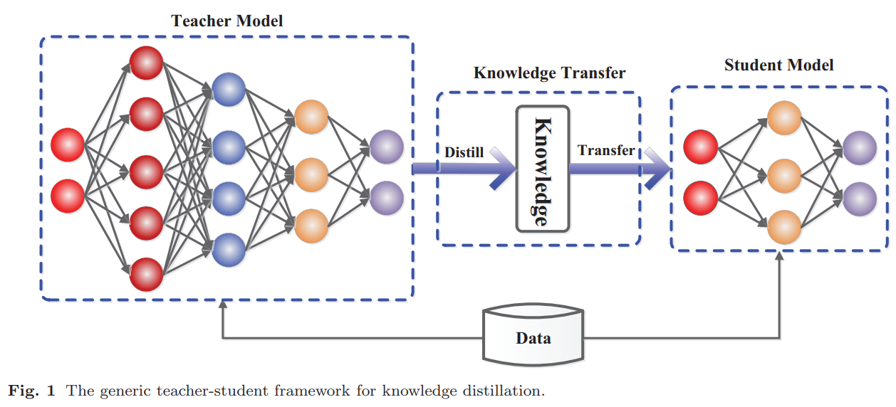
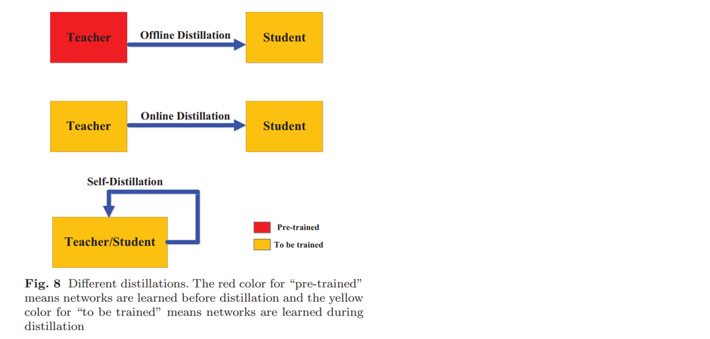
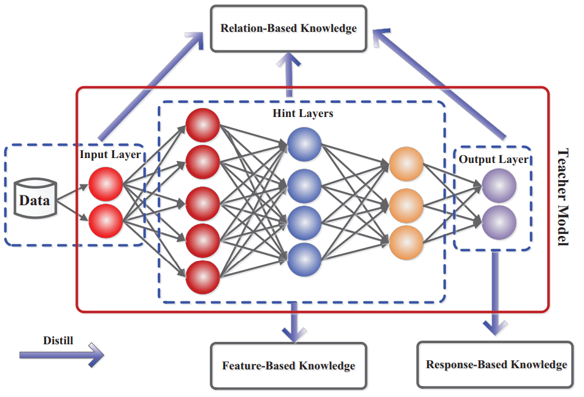
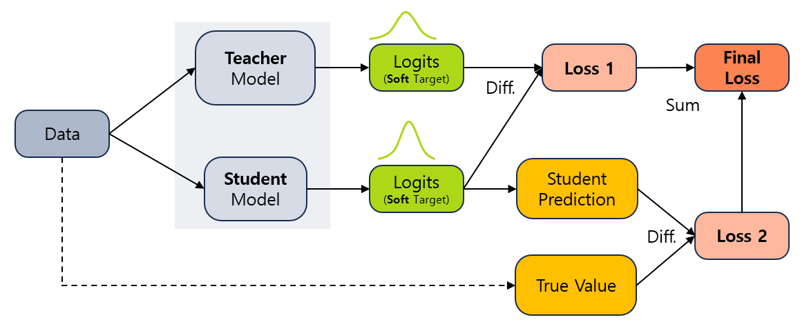
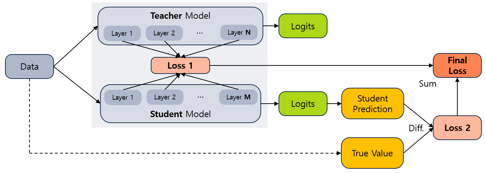
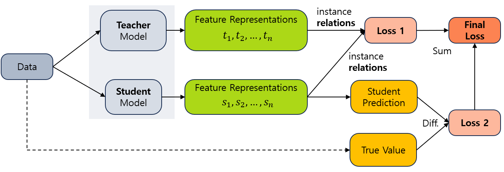
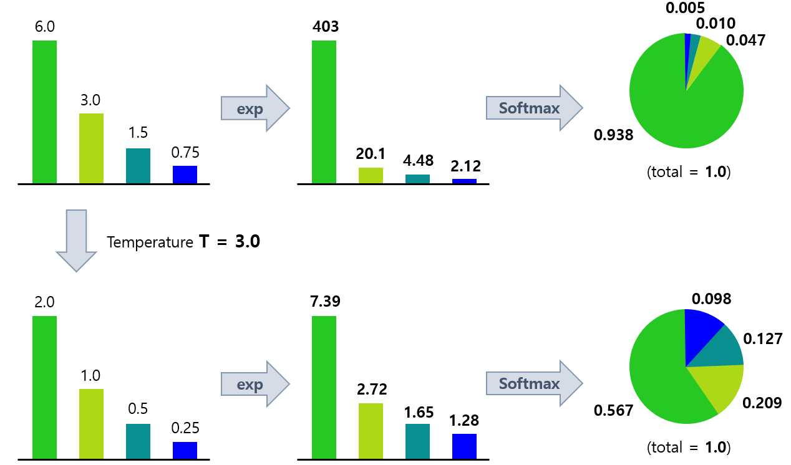

## 목차
* [1. Knowledge Distillation](#1-knowledge-distillation)
  * [1-1. Knowledge Distillation 은 기본적으로 비지도 학습임](#1-1-knowledge-distillation-은-기본적으로-비지도-학습임)
  * [1-2. Transfer Learning 과의 비교](#1-2-transfer-learning-과의-비교) 
* [2. Knowledge Distillation 학습 프로세스의 분류](#2-knowledge-distillation-학습-프로세스의-분류)
  * [2-1. Offline Distillation](#2-1-offline-distillation)
  * [2-2. Online Distillation](#2-2-online-distillation)
  * [2-3. Self-Distillation](#2-3-self-distillation)
* [3. Knowledge Distillation 방법의 분류](#2-knowledge-distillation-방법의-분류)
  * [3-1. Response-Based Knowledge Distillation](#3-1-response-based-knowledge-distillation)
  * [3-2. Feature-Based Knowledge Distillation](#3-2-feature-based-knowledge-distillation)
  * [3-3. Relation-Based Knowledge Distillation](#3-3-relation-based-knowledge-distillation)
* [4. Knowledge Distillation 과정](#4-knowledge-distillation-과정)
  * [4-1. Soft Label](#4-1-soft-label)
  * [4-2. KL-Divergence Loss](#4-2-kl-divergence-loss)

## 1. Knowledge Distillation

**Knowledge Distillation (지식 증류)** 는 Teacher Network 라 불리는 큰 모델로부터 **지식을 '증류' (핵심만 뽑아냄)** 하여, 이를 Student Network 라는 작은 모델로 '전달'하는 것이다.

* 이를 통해 **작은 모델이 큰 모델과 비슷한 수준의 성능을 발휘할 수 있게** 하는 것이다.



[(출처)](https://arxiv.org/pdf/2006.05525) Jianping Gou, Baosheng Yu et al, "Knowledge Distillation: A Survey"

Knowledge Distillation 의 필요성은 다음과 같이 사용자 요구에 따라 **경량화된 모델이 필요** 하기 때문이다.

* 거대한 모델을 실제 제품에 적용하면, 실제 사용자 입력 데이터를 모델에 입력했을 때 모델의 출력값을 받기까지 걸리는 '추론 시간'이 길어질 수 있음
* 용량 부족으로 인해 거대한 모델 자체를 제품에 적용할 수 없고, 경량화를 시켜야 함

### 1-1. Knowledge Distillation 은 기본적으로 비지도 학습임

Knowledge Distillation은 기본적으로 **Student 모델과 Teacher 모델의 출력 분포를 유사하게 만드는** 것이 목표인 **비지도학습** 이다.

* 양쪽 모델의 출력 분포를 유사하게 만드는 데에는 **Label 이 불필요** 하다.
* 따라서, Teacher 모델의 학습 데이터를 사용할 필요가 없다.

### 1-2. Transfer Learning 과의 비교

Transfer Learning 과 Knowledge Distillation 의 차이점은 다음과 같다.

|             | Transfer Learning              | Knowledge Distillation                |
|-------------|--------------------------------|---------------------------------------|
| 양쪽 모델 간 도메인 | 서로 다름 (새로운 Domain 으로 전이 학습)    | 서로 같음 (Student 가 Teacher 의 핵심 지식을 학습) |
| 목적          | 새로운 task 의 학습 시 자원 절약          | 모델 크기 자체를 줄임                          |
| 비유          | Python 언어 지식을 이용하여 C 언어를 쉽게 학습 | Python 언어의 다양한 함수 및 문법들 중 핵심 함수/문법 학습 |

## 2. Knowledge Distillation 학습 프로세스의 분류

Knowledge Distillation 의 학습 프로세스는 다음과 같이 3가지로 분류할 수 있다.

| 학습 프로세스              | 설명                                                                  |
|----------------------|---------------------------------------------------------------------|
| Offline Distillation | - **Pre-train** 된 Teacher Model 을 이용하여 Student Model 에 Distillation |
| Online Distillation  | - Teacher, Student Model 을 **동시에 또는 번갈아 가며** 학습                     |
| Self-Distillation    | - Teacher, Student 모델의 **네트워크 구조가 동일**                              |



[(출처)](https://arxiv.org/pdf/2006.05525) Jianping Gou, Baosheng Yu et al, "Knowledge Distillation: A Survey"

### 2-1. Offline Distillation

**Offline Distillation** 은 **Teacher Model 을 Pre-train** 시키고, 이 모델의 지식을 Student Model 로 전달하는 것이다.

Offline Distillation 의 학습 과정은 다음과 같다.

* Teacher Model 을 먼저 학습
* Student Model 로 Distillation 할 때
  * Teacher Model 의 최종 output인 logits 를 이용하거나,
  * Teacher Model 의 중간 layer 의 feature 를 이용할 수도 있다.

Offline Distillation 의 장단점은 다음과 같다.

* 장점
  * 프로세스가 단순하여 구현이 간단하다.
* 단점
  * Teacher Model 을 학습시키는 과정에서 자원이 많이 소비되는 것은 피할 수 없다.

### 2-2. Online Distillation

**Online Distillation** 은 Teacher Model 과 Student Model 을 **동시에 또는 번갈아 가며** 학습시키는 것이다. 그 장단점은 다음과 같다.

* 장점
  * 용량이 큰 고성능의 Teacher Model 을 사용할 수 없을 때 이 방법을 사용할 수 있다.
* 단점
  * 두 모델을 동시에 학습하기 위한 알고리즘의 구현이 복잡하다.

### 2-3. Self-Distillation

**Self-Distillation** 은 **Teacher Model 과 Student Model 간에 동일한 네트워크 구조** 를 사용하여 Knowledge Distillation 을 하는 것을 말한다.

Self-Distillation 의 방법에는 다음과 같은 것들이 있다.

* 모델의 깊은 곳에 있는 지식을 얕은 곳으로 전달 (Zhang et al., 2019b)
* Attention Map 이라는 레이어를 추가하여 이를 Distillation target 으로 다른 레이어가 학습하게 한다. (Yang et al., 2019b)

Self-Distillation 의 장단점은 다음과 같다.

* 장점
  * Teacher Model 과 Student Model 의 구분 없이 1개의 모델 구조를 이용하므로, 모델 경량화에 용이하며 효율적이다.
* 단점
  * 다른 Teacher Model 을 사용하지 않는 **자체적인 Knowledge Distillation** 방식이므로, 성능 향상이 제한됨 
  * '모델 간'이 아닌 '모델 내부' Knowledge Distillation 구현이 복잡할 수 있음

## 3. Knowledge Distillation 방법의 분류

Knowledge Distillation 방법은 **Teacher Model 로부터 정보를 얻는 방법** 에 따라 다음과 같이 3가지로 구분할 수 있다.

| 방법                                    | 설명                                                                        |
|---------------------------------------|---------------------------------------------------------------------------|
| Response-Based Knowledge Distillation | Teacher Model 의 **output 만을 이용**한다.                                       |
| Feature-Based Knowledge Distillation  | Teacher Model 의 **중간 layer 의 결과를 Student 모델에 전달**한다.                      |
| Relation-Based Knowledge Distillation | Input / Hidden (Hint) / Output Layer 에 있는 **feature 간 관계에 대한 정보** 를 이용한다. |



[(출처)](https://arxiv.org/pdf/2006.05525) Jianping Gou, Baosheng Yu et al, "Knowledge Distillation: A Survey"

### 3-1. Response-Based Knowledge Distillation

**Response-Based Knowledge Distillation** 은 Teacher 모델의 **마지막 출력값인 logits 의 확률 분포를 soft target** 으로 하여 이 값과 Student 모델의 출력값의 확률분포 차이를 최소화하는 것이다.



* 두 확률분포에 대한 Loss인 **Loss 1** 은 이들 간 확률분포의 차이를 나타내는 KL-Divergence Loss 이다.
* Student 모델의 예측값과 실제 True Value 를 비교하는 **Loss 2** 도 고려해야 한다.

### 3-2. Feature-Based Knowledge Distillation

**Feature-Based Knowledge Distillation** 은 Teacher Model 의 중간 레이어의 결과를 Student 모델에 전달하는 컨셉이다.
* 이 중간 레이어를 hints 라고 부르기도 한다.



* Teacher Model 의 레이어의 출력값과 Student Model 의 레이어들의 출력값 간의 Loss 인 **Distillation Loss (Loss 1)** 를 줄인다. 
* 역시 Student 모델의 예측값과 실제 True Value 를 비교하는 **Loss 2** 도 고려해야 한다.

### 3-3. Relation-Based Knowledge Distillation

**Relation-Based Knowledge Distillation** 은 Teacher Model 과 Student Model 의 각 layer 로부터 얻은 feature 간의 관계를 이용하는 방법이다.



* 다음 둘의 차이를 나타내는 **Loss 1 (Distillation Loss)** 을 최소화하는 것을 목표로 한다.
  * Teacher Model 의 각 Feature Representation $t_1, t_2, ..., t_n$ 에 대해, 서로 간의 관계 (유사도) 값들의 집합
  * Student Model 의 각 Feature Representation $s_1, s_2, ..., s_n$ 에 대해, 서로 간의 관계 (유사도) 값들의 집합
* **[수식]** $L_{RelD}(F_t, F_s) = L_{R^2}(\psi_t(t_i, t_j), \psi_s(s_i, s_j))$
  * $L_{R^2}$ : Teacher Model 과 Student Model 의 Feature Representaion 간의 Correlation 함수
  * $\psi_t$ : $(t_i, t_j)$ 에 대한 similarity function
  * $\psi_s$ : $(s_i, s_j)$ 에 대한 similarity function

## 4. Knowledge Distillation 과정

Knowledge Distillation 과정은 다음과 같은 특징을 갖는다.

* Hard Label 이 아닌 **Soft Label** 을 사용
  * 이를 통해 Hard Label 로 표현했을 때의 정보 손실 없이 Student Network 로 지식이 잘 전달되게 함
* Distillation 을 위한 Loss Function 으로 **KL-Divergence Loss** 를 사용
  * KL-Divergence Loss 는 **두 확률분포 간의 차이** 를 나타내는 [Loss Function](딥러닝_기초_Loss_function.md) 이다.

### 4-1. Soft Label

**Soft Label** 은 **(Classification task 모델의 output value 등에서) 각 Class 에 속할 확률을 벡터로** 나타내는 것이다.
* 이는 Class 를 [One-hot 벡터](../Machine%20Learning%20Models/머신러닝_방법론_One_Hot.md) 로 나타내는 **Hard Label** 과 구분된다.
* **Hard Level** 을 이용하여 [Response-Based Knowledge Distillation](#3-1-response-based-knowledge-distillation) 처럼 학습하는 것은 **Knowledge Distillation 이 아니다. (pseudo-labeling)**
  * 이때 Knowledge Distillation 이 되려면 반드시 **Soft Label** 을 학습하도록 해야 한다.

| Label      | 예시                                                 | 설명                                              |
|------------|----------------------------------------------------|-------------------------------------------------|
| Soft Label | ```['Cat', 'Dog', 'Snake'] = [0.75, 0.20, 0.05]``` | Cat, Dog, Snake 일 확률이 각각 75%, 20%, 5% 임을 의미한다.  |
| Hard Label | ```['Cat', 'Dog', 'Snake'] = [1, 0, 0]```          | 확률이 가장 높은 것이 Cat 이므로, Cat 으로 hard 하게 분류함을 의미한다. |

**Temperature**

* Temperature 는 Soft Label 을 위해 사용되는 [Softmax 함수](딥러닝_기초_활성화_함수.md#2-5-softmax-함수) 에서 확률로 변환되기 전의 **원래 score 가 매우 클 때** 나타나는 **다음과 같은 문제를 해결하기 위한 장치** 이다.
  * 원래 score 가 클수록, 지수함수의 특성상 가장 score 가 높은 class 에 대한 확률이 1에 매우 가까워진다.
  * 따라서 다른 Class 의 확률은 거의 0에 가까워진다.
  * 이는 Soft Label 이 아닌 **사실상 Hard Label 에 가까워짐** 을 의미한다.
* Temperature 의 값이 t 일 때, Softmax 함수의 수식은 다음과 같다.
  * $\displaystyle softmax(x_i) = \frac{e^\frac{x_i}{t}}{\sum_{j=1}^{n} e^\frac{x_j}{t}}$



**Soft Label 의 장점**

* Hard Label 은 Teacher Model 의 지식을 비교적 축소한 형태로 변환한 것이지만, **Soft Label 은 Teacher Model 의 지식에 의한 출력값 그 자체** 이다.
* 따라서 Soft Label 적용 시, **Student Model 이 Teacher 의 분포를 따르도록 비교적 원활히 학습** 할 수 있다.

### 4-2. KL-Divergence Loss

**KL-Divergence Loss** 는 **두 확률분포 $p$, $q$ 간의 분포 차이** 를 나타내는 Loss Function 이다.
* Teacher Model 과 Student Model 의 Soft Label 간의 [Cross-Entropy Loss](딥러닝_기초_Loss_function.md#2-5-categorical-cross-entropy-loss) 를 응용한 것이다.

KL-Divergence Loss 의 수식은 다음과 같다.

* **[KL-Divergence Loss]** $D_{KL}(q || p) = \Sigma_i q(i) \log q(i) - \Sigma_i q(i) log p(i) = H(q,p) - H(q)$
  * $q$ : Teacher 로부터 출력된 Soft Label
  * $p$ : Student 가 예측한 Soft Label
  * $H(q, p)$ : $q$, $p$ 간의 Cross-Entropy Loss
  * $H(q)$ : Teacher Model 의 Soft Label $q$ 에 대한 불확실성 ($p$ 에 대해서는 상수)

* 따라서, KL-Divergence 를 줄이는 것은 결국 **$q$, $p$ 간의 Cross-Entropy Loss H(q, p) 를 줄이는 것** 이라고 할 수 있다.
  * Student Model 관점에서는 $q$ 는 고정값이며, $p$ 만을 최적화하면 되기 때문이다.

* KL-Divergence 의 최적화를 위한 미분을 **Student Model 을 최적화하기 위한 관점** 에서 나타내면 다음과 같다.
  * $\displaystyle \frac{\delta D_{KL}(q || p)}{\delta p(i)} = -\frac{q(i)}{p(i)}$
  * $\displaystyle \frac{\delta H(q, p)}{\delta p(i)} = -\frac{q(i)}{p(i)}$
