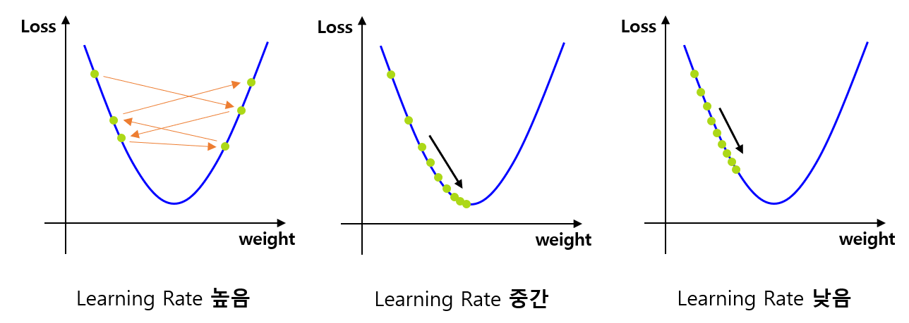

## 목차
* [1. Learning Rate](#1-learning-rate)
* [2. Learning Rate 조절이 필요한 이유](#2-learning-rate-조절이-필요한-이유)
* [3. Learning Rate Scheduler](#3-learning-rate-scheduler)
* [4. Optimizer](#4-optimizer)
* [5. 탐구: 어느 정도의 Learning Rate 가 좋을까? (Accuracy vs. Time)](#5-탐구-어느-정도의-learning-rate-가-좋을까-accuracy-vs-time)
  * [5-1. 실험 설계](#5-1-실험-설계)
  * [5-2. 실험 결과](#5-2-실험-결과)
  * [5-3. 실험 결과에 대한 이유 분석](#5-3-실험-결과에-대한-이유-분석)

## 코드

## 1. Learning Rate

Gradient Descent 알고리즘에서는 다음과 같이 가중치를 갱신한다. ($W$ : weight) 자세한 것은 [해당 문서](../Machine%20Learning%20Models/머신러닝_모델_Linear_Logistic_Regression.md#2-2-regression-최적화-과정) 참고.

* $W = W - \alpha \frac{\delta}{\delta W} [Loss (W)]$

즉, [Loss Function](딥러닝_기초_Loss_function.md) 에 해당하는 $[Loss (W)]$ 의 미분값, 즉 기울기에 **일정 배수인 $\alpha$ 를 곱한** 값만큼 갱신이 이루어진다. 여기서 $\alpha$ 를 **Learning Rate (학습률)** 라고 한다.

## 2. Learning Rate 조절이 필요한 이유

Learning Rate 조절이 필요한 이유는 다음과 같다.

* Learning Rate 가 매우 크면 학습이 수렴되지 않을 수 있다.
* Learning Rate 가 매우 작으면 학습에 시간이 매우 오래 걸린다.

따라서 이 Trade-off 를 고려한 적절한 수준의 Learning Rate 가 필요하다.



## 3. Learning Rate Scheduler

**Learning Rate Scheduler** 는 Learning Rate 를 학습이 진행됨에 따라 조절해 나가기 위한 알고리즘이다.

* 학습 초반에는 평균적인 gradient 가 크기 때문에, 높은 learning rate 를 통해 이를 빠르게 감소시킨다.
* 학습 후반에는 낮은 learning rate 를 통해 학습을 정교하게 수렴시킨다.

자세한 것은 [해당 문서](딥러닝_기초_Learning_Rate_Scheduler.md) 참고.

## 4. Optimizer

주로 Learning Rate 에 곱해지는 여러 가지 변수들을 추가하여 딥러닝 학습을 보다 효율적으로 진행하기 위한 일종의 장치이다.

자세한 것은 [해당 문서](딥러닝_기초_Optimizer.md) 참고.

## 5. 탐구: 어느 정도의 Learning Rate 가 좋을까? (Accuracy vs. Time)

* 실험 목적
  * MNIST 숫자 데이터셋에서 어느 정도의 learning rate 가 성능이 가장 높은지 알아본다.
  * 성능지표 값과 학습 시간의 trade-off 를 고려하여 최적의 learning rate 를 찾는다.

### 5-1. 실험 설계

**데이터셋**

* **MNIST 숫자 이미지 분류 데이터셋 (train 60K / test 10K)**
  * 10 개의 Class 가 있는 Classification Task
  * 학습 시간 절약을 위해, train dataset 중 일부만을 샘플링하여 학습
* 선정 이유
  * 데이터셋이 28 x 28 size 의 작은 이미지들로 구성
  * 이로 인해 비교적 간단한 신경망을 설계할 수 있으므로, 간단한 딥러닝 실험에 적합하다고 판단

| 학습 데이터  | Valid 데이터 | Test 데이터          |
|---------|-----------|-------------------|
| 3,000 장 | 5,000 장   | 10,000 장 (원본 그대로) |

**성능 Metric**

* **Accuracy**
* 선정 이유
  * Accuracy 로 성능을 측정해도 될 정도로, [각 Class 간 데이터 불균형](../Data%20Science%20Basics/데이터_사이언스_기초_데이터_불균형.md) 이 적음 

**신경망 구조**

```python
# 신경망 구조 출력 코드

from torchinfo import summary

model = CNN()
print(summary(model, input_size=(BATCH_SIZE, 1, 28, 28)))
```


* [활성화 함수](딥러닝_기초_활성화_함수.md) 는 다음과 같이 사용

| Conv. Layers | Fully Connected Layer | Final Layer |
|--------------|-----------------------|-------------|
| ReLU only    | Sigmoid               | Softmax     |

* [Dropout](딥러닝_기초_Overfitting_Dropout.md#3-dropout) 미 적용
* Early Stopping Rounds = 5 로 고정 (5 epoch 동안 valid set 성능 갱신 없으면 종료)
* Optimizer 는 [AdamW](딥러닝_기초_Optimizer.md#2-3-adamw) 를 사용
  * 해당 Optimizer 가 [동일 데이터셋을 대상으로 한 성능 실험](딥러닝_기초_Optimizer.md#3-탐구-어떤-optimizer-가-적절할까) 에서 최상의 정확도를 기록했기 때문

**상세 실험 방법**

* Learning Rate 를 다음과 같이 실험한다.
  * $10^{m}, m=-6.0, -5.9, -5.8, ..., -1.5$ (총 46 가지 case)
  * [Learning Rate Scheduler](딥러닝_기초_Learning_Rate_Scheduler.md) 를 적용하지 않은 고정값
* 각 Learning Rate 별로 다음을 측정하여 기록한다.
  * 성능지표 (정확도) 
  * 학습 수행 시간
* [하이퍼파라미터 최적화](../Machine%20Learning%20Models/머신러닝_방법론_HyperParam_Opt.md) 미 적용

### 5-2. 실험 결과

**1. 실험 결론**

* 정확도가 가장 높은 learning rate 구간은 ??? 이다.
* 성능 (정확도) 과 시간의 trade-off 를 고려할 때, 최적의 learning rate 는 ??? 이다.
* learning rate 가 1e-5 미만으로 매우 낮으면, 학습이 전혀 진행되지 않는다.

**2. Learning Rate 별 정확도 및 수행 시간**

### 5-3. 실험 결과에 대한 이유 분석

**Learning Rate 가 매우 작을 때 성능이 낮은 이유**

* 결론
  * **모델이 거의 학습되지 않아서 valid set 성능이 5 epoch 동안 증가하지 않았기 때문** 
* 모델 학습이 전혀 되지 않음
  * learning rate 가 매우 낮기 때문에, 초반 5 epoch 동안 모델이 거의 학습되지 않음
  * 이로 인해, 5 epoch 동안 valid dataset 에서의 성능 개선이 이루어지지 않아서 학습이 종료됨
* 한편, learning rate 가 아주 낮지는 않아서 5 epoch 동안 약간의 성능 개선을 기대할 수 있는 경우 (1e-5 ~ 1e-4 정도) 에는 다음과 같은 현상을 보임
  * 학습 시간이 매우 오래 걸림
  * **학습 성능이 최적의 learning rate 일 때보다는 낮음**
    * 학습 중반 valid set 정확도 향상 속도가 느려지는 시점에서, 모델 학습이 매우 느려서 valid set 정확도가 5 epochs 동안 최고 기록을 갱신하지 않는 경우가 있기 때문으로 추정