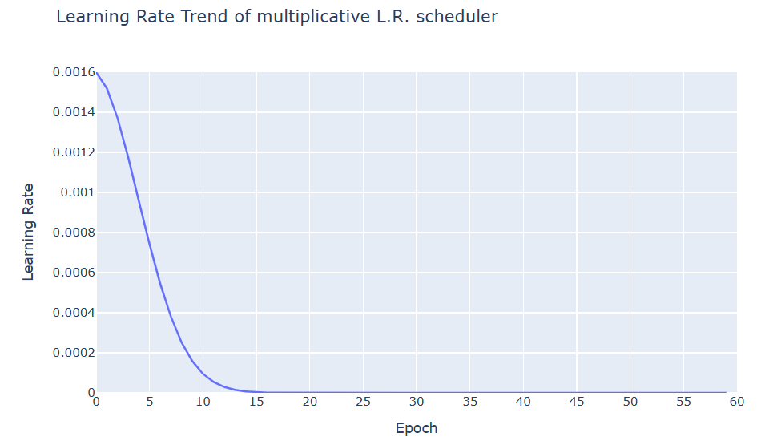
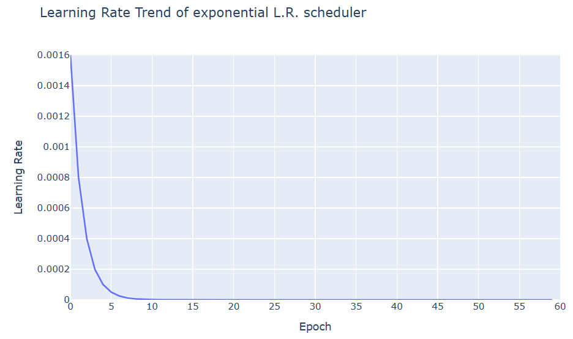
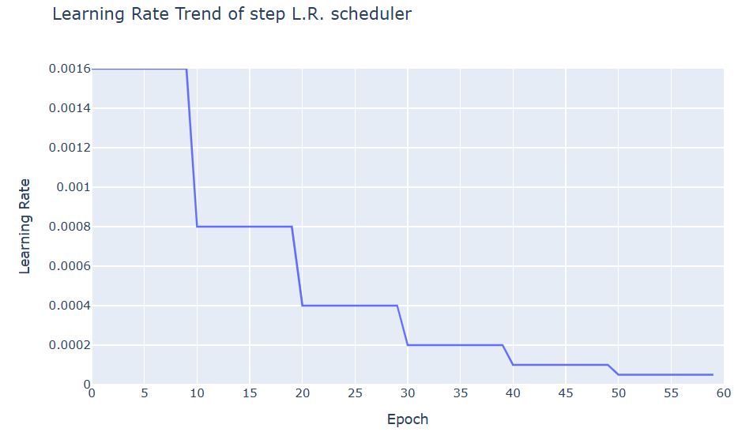
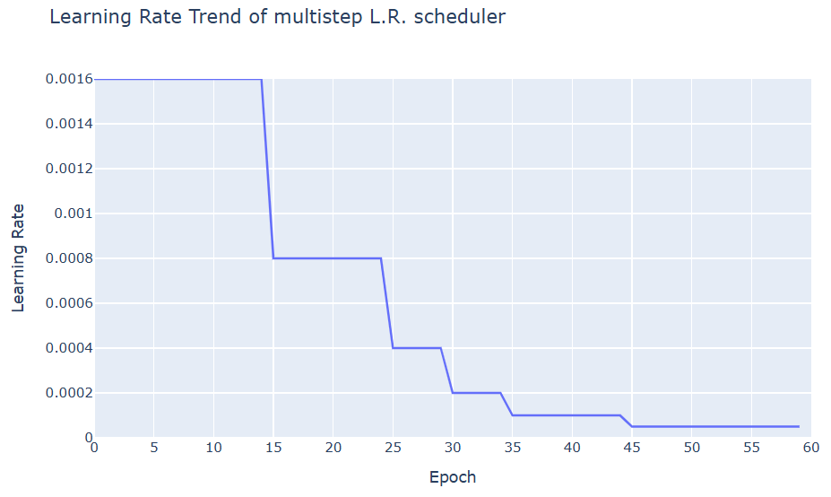
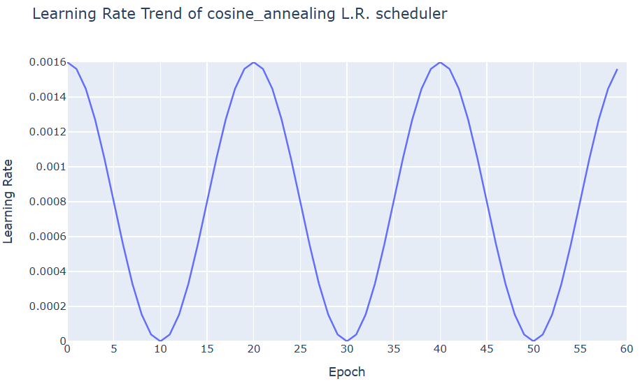
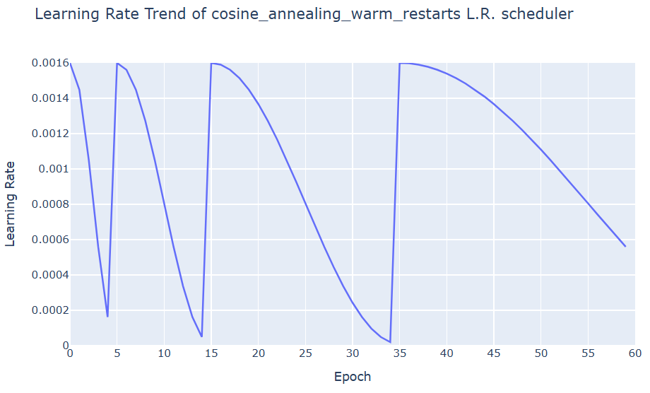
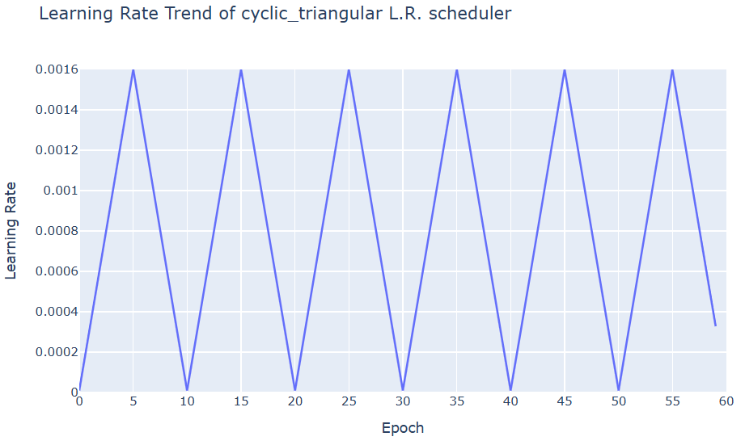
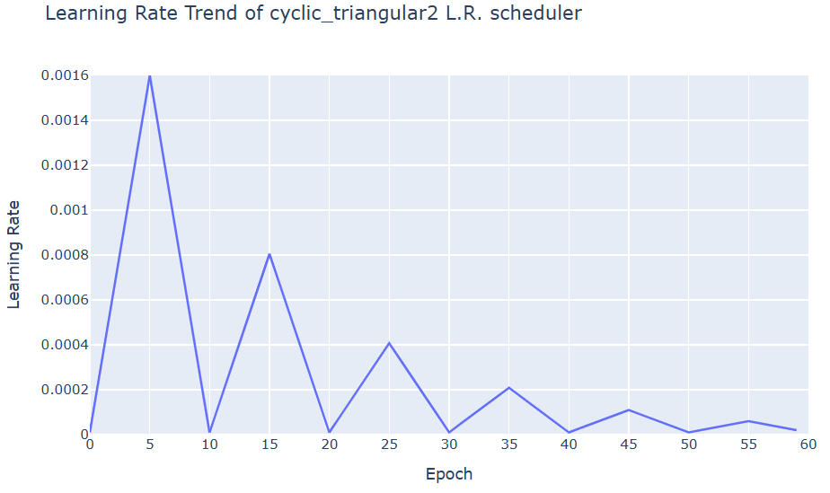
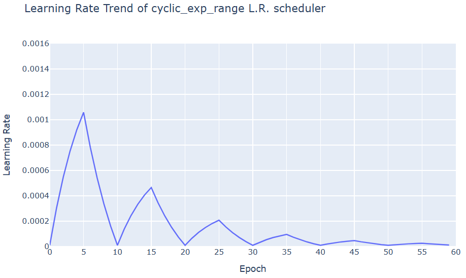
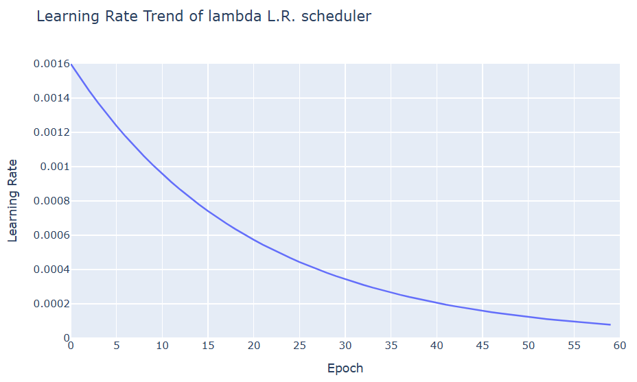

## 목차

* [1. Learning Rate Scheduler 및 그 필요성](#1-learning-rate-scheduler-및-그-필요성)
* [2. Learning Rate Scheduler 의 종류](#2-learning-rate-scheduler-의-종류)
  * [2-1. Multiplicative Scheduler](#2-1-multiplicative-scheduler)
  * [2-2. Exponential Scheduler](#2-2-exponential-scheduler)
  * [2-3. Step Scheduler](#2-3-step-scheduler)
  * [2-4. Multi-Step Scheduler](#2-4-multi-step-scheduler)
  * [2-5. Reduce-LR-On-Plateau Scheduler](#2-5-reduce-lr-on-plateau-scheduler)
  * [2-6. Cosine-Annealing Scheduler](#2-6-cosine-annealing-scheduler)
  * [2-7. Cosine-Annealing-Warm-Restarts Scheduler](#2-7-cosine-annealing-warm-restarts-scheduler)
  * [2-8. Cyclic Scheduler](#2-8-cyclic-scheduler)
  * [2-9. Lambda Scheduler](#2-9-lambda-scheduler)
* [3. 실험: 가장 성능이 좋은 L.R. Scheduler 는?](#3-실험-가장-성능이-좋은-lr-scheduler-는)
  * [3-1. 실험 설계](#3-1-실험-설계)
  * [3-2. 실험 결과](#3-2-실험-결과)
  * [3-3. 실험 결과에 대한 분석](#3-3-실험-결과에-대한-이유-분석)

## 코드

* [Learning Rate 그래프 출력 예시 코드 (ipynb)](codes/Learning_Rate_Scheduler_example.ipynb)

## 1. Learning Rate Scheduler 및 그 필요성

**Learning Rate Scheduler** 는 딥 러닝에서 **epoch가 진행됨** 에 따라 [학습률 (Learning Rate)](딥러닝_기초_Learning_Rate.md) 을 조절해 나가는 알고리즘을 의미한다.

Learning Rate Scheduler 의 필요성은 다음과 같다.

* 평균적인 gradient 가 큰 학습 초반에는 높은 Learning Rate 를 통해 빠르게 학습을 진행한다.
* 평균적인 gradient 가 작은 학습 후반에는 낮은 Learning Rate 를 통해 모델이 안정적이고 정교하게 수렴할 수 있게 한다.
* Learning rate 를 **학습 내내 일정하게 하면, 이와 같은 것을 실현할 수 없다.**

## 2. Learning Rate Scheduler 의 종류

다음과 같이 다양한 Learning Rate Scheduler 를 적절히 사용할 수 있다.

| 방법론                              | Learning Rate Scheduler                                |
|----------------------------------|--------------------------------------------------------|
| Learning Rate 를 지수적으로 감소         | - Multiplicative<br>- Exponential                      |
| Learning Rate 를 계단식 (Step) 으로 감소 | - Step<br>- Multi-Step<br>- Reduce-LR-On-Plateau       |
| 코사인 함수 그래프처럼 조정                  | - Cosine-Annealing<br>- Cosine-Annealing-Warm-Restarts |
| 기타                               | - Cyclic<br>- Lambda                                   |

아래 예시에서 코드는 PyTorch 기준이며, 초기 또는 최대 learning rate 는 모두 0.0016 이다.

### 2-1. Multiplicative Scheduler



```python
optim.lr_scheduler.MultiplicativeLR(optimizer=optimizer,
                                    lr_lambda=lambda epoch: 0.95 ** epoch)
```

* 설명 
  * 기존 learning rate 에 **lambda 함수의 값** 을 곱한 것을 새로운 learning rate 로 한다.
* 수식
  * ${LR}_{t+1} = {LR}_t \times \lambda(epoch)$

### 2-2. Exponential Scheduler



```python
optim.lr_scheduler.ExponentialLR(optimizer=optimizer,
                                 gamma=0.95)
```

* 설명
  * epoch 가 증가함에 따라 (학습이 진행됨에 따라) learning rate 를 지수적으로 감소시킨다. 
* 수식
  * ${LR}_{t+1} = {LR}_t \times \gamma$
  * ${LR}_t = (initial LR)^\gamma$

### 2-3. Step Scheduler



```python
optim.lr_scheduler.StepLR(optimizer=optimizer,
                          step_size=10,
                          gamma=0.5)
```

* 설명
  * 매 ```step_size``` 마다 epoch 를 기존의 ```gamma``` 배로 만든다.

### 2-4. Multi-Step Scheduler



```python
optim.lr_scheduler.MultiStepLR(optimizer=optimizer,
                               milestones=[15, 25, 30, 35, 45],
                               gamma=0.5)
```

* 설명
  * ```milestones``` 의 원소에 해당하는 epoch 일 때, learning rate 를 기존의 ```gamma``` 배로 만든다.
  * 예를 들어, 위 경우에는 15, 25, 30, 35, 45 번째 epoch 에서 learning rate 를 기존의 0.5 배로 만든다.

### 2-5. Reduce-LR-On-Plateau Scheduler

```python
scheduler = optim.lr_scheduler.ReduceLROnPlateau(optimizer=optimizer,
                                                 patience=5,
                                                 factor=0.25,
                                                 mode='min')  # min = Loss 가 더 이상 감소하지 않을 때

...

val_loss = ...
scheduler.step(val_loss)
```

* 설명
  * ```scheduler.step()``` 에 들어가는 값이 다음 mode 에 따라 그 최고 기록 또는 최저 기록이 ```patience``` 회 이상 갱신되지 않을 때, learning rate 를 기존의 ```factor``` 배로 만든다.
    * ```mode='max'``` : **최고** 기록이 갱신되지 않을 때 (Accuracy 등 **높을수록 좋은 값**에 사용)
    * ```mode='min'``` : **최저** 기록이 갱신되지 않을 때 (Loss 등 **낮을수록 좋은 값**에 사용)
  * 예를 들어 위의 경우에는 ```val_loss``` 의 최저 기록이 5 epochs 동안 갱신되지 않으면 learning rate 를 기존의 0.25 배 한다.

### 2-6. Cosine-Annealing Scheduler



```python
optim.lr_scheduler.CosineAnnealingLR(optimizer=optimizer,
                                     T_max=10,
                                     eta_min=0)
```

* 설명
  * learning rate를 그 주기가 ```2 * T_max``` 인 코사인 곡선의 함숫값으로 한다.
  * 이때, 그 최댓값은 초기 learning rate, 최솟값은 ```eta_min``` 으로 한다.
  * 위의 경우, learning rate 를 최소 0, 최대 0.0016 이고 주기가 $20 = 2 \times 10$ 인 코사인 곡선을 따라 움직인다.
* 수식
  * $\displaystyle \eta_t = \eta_{min} + \frac{1}{2} (\eta_{max} - \eta_{min}) (1 + \cos (\frac{T_{cur}}{T_{max}} \pi))$ 

### 2-7. Cosine-Annealing-Warm-Restarts Scheduler



```python
optim.lr_scheduler.CosineAnnealingWarmRestarts(optimizer=optimizer,
                                               T_0=5,
                                               T_mult=2,
                                               eta_min=1e-5)
```

* 설명
  * 위의 Cosine-Annealing Scheduler 대로 스케줄링하되, 다음과 같이 한다.
    * ```T_0``` 번째 epoch 에서 Cosine-Annealing 의 처음부터 Restart 한다.
    * 이후 코사인 함수의 주기를 ```T_mult``` 배 늘리고, Restart 한 지 ```T_0 * T_mult``` epoch 가 지난 후에 또 Restart 한다.
    * 이런 식으로 코사인 함수 및 Restart 의 주기를 매번 ```T_mult``` 배 늘린다.
  * 위 경우에는 다음과 같다.
    * 5 번째 epoch 에서 처음으로 Restart 한다.
    * 그 이후에는 코사인 함수의 주기를 2배 늘리고, $5 + 2 \times 5 = 15$ 번째 epoch 에서 다시 Restart 한다.
    * 코사인 함수의 주기를 또 2배 늘리고, $15 + 4 \times 5 = 35$ 번째 epoch 에서 다시 Restart 한다.
    * 이런 식으로 계속 반복한다.

### 2-8. Cyclic Scheduler

```python
optim.lr_scheduler.CyclicLR(optimizer=optimizer,
                            base_lr=1e-5,
                            step_size_up=5,
                            max_lr=0.0016,
                            gamma=0.92,  # for only 'exp_range' mode
                            mode=scheduler_name[7:])
```

* 설명
  * learning rate 가 ```base_lr``` 과 ```max_lr``` 사이에서 ```step_size_up``` 만큼 상승했다가 ```step_size_down``` 만큼 하강하는 것을 반복한다.
    * ```step_size_down``` 을 지정하지 않으면 ```step_size_up``` 과 그 값이 같다. 
  * ```mode``` 를 통해 그래프의 형태를 조절할 수 있다.
  * 예를 들어 위 경우에는 1e-5 와 0.0016 사이에서 learning rate 가 움직이며, 5 epoch 동안 증가하다가 이후 5 epoch 만큼 감소한다.

**1. mode = ```triangular```**



* 삼각형 모양으로 linear 하게 증가와 감소를 반복한다.

**2. mode = ```triangular2```**



* 삼각형 모양으로 linear 하게 증가와 감소를 반복한다.
* 단, 매 반복 시마다 삼각형의 **최대 높이가 직전 반복의 절반** 이 된다.

**3. mode = ```exp_range```**



* 삼각형이 아닌 지수함수 모양으로 증가와 감소를 반복한다.
* ```gamma``` 의 값이 작을수록 그래프 높이가 낮아지는 속도가 빨라진다. (위의 경우는 ```gamma = 0.92```)

### 2-9. Lambda Scheduler



```
optim.lr_scheduler.LambdaLR(optimizer=optimizer,
                            lr_lambda=lambda epoch: 0.95 ** epoch)
```

* 설명
  * ```lr_lambda``` 안에 들어가는 함수의 수식에 따라, 각 epoch 에 따른 Learning Rate 를 결정한다.
  * 예를 들어 위 경우에는 ```lr_lambda=lambda epoch: 0.95 ** epoch``` 이다. 따라서 Learning Rate 가 0.95 의 epoch 제곱, 즉 지수적으로 감소하는 꼴이 된다.
  * **다양하고 복잡한 Learning Rate scheduling 에 적합** 하다.

## 3. 실험: 가장 성능이 좋은 L.R. Scheduler 는?

### 3-1. 실험 설계

### 3-2. 실험 결과

### 3-3. 실험 결과에 대한 이유 분석