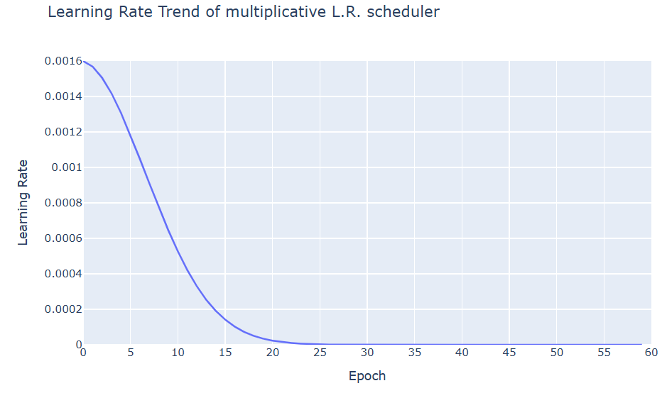
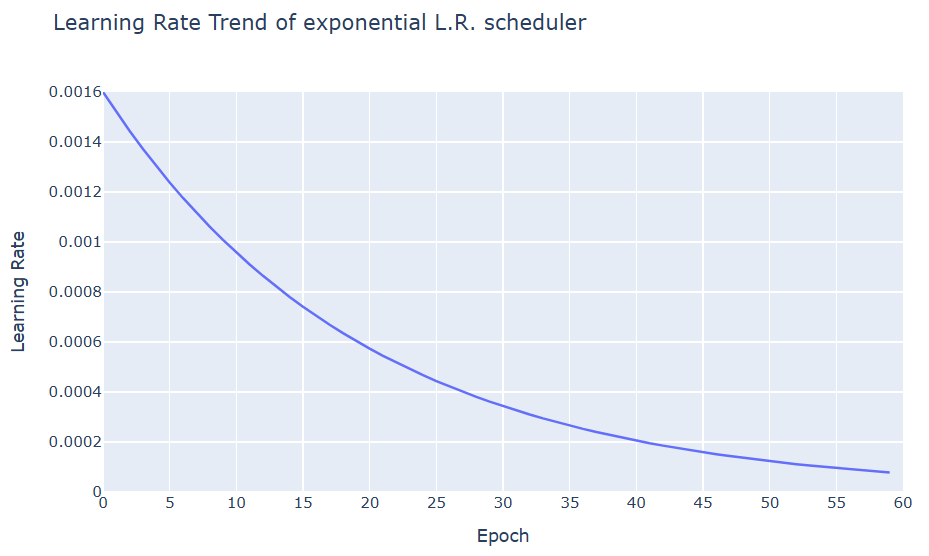
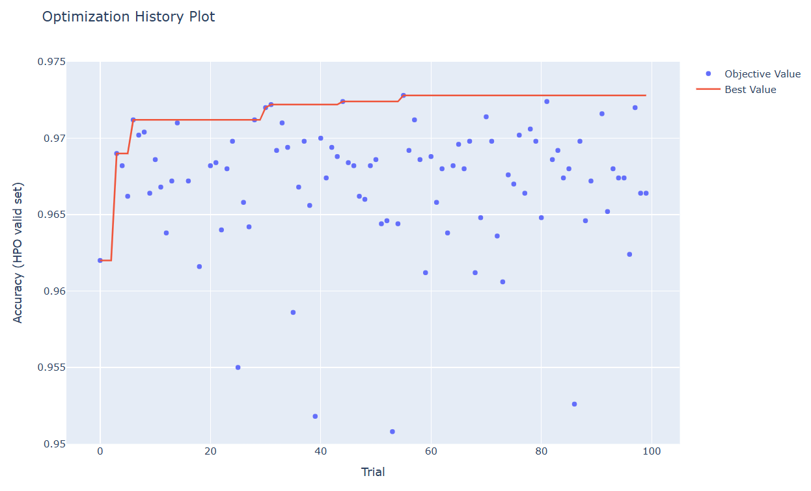
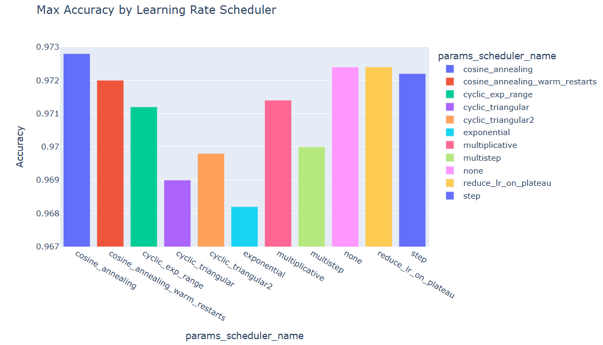
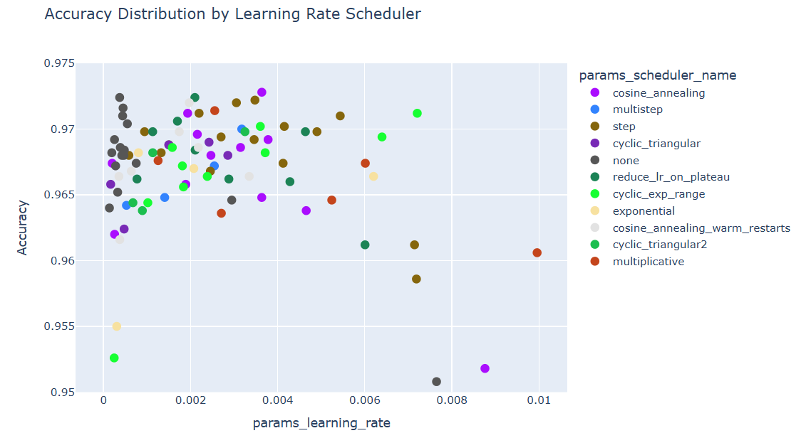

## 목차

* [1. Learning Rate Scheduler 및 그 필요성](#1-learning-rate-scheduler-및-그-필요성)
* [2. Learning Rate Scheduler 의 종류](#2-learning-rate-scheduler-의-종류)
  * [2-1. Multiplicative Scheduler](#2-1-multiplicative-scheduler)
  * [2-2. Exponential Scheduler](#2-2-exponential-scheduler)
  * [2-3. Step Scheduler](#2-3-step-scheduler)
  * [2-4. Multi-Step Scheduler](#2-4-multi-step-scheduler)
  * [2-5. Reduce-LR-On-Plateau Scheduler](#2-5-reduce-lr-on-plateau-scheduler)
  * [2-6. Cosine-Annealing Scheduler](#2-6-cosine-annealing-scheduler)
  * [2-7. Cosine-Annealing-Warm-Restarts Scheduler](#2-7-cosine-annealing-warm-restarts-scheduler)
  * [2-8. Cyclic Scheduler](#2-8-cyclic-scheduler)
  * [2-9. Lambda Scheduler](#2-9-lambda-scheduler)
* [3. 실험: 가장 성능이 좋은 L.R. Scheduler 는?](#3-실험-가장-성능이-좋은-lr-scheduler-는)
  * [3-1. 실험 설계](#3-1-실험-설계)
  * [3-2. 실험 결과](#3-2-실험-결과)
  * [3-3. 실험 결과에 대한 분석](#3-3-실험-결과에-대한-이유-분석)

## 코드

* [Learning Rate 그래프 출력 예시 코드 (ipynb)](codes/Learning_Rate_Scheduler_example.ipynb)
* [Learning Rate 실험](#3-실험-가장-성능이-좋은-lr-scheduler-는) 코드 : [code (ipynb)](codes/Learning_Rate_Scheduler_experiment.ipynb)

## 1. Learning Rate Scheduler 및 그 필요성

**Learning Rate Scheduler** 는 딥 러닝에서 **epoch가 진행됨** 에 따라 [학습률 (Learning Rate)](딥러닝_기초_Learning_Rate.md) 을 조절해 나가는 알고리즘을 의미한다.

Learning Rate Scheduler 의 필요성은 다음과 같다.

* 평균적인 gradient 가 큰 학습 초반에는 높은 Learning Rate 를 통해 빠르게 학습을 진행한다.
* 평균적인 gradient 가 작은 학습 후반에는 낮은 Learning Rate 를 통해 모델이 안정적이고 정교하게 수렴할 수 있게 한다.
* Learning rate 를 **학습 내내 일정하게 하면, 이와 같은 것을 실현할 수 없다.**

## 2. Learning Rate Scheduler 의 종류

다음과 같이 다양한 Learning Rate Scheduler 를 적절히 사용할 수 있다.

| 방법론                              | Learning Rate Scheduler                                |
|----------------------------------|--------------------------------------------------------|
| Learning Rate 를 지수적으로 감소         | - Multiplicative<br>- Exponential                      |
| Learning Rate 를 계단식 (Step) 으로 감소 | - Step<br>- Multi-Step<br>- Reduce-LR-On-Plateau       |
| 코사인 함수 그래프처럼 조정                  | - Cosine-Annealing<br>- Cosine-Annealing-Warm-Restarts |
| 기타                               | - Cyclic<br>- Lambda                                   |

아래 예시에서 코드는 PyTorch 기준이며, 초기 또는 최대 learning rate 는 모두 0.0016 이다.

### 2-1. Multiplicative Scheduler



```python
optim.lr_scheduler.MultiplicativeLR(optimizer=optimizer,
                                    lr_lambda=lambda epoch: 0.98 ** epoch)
```

* 설명 
  * 기존 learning rate 에 **lambda 함수의 값** 을 곱한 것을 새로운 learning rate 로 한다.
  * 예를 들어, 위와 같은 경우 2 번째 epoch 에서는 원래 learning rate 의 $(0.98)^1$ = 0.98 배, 3 번째 epoch 에서는 원래 learning rate 의 $0.98 \times (0.98)^2$ = 약 0.9412 배가 된다.  
* 수식
  * ${LR}_{t+1} = {LR}_t \times \lambda(epoch)$

### 2-2. Exponential Scheduler



```python
optim.lr_scheduler.ExponentialLR(optimizer=optimizer,
                                 gamma=0.95)
```

* 설명
  * epoch 가 증가함에 따라 (학습이 진행됨에 따라) learning rate 를 지수적으로 감소시킨다. 
* 수식
  * ${LR}_{t+1} = {LR}_t \times \gamma$
  * ${LR}_t = (initial LR)^\gamma$

### 2-3. Step Scheduler


```python
optim.lr_scheduler.StepLR(optimizer=optimizer,
                          step_size=10,
                          gamma=0.5)
```

* 설명
  * 매 ```step_size``` 마다 epoch 를 기존의 ```gamma``` 배로 만든다.

### 2-4. Multi-Step Scheduler


```python
optim.lr_scheduler.MultiStepLR(optimizer=optimizer,
                               milestones=[15, 25, 30, 35, 45],
                               gamma=0.5)
```

* 설명
  * ```milestones``` 의 원소에 해당하는 epoch 일 때, learning rate 를 기존의 ```gamma``` 배로 만든다.
  * 예를 들어, 위 경우에는 15, 25, 30, 35, 45 번째 epoch 에서 learning rate 를 기존의 0.5 배로 만든다.

### 2-5. Reduce-LR-On-Plateau Scheduler

```python
scheduler = optim.lr_scheduler.ReduceLROnPlateau(optimizer=optimizer,
                                                 patience=5,
                                                 factor=0.25,
                                                 mode='min')  # min = Loss 가 더 이상 감소하지 않을 때

...

val_loss = ...
scheduler.step(val_loss)
```

* 설명
  * ```scheduler.step()``` 에 들어가는 값이 다음 mode 에 따라 그 최고 기록 또는 최저 기록이 ```patience``` 회 이상 갱신되지 않을 때, learning rate 를 기존의 ```factor``` 배로 만든다.
    * ```mode='max'``` : **최고** 기록이 갱신되지 않을 때 (Accuracy 등 **높을수록 좋은 값**에 사용)
    * ```mode='min'``` : **최저** 기록이 갱신되지 않을 때 (Loss 등 **낮을수록 좋은 값**에 사용)
  * 예를 들어 위의 경우에는 ```val_loss``` 의 최저 기록이 5 epochs 동안 갱신되지 않으면 learning rate 를 기존의 0.25 배 한다.

### 2-6. Cosine-Annealing Scheduler


```python
optim.lr_scheduler.CosineAnnealingLR(optimizer=optimizer,
                                     T_max=10,
                                     eta_min=0)
```

* 설명
  * learning rate를 그 주기가 ```2 * T_max``` 인 코사인 곡선의 함숫값으로 한다.
  * 이때, 그 최댓값은 초기 learning rate, 최솟값은 ```eta_min``` 으로 한다.
  * 위의 경우, learning rate 를 최소 0, 최대 0.0016 이고 주기가 $20 = 2 \times 10$ 인 코사인 곡선을 따라 움직인다.
* 수식
  * $\displaystyle \eta_t = \eta_{min} + \frac{1}{2} (\eta_{max} - \eta_{min}) (1 + \cos (\frac{T_{cur}}{T_{max}} \pi))$ 

### 2-7. Cosine-Annealing-Warm-Restarts Scheduler


```python
optim.lr_scheduler.CosineAnnealingWarmRestarts(optimizer=optimizer,
                                               T_0=5,
                                               T_mult=2,
                                               eta_min=1e-5)
```

* 설명
  * 위의 Cosine-Annealing Scheduler 대로 스케줄링하되, 다음과 같이 한다.
    * ```T_0``` 번째 epoch 에서 Cosine-Annealing 의 처음부터 Restart 한다.
    * 이후 코사인 함수의 주기를 ```T_mult``` 배 늘리고, Restart 한 지 ```T_0 * T_mult``` epoch 가 지난 후에 또 Restart 한다.
    * 이런 식으로 코사인 함수 및 Restart 의 주기를 매번 ```T_mult``` 배 늘린다.
  * 위 경우에는 다음과 같다.
    * 5 번째 epoch 에서 처음으로 Restart 한다.
    * 그 이후에는 코사인 함수의 주기를 2배 늘리고, $5 + 2 \times 5 = 15$ 번째 epoch 에서 다시 Restart 한다.
    * 코사인 함수의 주기를 또 2배 늘리고, $15 + 4 \times 5 = 35$ 번째 epoch 에서 다시 Restart 한다.
    * 이런 식으로 계속 반복한다.

### 2-8. Cyclic Scheduler

```python
optim.lr_scheduler.CyclicLR(optimizer=optimizer,
                            base_lr=1e-5,
                            step_size_up=5,
                            max_lr=0.0016,
                            gamma=0.92,  # for only 'exp_range' mode
                            mode=scheduler_name[7:])
```

* 설명
  * learning rate 가 ```base_lr``` 과 ```max_lr``` 사이에서 ```step_size_up``` 만큼 상승했다가 ```step_size_down``` 만큼 하강하는 것을 반복한다.
    * ```step_size_down``` 을 지정하지 않으면 ```step_size_up``` 과 그 값이 같다. 
  * ```mode``` 를 통해 그래프의 형태를 조절할 수 있다.
  * 예를 들어 위 경우에는 1e-5 와 0.0016 사이에서 learning rate 가 움직이며, 5 epoch 동안 증가하다가 이후 5 epoch 만큼 감소한다.

**1. mode = ```triangular```**


* 삼각형 모양으로 linear 하게 증가와 감소를 반복한다.

**2. mode = ```triangular2```**


* 삼각형 모양으로 linear 하게 증가와 감소를 반복한다.
* 단, 매 반복 시마다 삼각형의 **최대 높이가 직전 반복의 절반** 이 된다.

**3. mode = ```exp_range```**


* 삼각형이 아닌 지수함수 모양으로 증가와 감소를 반복한다.
* ```gamma``` 의 값이 작을수록 그래프 높이가 낮아지는 속도가 빨라진다. (위의 경우는 ```gamma = 0.92```)

### 2-9. Lambda Scheduler


```
optim.lr_scheduler.LambdaLR(optimizer=optimizer,
                            lr_lambda=lambda epoch: 0.95 ** epoch)
```

* 설명
  * ```lr_lambda``` 안에 들어가는 함수의 수식에 따라, 각 epoch 에 따른 Learning Rate 를 결정한다.
  * 예를 들어 위 경우에는 ```lr_lambda=lambda epoch: 0.95 ** epoch``` 이다. 따라서 Learning Rate 가 0.95 의 epoch 제곱, 즉 지수적으로 감소하는 꼴이 된다.
  * **다양하고 복잡한 Learning Rate scheduling 에 적합** 하다.

## 3. 실험: 가장 성능이 좋은 L.R. Scheduler 는?

**실험 목표**

* MNIST 숫자 분류 데이터셋에서 가장 성능이 좋은 Learning Rate Scheduler 를 찾는다.
* 각 Learning Rate Scheduler 적용 시 성능을 비교 분석한다.

### 3-1. 실험 설계

**데이터셋**

* **MNIST 숫자 이미지 분류 데이터셋 (train 60K / test 10K)**
  * 10 개의 Class 가 있는 Classification Task
  * 학습 시간 절약을 위해, train dataset 중 일부만을 샘플링하여 학습
* 선정 이유
  * 데이터셋이 28 x 28 size 의 작은 이미지들로 구성
  * 이로 인해 비교적 간단한 신경망을 설계할 수 있으므로, 간단한 딥러닝 실험에 적합하다고 판단
* 데이터셋 분리

| 학습 데이터  | Valid 데이터 (Epoch 단위) | Valid 데이터 (Trial 단위) | Test 데이터          |
|---------|----------------------|----------------------|-------------------|
| 2,000 장 | 2,000 장              | 5,000 장              | 10,000 장 (원본 그대로) |

**성능 Metric**

* **Accuracy**
* 선정 이유
  * Accuracy 로 성능을 측정해도 될 정도로, [각 Class 간 데이터 불균형](../Data%20Science%20Basics/데이터_사이언스_기초_데이터_불균형.md) 이 적음 

**신경망 구조**

```python
# 신경망 구조 출력 코드

from torchinfo import summary

model = CNN()
print(summary(model, input_size=(BATCH_SIZE, 1, 28, 28)))
```


* [Dropout](딥러닝_기초_Overfitting_Dropout.md#3-dropout) 미 적용
* Early Stopping Rounds = 10 로 고정 (10 epoch 동안 valid set 성능 갱신 없으면 종료)
  * 각 Learning Rate Scheduler 의 성능을 변별할 수 있도록 epoch 횟수 증가 목적 
* Optimizer 는 [AdamW](딥러닝_기초_Optimizer.md#2-3-adamw) 를 사용
  * 해당 Optimizer 가 [동일 데이터셋을 대상으로 한 성능 실험](딥러닝_기초_Optimizer.md#3-탐구-어떤-optimizer-가-적절할까) 에서 최상의 정확도를 기록했기 때문

**상세 학습 방법**

* 다음과 같이 하이퍼파라미터 최적화를 실시하여, **최적화된 하이퍼파라미터를 기준으로 한 성능을 기준** 으로 최고 성능의 Optimizer 를 파악
  * **Learning Rate Scheduler** ```lr_scheduler```
    * Learning Rate Scheduler 미 적용 
    * Multiplicative
    * Exponential
    * Step
    * Multi-Step
    * Reduce-LR-On-Plateau
    * Cosine-Annealing
    * Cosine-Annealing-Warm-Restarts
    * Cyclic (mode = ```triangular```)
    * Cyclic (mode = ```triangular2```)
    * Cyclic (mode = ```exp_range```)
  * **learning rate** ```learning_rate```
    * 탐색 범위 : 0.00005 ~ 0.01 (= 5e-5 ~ 1e-2)
    * 각 Learning Rate Scheduler 의 성능을 변별할 수 있도록 탐색 범위를 보다 확장
  * Learning Rate Scheduler 의 하이퍼파라미터는 모두 본 문서에 나온 그대로 설정한다. 
    * 단, 최대 learning rate 를 가리키는 하이퍼파라미터는 위 ```learning_rate``` 하이퍼파라미터 값과 동일하게 한다.
    * ```ReduceLROnPlateau``` Scheduler 의 경우, 성능지표가 Valid Accuracy 기준이므로 ```mode = max``` 로 설정

* 하이퍼파라미터 최적화
  * [하이퍼파라미터 최적화 라이브러리](../Machine%20Learning%20Models/머신러닝_방법론_HyperParam_Opt.md#4-하이퍼파라미터-최적화-라이브러리) 중 Optuna 를 사용
  * 하이퍼파라미터 탐색 100 회 반복 (= 100 Trials) 실시

### 3-2. 실험 결과

**1. 실험 결론**

* Learning Rate Scheduler 중 [Step Scheduler](#2-3-step-scheduler) 가 다른 Scheduler 보다 성능이 약간 좋은 편임
* Scheduler 적용 없이 진행해도 Scheduler를 적용한 경우에 비해 **성능이 크게 떨어지지 않음**
* Learning Rate 가 매우 작거나 (0.0002 이하) 매우 크면 (0.006 이상) **Scheduler 의 종류에 상관없이** 성능이 저하됨

**2. Best Hyper-param 및 그 성능 (정확도)**

| 구분                | 값                                                                               |
|-------------------|---------------------------------------------------------------------------------|
| 최종 테스트셋 정확도       | 97.49%                                                                          |
| HPO Valid set 정확도 | 97.28%                                                                          |
| Best Hyper-param  | ```scheduler_name``` : ```cosine_annealing```<br>```learning_rate``` : 0.003635 |

**3. 하이퍼파라미터 최적화 진행에 따른 정확도 추이**



**4. 각 하이퍼파라미터의 값에 따른 성능 분포**

* 각 Learning Rate Scheduler 별 최고 정확도
  * 최고 정확도는 [Cosine Annealing](#2-6-cosine-annealing-scheduler), [Reduce-LR-On-Plateau](#2-5-reduce-lr-on-plateau-scheduler) 등이 높고, Scheduler 미적용 (none) 시에도 성능이 괜찮은 편임
  * 그러나, **아래 '정확도 분포 분석' 결과, 최고 정확도가 해당 Scheduler 가 성능이 가장 좋다는 것을 말해 주기는 어려움**



* 각 Learning Rate Scheduler 별 정확도 분포 분석
  * Learning Rate Scheduler 중 [Step Scheduler](#2-3-step-scheduler) 가 다른 Scheduler 보다 성능이 약간 좋은 편임
  * Learning Rate 가 매우 작거나 (0.0002 이하) 매우 크면 (0.006 이상) **Scheduler 의 종류에 상관없이** 성능이 저하됨
  * Scheduler 미적용 (none) 의 경우도 괜찮은 성능을 보임

