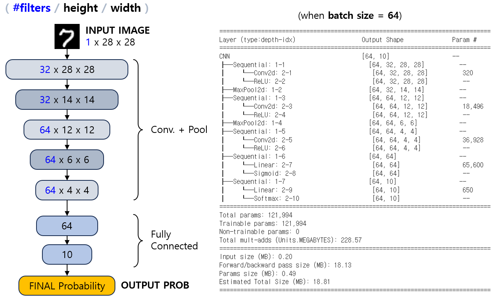

## 목차

* [1. Loss Function 의 적절한 사용](#1-loss-function-의-적절한-사용)
  * [1-1. Multi-Label Classification 에서 Binary C.E. 를 사용하는 이유](#1-1-multi-label-classification-에서-binary-ce-를-사용하는-이유)  
  * [1-2. nn.BCELoss vs. nn.BCEWithLogitsLoss](#1-2-nnbceloss-vs-nnbcewithlogitsloss) 
* [2. 실험 설계](#2-실험-설계)
  * [2-1. 데이터셋 및 성능 Metric](#2-1-데이터셋-및-성능-metric)
  * [2-2. 실험 구성](#2-2-실험-구성)
  * [2-3. 신경망 구조](#2-3-신경망-구조)
  * [2-4. 상세 configuration](#2-4-상세-configuration)
* [3. 실험 결과](#3-실험-결과)
  * [3-1. Probability Prediction](#3-1-probability-prediction)
  * [3-2. Binary Classification](#3-2-binary-classification)
  * [3-3. Multi-Class Classification](#3-3-multi-class-classification)
  * [3-4. Multi-Label Classification](#3-4-multi-label-classification)

## 코드

## 1. Loss Function 의 적절한 사용

**본인이 2024년 현업 실무에서 중대한 오류를 범한 부분이라 철저히 짚고 넘어가야 한다.**

[Loss Function](딥러닝_기초_Loss_function.md) 을 잘못 사용하면 모델 학습이 잘 안 될 수 있다. Loss Function 을 적절히 사용하는 것이 중요하며, 그 방법은 다음과 같다.

| Task                              | Task 설명                                                                  | Loss Function                                                                                 |
|-----------------------------------|--------------------------------------------------------------------------|-----------------------------------------------------------------------------------------------|
| Regression                        |                                                                          | - MSE (Mean Squared Error)<br>- RMSE (Root Mean Squared Error)<br>- MAE (Mean Absolute Error) |
| Probability Prediction<br>(0 ~ 1) | 단일 output, 0 ~ 1 사이의 확률                                                  | 회귀 문제와 동일<br>(Task 성격이 Regression 에 가까운 경우)                                                   |
| Classification<br>(Binary)        | 각 Class 에 대한 0 ~ 1 사이의 확률<br>(Class 2개, 확률 합산은 1)                        | - BCE (Binary Cross Entropy)                                                                  |
| Classification<br>(Multi-Class)   | 각 Class 에 대한 0 ~ 1 사이의 확률<br>(Class 3개 이상, 확률 합산은 1)                     | - Categorical Cross Entropy                                                                   |
| Classification<br>(Multi-Label)   | 각 Class 에 대한 0 ~ 1 사이의 확률<br>(**각 Class 별 독립적으로 계산** 하며, 합산이 1이 아닐 수 있음) | - 각 Class 별 BCE (Binary Cross Entropy)                                                        |

### 1-1. Multi-Label Classification 에서 Binary C.E. 를 사용하는 이유

Multi-Label Classification 은 **각 Class 별 확률 값을 독립적으로 예측** 하는 것이므로, 각 Class 별로 적용할 다음과 같은 Loss Function 을 생각할 수 있다.

* Regression 에서 사용하는 Loss Function (MSE, MAE)
* Binary Cross Entropy

이 둘 중에서 더 적절한 것은 **Binary Cross Entropy** 인데, 그 이유는 다음과 같다.

* **0과 1을 반대로 한 예측에 가까울수록 페널티가 급격하게 증가** 하는 메커니즘은 MSE, MAE 등에는 없고 Cross Entropy 계열 손실 함수에만 있음
* Cross Entropy 계열 Loss Function은 0부터 1까지의 확률 값을 예측하고 그 확률을 해석하는 데 최적화되어 있음

### 1-2. nn.BCELoss vs. nn.BCEWithLogitsLoss

PyTorch 에서는 Binary Cross Entropy 함수로 **nn.BCELoss** 와 **nn.BCEWithLogitsLoss** 의 2가지 함수를 제공한다. 이들의 차이점은 다음과 같다.

| 함수                         | 설명                                                                                                                                                                                                                                                                   |
|----------------------------|----------------------------------------------------------------------------------------------------------------------------------------------------------------------------------------------------------------------------------------------------------------------|
| ```nn.BCELoss```           | 입력되는 prediction 값을 **원래 값 그대로 해서** target 과의 Binary Cross-Entropy Loss 를 계산한다.<br>- 필요한 경우 prediction 값을 이 함수의 입력으로 넣기 위해 따로 Sigmoid 함수를 통해 0~1 범위의 값으로 변환해야 한다.                                                                                                     |
| ```nn.BCEWithLogitsLoss``` | 입력되는 prediction 값을 **[Sigmoid 함수](딥러닝_기초_활성화_함수.md#2-1-sigmoid-함수) 를 통해 0~1 로 변환시킨 값**과 target 과의 Binary Cross-Entropy Loss 를 계산한다.<br>- sigmoid 를 적용하지 않은 원본 값도 0~1 로 자동으로 변환해서 Loss 를 구하므로, 코드가 간결하고 편리하다.<br> - **이미 Sigmoid 를 통해 변환된 값을 입력으로 넣지 않도록 주의** 가 필요하다. |


## 2. 실험 설계

**실험 목표**

* 다음과 같이 **부적절한 Loss Function** 을 사용했을 때, 학습 과정에서 어떤 문제가 발생하는지 알아본다.

| Task                              | Loss Function                                             |
|-----------------------------------|-----------------------------------------------------------|
| Probability Prediction<br>(0 ~ 1) | - Categorical Cross-Entropy                               |
| Classification<br>(Binary)        | - Mean-Squared Error                                      |
| Classification<br>(Multi-Class)   | - Mean-Squared Error<br> - 각 Class 별 Binary Cross-Entropy |
| Classification<br>(Multi-Label)   | - Mean-Squared Error<br> - Categorical Cross-Entropy      |

### 2-1. 데이터셋 및 성능 Metric

* **MNIST Dataset (60K train / 10K test)** 에 대해, 다음과 같이 데이터를 구분한다.

| Train Data               | Valid Data                | Test Data         |
|--------------------------|---------------------------|-------------------|
| 5,000 장 (Train Set 의 일부) | 5,000 장 (Train set 에서 분리) | 10,000 장 (원본 그대로) |

* 학습 시간 절약을 위해, train dataset 중 일부만을 샘플링하여 학습
* MNIST 선정 이유
  * 데이터셋이 28 x 28 size 의 작은 이미지들로 구성
  * 이로 인해 비교적 간단한 신경망을 설계할 수 있으므로, 간단한 딥러닝 실험에 적합하다고 판단
* 성능 Metric
  * **Accuracy**
  * 선정 이유
    * Accuracy 로 성능을 측정해도 될 정도로, [각 Class 간 데이터 불균형](../Data%20Science%20Basics/데이터_사이언스_기초_데이터_불균형.md) 이 적음 

### 2-2. 실험 구성

실험에 대한 상세 구성은 다음과 같다.

| Task                              | Task 상세                                                                                                                                                                             | 실험을 진행할 잘못된 Loss Function                                 |
|-----------------------------------|-------------------------------------------------------------------------------------------------------------------------------------------------------------------------------------|-----------------------------------------------------------|
| Probability Prediction<br>(0 ~ 1) | 숫자 이미지가 곡선 숫자 (0, 3, 6, 8 또는 9) 일 확률 예측                                                                                                                                             | - Categorical Cross-Entropy                               |
| Classification<br>(Binary)        | 숫자를 다음과 같이 분류<br>- Class 1: 곡선 숫자 (0, 3, 6, 8, 9) 인 이미지<br>- Class 2: 나머지 숫자인 이미지                                                                                                   | - Mean-Squared Error                                      |
| Classification<br>(Multi-Class)   | 0~9 의 숫자 분류, 총 10개의 Class                                                                                                                                                           | - Mean-Squared Error<br> - 각 Class 별 Binary Cross-Entropy |
| Classification<br>(Multi-Label)   | 숫자를 다음과 같이 4 그룹으로 나누고, 각 그룹에 속할 확률을 **독립적으로** 예측 **<br>(각 그룹에 대한 확률의 합이 1이 아닐 수 있음)**<br>- 짝수 (0, 2, 4, 6, 8)<br>- 소수 (2, 3, 5, 7)<br>- 곡선 숫자 (0, 3, 6, 8, 9)<br>- 제곱수 (0, 1, 4, 9) | - Mean-Squared Error<br> - Categorical Cross-Entropy      |

### 2-3. 신경망 구조

```python
# 신경망 구조 출력 코드

from torchinfo import summary

model = CNN()
print(summary(model, input_size=(BATCH_SIZE, 1, 28, 28)))
```



### 2-4. 상세 configuration

* [활성화 함수](딥러닝_기초_활성화_함수.md) 는 다음과 같이 사용

| Conv. Layers | Fully Connected Layer | Final Layer |
|--------------|-----------------------|-------------|
| ReLU only    | Sigmoid               | Softmax     |

* [Dropout](딥러닝_기초_Overfitting_Dropout.md#3-dropout) 미 적용
* [Early Stopping](딥러닝_기초_Early_Stopping.md) Rounds = 10 으로 고정 (10 epoch 동안 valid set 정확도 최고 기록 갱신 없으면 종료)
* Optimizer 는 [AdamW](딥러닝_기초_Optimizer.md#2-3-adamw) 를 사용
  * 해당 Optimizer 가 [동일 데이터셋을 대상으로 한 성능 실험](딥러닝_기초_Optimizer.md#3-탐구-어떤-optimizer-가-적절할까) 에서 최상의 정확도를 기록했기 때문
* Learning Rate = 0.001 로, [Learning Rate Scheduler](딥러닝_기초_Learning_Rate_Scheduler.md) 를 적용하지 않은 고정값

## 3. 실험 결과

### 3-1. Probability Prediction

### 3-2. Binary Classification

### 3-3. Multi-Class Classification

### 3-4. Multi-Label Classification