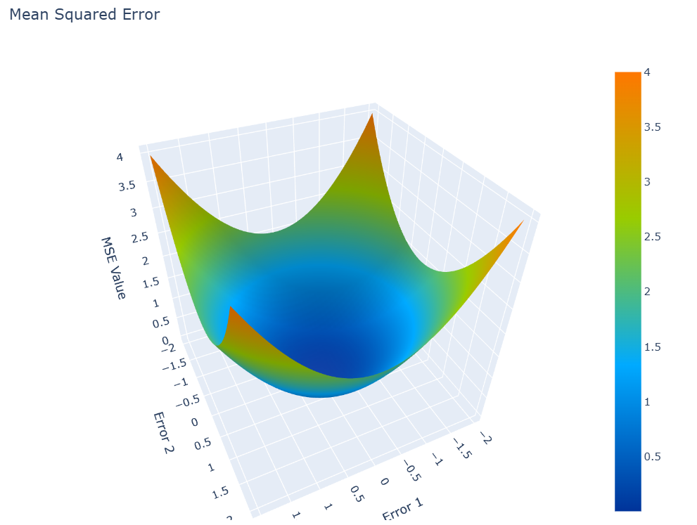
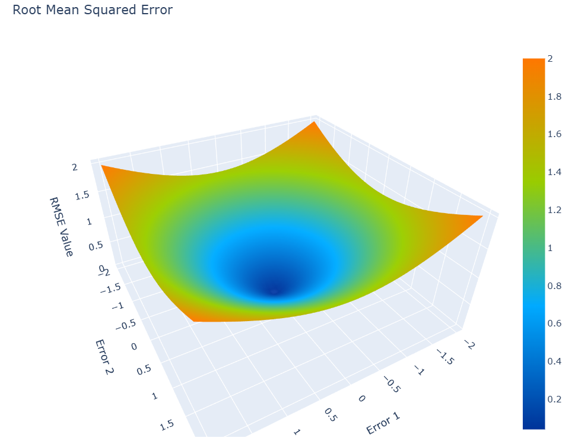
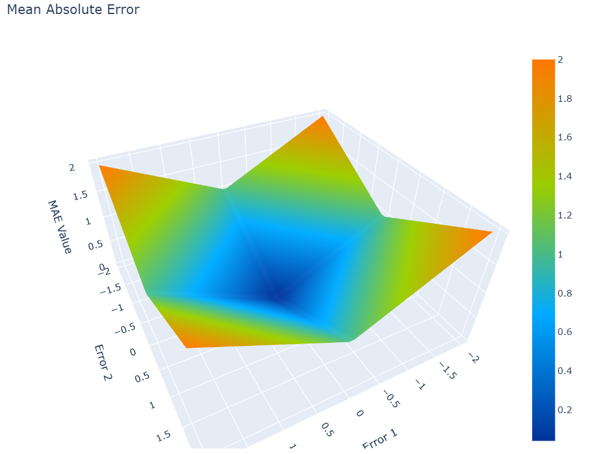

## 목차
* [1. Loss Function 이란?](#1-loss-function-이란)
* [2. 다양한 Loss Function](#2-다양한-loss-function)
  * [2-1. Mean-Squared Error (MSE)](#2-1-mean-squared-error-mse)
  * [2-2. Root Mean-Squared Error (RMSE)](#2-2-root-mean-squared-error-rmse)
  * [2-3. Mean-Absolute Error (MAE)](#2-3-mean-absolute-error-mae)
  * [2-4. Binary Cross Entropy Loss](#2-4-binary-cross-entropy-loss)
  * [2-5. Categorical Cross Entropy Loss](#2-5-categorical-cross-entropy-loss)
  * [2-6. Focal Loss](#2-6-focal-loss)
  * [2-7. Dice Loss](#2-7-dice-loss)
* [3. Loss Function과 성능 측정 지표](#3-loss-function과-성능-측정-지표)
* [4. Loss Function을 잘못 사용하면?](#4-loss-function을-잘못-사용하면)
* [5. Loss Function 의 값으로 정상적 학습 진행 여부 파악](#5-loss-function-의-값으로-정상적-학습-진행-여부-파악)

## 1. Loss Function 이란?

딥 러닝 모델의 목표는 주어진 입력 데이터로부터 신경망을 거쳐 출력 데이터까지 이어지는 거대한 함수인 **인공신경망** 을 학습하는 것에 있다. 그렇다면, 구체적으로 무엇을 학습해야 할까? 바로 **모델의 예측과 실제 값 간의 오차** 를 최소화해야 한다. **Loss Function (손실함수) 은 바로 이 오차를 함수로 나타낸 것** 이다.

딥 러닝에서는 미분을 이용하여 Back-propagation (역전파) 를 하기 때문에, 이 오차의 값들은 이산적이지 않고, **연속적인 값 (연속함수) 으로 측정** 할 수 있어야 한다.

[Regression, Classification 의 각 유형별 Task](../Machine%20Learning%20Models/머신러닝_모델_Learning_종류.md#2-supervised-learning-지도학습) 에서 Loss Function은 다음과 같은 형태이다.

* Regression Task 의 경우
  * 모델이 학습하려는 target feature 의 값과 실제 값의 오차를 계산하면 된다.
* Classification Task 의 경우
  * 예측하려는 값이 이산적이다.
  * 따라서 이를 **연속적인 숫자 값 또는 그 집합으로 먼저 바꾼 후,** 실제 값과의 **오차가 클수록 커지는 연속함수** 를 이용해야 한다.
    * 대표적으로, (분류가 N개일 때) [One-hot encoding](../Machine%20Learning%20Models/머신러닝_방법론_One_Hot.md) 을 통해 특정 class에 해당하는 값만 1 이고 나머지는 0 인 크기 N인 one-hot vector로 변환하는 방법이 있다.

## 2. 다양한 Loss Function

자주 사용되는 Loss Function으로 다음과 같은 것들이 있다.

| 문제 (Task)                              | Loss Function                                                                                 |
|----------------------------------------|-----------------------------------------------------------------------------------------------|
| Regression                             | - MSE (Mean Squared Error)<br>- RMSE (Root Mean Squared Error)<br>- MAE (Mean Absolute Error) |
| Binary Classification                  | - BCE (Binary Cross Entropy)                                                                  |
| 3-Class 이상의 Multi-Class Classification | - Categorical Cross Entropy                                                                   |

아래에서 소개할 각 Loss Function 에 대해 간단히 정리하면 다음과 같다.

| Loss Function                  | 설명                                                        | Outlier 민감 | 미분 불가능점                             |
|--------------------------------|-----------------------------------------------------------|------------|-------------------------------------|
| Mean-Squared Error (MSE)       | 오차 제곱의 합                                                  | O          | 없음                                  |
| root mean-squared error (RMSE) | 오차 제곱의 합의 제곱근                                             | O          | **모든 데이터 (row)** 에 대한 오차가 0인 지점     |
| Mean-Absolute Error (MAE)      | 절대 오차의 합                                                  | X          | **1개 이상의 데이터 (row)** 에 대한 오차가 0인 지점 |
| Binary Cross Entropy Loss      | 0~1 사이의 확률 예측이 실제와 차이가 클수록 오차 급증<br>**(Class가 2개일 때)**    |            | 없음                                  |
| Categorical Cross Entropy Loss | 0~1 사이의 확률 예측이 실제와 차이가 클수록 오차 급증<br>**(Class가 3개 이상일 때)** |            | 없음                                  |

### 2-1. Mean-Squared Error (MSE)

$$MSE = \sum_{i=1}^n {(\hat{y}_i - y_i)^2 \over n}$$



**오차의 제곱의 합** 으로, 일반적으로 regression 문제에서 자주 사용하는 Loss Function이다. 아래에서 사용할 MAE는 오차 자체를 사용하는데, 오차 값 자체가 아닌 **그 제곱에 해당하는 값** 을 딥러닝 모델의 오차로 사용하는 이유는 다음과 같다.
* 이상치에 민감하므로, 이상치를 고려해서 모델을 학습해야 하는 경우에 사용한다.

MSE의 특징으로 이차함수를 이용하기 때문에 **모든 지점에서 미분 가능** 하다.

### 2-2. root mean-squared error (RMSE)

$$RMSE = (MSE 의 제곱근) = \sqrt{\sum_{i=1}^n {(\hat{y}_i - y_i)^2 \over n}}$$



MSE 대신 RMSE를 사용하는 이유는 MSE의 다음과 같은 특징을 일정 부분 보완하기 위해서이다.
* 오차를 제곱하기 때문에 정답과 큰 차이가 나는 값에 의해서 Loss가 급격히 증가하여, 따라서 **큰 차이가 나는 값이 오차에 많이 반영** 된다. 즉, **오차 및 outlier에 민감**하다.
  * 반면 오차가 1 미만으로 작을 때는 오차에 적게 반영된다.

RMSE 는 **모든 데이터에 대한 오차가 0인 지점에서 미분 불가능** 하다.

### 2-3. Mean-Absolute Error (MAE)

$$MAE = \sum_{i=1}^n {|\hat{y}_i - y_i| \over n}$$



**오차의 절댓값의 합** 으로, RMSE와 마찬가지로 MSE가 **오차 및 outlier에 민감** 하다는 특성을 해결할 수 있다.

MAE는 오차의 **절댓값** 을 사용하기 때문에 **1개의 데이터라도 오차가 0인 곳에서 미분 불가능** 하다.
* RMSE 보다 미분 불가능점이 더 많다.

### 2-4. Binary Cross Entropy Loss

$$BCE = -(y \times \log{\hat{y}} + (1 - y) \times \log(1 - \hat{y}))$$
* $y$ : 실제 값
* $\hat{y}$ : 딥러닝 모델이 출력하는 0~1 사이의 연속적인 예측값 (확률)


Class에 대한 실제 값은 0 또는 1이므로, 딥러닝 모델이 예측하는 값은 Class가 1일 확률을 나타낸다고 할 수 있다.

실제 값 $y$에 따른 수식의 값은 다음과 같다.
* $y = 0$ 이면 수식은 $- \log(1 - \hat{y})$ 가 된다.
  * 이때, $\hat{y}$ 가 0에 가까울수록 식의 값이 0에 가까워지고, 1에 가까울수록 식의 값이 양의 무한대로 발산한다.
* $y = 1$ 이면 수식은 $- \log(\hat{y})$ 가 된다.
  * 이때, $\hat{y}$ 가 0에 가까워질수록 식의 값이 양의 무한대로 가까워지고, 1에 가까워질수록 식의 값이 0에 가까워진다.

이 함수는 [Logistic Regression 에서도 사용](../Machine%20Learning%20Models/머신러닝_모델_Linear_Logistic_Regression.md#3-2-logistic-regression의-손실-함수-log-loss) 한다. 자세한 것은 해당 문서 참고.

### 2-5. Categorical Cross Entropy Loss

$$CCE = \sum_{i=1}^n -(y_i \times \log{\hat{y_i}})$$
* $y_i$ : class $i$ 에 대한 실제 값
  * class가 실제로 $i$이면 1, 그렇지 않으면 0
* $\hat{y_i}$ : 모델이 class $i$ 일 것으로 예측하는 확률 (0~1의 값)
* $i = 1,2,...,n$ (전체 class는 $n$개)

핵심 아이디어
* 수식을 보면 알겠지만, Binary Cross Entropy 에서 **Class가 2개가 아닌 n개일 때로 확장 적용** 한 것이다.
* 한편 확률의 합은 1이므로, 최종 출력에 softmax와 같은 [활성화 함수](딥러닝_기초_활성화_함수.md) 를 적용했다고 가정했을 때 모든 class $i$에 대한 $\hat{y_i}$ 값의 합은 1이다.

실제 값 $y_i$ (for class $i$) 에 따른 수식의 값은 다음과 같다.
* $y_i = 1$ 이면 수식은 $- \log(\hat{y_i})$ 가 된다.
* 이때, $\hat{y_i}$가 0에 가까워질수록 식의 값이 양의 무한대로 가까워지고, 1에 가까워질수록 식의 값이 0에 가까워진다.

### 2-6. Focal Loss

$$FL = \sum_{i=1}^n -(y_i \times (1 - \hat{y_i})^\gamma \times \log{\hat{y_i}})$$
* $\gamma$ : focusing parameter
  * 모델이 정상적으로 분류할 가능성이 높은 **easy example 에 대한 Loss 가중치를 낮추는** 역할 
* 나머지 notation 은 [Categorical Cross Entropy Loss](#2-5-categorical-cross-entropy-loss) 와 동일

핵심 아이디어
* Categorical Cross Entropy 에서 **easy example 에 대한 Loss 를 낮추는** 메커니즘 추가
* 이를 위해 $(1 - \hat{y_i})^\gamma$ 항을 추가
* $\gamma$ 값이 클수록 easy example 에 대한 Loss 의 비중이 더욱 낮아짐

### 2-7. Dice Loss

$$\displaystyle L_{DICE} = 1 - \frac{2 \times \Sigma p_{true} p_{pred}}{\Sigma p_{true}^2 + \Sigma p_{pred}^2}$$
* $p_{true}$ : 실제 값 (0 또는 1)
* $p_{pred}$ : 예측 확률 값 (0 ~ 1 범위)

핵심 아이디어
* **DICE = 2 * (교집합의 넓이) / (각 집합의 넓이의 합)** 이라는 수식에 대해, **1 - (DICE)** 의 값을 Loss 로 이용하는 아이디어

용도
* **Image Segmentation** 에서 많이 사용
* Segmentation 하고자 하는 영역의 크기가 전체 이미지에서 차지하는 비중이 **매우 작은** [데이터 불균형](../Data%20Science%20Basics/데이터_사이언스_기초_데이터_불균형.md) 인 경우에 효과적

참고
* 다음과 같이 ```monai``` 라이브러리의 ```monai.losses.dice``` 를 이용하여 Dice Loss 를 계산하는 경우 다음과 같다.

```python
import monai
import torch
from monai.losses.dice import DiceLoss
```

| case                                 | Dice Loss 수식                                                                                     |
|--------------------------------------|--------------------------------------------------------------------------------------------------|
| ```squared_pred = False``` (default) | $L_{DICE} = 1 - \frac{2 \times \Sigma p_{true} p_{pred}}{\Sigma p_{true} + \Sigma p_{pred}}$     |
| ```squared_pred = True```            | $L_{DICE} = 1 - \frac{2 \times \Sigma p_{true} p_{pred}}{\Sigma p_{true}^2 + \Sigma p_{pred}^2}$ |

## 3. Loss Function과 성능 측정 지표

딥 러닝에서는 Loss Function 자체를 [성능 측정 지표](../Data%20Science%20Basics/데이터_사이언스_기초_Metrics.md) 로 사용할 수 있지만, Loss Function과는 다른 accuracy, F1 Score와 같은 다른 성능지표를 사용하기도 한다.

Accuracy, F1 Score와 같이 맞은 개수에 기반한 성능지표는 모델에서의 역전파를 하기 위한 미분이 불가능하기 때문에, Loss Function으로 사용할 수 없다. 하지만 Loss Function의 값을 줄여 나가면서 **모델의 예측값과 실제 값의 차이가 줄어들고**, 이를 통해 Accuracy와 F1 Score의 값도 증가하는 것이다.

## 4. Loss Function을 잘못 사용하면?

**본인이 2024년 현업 실무에서 중대한 오류를 범한 부분이라 철저히 짚고 넘어가야 한다.**

Loss Function 을 잘못 사용하면 모델 학습이 잘 이루어지지 않는 오류가 발생한다. 자세한 것은 [해당 문서](딥러닝_기초_Loss_Function_Misuse.md) 참고.

## 5. Loss Function 의 값으로 정상적 학습 진행 여부 파악

Loss Function 의 값을 이용하여 **모델이 정상적으로 학습 중인지** 를 파악할 수 있다. 그 방법은 **모델이 모든 출력값을 이론상의 평균값으로 예측했을 때의 값과 비교** 하는 것이다.

예를 들어, 다음과 같은 학습 상황을 가정한다. (단, [해당 문서](딥러닝_기초_Loss_Function_Misuse.md) 의 관점에서 보면 이 상황에서 MSE Loss 는 Loss Function Misuse 이다.)

* 이미지가 Dog 이면 1 로, Cat 이면 0 으로 예측해야 함
* Valid Dataset 에 Dog 50 장, Cat 50 장이 있음

이때는 각 Loss Function 별로, **모든 출력값을 이론상의 평균값인 0.5 로 예측** 했을 때의 값과 비교하여, 학습이 잘 진행되고 있는지를 다음과 같이 파악할 수 있다.

* Valid Dataset 에서, **Sample 에 관계없이 모델의 출력값이 평균으로 수렴** 한다면 학습이 잘 안 되는 것으로 간주한다.

| Loss Function                                                | 평균 Loss<br>(모든 출력값 0.5 예측 시) | 결론                                                             |
|--------------------------------------------------------------|------------------------------|----------------------------------------------------------------|
| [Binary Cross Entropy (BCE)](#2-4-binary-cross-entropy-loss) | 0.6931                       | 각 Valid data 에 대한 **평균 Loss 가 0.6931** 보다 떨어지지 않으면 학습이 안 되는 것임 |
| [Mean-Squared Loss (MSE)](#2-1-mean-squared-error-mse)       | 0.2500                       | 각 Valid data 에 대한 **평균 Loss 가 0.2500** 보다 떨어지지 않으면 학습이 안 되는 것임 |

* Loss Function 의 값이 위 **평균 Loss** 로 수렴하여 학습이 잘 되지 않을 때, **valid / test dataset 의 모든 데이터에 대해 거의 동일한 출력값** 을 나타내는 경우가 많다. 