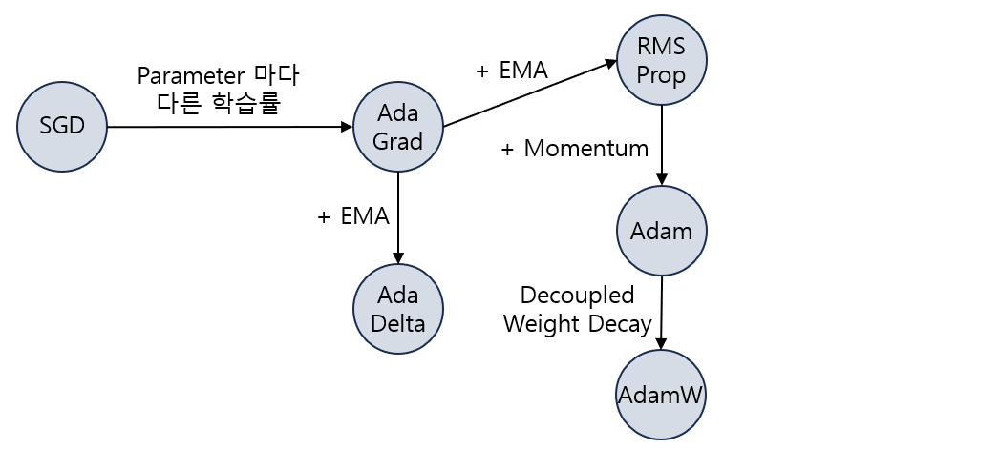
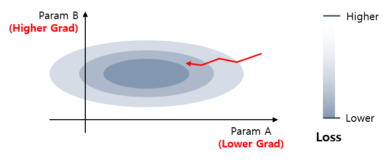
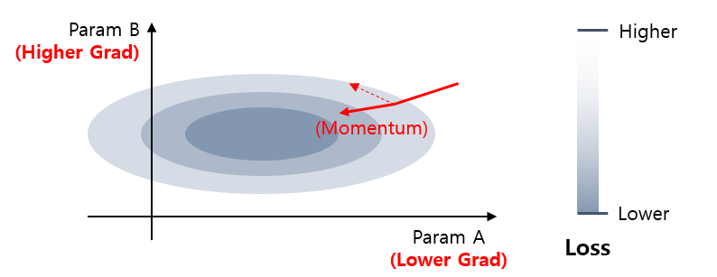

## 목차
* [1. Optimizer 란?](#1-optimizer-란)
  * [1-1. 중요 개념: weight decay](#1-1-중요-개념-weight-decay) 
* [2. Optimizer 의 종류](#2-optimizer-의-종류)
  * [2-1. RMSProp](#2-1-rmsprop)
  * [2-2. Adam](#2-2-adam)
  * [2-3. AdamW](#2-3-adamw)
  * [2-4. AdaGrad](#2-4-adagrad)
  * [2-5. AdaDelta](#2-5-adadelta)
  * [2-6. SGD (Stochastic Gradient Descent)](#2-6-sgd-stochastic-gradient-descent)
  * [2-7. 기타](#2-7-기타)
* [3. 탐구: 어떤 Optimizer 가 적절할까?](#3-탐구-어떤-optimizer-가-적절할까)
  * [3-1. 실험 설계](#3-1-실험-설계)
  * [3-2. 실험 결과](#3-2-실험-결과)
  * [3-3. 추가 탐구](#3-3-추가-탐구)

## 코드

## 1. Optimizer 란?
딥러닝에서 **최적화 (Optimization) 란, 손실 함수 (loss function) 를 줄여서 모델 예측의 오차를 줄이는 것**이다.

그렇다면 **Optimizer 란, 이 최적화를 수행하는 알고리즘 (학습이 효율적으로 이루어지도록 가중치를 갱신하는)** 을 말한다.

### 1-1. 중요 개념: weight decay
**weight decay (가중치 감쇠)** 는 Gradient Descent 에서 가중치를 업데이트할 때 **이전 weight의 크기를 일정 비율만큼 감소** 시키는 것이다.
* 이를 통해 **overfitting을 방지** 할 수 있다.

수식 비교

* 원래 가중치 갱신
  * $\theta_{t+1} = \theta_t - \alpha \nabla f_t(\theta_t)$
* **weight decay** 가 적용된 가중치 갱신
  * $\theta_{t+1} = (1 - \lambda) \theta_t - \alpha \nabla f_t(\theta_t)$
  * 여기서 하이퍼파라미터인 $\lambda$ 는 **decay rate** 라고 한다.

## 2. Optimizer 의 종류
Adam Optimizer, SGD (Stochastic Gradient Descent), RmsProp 등이 잘 알려진 Optimizer 이다. 이들 잘 알려진 Optimizer 들에 대해 간단히 설명하면 다음과 같다.

| Optimizer | 핵심 아이디어                                                                                                                                                                       |
|-----------|-------------------------------------------------------------------------------------------------------------------------------------------------------------------------------|
| RMSProp   | - Gradient 가 큰 매개변수일수록 learning rate 낮음                                                                                                                                       |
| Adam      | - RMSProp **+ Momentum**<br>- Momentum : Gradient 갱신 방향에 '가속'을 붙이는 방식                                                                                                         |
| AdamW     | - Adam 에서 **weight decay 를 Loss Function 에서 분리**<br>- weight decay 가 적용된 [L2 Regularization](딥러닝_기초_Regularization#2-l1-l2-reguliarization) 을 Adam Optimizer가 처리할 때의 성능 저하 해결 |
| AdaGrad   | - 가끔 업데이트되는 파라미터일수록 learning rate 높음<br>- 이로 인해, 가끔 업데이트되는 파라미터가 많은 sparse dataset 에서 효과적                                                                                     |
| AdaDelta  | - **지수 이동 평균 (EMA)** 를 이용, **최근의 Gradient** 의 가중치를 더 높임<br>- 시간이 지남에 따라 가중치는 지수적으로 감소                                                                                         |
| SGD       | - 전체 데이터셋 대신 **1개 샘플 또는 batch** 를 학습하여 파라미터 업데이트<br>- 대규모 데이터셋에서 계산 비용 절감 효과                                                                                                  |



### 2-1. RMSProp

**핵심 아이디어**

* Gradient 가 큰 매개변수의 학습 속도 (learning rate) 를 줄인다.
* Gradient 가 작은 매개변수의 학습 속도를 늘린다.



기존 Gradient Descent 방법에서는 다음과 같은 방식으로 weight과 bias를 갱신했다.
* (weight) = (weight) - (learning rate) * (weight의 gradient)
* (bias) = (bias) - (learning rate) * (bias의 gradient)

RMSProp은 다음과 같은 방식으로 weight과 bias를 갱신한다.
* weight 과 bias 의 업데이트 속도 조절 **(클수록 업데이트 느림)**
  * $${S_{dW}} = \beta * S_{dW} + (1 - \beta)dW^2$$
  * $${S_{db}} = \beta * S_{db} + (1 - \beta)db^2$$
  * $S_{dW}$, $S_{db}$는 처음에 모두 0으로 초기화
* weight 및 bias 업데이트
  * $$(weight) = (weight) - (LearningRate) * \frac{(weight의 gradient)}{\sqrt{S_{dW} + \epsilon}}$$
  * $$(bias) = (bias) - (LearningRate) * \frac{(bias의 gradient)}{\sqrt{S_{db} + \epsilon}}$$
  * $S_{dW}$, $S_{db}$ 가 분모에 들어감으로써, weight과 bias의 업데이트 속도가 해당 값에 반비례하게 된다.

보다 자세한 설명은 다음과 같다.

* $\beta$ : 지난 몇 회의 기울기 계산의 평균치를 사용할 것인지에 대한 가중치로, 그 횟수는 $\displaystyle \frac {1}{1 - \beta}$ 이다.
  * 보통 0.9 등 1에 가까운 값 사용 
* $\epsilon$ : 계산식의 분모가 0이 되지 않게 하기 위한 작은 양수 값
  * 보통 1억 분의 1, 100억 분의 1 등의 매우 작은 값 사용

### 2-2. Adam

**핵심 아이디어**

* RMSProp 의 방식에 추가로 **Gradient 갱신 방향의 가속 (Momentum, 일종의 '관성' 개념)** 을 함께 이용한다.
* Momentum 은 다음의 값으로 구성된다.
  * 1차 moment $v_{dW}$ : 과거 gradient 의 지수적 가중 평균
  * 2차 moment $S_{dW}$ : 과거 gradient 의 제곱의 지수적 가중 평균



Adam은 $\alpha$, $\beta_1$, $\beta_2$, $\epsilon$ 이라는 4개의 하이퍼파라미터를 이용한다.

먼저 $v_{dW} = 0, S_{dW} = 0, v_{db} = 0, S_{db} = 0$으로 초기화한 후, 다음과 같은 계산식을 통해 최적화를 진행한다.
* $v_{dW} = \beta_1 v_{dW} + (1 - \beta_1)dW$
* $v_{db} = \beta_1 v_{db} + (1 - \beta_1)db$
* $S_{dW} = \beta_2 S_{dW} + (1 - \beta_2)dW^2$
* $S_{db} = \beta_2 S_{db} + (1 - \beta_2)db^2$

RMSProp과 달리, 다음과 같이 bias correction을 적용한다. 이는 **관련 변수들이 $v_{dW} = 0, S_{dW} = 0, v_{db} = 0, S_{db} = 0$으로 초기화** 됨에 따라 처음에 **0을 향한 편향** 이 있기 때문이다.
* $v_{dW}^{bc} = \displaystyle \frac {v_{dW}}{1 - \beta_1^t}$
* $v_{db}^{bc} = \displaystyle \frac {v_{db}}{1 - \beta_1^t}$
* $S_{dW}^{bc} = \displaystyle \frac {S_{dW}}{1 - \beta_2^t}$
* $S_{db}^{bc} = \displaystyle \frac {S_{db}}{1 - \beta_2^t}$

마지막으로 RMSProp의 가중치 갱신 방식을 유사하게 적용한다. (단, gradient 대신 bias correction 된 값을 적용한다.)
* $$(weight) = (weight) - (LearningRate) * \frac{v_{dW}^{bc}}{\sqrt{S_{dW}^{bc} + \epsilon}}$$
* $$(bias) = (bias) - (LearningRate) * \frac{v_{db}^{bc}}{\sqrt{S_{db}^{bc} + \epsilon}}$$

여기서 $\beta_1, \beta_2$는 각각 1차, 2차 moment이며, $\epsilon$은 RMSProp과 동일한 목적으로 사용한다.

### 2-3. AdamW

**핵심 아이디어**

* Adam Optimizer 에서 **weight decay 와 Loss Function 을 분리 (Decoupled Weight Decay)** 한다.
* weight decay 가 적용된 [L2 Regularization](딥러닝_기초_Regularization#2-l1-l2-reguliarization) 을 Adam Optimizer로 처리할 때, 일부 케이스에서 성능이 저하되는 문제가 해결된다.

참고
* 간단한 모델에서는 Adam, 복잡한 모델이나 고차원의 복잡한 데이터셋에서는 AdamW Optimizer 를 사용하는 것이 일반적으로 좋다.

----

Adam Optimization 의 1차, 2차 moment $v_{dW}$, $S_{dW}$ 에 대해, 그 수식은 다음과 같다.

* **[Adam]** $$\displaystyle (weight) = (weight) - (LearningRate) * \frac{v_{dW}^{bc}}{\sqrt{S_{dW}^{bc} + \epsilon}}$$

한편, weight decay 수식은 다음과 같다.

* **[Weight Decay]** $\displaystyle \(weight) = (1 - \lambda) (weight) - \alpha \nabla f_t(\theta_t)$

이것을 **weight decay 를 나타내는 term 인 $\lambda \theta_t$ 를 weight 갱신에 추가** 하는 것이 핵심이다.
* L2 Regularization 에 의한 weight decay 효과가 부족한 것을 **weight 갱신에 weight decay term을 추가하여 해결** 한다.
  * 이것을 weight decay 와 Loss Function 을 **분리** 했다고 하여 **Decoupled** weight decay 라고 한다.
* Decoupled weight decay 가 적용된 AdamW의 수식은 다음과 같다.
  * **[AdamW]** $\displaystyle (weight) = (weight) - (LearningRate) * (\frac{v_{dW}^{bc}}{\sqrt {S_{dW}^{bc}} + \epsilon} + \lambda \theta_t)$

### 2-4. AdaGrad

**핵심 아이디어**

* 가끔 업데이트되는 파라미터일수록 학습률 (learning rate) 을 높인다.
  * 이를 통해 sparse dataset 또는 NLP (자연어 처리) 데이터에서 효과를 볼 수 있다.
  * 이를 위해 **각 parameter 에 대해 과거의 gradient 의 제곱 누적** 을 계산하고, 이를 통해 learning rate를 조정한다.
* SGD (Stochastic Gradient Descent) 대비 개선점으로, **각 파라미터마다 개별적인 learning rate를 적용** 한다.

----

AdaGrad 는 다음과 같은 방법으로 **각 파라미터를** 업데이트한다.

* $G_{t+1} = G_t + g_t^2$
  * $G_t$ : 해당 파라미터의 과거 gradient 의 제곱의 합
  * $g_t$ : 해당 시점 $t$ 에서의 gradient 값
* $\displaystyle (weight)_{t+1} = (weight)_t - \frac{(Learning Rate)}{\sqrt {G_t + \epsilon}} g_t$
  * $\epsilon$ : 0으로 나누기 방지를 위한 매우 작은 값
  * $G_t$ 를 **분모로 보냄** 으로써, **과거 Gradient의 절대 크기가 클수록 학습률이 낮아지는** 효과를 보인다.

AdaGrad 의 장단점은 다음과 같다.

* 장점
  * sparse dataset 은 '0'이라는 특징이 매우 자주 등장하는데, 이 특징에 대한 학습률을 낮춤으로써 sparse dataset 에서의 성능 향상
  * parameter 마다 그 빈도수를 반영한 **개별적인 학습률 조정**
* 단점
  * $G_t$ 의 값이 **시간이 갈수록 커지므로** 학습 진행에 따라 학습률이 지나치게 감소할 수 있음
    * 이로 인해 학습을 오랫동안 진행하는 경우 문제가 발생할 수 있음 
* 개선 방안
  * 아래 두 방법 (AdaDelta, RMSProp) 모두 **지수 이동 평균 (EMA) 을 사용한다는 공통점** 이 있다. 

| 구분            | [AdaDelta](#2-5-adadelta) | [RMSProp](#2-1-rmsprop)    |
|---------------|---------------------------|----------------------------|
| Learning Rate | 자동 조정 (수동 설정 불필요)         | 하이퍼파라미터로 수식에 포함 (수동 설정 필요) |
| EMA 적용 범위     | Gradient + 파라미터 값 변화량     | Gradient only              |

### 2-5. AdaDelta

**핵심 아이디어**

* **최근의 Gradient** 에 대해 더 높은 가중치를 둔다.
  * 이를 위해 **지수 이동 평균 (EMA, Exponential Moving Average)** 를 사용한다.
* AdaGrad가 **학습이 누적될수록 gradient가 잘 업데이트되지 않는 한계** 를 가지고 있으므로 이를 극복하기 위한 것이다. 

----

AdaDelta 는 다음과 같은 방법으로 각 파라미터를 업데이트한다.

**지수 이동 평균 (EMA) - Gradient ($g$)**

* 수식
  * ${E[g^2]}_t = p * {E[g^2]}_{t-1} + (1 - p) * g_t^2$
  * **가중치 갱신 시 분모** 에 위치하여, **gradient 가 큰 파라미터의 갱신을 느리게** 한다.
* 수식 설명
  * $E[g^2]$ : gradient의 제곱 $g^2$ 에 대한 지수 이동 평균
    * $E[g^2]_t$ : 시점 t 에서의 지수 이동 평균
    * $E[g^2]_{t-1}$ : 시점 t-1 에서의 지수 이동 평균
  * $p$ : 지수 이동 평균을 위한 감쇠율
    * 값이 클수록 가장 최신 gradient 만 반영
    * 값이 작을수록 오래된 gradient 의 반영 비율 높음
    * 일반적으로 0.95 를 사용

**지수 이동 평균 (EMA) - Parameter ($\theta$)**

* 수식
  * $E[\Delta \theta^2]_t = p * E[\Delta \theta^2]_{t-1} + (1 - p) * \Delta \theta_t^2$
  * **가중치 갱신 시 분자** 에 위치하여, **현재 가중치 갱신을 이전 가중치 갱신의 크기에 비례하게** 한다.
* 수식 설명
  * $E[\Delta \theta^2]$ : 가중치 갱신량 $\Delta \theta$ 의 제곱 $\Delta \theta^2$ 에 대한 지수 이동 평균 

**최종 가중치 갱신**

* 수식
  * $\displaystyle (weight) = (weight) - \frac{\sqrt {E[\Delta \theta^2]_{t-1} + \epsilon}}{\sqrt E[g^2]_t + \epsilon} * g_t$
* 수식 설명
  * 아래 변수를 이용하여 **학습률을 자동으로 조정** 하는 효과가 있다. 
  * $E[\Delta \theta^2]_{t-1}$ : 직전 파라미터 갱신량 제곱의 지수 이동 평균
    * 가중치 갱신량을 **직전 가중치 갱신량에 비례** 하게 한다.
  * $E[g^2]_t$ : 현재 gradient 의 제곱의 지수 이동 평균 
    * gradient 가 클수록 해당 파라미터의 갱신량을 줄인다. 

AdaDelta의 장단점은 다음과 같다.

* 장점
  * Learning rate 를 자동으로 조정하므로, 수동으로 설정 불필요
    * 실무적으로 [최적화 대상 Hyper-Parameter](../Machine%20Learning%20Models/머신러닝_방법론_HyperParam_Opt.md) 로 Learning rate 를 지정해 주지 않아도 되기 때문에, **최적의 하이퍼파라미터를 약간 더 빨리 찾을** 수 있다.
  * AdaGrad 가 학습률이 감소되어 장기적인 학습이 어렵다는 문제 해결

### 2-6. SGD (Stochastic Gradient Descent)

**핵심 아이디어**

* 전체 데이터셋 대신, **1개의 데이터 (row)** 또는 일정 개수의 데이터 (row) 를 포함한 **Minibatch 단위** 로 학습하여 가중치를 갱신한다.
  * 이때, 데이터 row 또는 minibatch 를 구성할 데이터를 **랜덤하게 선택** 하기 때문에, **확률적 (Stochastic)** 경사 하강법이라고 한다. 
* 이를 통해 큰 데이터셋에서 학습 비용을 절감할 수 있다.

----

**가중치 업데이트 수식**

* $\displaystyle (weight) = (weight) - (Learning Rate) * \frac{1}{m} \Sigma_{i=1}^m \nabla_\theta L$
  * $m$ : minibatch 의 크기
  * $\nabla_\theta L$ : Loss Function 의 gradient
* 위 수식을 통해 **minibatch 에 있는 각 데이터의 gradient의 평균** 만큼 가중치를 업데이트한다.

SGD 의 장단점은 다음과 같다.

* 장점
  * 계산 비용이 절감되기 때문에 빠른 업데이트 가능
* 단점
  * minibatch 의 크기는 전체 데이터보다 훨씬 작으므로, 표본 부족으로 인해 '진동' 발생 가능
  * 이 진동 때문에 모델 학습의 수렴 속도가 느려질 수 있음

### 2-7. 기타

이 외의 Optimizer로 다음과 같은 것들이 있다.
* Nadam, Adabelief
* GD (Gradient Descent), Batch Gradient Descent
* Momentum
* NAG (Nesterov Accelerated Gradient)

## 3. 탐구: 어떤 Optimizer 가 적절할까?

**실험 목적**

* 딥러닝 학습 데이터셋의 성능을 최대한 올릴 수 있는 적절한 Optimizer 를 탐색한다.
* 각 Optimizer 별로 성능의 차이를 분석하고, 그 이유를 탐구한다.

### 3-1. 실험 설계

**데이터셋**

* **MNIST 숫자 이미지 분류 데이터셋 (train 60K / test 10K)**
  * 10 개의 Class 가 있는 Classification Task
  * 학습 시간 절약을 위해, train dataset 중 일부만을 샘플링하여 학습
* 선정 이유
  * 데이터셋이 28 x 28 size 의 작은 이미지들로 구성
  * 이로 인해 비교적 간단한 신경망을 설계할 수 있으므로, 간단한 딥러닝 실험에 적합하다고 판단
* 데이터셋 분리
  * 학습 데이터 양이 **조금 부족해야 Optimizer 및 Hyper-parameter 에 따른 성능 변별** 이 보다 잘 될 것으로 판단

| 학습 데이터  | Valid 데이터 (Epoch 단위) | Valid 데이터 (Trial 단위) | Test 데이터          |
|---------|----------------------|----------------------|-------------------|
| 1,000 장 | 2,000 장              | 5,000 장              | 10,000 장 (원본 그대로) |

**성능 Metric**

* **Accuracy**
* 선정 이유
  * Accuracy 로 성능을 측정해도 될 정도로, [각 Class 간 데이터 불균형](../Data%20Science%20Basics/데이터_사이언스_기초_데이터_불균형.md) 이 적음 

**신경망 구조**

```python
# 신경망 구조 출력 코드

from torchinfo import summary

model = CNN()
print(summary(model, input_size=(BATCH_SIZE, 1, 28, 28)))
```


* [활성화 함수](딥러닝_기초_활성화_함수.md) 는 다음과 같이 사용

| Conv. Layers | Fully Connected Layer | Final Layer |
|--------------|-----------------------|-------------|
| ReLU only    | Sigmoid               | Softmax     |

**상세 학습 방법**

* 각 Optimizer 별로 하이퍼파라미터 최적화를 실시하여, **최적화된 하이퍼파라미터를 기준으로 한 성능을 기준** 으로 최고 성능의 Optimizer 를 파악
* Optimizer 종류
  * Adam, AdamW, AdaDelta (총 3개)
  * 각 Optimizer 별로 아래와 같이 하이퍼파라미터 최적화
* 하이퍼파라미터 최적화
  * [하이퍼파라미터 최적화 라이브러리](../Machine%20Learning%20Models/머신러닝_방법론_HyperParam_Opt.md#4-하이퍼파라미터-최적화-라이브러리) 중 Optuna 를 사용
  * 각 Optimizer 별로 하이퍼파라미터 탐색 70 회 반복 (= 70 trials) 하여 최적의 하이퍼파라미터 탐색
* 각 Optimizer 별 적용 하이퍼파라미터

| Optimizer | 하이퍼파라미터                                                   | 각 하이퍼파라미터 별 탐색 대상 범위                                      |
|-----------|-----------------------------------------------------------|-----------------------------------------------------------|
| Adam      | learning rate<br> $\beta_1$<br> $\beta_2$                 | 1e-4 ~ 1e-2<br>0.8 ~ 0.95<br>0.99 ~ 0.9999                |
| AdamW     | learning rate<br> $\beta_1$<br> $\beta_2$<br>weight decay | 1e-4 ~ 1e-2<br>0.8 ~ 0.95<br>0.99 ~ 0.9999<br>1e-4 ~ 2e-2 |
| AdaDelta  | $p$ (EMA 용 감쇠율)                                           | 0.5 - 0.999                                               |

### 3-2. 실험 결과

**결론**

* 실험 진행중
* Optuna 의 랜덤성에 의해서, 본 실험을 여러 번 반복할 경우 그 결과 간 성능 차이가 있을 수 있음

**각 Optimizer 별 테스트 데이터셋 최종 성능 및 최적 하이퍼파라미터**

| Optimizer | 최종 성능 | 최적 하이퍼파라미터 |
|-----------|-------|------------|
| Adam      |       |            |
| AdamW     |       |            |
| AdaDelta  |       |            |

**각 Optimizer 별 HPO 정확도 추이**

* Adam
* AdamW
* AdaDelta

**각 Optimizer 별 특정 하이퍼파라미터의 값에 따른 성능 분포**

* Adam
* 
| 하이퍼파라미터       | 성능 분포 |
|---------------|-------|
| Learning Rate |       |
| $\beta_1$     |       |
| $\beta_2$     |       |

* AdamW

| 하이퍼파라미터       | 성능 분포 |
|---------------|-------|
| Learning Rate |       |
| $\beta_1$     |       |
| $\beta_2$     |       |
| weight decay  |       |

* AdaDelta

| 하이퍼파라미터       | 성능 분포 |
|---------------|-------|
| $p$           |       |

### 3-3. 추가 탐구

* 탐구 사항 1
* 탐구 사항 2
* 탐구 사항 3