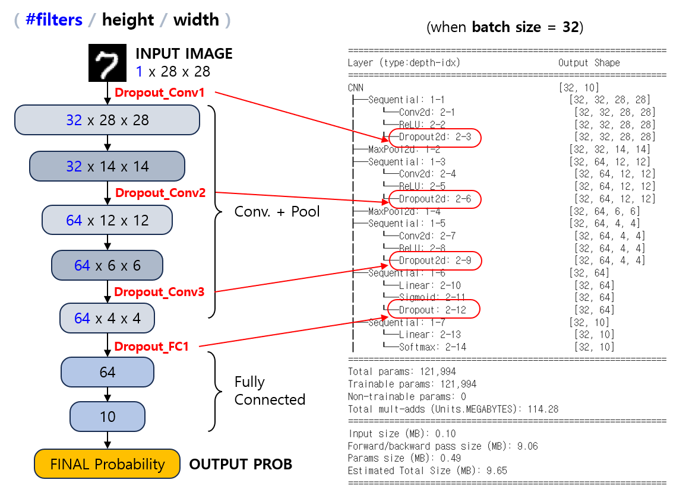

## 목차
* [1. bias와 variance](#1-bias와-variance)
* [2. 딥러닝에서의 오버피팅 (Overfitting)](#2-딥러닝에서의-오버피팅-overfitting)
  * [2-1. 오버피팅 해결 방법](#2-1-오버피팅-해결-방법) 
* [3. Dropout](#3-dropout)
  * [3-1. Dropout의 개념](#3-1-dropout의-개념)
  * [3-2. Dropout의 효과](#3-2-dropout의-효과)
* [4. 탐구: Dropout 은 몇 % 적용하는 것이 좋을까?](#4-탐구-dropout-은-몇--적용하는-것이-좋을까)
  * [4-1. 실험 설계](#4-1-실험-설계)
  * [4-2. 실험 결과](#4-2-실험-결과)

## 코드

* [MNIST 데이터셋에서 Dropout의 적절한 비율 탐구](#4-탐구-dropout-은-몇--적용하는-것이-좋을까) 실험 코드 : [code (ipynb)](codes/Dropout_experiment.ipynb)

## 1. bias와 variance

Overfitting 에 대해 설명하기 위해서 필요한 개념으로 **bias** 와 **variance** 가 있다.

* bias: 딥러닝 모델의 예측값과 실제 데이터 값의 차이
* variance: 다양한 데이터에 대해 모델이 예측할 때, 그 값의 편차


예를 들어 위 그림에서 보라색과 흰색을 분류하는 모델이 있다고 할 때, 각 그림에 따른 bias와 variance를 나타내면 다음과 같다.

| 그림       | (A) | (B) | (C) |
|----------|-----|-----|-----|
| bias     | 높음  | 중간  | 낮음  |
| variance | 낮음  | 중간  | 높음  |

bias와 variance 모두 모델의 오차이므로, 딥 러닝 모델이 목표로 하는 것은 **bias와 variance의 trade-off**를 고려하여 최적으로 학습하는 것이다. (한쪽이 너무 커지면 안 된다.)

## 2. 딥러닝에서의 오버피팅 (Overfitting)

**오버피팅 (Overfitting)** 이란, 위 그림의 (C) 와 같이 딥러닝/머신러닝 모델의 학습이 과도하게 진행되어 (즉, **필요 이상의 epoch 만큼 학습** 하여) 해당 모델의 variance가 높아지는 현상을 말한다.

위 그림 중 (A) 는 **언더피팅 (Underfitting)**, (B) 는 알맞게 학습된 모델, (C)는 **오버피팅**이다.

딥러닝 모델의 일반적인 학습 과정에 따른 bias와 variance의 변화를 나타내면 다음 그림과 같다.


오버피팅은 다음과 같을수록 **모델이 학습 데이터의 불필요한 특징까지 과도하게 학습하는 것으로 인해** 발생 가능성이 높다.

* 학습 데이터 개수가 적을 때
* 딥러닝 모델의 규모가 크고 (파라미터가 많고) 복잡할 때

### 2-1. 오버피팅 해결 방법

오버피팅의 해결 방법은 다음과 같다.

**1. 학습 프로세스 관점**

* 학습 데이터의 샘플 개수를 늘린다.
  * 이미지 데이터의 경우, [Data Augmentation](../../Image%20Processing/Basics_Image%20Augmentation.md) 을 사용할 수 있다.
* Valid set 을 이용하여 측정한 성능이 일정 epoch 횟수 이상 갱신되지 않으면 학습을 조기 종료한다. [(Early Stopping)](딥러닝_기초_Early_Stopping.md)
  * 참고 : [Overfitting 과 Early Stopping](../Machine%20Learning%20Models/머신러닝_방법론_Train_Valid_Test.md#3-overfitting-과-early-stopping)
* [Cross Validation](../Machine%20Learning%20Models/머신러닝_방법론_Cross_Validation.md) 방법을 이용한다.

**2. 모델 구조 관점**

* 딥러닝 모델의 퍼셉트론 개수를 줄인다.
  * feature 개수를 줄이는 등의 방법이 가능하다. 
  * 통계학에서도 오버피팅 해결을 위해 불필요한 feature 를 제거하기도 한다.
* [Batch Normalization](딥러닝_기초_Regularization.md#4-1-batch-normalization) 을 이용한다.
* [드롭아웃 (Dropout)](#3-dropout) 을 이용한다.

**3. 모델 학습 수식 (weight, loss 등) 관점**

* [Weight Decay](딥러닝_기초_Optimizer.md#1-1-중요-개념-weight-decay) 를 조정한다.
* [L1, L2 Regularization (정규화)](딥러닝_기초_Regularization.md#2-l1-l2-regularization) 를 이용한다.

## 3. Dropout

오버피팅의 해결 방법 중 대표적인 것으로 Dropout 이 있다.

## 3-1. Dropout의 개념

**드롭아웃 (Dropout)** 이란, 딥러닝 모델의 **학습 단계** 에서 아래와 같이 **신경망의 각 뉴런을 일정한 확률로 제거** 하는 것을 말한다.

* 예를 들어 Dropout rate가 0.25 이면, 모든 뉴런이 **완전히 랜덤하게** 25%의 확률로 제거되는 것을 의미한다.


미니배치 (Mini-batch) 단위로 딥러닝 모델을 학습시킬 경우, 학습 과정 전체가 아닌 **각 Minibatch마다 랜덤하게** 연결선이 제거된다.

* 제거 비율이 아닌 **확률**의 개념이기 때문에 정확히 해당 확률만큼의 연결선이 제거되지는 않는다.
* 즉, 제거되는 연결선의 비율은 해당 확률과 다소 차이가 있을 수 있다.

모델의 test 시에는 Dropout rate 에 따라, 모든 뉴런으로 입력되는 **(직전 뉴런의 입력값) * (가중치) 의 값에 (1 - (Dropout rate)) 를 곱하여** 적용한다. (단, bias 값에는 적용하지 않는다.)

* 학습 단계가 아니기 때문에 연결선을 제거하지 않는다.

## 3-2. Dropout의 효과

Dropout은 다음과 같은 효과가 있다.
* 학습 중 Overfitting 방지
  * 매 mini-batch를 학습시킬 때마다 신경망의 뉴런이 랜덤하게 제거되기 때문에, 출력값과 큰 상관관계가 있는 feature의 큰 가중치에 의해 **다른 feature들이 학습되지 않는 현상을 방지**할 수 있다.
  * 즉, **뉴런의 랜덤한 제거** 를 이용하여 **다양한 모델을 만드는 것과 같은 효과** 를 볼 수 있다. 이는 일종의 [앙상블 (Ensemble)](../Machine%20Learning%20Models/머신러닝_모델_Ensemble.md) 의 일종으로 볼 수도 있다.

## 4. 탐구: Dropout 은 몇 % 적용하는 것이 좋을까?

**실험 목표**
* Dropout의 비율을 어느 정도로 하는 것이 성능 (정확도) 을 가장 높이는지 탐구한다.
* 다른 조건은 그대로 두고, Dropout 의 비율을 다양하게 바꿔 가면서 MNIST 데이터셋을 대상으로 실험한다.

### 4-1. 실험 설계

**데이터셋**

* **MNIST 숫자 이미지 분류 데이터셋 (train 60K / test 10K)**
  * 10 개의 Class 가 있는 Classification Task
  * 학습 시간 절약을 위해, train dataset 중 일부만을 샘플링하여 학습
* 선정 이유
  * 데이터셋이 28 x 28 size 의 작은 이미지들로 구성
  * 이로 인해 비교적 간단한 신경망을 설계할 수 있으므로, 간단한 딥러닝 실험에 적합하다고 판단
* 데이터셋 분리
  * 학습 데이터가 조금 부족한 편이어야지 **Dropout 수준에 따른 overfitting 여부의 변별이 가능** 할 것으로 판단 

| 학습 데이터  | Valid 데이터 (Epoch 단위) | Valid 데이터 (Trial 단위) | Test 데이터          |
|---------|----------------------|----------------------|-------------------|
| 1,000 장 | 2,000 장              | 5,000 장              | 10,000 장 (원본 그대로) |

**성능 Metric**

* **Accuracy**
* 선정 이유
  * Accuracy 로 성능을 측정해도 될 정도로, [각 Class 간 데이터 불균형](../Data%20Science%20Basics/데이터_사이언스_기초_데이터_불균형.md) 이 적음 

**신경망 구조**

```python
# 신경망 구조 출력 코드

from torchinfo import summary

model = CNN()
print(summary(model, input_size=(BATCH_SIZE, 1, 28, 28)))
```



* [활성화 함수](딥러닝_기초_활성화_함수.md) 는 다음과 같이 사용

| Conv. Layers | Fully Connected Layer | Final Layer |
|--------------|-----------------------|-------------|
| ReLU only    | Sigmoid               | Softmax     |

* Optimizer 는 [AdamW](딥러닝_기초_Optimizer.md#2-3-adamw) 를 사용
  * 해당 Optimizer 가 [동일 데이터셋을 대상으로 한 성능 실험](딥러닝_기초_Optimizer.md#3-탐구-어떤-optimizer-가-적절할까) 에서 최상의 정확도를 기록했기 때문
* Early Stopping Rounds = 5 로 고정 (5 epoch 동안 valid set 성능 갱신 없으면 종료)

**Dropout 비율**

* 각 레이어 별 Dropout 비율은 **하이퍼파라미터로 하여 자동으로 최적화** 한다. (총 4개, Pooling Layer 제외)
  * Conv. 및 Fully-connected 의 **각 레이어마다 Dropout 비율이 하이퍼파라미터로 match** 된다.
  * 1번째, 2번째, 3번째 Conv. Layer (3개)
  * 1번째 Fully Connected Layer (1개)
* 하이퍼파라미터 최적화
  * [하이퍼파라미터 최적화 라이브러리](../Machine%20Learning%20Models/머신러닝_방법론_HyperParam_Opt.md#4-하이퍼파라미터-최적화-라이브러리) 중 Optuna 를 사용
  * 하이퍼파라미터 탐색 100 회 반복 (= 100 Trials) 실시
  * 모든 하이퍼파라미터 (dropout 비율) 의 탐색 범위는 0.0 ~ 0.75

### 4-2. 실험 결과

**1. 결론**

* 본 데이터셋에서는 **1번째 Conv. Layer 의 Dropout 이 클수록 성능이 떨어진다.**
* 이외의 결론은 관측 데이터 표본이 부족하여 추가적인 실험을 진행해야 알 수 있을 것으로 예상된다.

**2. Best Hyper-param 및 그 성능 (정확도)**

| 구분                | 값                                                                                                                          |
|-------------------|----------------------------------------------------------------------------------------------------------------------------|
| 최종 테스트셋 정확도       | 96.57%                                                                                                                     |
| HPO Valid set 정확도 | 96.12%                                                                                                                     |
| Best Hyper-param  | ```conv1_dropout``` : 0.0529<br>```conv2_dropout``` : 0.3585<br>```conv3_dropout``` : 0.2060<br>```fc1_dropout``` : 0.7258 |

**3. 하이퍼파라미터 최적화 진행에 따른 정확도 추이**


**4. 각 하이퍼파라미터 (= 각 레이어의 dropout rate) 의 값에 따른 성능 분포**

* Conv1 (1st Conv. Layer) 의 경우 Dropout Rate 가 클수록 일반적으로 성능이 감소하는 경향이 있다.
  * 이는 첫번째 Conv. Layer 를 Dropout 함으로써 **low-level feature 의 추출에 지장** 을 주고, 이는 **이후 레이어에서의 복잡한 패턴 학습에 지장** 을 주기 때문으로 추정된다.

| 하이퍼파라미터 (레이어)      | 성능 분포                              |
|--------------------|------------------------------------|
| Conv1 Dropout Rate |  |
| Conv2 Dropout Rate |  |
| Conv3 Dropout Rate |  |
| FC1 Dropout Rate   |  |