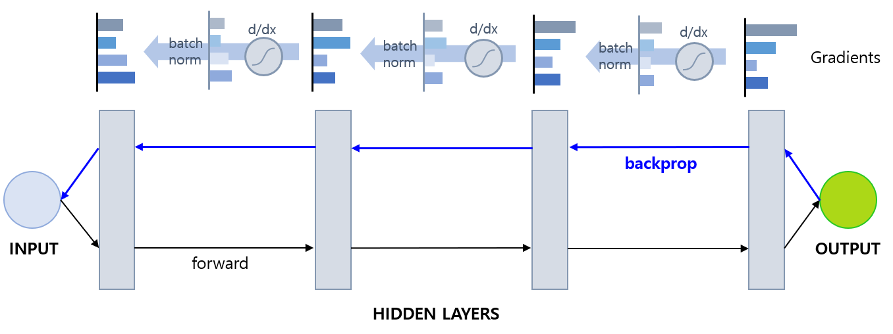

## 목차
* [1. Reguarization 이란? 그 목적은?](#1-regularization-이란-그-목적은)
* [2. L1, L2 Regularization](#2-l1-l2-regularization)
  * [2-1. Elastic Net = L1 + L2](#2-1-elastic-net--l1--l2) 
* [3. Gradient Vanishing](#3-gradient-vanishing)
* [4. Batch/Layer Normalization](#4-batchlayer-normalization)
  * [4-1. Batch Normalization](#4-1-batch-normalization) 
  * [4-2. Layer Normalization](#4-2-layer-normalization)
* [5. 탐구: 어떤 정규화가 가장 좋을까?](#5-탐구-어떤-정규화가-가장-좋을까)
  * [5-1. 실험 설계](#5-1-실험-설계) 
  * [5-2. 실험 결과](#5-2-실험-결과) 

## 코드

## 1. Regularization 이란? 그 목적은?

딥러닝에서 **Regularization (정규화)** 란, **[오버피팅](딥러닝_기초_Overfitting_Dropout.md) 방지를 위한 일종의 규제** 를 의미한다.

오버피팅을 방지하기 위해서 validation dataset에서의 loss가 가장 낮은 (=좋은) 기록이 5회의 epoch 이상 갱신되지 않는 등 특정 조건을 만족시킬 때 **학습 조기 종료 (Early Stopping)** 를 할 수 있는데, 이것 역시 정규화의 일종이다.

## 2. L1, L2 Regularization

L1, L2 Regularization은 **loss function의 값에 weight의 크기를 더해 주는 방식**의 정규화이다.

기존 loss function의 값이 $L_0$일 때, L1, L2 정규화에 의한 새로운 loss function의 수식은 다음과 같다. (w = weight)

* L1 Regularization
  * $L = L_0 + \displaystyle \frac{\lambda}{n} \sum_{w} |w|$

* L2 Regularization
  * $L = L_0 + \displaystyle \frac{\lambda}{n} \sum_{w} w^2$

* 상수 $\lambda$ 의 의미
  * L1, L2 Regularization 의 정도를 조절하는 역할
  * 너무 작으면 Regularization 의 효과 감소


* 위 그림에서 연두색 영역은 **w1, w2 의 값이 가능한 영역, 즉 규제 영역** 을 의미하며, **w1, w2 는 해당 영역을 벗어날 수 없다.**

이와 같은 정규화를 통해서 다음과 같은 효과를 얻을 수 있다.

| 정규화    | 요약                 | 상세                                                                                                                                                                                                           |
|--------|--------------------|--------------------------------------------------------------------------------------------------------------------------------------------------------------------------------------------------------------|
| L1 정규화 | 중요한 weight 들만 유지   | **의미 있는 몇 개의 값이 중요한 역할을 하는 경우** 에 적용하면 좋음<br>- 손실함수를 미분하면 weight 부분은 실제 weight의 값에 관계없이 **절댓값이 일정하고 부호만 남아 있는 상수**가 됨<br>- 가중치를 갱신할 때 이 값을 빼게 되므로, 신경망의 weight 값들 중 작은 값들은 0이 되고, **큰 (중요한) weight 들만 남게** 됨 |
| L2 정규화 | 가중치 절대 크기 매우 커짐 방지 | **weight의 절댓값을 제어하여 overfitting 방지**<br>- 가중치 갱신 시 weight 값이 클수록 손실함수의 값에 이에 비례하는 큰 영향<br> - 따라서 특정 가중치가 매우 커지는 것을 방지 가능                                                                                     |

* L1, L2 정규화는 **weight 을 모델의 예측값으로 바꾸면**, [Loss Function](딥러닝_기초_Loss_function.md) 중 각각 **Mean Squared Error, Mean Absolute Error** 와 관련 있다.

### 2-1. Elastic Net = L1 + L2


위와 같이 L1, L2 정규화를 합성하여 적용할 수도 있다. 이것을 **Elastic Net** 이라고 한다.

## 3. Gradient Vanishing

**Gradient Vanishing** 이란, 딥러닝 모델의 역전파 과정에서 **입력층에 가까워질수록 gradient의 값이 0에 가까워져서 학습이 잘 되지 않는 현상** 을 말한다.

* Gradient 의 값이 매우 감소하기 때문에 학습 속도가 자연스럽게 느려진다.

Gradient Vanishing의 원인은 일반적으로 **[활성화 함수](딥러닝_기초_활성화_함수.md)** 때문이다. **활성화 함수의 미분값이 1 미만** 인 경우, 역전파 과정에서 이 값이 계속 곱해지면서 입력층에 가까워질 때는 gradient가 0에 가까워지는 것이다.
* 딥러닝에서 많이 쓰이는 sigmoid 함수의 경우, 미분값의 최댓값은 x=0에서 0.25에 불과하다.
* tanh 함수는 미분값이 x=0에서 1로 최대이지만, x가 0이 아닐 때는 미분값으로 1보다 훨씬 작은 값을 갖는다.


Gradient Vanishing의 해결 방법은 다음과 같다.
* 특정 범위에서 미분값이 항상 1인 활성화 함수인 **ReLU = max(0, x)** 또는 **Leaky ReLU = max(0.05x, x)** 등을 사용한다.
* [Batch Normalization](#4-1-batch-normalization) 을 사용한다.

## 4. Batch/Layer Normalization

**overfitting 을 방지** 하기 위한 대표적인 방법으로 **Normalization** 이 있다. Normalization 은 **Batch Normalization 과 Layer Normalization** 으로 구분된다.

* 둘 모두 **레이어 단위** 로 적용된다.

| 구분                  | 설명                                                                      |
|---------------------|-------------------------------------------------------------------------|
| Batch Normalization | 특정 레이어에 대해, 한 batch 내에서 **동일한 위치의 feature 의 값** 끼리 Normalization        |
| Layer Normalization | 특정 레이어에 대해, 각 sample 마다 **그 sample 내의 모든 feature 값** 에 대해 Normalization |


### 4-1. Batch Normalization

**Batch Normalization** 이란, 전체 데이터셋이 아닌 그 데이터셋을 나눈 **작은 학습 단위인 Batch** 에 대해, **신경망 자체적으로** 그 평균과 분산을 이용하여 정규화하는 것이다.
* 각 레이어마다 **Normalization Layer** 를 따로 두어서 분포가 변형되지 않게 한다.



배치 정규화를 통해 다음과 같은 효과를 얻을 수 있다.
* **Gradient vanishing 등을 방지**하여 안정적으로 학습할 수 있게 한다.
* 평균과 분산이 각 batch마다 달라지기 때문에 특정 weight가 매우 커지는 것을 방지할 수 있다.

### 4-2. Layer Normalization

**Layer Normalization** 은 Batch Normalization 과 달리 **같은 sample 의 모든 feature 에 대한 평균 및 표준편차** 를 이용하여 정규화하는 것을 이용한다.

* Batch Normalization 과 마찬가지로 Normalization Layer 를 따로 둔다.
* 역시 Gradient Vanishing을 방지할 수 있다.

Batch Normalization 과 비교한 Layer Normalization 의 장점은 다음과 같다.

* batch size가 작을 때도 안정적인 결과가 나온다.
* [Recurrent Neural Network (RNN)](../../Natural%20Language%20Processing/Basics_RNN과%20LSTM,%20GRU.md#rnn이란) 을 NLP 에 사용할 때, Normalization 대상 데이터 개수가 고정되어 있어서 더 효과적이다.

## 5. 탐구: 어떤 정규화가 가장 좋을까?

**실험 목표**
* L1, L2 Regularization, Batch/Layer Normalization 중 어떤 것의 효과가 가장 큰지 알아본다.
* 적용할 Regularization의 종류 및 관련 상수, learning rate를 하이퍼파라미터로 하여, MNIST 데이터셋을 대상으로 하이퍼파라미터 최적화를 실험한다.

### 5-1. 실험 설계

**데이터셋**

* **MNIST 숫자 이미지 분류 데이터셋 (train 60K / test 10K)**
  * 10 개의 Class 가 있는 Classification Task
  * 학습 시간 절약을 위해, train dataset 중 일부만을 샘플링하여 학습
* 선정 이유
  * 데이터셋이 28 x 28 size 의 작은 이미지들로 구성
  * 이로 인해 비교적 간단한 신경망을 설계할 수 있으므로, 간단한 딥러닝 실험에 적합하다고 판단
* 데이터셋 분리
  * 학습 데이터 양이 **조금 부족해야 Regularization 을 통한 오버피팅 방지 효과에 따른 성능 변별** 이 보다 잘 될 것으로 판단

| 학습 데이터  | Valid 데이터 (Epoch 단위) | Valid 데이터 (Trial 단위) | Test 데이터          |
|---------|----------------------|----------------------|-------------------|
| 1,000 장 | 2,000 장              | 5,000 장              | 10,000 장 (원본 그대로) |

**성능 Metric**

* **Accuracy**
* 선정 이유
  * Accuracy 로 성능을 측정해도 될 정도로, [각 Class 간 데이터 불균형](../Data%20Science%20Basics/데이터_사이언스_기초_데이터_불균형.md) 이 적음 

**신경망 구조**

```python
# 신경망 구조 출력 코드

from torchinfo import summary

model = CNN()
print(summary(model, input_size=(BATCH_SIZE, 1, 28, 28)))
```


* [활성화 함수](딥러닝_기초_활성화_함수.md) 는 다음과 같이 사용

| Conv. Layers | Fully Connected Layer | Final Layer |
|--------------|-----------------------|-------------|
| ReLU only    | Sigmoid               | Softmax     |

* [Dropout](딥러닝_기초_Overfitting_Dropout.md#3-dropout) 미 적용
* Early Stopping Rounds = 5 로 고정 (5 epoch 동안 valid set 성능 갱신 없으면 종료)
* Optimizer 는 [Adam](딥러닝_기초_Optimizer.md#2-2-adam) 를 사용
  * 여기에 weight decay 항을 추가한 [AdamW](딥러닝_기초_Optimizer.md#2-3-adamw) 가 [동일 데이터셋을 대상으로 한 성능 실험](딥러닝_기초_Optimizer.md#3-탐구-어떤-optimizer-가-적절할까) 에서 최상의 정확도를 기록했기 때문
  * 그러나, **L2 Regularization 의 효과를 측정하기 위해 weight decay 를 0으로 고정** 했으므로, AdamW 의 Adam 에 비한 개선점이 희석됨

**상세 학습 방법**

* 다음과 같이 하이퍼파라미터 최적화를 실시하여, **최적화된 하이퍼파라미터를 기준으로 한 성능을 기준** 으로 최고 성능의 Optimizer 를 파악
  * L1, L2 Regularization 적용 여부
    * Regularization 미 적용
    * 모든 레이어에 L1 Regularization 적용
    * 모든 레이어에 L2 Regularization 적용
    * 모든 레이어에 L1 + L2 = Elastic Net 적용
  * L1, L2 Regularization 에 적용할 $\lambda$ 값
    * 탐색 범위 : 0.000001 ~ 0.01 (= 1e-6 ~ 1e-2)
  * 모든 Conv. + Fully Connected Layer (총 4개) 에 적용할 Normalization
    * Normalization 미 적용
    * Batch Normalization 적용
    * Layer Normalization 적용
      * 이때 Conv. Layer 의 경우, 모든 channel 을 하나로 묶어서 Layer Normalization 실시 
  * learning rate
    * 탐색 범위 : 0.0005 ~ 0.01 (= 5e-4 ~ 1e-2)

* 하이퍼파라미터 최적화
  * [하이퍼파라미터 최적화 라이브러리](../Machine%20Learning%20Models/머신러닝_방법론_HyperParam_Opt.md#4-하이퍼파라미터-최적화-라이브러리) 중 Optuna 를 사용
  * 하이퍼파라미터 탐색 200 회 반복 (= 200 Trials) 실시

### 5-2. 실험 결과

**1. 실험 결론**

실험 진행중

**2. 하이퍼파라미터 최적화 진행에 따른 정확도 추이**

**3. 각 하이퍼파라미터의 값에 따른 성능 분포**
