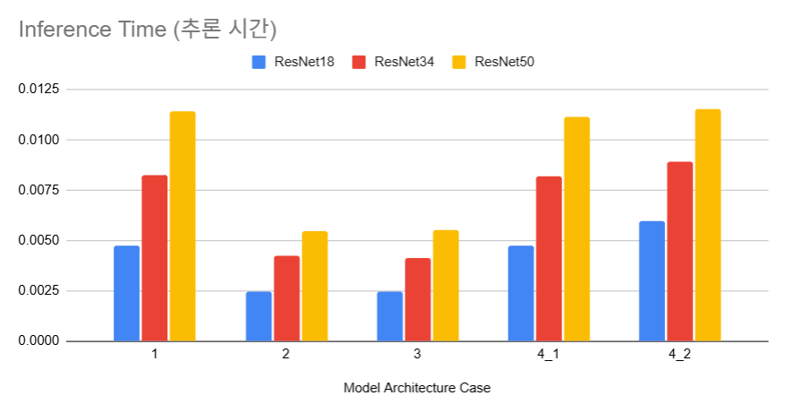

## 목차

* [1. Shared Backbone & Shared Head 개요](#1-shared-backbone--shared-head-개요)
* [2. 구조 비교](#2-구조-비교)
* [3. 탐구: 어떤 구조가 가장 좋을까?](#3-탐구-어떤-구조가-가장-좋을까)
  * [3-1. 실험 설계](#3-1-실험-설계)
  * [3-2. 실험 결과](#3-2-실험-결과)
  * [3-3. 실험 결과에 대한 이유 분석](#3-3-실험-결과에-대한-이유-분석)

## 코드

* [가장 적절한 모델 구조 실험](#3-탐구-어떤-구조가-가장-좋을까) 코드

| 실험    | ipynb 코드                                                  | 결과 csv 파일                               |
|-------|-----------------------------------------------------------|-----------------------------------------|
| 1차 실험 | [ipynb 코드](codes/Shared_Backbone_Head_experiment_1.ipynb) | [결과 csv](codes/result_experiment_1.csv) |
| 2차 실험 | [ipynb 코드](codes/Shared_Backbone_Head_experiment_2.ipynb) | [결과 csv](codes/result_experiment_2.csv) |

## 1. Shared Backbone & Shared Head 개요

딥러닝 모델의 구조에서 **Shared Backbone** 과 **Shared Head** 는 각각 다음을 의미한다.

| 용어              | 설명                                         |
|-----------------|--------------------------------------------|
| Shared Backbone | 모델 학습 시 **여러 task 에 대해 backbone을 공유** 하는 것 |
| Shared Head     | 모델 학습 시 **여러 개의 분류/회귀 head를 공유** 하는 것      |

본 문서에서는 Shared Backbone, Shared Head 가 아닌 경우를 각각 **Splitted Backbone, Splitted Head** 로 칭한다.

## 2. 구조 비교

딥러닝 모델은 Shared Backbone & Shared Head 각각의 적용 여부에 따라 다음과 같이 5가지 구조로 나눌 수 있다.


| 구조    | Shared Backbone | Shared Head | 기타 특징              |
|-------|-----------------|-------------|--------------------|
| (1)   | X               | O           |                    |
| (2)   | O               | O           |                    |
| (3)   | O               | X           |                    |
| (4)-1 | X               | X           | MLP 부분 공유          |
| (4)-2 | X               | X           | 개별 모델, MLP 부분 비 공유 |

## 3. 탐구: 어떤 구조가 가장 좋을까?

### 3-1. 실험 설계

* 실험 개요
  * 위 5가지 구조 중 **가장 좋은 구조가 무엇인지** 를 **성능 & inference time** 기준으로 측정 
* task
  * MNIST Full Dataset 에서 **0, 1, 2 숫자 이미지 분류**
  * 위 5가지 구조 이미지에 나타난 분류 기준 (예: ```0,1 vs. 2```) 을 그대로 적용
* 실험 대상 모델

| 구분       | 설명                                           |
|----------|----------------------------------------------|
| backbone | ```ResNet18``` ```ResNet34``` ```ResNet50``` |
| 모델 구조    | 위 5가지 구조 각각 실험                               |

* 정확도 판정 방식

| 구조    | Shared Backbone | Shared Head | 정확도 판정 방식 (실험 1)                | 정확도 판정 방식 (실험 2)           |
|-------|-----------------|-------------|---------------------------------|----------------------------|
| (1)   | X               | O           | Head 의 3가지 Class 의 단순 예측 정확도    | 좌동                         |
| (2)   | O               | O           | Head 의 3가지 Class 의 단순 예측 정확도    | 좌동                         |
| (3)   | O               | X           | 각 Head 의 2가지 Class 의 예측 정확도의 평균 | 2개의 Head 모두 정확히 예측해야 정답 처리 |
| (4)-1 | X               | X           | 각 Head 의 2가지 Class 의 예측 정확도의 평균 | 2개의 Head 모두 정확히 예측해야 정답 처리 |
| (4)-2 | X               | X           | 각 Head 의 2가지 Class 의 예측 정확도의 평균 | 2개의 Head 모두 정확히 예측해야 정답 처리 |

### 3-2. 실험 결과

* **실험 결과 요약**
  * **Splitted Head & Backbone 인 (4)-1** 이 다른 case 들에 비해 정확도가 소폭 높은 편
  * 추론 시간은 **모델의 크기가 크고 (ResNet50 등), Splitted Backbone** 인 경우에 오래 걸림
  * 정확도와 추론 시간의 trade-off 를 고려할 때, 본 실험 결과만으로는 **(3) 과 같은 모델 구조를 적용** 하는 것이 최선으로 판단 

* **실험 1 결과**
  * **Splitted Head** 인 **(3), (4)-1, (4)-2** 의 경우, **각 Head의 2가지 Class의 예측 정확도 평균** 사용

| 구분        | 실험 결과                                | 결과 요약                                                                                                         |
|-----------|--------------------------------------|---------------------------------------------------------------------------------------------------------------|
| 정확도       |  | - **Splitted Backbone** 이 Shared backbone 보다 정확도 **소폭 높음**<br>- **Splitted Head** 가 Shared Head 보다 정확도 **높음** |
| 추론 시간 (초) |  | - **Shared Backbone** 이 Splitted Backbone 보다 **2배 정도 빠름**<br>- backbone 모델 자체가 클수록, 추론 시간이 이에 비례하여 증가         |

* **실험 2 결과**
  * **Splitted Head** 인 **(3), (4)-1, (4)-2** 의 경우, **2개의 Head 모두 정확히 예측해야 정답 처리되는 정확도** 사용

| 구분        | 실험 결과                                | 결과 요약                                                                                                |
|-----------|--------------------------------------|------------------------------------------------------------------------------------------------------|
| 정확도       |  | - Splitted/Shared Backbone 간 정확도 차이 **거의 없음**<br>- **Splitted Head & Backbone 인 (4)-1** 이 정확도 **높음** |

### 3-3. 실험 결과에 대한 이유 분석

**1. Splitted Head & Backbone 인 (4)-1 이 다른 case 들에 비해 정확도가 소폭 높은 편**

* Backbone 이 Split 된 상태에서 공통의 MLP로 연결되고, 서로 Split 된 Head 로 연결
* 정확도가 높은 이유 추정
  * **Backbone 이 서로 분리** 되어 있어서 더 다양한 특징을 학습 가능
  * **Head 가 서로 분리** 되어 있어서 **3개의 class를 한번에 분류가 아닌, 각각 독립적인 head에서 이진 분류** 를 하므로, 분류 특징 최적화 가능

**2. 추론 시간은 모델의 크기가 크고 (ResNet50 등), Splitted Backbone인 경우에 오래 걸림**

* 모델의 크기가 클수록 당연히 추론 시간이 오래 걸림
* Splitted Backbone 인 경우 처리해야 할 backbone 이 **1개가 아닌 2개** 이기 때문에 그만큼 오래 소요
