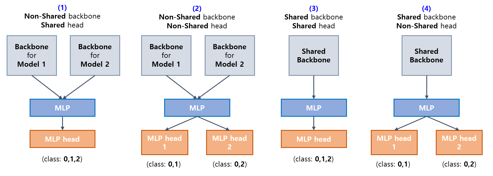
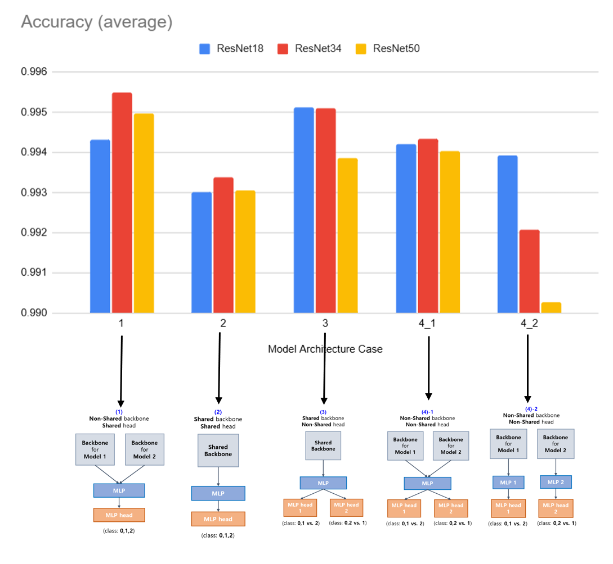
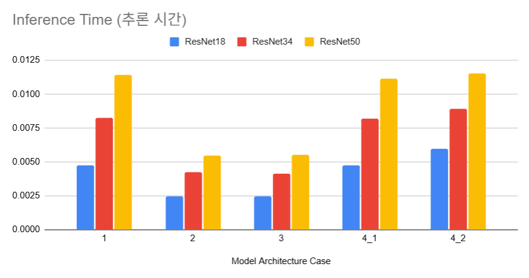
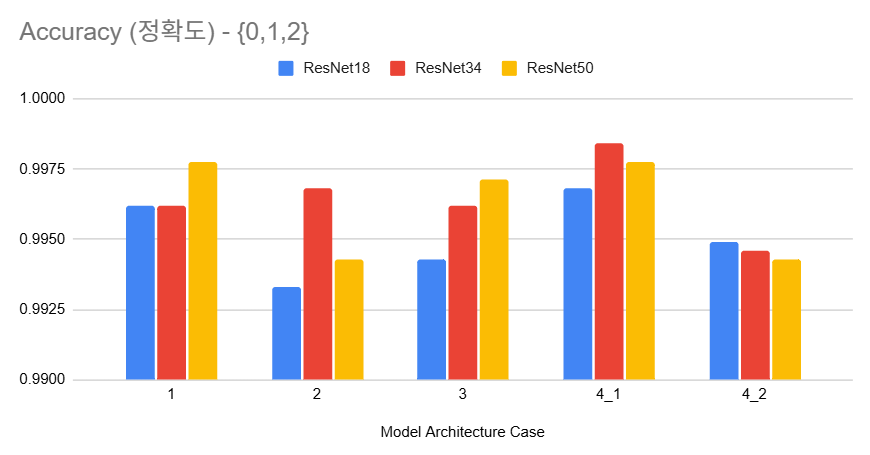
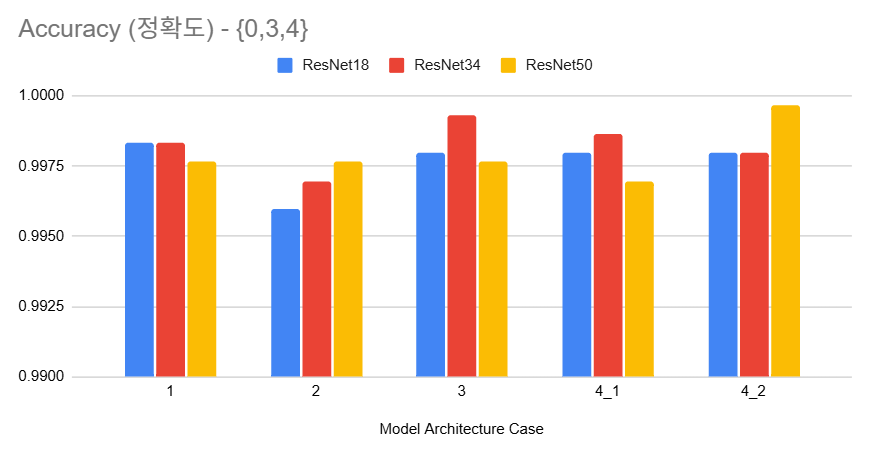
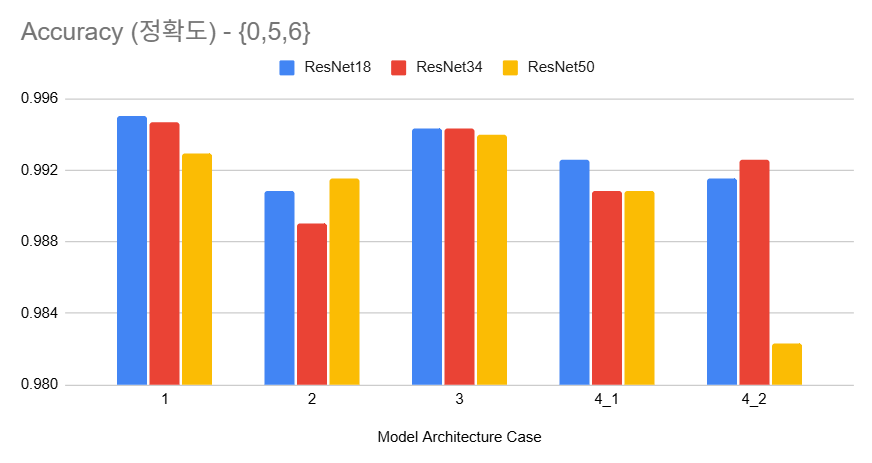
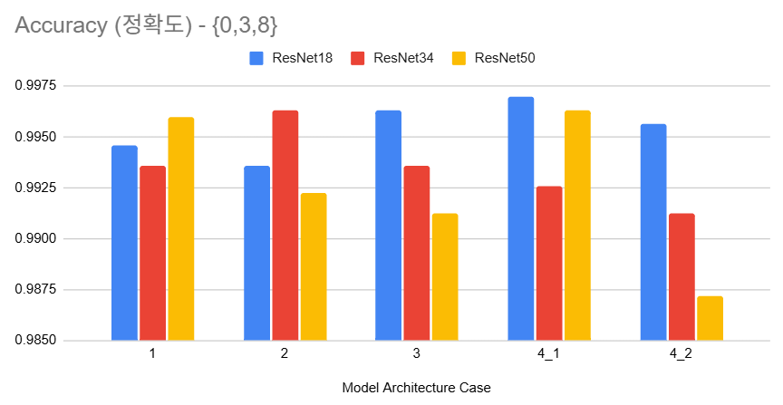
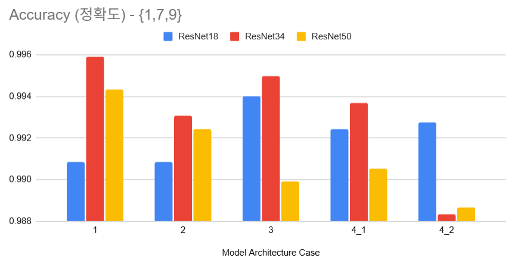

## 목차

* [1. 개요](#1-개요)
* [2. 모델 구조 비교](#2-모델-구조-비교)
* [3. 실험 결과](#3-실험-결과)
  * [3-1. 0,1,2 외의 서로 다른 숫자 조합 실험](#3-1-012-외의-서로-다른-숫자-조합-실험) 
  * [3-2. 데이터셋 크기에 따른 실험](#3-2-데이터셋-크기에-따른-실험)
  * [3-3. Learning Rate 에 따른 실험 (작은 데이터셋)](#3-3-learning-rate-에-따른-실험-작은-데이터셋)

## 코드

| 실험                | ipynb 코드                                                    | 결과 csv 파일                                               |
|-------------------|-------------------------------------------------------------|---------------------------------------------------------|
| ```0,3,4``` 조합 실험 | [ipynb 코드](codes/Shared_Backbone_Head_experiment_034.ipynb) | [결과 csv](codes/Shared_Backbone_Head_experiment_034.csv) |
| ```0,5,6``` 조합 실험 | [ipynb 코드](codes/Shared_Backbone_Head_experiment_056.ipynb) | [결과 csv](codes/Shared_Backbone_Head_experiment_056.csv) |
| ```6,8,9``` 조합 실험 | [ipynb 코드](codes/Shared_Backbone_Head_experiment_689.ipynb) | [결과 csv](codes/Shared_Backbone_Head_experiment_689.csv) |
| ```0,3,8``` 조합 실험 | [ipynb 코드](codes/Shared_Backbone_Head_experiment_038.ipynb) | [결과 csv](codes/Shared_Backbone_Head_experiment_038.csv) |
| ```1,7,9``` 조합 실험 | [ipynb 코드](codes/Shared_Backbone_Head_experiment_179.ipynb) | [결과 csv](codes/Shared_Backbone_Head_experiment_179.csv) |

## 1. 개요

* [Shared Backbone / Shared Head 문서](딥러닝_기초_Shared_Backbone_Head.md) 에서 진행한, **어떤 모델 구조가 최적인지** 에 대한 [실험](딥러닝_기초_Shared_Backbone_Head.md#3-탐구-어떤-구조가-가장-좋을까) 을 추가 진행

## 2. 모델 구조 비교



* [해당 문서](딥러닝_기초_Shared_Backbone_Head.md#2-구조-비교) 참고.

## 3. 실험 결과

* 실험 결과 요약
  * TBU 

### 3-1. 0,1,2 외의 서로 다른 숫자 조합 실험

**1. 전체 결과 요약**

* 실험 결과 요약
  * 본 실험 결과만을 고려할 때, **(3) Shared backbone & Non-Shared head** 가 정확도 및 추론 시간의 양 측면에서 최선의 선택

* 전체 조합 정확도 평균

* 각 조합 별 정확도 및 inference 시간 평균

| 구분                                                            | 그래프                                   |
|---------------------------------------------------------------|---------------------------------------|
| 정확도                                                           |  |
| inference 시간 [(참고)](딥러닝_기초_Shared_Backbone_Head.md#3-2-실험-결과) |   |

**2. 개별 케이스 실험 결과**

* 조합 ```{0,1,2}```



* 조합 ```{0,3,4}```



* 조합 ```{0,5,6}```



* 조합 ```{6,8,9}```


* 조합 ```{0,3,8}```



* 조합 ```{1,7,9}```



### 3-2. 데이터셋 크기에 따른 실험

### 3-3. Learning Rate 에 따른 실험 (작은 데이터셋)