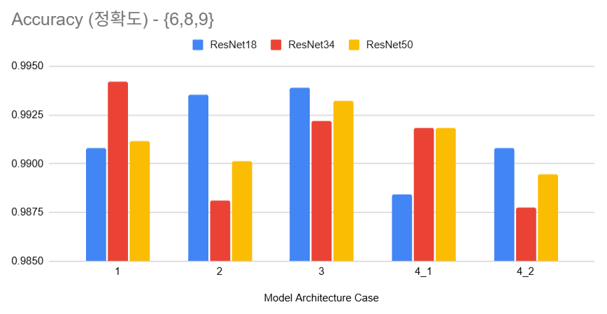

## 목차

* [1. 개요](#1-개요)
* [2. 모델 구조 비교](#2-모델-구조-비교)
* [3. 실험 결과](#3-실험-결과)
  * [3-1. 0,1,2 외의 서로 다른 숫자 조합 실험](#3-1-012-외의-서로-다른-숫자-조합-실험) 
  * [3-2. 데이터셋 크기에 따른 실험](#3-2-데이터셋-크기에-따른-실험)
  * [3-3. Learning Rate 에 따른 실험 (작은 데이터셋)](#3-3-learning-rate-에-따른-실험-작은-데이터셋)

## 코드

| 실험                   | ipynb 코드                                                                                     | 결과 csv 파일                                                 |
|----------------------|----------------------------------------------------------------------------------------------|-----------------------------------------------------------|
| ```0,3,4``` 조합 실험    | [ipynb 코드](codes/Shared_Backbone_Head_experiment_034.ipynb)                                  | [결과 csv](codes/Shared_Backbone_Head_experiment_034.csv)   |
| ```0,5,6``` 조합 실험    | [ipynb 코드](codes/Shared_Backbone_Head_experiment_056.ipynb)                                  | [결과 csv](codes/Shared_Backbone_Head_experiment_056.csv)   |
| ```6,8,9``` 조합 실험    | [ipynb 코드](codes/Shared_Backbone_Head_experiment_689.ipynb)                                  | [결과 csv](codes/Shared_Backbone_Head_experiment_689.csv)   |
| ```0,3,8``` 조합 실험    | [ipynb 코드](codes/Shared_Backbone_Head_experiment_038.ipynb)                                  | [결과 csv](codes/Shared_Backbone_Head_experiment_038.csv)   |
| ```1,7,9``` 조합 실험    | [ipynb 코드](codes/Shared_Backbone_Head_experiment_179.ipynb)                                  | [결과 csv](codes/Shared_Backbone_Head_experiment_179.csv)   |
| 데이터셋 크기에 따른 실험       | [ipynb 코드](codes/Shared_Backbone_Head_experiment_3/Shared_Backbone_Head_experiment_3.ipynb)  | [결과 csv 디렉토리](codes/Shared_Backbone_Head_experiment_3)    |
| Learning Rate에 따른 실험 | [ipynb 코드](codes/Shared_Backbone_Head_experiment_3_lr/Shared_Backbone_Head_experiment.ipynb) | [결과 csv 디렉토리](codes/Shared_Backbone_Head_experiment_3_lr) |

## 1. 개요

* [Shared Backbone / Shared Head 문서](딥러닝_기초_Shared_Backbone_Head.md) 에서 진행한, **어떤 모델 구조가 최적인지** 에 대한 [실험](딥러닝_기초_Shared_Backbone_Head.md#3-탐구-어떤-구조가-가장-좋을까) 을 추가 진행

## 2. 모델 구조 비교


* [해당 문서](딥러닝_기초_Shared_Backbone_Head.md#2-구조-비교) 참고.

## 3. 실험 결과

* 실험 결과 요약

| 실험                                                                    | 실험 결과 요약                                                                                                                   | 정확도 최고 / 최저 아키텍쳐                                               |
|-----------------------------------------------------------------------|----------------------------------------------------------------------------------------------------------------------------|----------------------------------------------------------------|
| [0,1,2 외의 서로 다른 숫자 조합 실험](#3-1-012-외의-서로-다른-숫자-조합-실험)                 | **(3) Shared backbone & Non-Shared head** 가 정확도 및 추론 시간 고려 시 최선의 선택                                                        | - 최고: **(1), (3)**<br>- 최저: **(4)-2**                          |
| [데이터셋 크기에 따른 실험](#3-2-데이터셋-크기에-따른-실험)                                 | **(1) Non-Shared backbone & Shared head** 의 정확도가 가장 높음                                                                     | - 최고: **(1)**<br>- 최저: **(4)-2**                               |
| [Learning Rate 에 따른 실험 (작은 데이터셋)](#3-3-learning-rate-에-따른-실험-작은-데이터셋) | - 전체적으로는 **(1) (2)** 아키텍쳐의 정확도가 가장 높음<br>- learning rate 가 클 때는 **(2) Shared** backbone & **Shared** head 아키텍쳐의 정확도가 가장 높음 | - 최고: **(2)**<br>(learning rate 가 클수록 **(1)** 과의 정확도 차이가 두드러짐) |

### 3-1. 0,1,2 외의 서로 다른 숫자 조합 실험

**1. 전체 결과 요약**

* 실험 결과 요약
  * 본 실험 결과만을 고려할 때, **(3) Shared backbone & Non-Shared head** 가 '정확도' 및 '추론 시간'의 양 측면에서 최선의 선택
  * 정확도가 중요한 경우, 차선책으로는 **(1) Non-Shared backbone & Shared head** 를 선택할 수 있음

* 각 조합 별 정확도 및 inference 시간 평균

| 구분                                                               | 그래프                                   | 최고/최저 케이스                                     |
|------------------------------------------------------------------|---------------------------------------|-----------------------------------------------|
| 정확도                                                              |  | - 최고 정확도: **(1), (3)**<br>- 최저 정확도: **(4)-2** |
| inference 시간<br>[(참고)](딥러닝_기초_Shared_Backbone_Head.md#3-2-실험-결과) |   | 추론 속도는 **(2), (3) > (나머지 3개)** 순으로 빠름         |

* 각 숫자 조합 별 정확도 평균

| 그래프                                   | 최고/최저 정확도 케이스                              |
|---------------------------------------|--------------------------------------------|
|  | - 최고: ```(0,3,4)```<br>- 최저: ```(6,8,9)``` |

**2. 개별 케이스 실험 결과**

* 조합 ```{0,1,2}```

| 그래프                                  | 최고 정확도 케이스                                                                |
|--------------------------------------|---------------------------------------------------------------------------|
|  | **(4)-1** with **ResNet34**<br>- Non-Shared backbone<br>- Non-Shared head |

* 조합 ```{0,3,4}```

| 그래프                                  | 최고 정확도 케이스                                                                |
|--------------------------------------|---------------------------------------------------------------------------|
|  | **(4)-2** with **ResNet50**<br>- Non-Shared backbone<br>- Non-Shared head |

* 조합 ```{0,5,6}```

| 그래프                                  | 최고 정확도 케이스                                                          |
|--------------------------------------|---------------------------------------------------------------------|
|  | **(1)** with **ResNet18**<br>- Non-Shared backbone<br>- Shared Head |

* 조합 ```{6,8,9}```

| 그래프                                  | 최고 정확도 케이스                                                          |
|--------------------------------------|---------------------------------------------------------------------|
|  | **(1)** with **ResNet34**<br>- Non-Shared backbone<br>- Shared Head |

* 조합 ```{0,3,8}```

| 그래프                                  | 최고 정확도 케이스                                                                |
|--------------------------------------|---------------------------------------------------------------------------|
|  | **(4)-1** with **ResNet18**<br>- Non-Shared backbone<br>- Non-Shared head |

* 조합 ```{1,7,9}```

| 그래프                                   | 최고 정확도 케이스                                                          |
|---------------------------------------|---------------------------------------------------------------------|
|  | **(1)** with **ResNet34**<br>- Non-Shared backbone<br>- Shared Head |

### 3-2. 데이터셋 크기에 따른 실험

* 실험 개요
  * 위 [0,1,2 외의 서로 다른 숫자 조합 실험](#3-1-012-외의-서로-다른-숫자-조합-실험) 에서 조합 ```{6,8,9}``` 로 실험
  * 모델 아키텍쳐 (```(1)``` ```(2)``` ```(3)``` ```(4)-1``` ```(4)-2```) 와 ResNet 종류 조합은 동일
  * **학습 데이터 규모를 10K 이하로 줄여서** 테스트

* 실험 결과 요약
  * 본 실험 결과만을 고려할 때, **(1) Non-Shared backbone & Shared head** 가 '정확도' 측면에서 최선의 선택
  * 단, 조합 케이스가 1가지뿐이므로, **실험의 신뢰성을 높이려면 다른 조합에 대한 실험 필요**

* train dataset size 에 따른 각 Architecture 의 정확도 변화

| 그래프                                   | 최고/최저 정확도 케이스                                                                                                              |
|---------------------------------------|----------------------------------------------------------------------------------------------------------------------------|
|  | 최고:<br>- **(1) Non-Shared** backbone & **Shared** head<br><br>최저:<br>- **(4)-2 Non-Shared** backbone & **Non-Shared** head |

* train dataset size 구간에 따른 각 Architecture 의 정확도 평균

| 그래프                                   | 최고/최저 정확도 케이스                                                                                                              |
|---------------------------------------|----------------------------------------------------------------------------------------------------------------------------|
|  | 최고:<br>- **(1) Non-Shared** backbone & **Shared** head<br><br>최저:<br>- **(4)-2 Non-Shared** backbone & **Non-Shared** head |

### 3-3. Learning Rate 에 따른 실험 (작은 데이터셋)

* 실험 개요
  * 위 [0,1,2 외의 서로 다른 숫자 조합 실험](#3-1-012-외의-서로-다른-숫자-조합-실험) 에서 조합 ```{6,8,9}``` 로 실험 (단, 학습 데이터 **4,000 개**)
  * 모델 아키텍쳐 (```(1)``` ```(2)``` ```(3)``` ```(4)-1``` ```(4)-2```) 와 ResNet 종류 조합은 동일
  * **Learning Rate 를 기존 1e-4 에서 늘려서** 테스트

* 실험 결과 요약
  * 본 실험 결과만을 고려할 때, **(1) Non-Shared backbone & Shared head** 가 '정확도' 측면에서 최선의 선택
  * 단, 조합 케이스가 1가지뿐이므로, **실험의 신뢰성을 높이려면 다른 조합에 대한 실험 필요**

* train dataset size 에 따른 각 Architecture 의 정확도 변화

| 그래프                                   | 최고/최저 정확도 케이스                                                                                               |
|---------------------------------------|-------------------------------------------------------------------------------------------------------------|
|  | 최고:<br>- 전체적으로는 불분명<br>- learning rate 가 클 때는 **(2) Shared** backbone & **Shared** head<br><br>최저:<br>- 불분명 |

* train dataset size 구간에 따른 각 Architecture 의 정확도 평균

| 그래프                                   | 최고/최저 정확도 케이스                                                          |
|---------------------------------------|------------------------------------------------------------------------|
|  | 최고:<br>- **(2) Shared** backbone & **Shared** head<br><br>최저:<br>- 불분명 |
