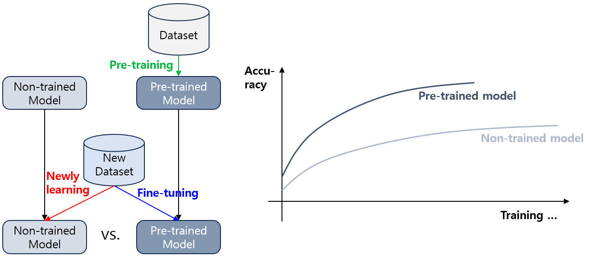
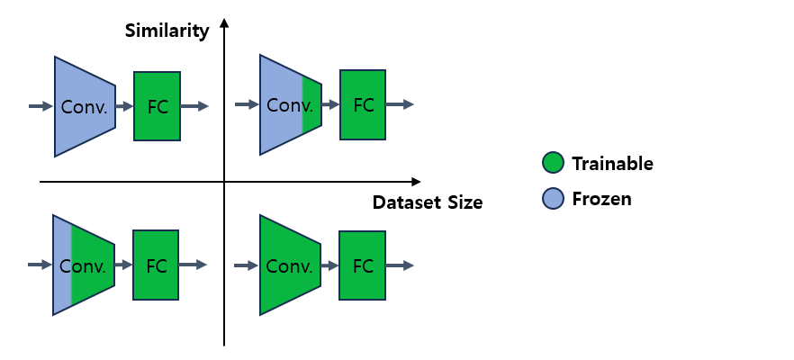

## 목차
* [1. Transfer Learning (전이학습)](#1-transfer-learning-전이학습)
* [2. Transfer Learning 의 Freeze 전략](#2-transfer-learning-의-freeze-전략)
* [3. Transfer Learning 의 과정](#3-transfer-learning-의-과정)
  * [3-1. 사전 학습 (Pre-training)](#3-1-사전-학습-pre-training)
  * [3-2. 미세 조정 (Fine-tuning)](#3-2-미세-조정-fine-tuning)

## 1. Transfer Learning (전이학습)

**Transfer Learning (전이학습)** 은 어떤 데이터셋을 통해 이미 **사전 학습 (pre-train)** 된 모델을 **다른 데이터셋** 또는 해당 모델을 적용 가능한 **다른 task** 에 적용시키는 것을 의미한다.

* 모델을 처음부터 학습하는 것보다는 **기존 학습된 가중치가 있는 모델을 사용** 함으로써 **목표 성능을 비교적 빠르게** 달성할 수 있다는 장점이 있다.

특히 이미지를 처리하는 컴퓨터 비전 (Vision) 문제에서 전이 학습의 효과가 좋은 것으로 알려져 있다.

## 2. Transfer Learning 의 Freeze 전략

전이 학습의 일반적인 전략은 **현재 가지고 있는 dataset 의 규모** 및 **Pre-trained 데이터셋과의 유사성** 에 따라 다음과 같다.

* 요약하자면, **유사성이 클수록 (1순위) + 데이터셋이 작을수록 (2순위)** Conv. Layer 의 많은 부분을 Freeze 시킨 채로 전이학습 한다.
* Freeze 는 **해당 부분의 가중치를 고정시키는,** 즉 해당 부분을 추가적으로 학습하지 않는 것을 의미한다.

|                | Pre-trained dataset 과 유사                             | Pre-trained dataset 과 다름                            |
|----------------|------------------------------------------------------|-----------------------------------------------------|
| **큰** 데이터셋 보유  | CNN 의 경우 **Conv. Layer 의 대부분**을 Freeze 한 채로 전이학습 한다. | 모델 전체를 추가적으로 전이학습 한다.                               |
| **작은** 데이터셋 보유 | CNN 의 경우 **Conv. Layer 의 전체**를 Freeze 한 채로 전이학습 한다.  | CNN 의 경우 **Conv. Layer 의 일부**를 Freeze 한 채로 전이학습 한다. |

## 3. Transfer Learning 의 과정

Transfer Learning 은 **사전 학습 (Pre-training)** 과 **미세 조정 (Fine-tuning)** 의 과정으로 이루어진다.

| 과정                   | 설명                                             |
|----------------------|------------------------------------------------|
| 사전 학습 (Pre-training) | 큰 규모의 데이터셋을 이용하여 모델 학습                         |
| 미세 조정 (Fine-tuning)  | 학습된 모델을 task 에 최적화된 작은 데이터셋을 이용하여 추가 학습을 통해 조정 |

### 3-1. 사전 학습 (Pre-training)

**사전 학습 (Pre-training)** 은 큰 규모의 데이터셋을 이용하여 미세 조정되기 전의 최초의 모델을 학습시키는 것이다. 사전 학습의 특징은 다음과 같다.

* 거대한 양의 데이터를 오랫동안 학습시켜야 하기 때문에 많은 자원이 소비된다.
* 여러 가지 미세 조정된 모델을 만들어낼 수 있어야 하므로, '일반화'가 잘 되어 있는 데이터셋을 사용한다.

### 3-2. 미세 조정 (Fine-tuning)

**미세 조정 (Fine-tuning)** 은 사전 학습된 모델을 특정 task domain 에 최적화된 작은 데이터셋으로 추가 학습시키는 것이다. 미세 조정의 특징은 다음과 같다.

* 미세 조정용 학습 데이터의 크기는 일반적으로 작다.
* 사전 학습된 모델의 파라미터를 **미세하게 조정** 해야 하므로, **[Learning Rate](딥러닝_기초_Learning_Rate.md) 가 매우 작아야** 한다.

