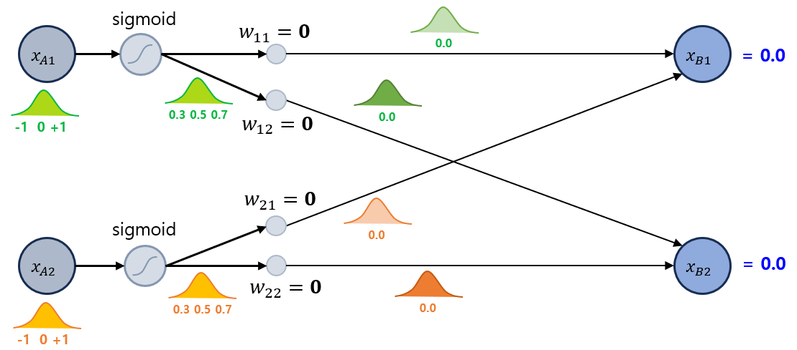
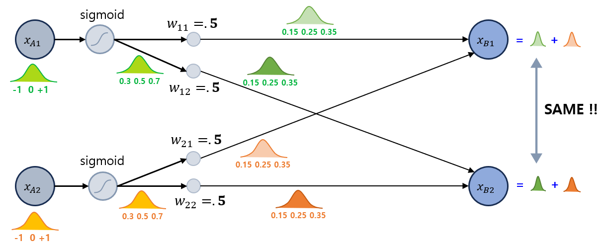
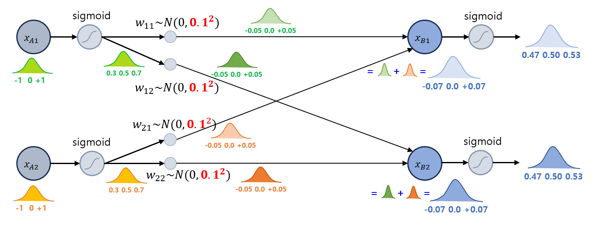
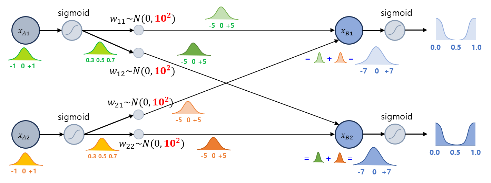

## 목차

* [1. 딥러닝에서의 가중치 초기화](#1-딥러닝에서의-가중치-초기화)
  * [1-1. 가중치 초기화 방법 요약](#1-1-가중치-초기화-방법-요약) 
* [2. 상수 초기화 (Const. Initialization)](#2-상수-초기화-const-initialization)
* [3. 가우시안 분포 초기화 (Gaussian Initialization)](#3-가우시안-분포-초기화-gaussian-initialization)
* [4. Xavier Initialization](#4-xavier-initialization)
* [5. He Initialization](#5-he-initialization)
* [6. Xavier, He Initialization 의 균등 분포 수식에서 분자가 6인 이유](#6-xavier-he-initialization-의-균등-분포-수식에서-분자가-6인-이유)
* [7. 실험: 가장 적절한 Initialization](#7-실험-가장-적절한-initialization)
  * [7-1. 실험 설계](#7-1-실험-설계)
  * [7-2. 실험 결과](#7-2-실험-결과)
  * [7-3. 실험 결과에 대한 이유 분석](#7-3-실험-결과에-대한-이유-분석)

## 코드


## 1. 딥러닝에서의 가중치 초기화

딥러닝에서 학습을 시작할 때 가중치를 초기화하는 것, 즉 **가중치 초기화 (weight initialization)** 은 딥러닝 모델의 성능을 좌우할 수 있는 중요한 문제이다. 그 이유는 다음과 같다.

* 모델의 학습 능력 관련
  * 예를 들어, 모든 가중치를 0으로 초기화하는 경우 어떤 데이터를 입력하든 그 출력값이 동일하게 0이 되므로 모델의 학습 능력이 제한된다.
  * 초기화된 가중치는 모델의 출발점이므로, 그 값의 분포에 따라 **모델의 학습 및 수렴 속도** 가 달라질 수 있다. 
* [Gradient Vanishing / Explosion](딥러닝_기초_Regularization.md#3-gradient-vanishing)
  * 가중치를 어떻게 초기화하는지에 따라 Gradient Vanishing 이나 Gradient Explosion (Gradient 의 절댓값이 너무 커지는 것) 이 발생할 수 있다.

## 1-1. 가중치 초기화 방법 요약

잘 알려진 가중치 초기화 방법은 다음과 같다.

| 방법론                   | 설명                                                                                                | 적절한 활성화 함수                                                                                        |
|-----------------------|---------------------------------------------------------------------------------------------------|---------------------------------------------------------------------------------------------------|
| 상수 초기화                | 모든 가중치를 특정 상수로 초기화한다.<br>- 경우에 따라 모델의 학습 능력에 **심각한 지장**이 생길 수 있다.                                 |                                                                                                   |
| 가우시안 분포 초기화           | 가중치를 가우시안 분포 (정규분포) 를 따르는 random number 로 초기화한다.                                                  |                                                                                                   |
| Xavier Initialization | 각 layer 의 가중치를 **input, output node 가 많을수록 분산이 작은** 분포를 따르도록 초기화한다.<br>- 균등 분포 및 정규 분포의 2가지 방법 존재 | [Sigmoid](딥러닝_기초_활성화_함수.md#2-1-sigmoid-함수)                                                        |
| He Initialization     | 각 layer 의 가중치를 **input node 가 많을수록 분산이 작은** 분포를 따르도록 초기화한다.<br>- 균등 분포 및 정규 분포의 2가지 방법 존재         | [ReLU](딥러닝_기초_활성화_함수.md#2-2-relu-함수) 및 그 [파생 함수](딥러닝_기초_활성화_함수.md#2-3-relu-파생-함수들) (Leaky ReLU 등) |

## 2. 상수 초기화 (Const. Initialization)

**상수 초기화 (Constant Initialization)** 은 **모든 가중치를 특정 상수로 초기화** 하는 것을 말한다. 일반적으로 모델의 학습 능력이 떨어지며, **경우에 따라 학습에 심각한 지장** 이 있을 수 있다.

* 0 으로 초기화하는 경우
  * Activation Function 의 결과가 입력된 데이터에 관계없이 항상 같은 값을 나타냄
    * [Sigmoid 함수](딥러닝_기초_활성화_함수.md#2-1-sigmoid-함수) 를 사용했을 경우, Sigmoid(0) = 0.5 이므로 항상 0.5 라는 값을 나타냄 
  * 가중치가 0이므로 **학습 자체가 진행되지 않음**



* 0 이 아닌 값으로 초기화하는 경우
  * 해당 layer 로부터 값을 전달받은 **다음 layer 의 모든 뉴런이 동일한 값** 을 나타내서, 결과적으로 학습 능력이 제한됨
  * 이를 신경망에 **대칭성 (symmetry)** 이 생겼다고 함



## 3. 가우시안 분포 초기화 (Gaussian Initialization)

**가우시안 분포 초기화 (Gaussian Initialization)** 는 **가중치를 Gaussian Distribution 을 따르는 난수의 값으로 초기화** 하는 것을 말한다.

* 상수 초기화와 달리 모든 가중치가 동일하게 초기화되지는 않으므로, 표준편차만 잘 설정하면 학습 능력이 심각하게 저하되는 등의 직접적인 문제는 없다.
* 단, [Gradient Vanishing](딥러닝_기초_Regularization.md#3-gradient-vanishing) 이나 Gradient Explosion 또는 이와 유사한 현상이 발생하지 않도록 **가중치의 표준편차를 적절히 설정** 할 필요가 있다.

표준편차 설정값에 따라 학습에 지장이 있는 경우가 있다. 예를 들어, 표준편차를 0.1 과 10 으로 각각 설정했을 때는 다음과 같다.

* **표준편차 = 0.1 일 때**
  * 다음 레이어로 이동해 나가면서 **뉴런의 값이 기하급수적으로 작아진다.** (Vaninshing Gradient 와 유사) 



* **표준편차 = 10 일 때**
  * 다음 레이어로 이동해 나가면서 **뉴런의 값이 급격히 커지고,** 이것이 문제가 될 수 있다. (Gradient Explosion 과 유사)
  * 다음 레이어의 활성화 함수가 Sigmoid 인 경우, 이를 적용한 값은 **0 부근, +1 부근에 몰려** 있을 가능성이 높다.



## 4. Xavier Initialization

**Xavier Initialization (또는 Glorot Initialization)** 의 핵심 아이디어는 다음과 같다.

* **input node 및 output node 의 개수가 많을수록 가중치의 절대적 크기를 그 제곱근에 비례하여 줄이면** 적절하게 초기화될 것이다.
* 이는 특정 뉴런이 갖는 값 (입력값의 가중치 합) 의 평균적인 절댓값 크기는 통계적으로 **직전 층의 뉴런의 개수, 즉 해당 뉴런의 input node 의 개수**의 제곱근에 비례하기 때문이다.
  * 이는 평균적인 절댓값의 크기가 그 표준편차에 비례하기 때문이다. 

Xavier Initialization 으로 초기화되는 **가중치 값 분포**에 대한 수식은 다음과 같다.

* 균등 분포
  * $\displaystyle [-\sqrt{\frac{6}{n_{in} + n_{out}}}, +\sqrt{\frac{6}{n_{in} + n_{out}}}]$

* 정규 분포
  * weight 의 분포는 표준정규분포 $\displaystyle N(0, \frac{2}{n_{in} + n_{out}})$ 를 따른다.
  * 평균 0, 표준편차 $\displaystyle \sqrt{\frac{2}{n_{in} + n_{out}}}$

* 수식 설명
  * notation 
    * $n_{in}$ : 해당 뉴런의 input node 의 개수 = 직전 layer 의 뉴런 개수
    * $n_{out}$ : 해당 뉴런의 output node 의 개수 = 직후 layer 의 뉴런 개수
  * $n_{in}$ 뿐만 아니라 $n_{out}$ 까지 고려하기 때문에, **정규분포의 분산 값의 분자가 2가 되어야 가중치의 분산이 1** 이 된다. 

Xavier Initialization 에 적합한 활성화 함수는 **Sigmoid 계열** 이다.

## 5. He Initialization

**He Initialization (또는 Kaiming Initialization)** 의 핵심 아이디어는 다음과 같다.

* ReLU 함수에 대해 Xavier Initialization 을 적용하면 **이후 layer 로 진행됨에 따라 출력값이 점차 감소** 한다.
  * 이는 Sigmoid 와 같은 함수와 달리, ReLU 는 **$x < 0$ 인 구간에서 함숫값이 항상 0** 이기 때문이다.
* 이를 해결하기 위해, **가중치의 분산이 1 이 아닌 2 가 되게** 한다.
* 또한, Xavier initialization 과 달리 **input node 만을 고려** 한다.

He Initialization 으로 초기화되는 **가중치 값 분포**에 대한 수식은 다음과 같다.

* 균등 분포
  * $\displaystyle [-\sqrt{\frac{6}{n_{in}}}, +\sqrt{\frac{6}{n_{in}}}]$

* 정규 분포
  * weight 의 분포는 표준정규분포 $\displaystyle N(0, \frac{2}{n_{in}})$ 를 따른다.
  * 평균 0, 표준편차 $\displaystyle \sqrt{\frac{2}{n_{in}}}$

He Initialization 에 적합한 활성화 함수는 **ReLU 및 그 파생 (Leaky ReLU 등)** 이다.

## 6. Xavier, He Initialization 의 균등 분포 수식에서 분자가 6인 이유

Xavier, He Initialization 에서 **균등 분포 구간 수식의 분자에 들어가는 상수 값이 6인 이유** 는 동일한 방법을 **정규 분포로 적용했을 때의 분산과 일치** 시키기 위해서이다.

**Xavier Initialization 의 경우**

* Xavier Initialization 의 Uniform Distribution 의 구간을 $[a, b]$ 라고 할 때, 그 분산을 정규분포 적용 시와 일치시키려면 다음과 같아야 한다.
  * $\displaystyle Var(Uniform(a, b)) = \frac{(b - a)^2}{12} = \frac{2}{n_{in} + n_{out}}$
* 이 수식에 $a = -x, b = x$ 를 대입하여 정리하면 다음과 같다.
  * $\displaystyle \frac{(x - (-x))^2}{12} = \frac{2}{n_{in} + n_{out}}$
  * $\displaystyle \frac{4x^2}{12} = \frac{2}{n_{in} + n_{out}}$
  * $\displaystyle x^2 = \frac{6}{n_{in} + n_{out}}$
  * $\displaystyle x = \sqrt{\frac{6}{n_{in} + n_{out}}}$
* 따라서 Xavier Initialization 균등 분포 구간 수식의 분자에 들어가는 상수는 6이 된다.

**He Initialization 의 경우**

* Xavier Initialization 과 마찬가지 방법으로 하면 된다.
* 이때, $n_{in} + n_{out}$ 대신 $n_{in}$ 을 대입하여 같은 방법으로 한다.

## 7. 실험: 가장 적절한 Initialization

**실험 목표**

* 각 종류의 레이어 (Conv. w/ ReLU, Fully-Connected w/ Sigmoid) 마다 서로 다른 initialization method 를 적용한다.
* 어떤 method 를 조합하는 것이 성능이 가장 좋은지 알아본다.

### 7-1. 실험 설계

**데이터셋**

* **MNIST 숫자 이미지 분류 데이터셋 (train 60K / test 10K)**
  * 10 개의 Class 가 있는 Classification Task
  * 학습 시간 절약을 위해, train dataset 중 일부만을 샘플링하여 학습
* 선정 이유
  * 데이터셋이 28 x 28 size 의 작은 이미지들로 구성
  * 이로 인해 비교적 간단한 신경망을 설계할 수 있으므로, 간단한 딥러닝 실험에 적합하다고 판단
* 데이터셋 분리

| 학습 데이터  | Valid 데이터 (Epoch 단위) | Valid 데이터 (Trial 단위) | Test 데이터          |
|---------|----------------------|----------------------|-------------------|
| 2,000 장 | 2,000 장              | 5,000 장              | 10,000 장 (원본 그대로) |

**성능 Metric**

* **Accuracy**
* 선정 이유
  * Accuracy 로 성능을 측정해도 될 정도로, [각 Class 간 데이터 불균형](../Data%20Science%20Basics/데이터_사이언스_기초_데이터_불균형.md) 이 적음 

**신경망 구조**

```python
# 신경망 구조 출력 코드

from torchinfo import summary

model = CNN()
print(summary(model, input_size=(BATCH_SIZE, 1, 28, 28)))
```


* [Dropout](딥러닝_기초_Overfitting_Dropout.md#3-dropout) 미 적용
* [Learning Rate Scheduler](딥러닝_기초_Learning_Rate_Scheduler.md) 미 적용
* Optimizer 는 [AdamW](딥러닝_기초_Optimizer.md#2-3-adamw) 를 사용
  * 해당 Optimizer 가 [동일 데이터셋을 대상으로 한 성능 실험](딥러닝_기초_Optimizer.md#3-탐구-어떤-optimizer-가-적절할까) 에서 최상의 정확도를 기록했기 때문

**상세 학습 방법**

* 다음과 같이 하이퍼파라미터 최적화를 실시하여, **최적화된 하이퍼파라미터를 기준으로 한 성능을 기준** 으로 최고 성능의 Optimizer 를 파악
  * **Conv. Layer 의 Weight Initialization 방법** ```winit_conv```
    * 상수로 초기화 (0.0) ```const_zero```
    * 상수로 초기화 (0.5) ```const_0.5```
    * Gaussian Distribution ```gaussian```
      * 관련 상수 : 표준편차 ```gaussian_std``` 
    * Xavier Initialization - 균등 분포 ```xavier_uniform```
    * Xavier Initialization - 정규 분포 ```xavier_normal```
    * He Initialization - 균등 분포 ```he_uniform```
    * He Initialization - 정규 분포 ```he_normal```
  * **Fully-Connected Layer 의 Weight Initialization 방법** ```winit_fc```
    * Conv. Layer 의 Weight Initialization 방법 과 동일한 조합
  * **learning rate** ```learning_rate```
    * 탐색 범위 : 0.0005 ~ 0.01 (= 5e-4 ~ 1e-2)

* 하이퍼파라미터 최적화
  * [하이퍼파라미터 최적화 라이브러리](../Machine%20Learning%20Models/머신러닝_방법론_HyperParam_Opt.md#4-하이퍼파라미터-최적화-라이브러리) 중 Optuna 를 사용
  * 하이퍼파라미터 탐색 100 회 반복 (= 100 Trials) 실시

### 7-2. 실험 결과

### 7-3. 실험 결과에 대한 이유 분석