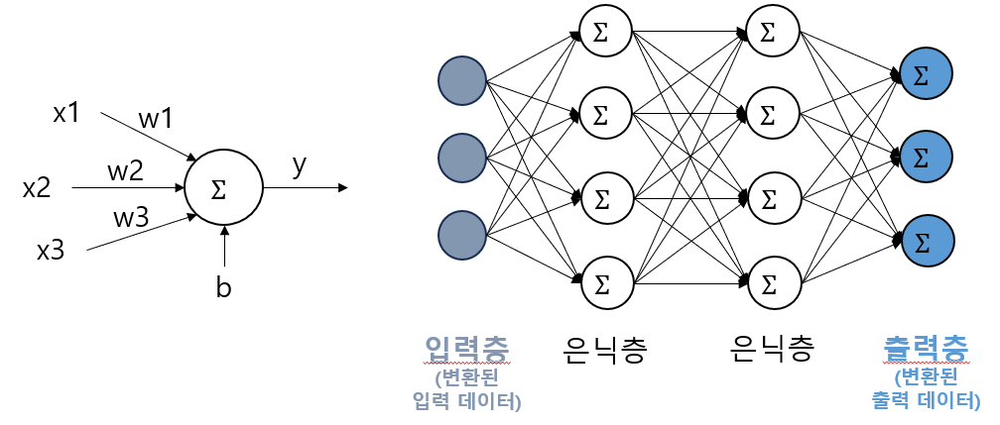
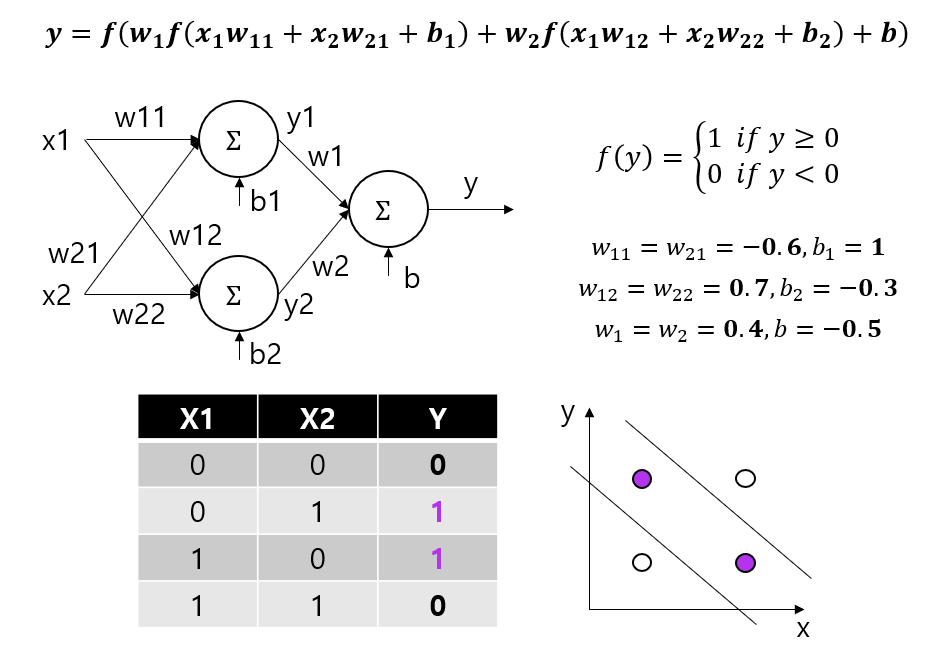

## 목차
1. 인공신경망이란?

2. 입력층, 출력층, 은닉층

3. 인공신경망의 작동 원리
* 3-1. 손실 함수 (Loss Function)
* 3-2. 역전파 (back-propagation)
* 3-3. 예시 (XOR 문제 해결)

4. 심층 신경망과 딥 러닝 (Deep Learning)

## 인공신경망이란?
**인공신경망 (Artificial Neural Network, ANN)** 은 인간의 뇌에 있는 뉴런들의 신경망을 본뜬 형태의, 딥 러닝 알고리즘 수행을 위한 일종의 자료구조이다.

인공신경망은 여러 개의 퍼셉트론이 층을 이루어 구성되어 있으며, 각 층을 입력 데이터를 받는 위치인지, 최종 출력 데이터를 출력하는 위치인지 등에 따라 **입력층, 출력층, 은닉층**으로 구분된다.

## 입력층, 출력층, 은닉층
인공신경망을 이루는 층인 입력층, 출력층, 은닉층은 다음과 같다.

**입력층 (input layer)** : 인공신경망의 층 중 입력 데이터 (input data) 를 처리하는 층
**출력층 (output layer)** : 직전 층 (일반적으로 은닉층) 의 데이터를 처리해서 최종 결과를 출력하는 층
**은닉층 (hidden layer)** : 입력층과 출력층 사이에 있는 층으로, 직전 층의 데이터를 퍼셉트론으로 처리해서 다음 층의 퍼셉트론으로 전달하는 층 

이를 그림으로 설명하면 다음과 같다.

* **입력층**에는 학습 데이터가 일반적으로 딥러닝 모델이 사용할 수 있는 숫자 값으로 **변환되어** 입력된다.
* **은닉층**에서는 입력층이나 직전 은닉층에서 처리된 데이터가 입력값 (x1, x2, x3, ...) 으로 들어온다.
* **출력층**에서는 마지막 은닉층에서 처리된 데이터가 입력값으로 들어오며, 출력층에서의 y 값에 활성화 함수를 적용한 f(y) 값은 해당 인공신경망의 **최종 출력값**이다. (일반적으로 원본 데이터에서 변형된 출력 데이터)

## 인공신경망의 작동 원리
인공신경망은 결국 **입력 데이터 (feature 값들) 를 입력값으로, 출력 데이터 (target 값) 를 출력값으로 하는 함수**라고 할 수 있으며, 따라서 인공신경망을 학습시키는 것은 신경망을 구성하는 **각 퍼셉트론의 가중치를 최적화**하여 이런 함수를 만드는 것이다.

여기서 퍼셉트론의 가중치를 최적화한다는 것은, 인공신경망의 출력값과 실제 출력 데이터 (target 값) 의 오차를 나타내는 **손실 함수 (Loss Function)** 의 값을 최소화하는 것을 의미한다.

### 손실 함수 (Loss Function)
**손실 함수 (Loss Function)** 는 인공신경망의 학습을 통해 0에 가깝게 줄이려는 값으로, **신경망에서 출력되는 값과 실제 target 값 사이의 오차**를 나타낸다.

이때, 일반적으로 다음과 같은 함수를 사용한다. 이때, $y_i$는 실제 데이터상의 target 값, $\hat{y}_i$는 인공신경망의 출력값을 의미한다.
* mean-squared error (MSE)
$$MSE = \sum_{i=1}^n {(\hat{y}_i - y_i)^2 \over n}$$

* mean-absolute error (MAE)
$$MAE = \sum_{i=1}^n {|\hat{y}_i - y_i| \over n}$$

* log loss (다중 class 분류용)
  * 출력값 이외에도 확률 값을 추가로 이용하여 오차를 계산한다. 모델이 어떤 데이터를 특정 class로 정확히 분류했을 때, 모델이 판단한 "그 class일 확률"이 클수록 정확도가 높은 것으로 판정된다.

회귀 문제 (y 값을 예측하는 문제) 에서는 MAE보다는 주로 MSE가 사용되고, 분류 문제 (y 값이 개, 고양이 등 분류인 문제) 에서는 출력값이 일반적으로 one-hot 처리된 상태에서 학습을 실시하므로 log loss를 주로 사용한다.

### 역전파 (back-propagation)
모델을 학습시킬 때 데이터를 입력층에서 출력층 방향으로만 전달하면 퍼셉트론의 가중치 최적화가 원활히 이루어지지 않는다. 이를 해결하기 위한 것이 바로 역전파이다.

**역전파 (back-propagation)** 란, 출력층에서의 최종 결과값이 실제 데이터상의 출력값과 오차가 있는 경우, **해당 오차에 비례해서, 출력층에서 입력층 방향으로 전달하여 가중치를 갱신**하는 것이다.
* 이를 위해 미분의 연쇄 법칙 (chain rule) 이 사용된다.

### 예시 (XOR 문제 해결)
XOR 문제를 은닉층이 있는 신경망을 이용하여 다음과 같이 해결할 수 있다.

여기서 입력 데이터 x1, x2에 해당하는 부분이 입력층, 가중치 b1, b2가 입력되는 부분이 은닉층, 가중치 b가 입력되는 부분이 출력층이다.

## 심층 신경망과 딥 러닝 (Deep Learning)
**심층 신경망 (Deep Neural Network, DNN)** 이란, 일반적으로 은닉층이 2개 이상인 인공신경망을 말한다.

**딥 러닝 (Deep Learning)** 이란, 이 심층 신경망을 학습시키는 것을 말한다.