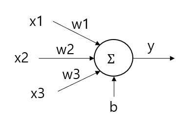

## 목차
1. 퍼셉트론이란?

2. 퍼셉트론의 작동 원리
* 2-1. 활성화 함수의 예시

3. 단일 층 퍼셉트론의 문제점
* 3-1. 해결 방법

## 퍼셉트론이란?
**퍼셉트론 (Perceptron)** 은 인공신경망의 가장 간단한 구조로, 여러 개의 입력값으로부터 1개의 결과값을 출력하는 알고리즘이다.

인간의 뇌에 있는 뉴런이 신호를 전달하는 동작을 본뜬 것이다.

## 퍼셉트론의 작동 원리
퍼셉트론을 그림으로 나타내면 다음과 같다.

퍼셉트론은 각 입력값 x1, x2, x3, ... 을 각각 w1, w2, w3, ... 의 가중치로 bias b와 함께 입력받아서, 다음과 같은 출력값 y를 계산한다.
* $$y = x_1 \times w_1 + x_2 \times w_2 + x_3 \times w_3 + ... + b$$

이때 이 값을 그냥 사용하지 않고, **activation function (활성화 함수)** 를 이용하여 변형하여 사용한다. 이 활성화 함수를 **f**라고 할 때, 퍼셉트론의 최종 출력값은 **f(y)** 이다.

즉, 퍼셉트론의 최종 출력값은 다음과 같다.
* $$f(y) = f(x_1 \times w_1 + x_2 \times w_2 + x_3 \times w_3 + ... + b)$$

퍼셉트론을 이용하여 데이터를 학습할 때, **f(y) 의 값을 실제 값(Y)과 최대한 일치**시켜야 한다. 즉, 오차를 최대한 줄여야 한다.

이때 입력값 x1, x2, x3, ... 는 신경망 자체적으로 통제할 수 없기 때문에, 퍼셉트론은 가중치 및 bias 값을 최적화 (학습) 시킨다. 즉, 다음의 값들을 오차가 최소화되도록 학습한다.
* w1, w2, w3, ..., b (bias)

### 활성화 함수의 예시
대표적인 활성화 함수의 예시는 다음과 같다.
* $$\displaystyle sigmoid(x) = \frac{1}{1 + e^{-x}}$$
* $$relu(x) = max(0, x)$$
* $$\displaystyle tanh(x) = \frac{e^x - e^{-x}}{e^x + e^{-x}}$$

예를 들어 활성화 함수로 sigmoid 함수를 사용하는 위 예시와 같은 신경망에서, x1, x2, x3의 값이 각각 0.5, 0.5, 0.8이고, 가중치 w1, w2, w3의 값이 0.1, 0.4, -0.9, bias=1.0인 경우를 생각해 보자.

이때, 퍼셉트론을 통해 계산한 y 값은
* (0.5 * 0.1) + (0.5 * 0.4) + (0.8 * (-0.9)) + 1.0 = **0.53** 이다.

따라서, 이 퍼셉트론의 최종 출력값은
* f(y) = sigmoid(0.53) = $\displaystyle \frac{1}{1 + e^{-0.53}}$ = **0.629483** 이다.

## 단일 층 퍼셉트론의 문제점
위 그림에도 나타나 있는 단일 층 퍼셉트론으로는 AND, OR 문제는 해결할 수 있지만, XOR 문제는 해결할 수 없다.

예를 들어 위와 같이 입력값 2개와 bias가 있는 단일 층 퍼셉트론 모델을 생각해 보자. 해당 모델을 이용하여 AND, OR, XOR 문제를 해결하려고 시도해 보면 다음과 같다.

AND 문제는 위와 같이 해결할 수 있다.

OR 문제도 위와 같이 해결할 수 있다.

XOR 문제는 단일 층 퍼셉트론으로는 해결하기 어렵다. (단일 층 퍼셉트론으로는 class 구분을 위한 직선을 최대 1개밖에 그리지 못하는데, XOR 문제를 해결하려면 직선이 최소 2개 필요하다.)

### 해결 방법
이 문제의 해결 방법으로는 **다층 퍼셉트론 (multi-layer perceptron)** 이 있다. 다층 퍼셉트론은 입력 부분(층) 과 출력 부분(층) 외에도 **은닉층 (hidden layer)** 이 있으며, 은닉층이 2개 이상일 경우 **딥 러닝 (Deep Learning)** 이라고 한다.