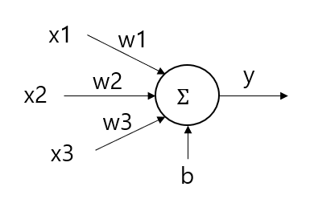

## 목차
* 1. 활성화 함수 (activation function) 란?
* 2. 다양한 활성화 함수
  * 2-1. Sigmoid 함수
  * 2-2. ReLU 함수
  * 2-3. ReLU 파생 함수들
  * 2-4. tanh 함수
  * 2-5. softmax 함수
  * 2-6. 기타 활성화 함수들

## 활성화 함수 (activation function) 란?
**활성화 함수 (activation function)** 은 딥 러닝의 신경망에서 가중치를 가지고 입력된 데이터들의 총합을 다음 층으로 전달하기 전에 사용하는 함수이다.

예를 들어 위 예시와 같은 신경망에서, x1, x2, x3의 값이 각각 0.5, 0.5, 0.8이고, 가중치 w1, w2, w3의 값이 0.1, 0.4, -0.9, bias=1.0인 경우를 생각해 보자.

이때, 퍼셉트론을 통해 계산한 y 값은 다음과 같다.
* (0.5 * 0.1) + (0.5 * 0.4) + (0.8 * (-0.9)) + 1.0 = **0.53**

따라서, 이 퍼셉트론의 최종 출력값은 여기에 활성화 함수 **f** 를 적용하면 **f(y) = f(0.53)** 이다.
* 예를 들어 활성화 함수로 sigmoid 함수를 사용하는 경우, f(y) = sigmoid(0.53) = $\displaystyle \frac{1}{1 + e^{-0.53}}$ = **0.629483** 이다.

활성화 함수는 **딥 러닝이 딥 러닝으로서의 진정한 의미를 갖게 하는 함수** 이다. 즉 활성화 함수가 없으면 딥러닝 모델이 아무리 학습을 해도 **입력된 데이터에 대한 선형 결합, 즉 선형 함수** 만 학습을 할 수가 있고, 일반적으로 딥 러닝을 통해 학습해야 하는 비선형적인 함수는 학습할 수 없다. 활성화 함수를 선형 함수로 해도 마찬가지이므로, 활성화 함수는 **비선형 함수** 이어야지만 딥 러닝에서 레이어를 깊이 쌓아서 **비선형 결합을 딥 러닝을 통해 학습하는** 의미가 있다.

## 다양한 활성화 함수

### Sigmoid 함수
$$\displaystyle sigmoid(x) = \frac{1}{1 + e^{-x}}$$

출력값은 0부터 1까지이며, 일반적으로 딥러닝 모델의 최종 출력 레이어에서 0부터 1까지의 값을 예측하기 위해 사용한다. 다음과 같은 단점이 있다.
* Vanishing Gradient Problem 발생 (기울기가 최대 0.25 이므로, 신경망을 deep 하게 들어가면서 기울기가 곱해질수록 0에 가까워진다.)
* 함숫값의 중심점이 양의 값이기 때문에 학습 속도가 느리다.

### ReLU 함수
$$relu(x) = max(0, x)$$

$x = 0$ 일 때 미분이 불가능하고, 나머지의 경우 $x < 0$ 이면 미분값은 0, $x > 0$ 이면 미분값은 1이다.
* 연산이 간단해서 빠르다.
* 함숫값의 중심점이 0이 아니므로 학습 속도가 느릴 수 있다.

### ReLU 파생 함수들
**Leaky ReLU**, $LeakyRelu(x) = max(0.01x, x)$
* ReLU 함수에서 음의 값에 대해 고정적으로 0을 출력하는 부분을 보완할 수 있다.
* 음의 값에 대해 0.01x가 아닌 다른 배율을 사용할 수도 있다.

**PReLU (Parametric Leaky ReLU)**, $PRelu(x) = max(0, x) + a \times min(0, x)$
* x > 0 이면 max(0, x) = x 가 되어서 x 값이 그대로 사용된다.
* x < 0 이면 $a \times x$ 가 되어서 x 값이 a 배 되어 적용된다. (즉, 음수에 대한 배율을 파라미터 a로 하여 추가로 학습한다.)

**ELU (Exponential Linear Unit)**
* x < 0 이면 $ELU(x) = a \times (e^x - 1)$ 이다.
* x >= 0 이면 $ELU(x) = x$ 이다.
* x < 0 일 때 함숫값이 음수이며, 함숫값의 최솟값은 -a 로 음수이다.
* a = 1인 경우 x = 0 지점에서 좌측 미분값과 우측 미분값이 모두 1인 매끄러운 함수가 된다.

### tanh 함수
$$\displaystyle tanh(x) = \frac{e^x - e^{-x}}{e^x + e^{-x}}$$

출력값은 -1부터 1까지이며, **(2 * Sigmoid - 1)** 의 값과 같다.
* Sigmoid 함수처럼 Vanishing Gradient Problem은 존재한다.
* 그러나, 함숫값의 중심점이 0이다. (zero-centered)

### softmax 함수
$$\displaystyle softmax(x_i) = \frac{e^{x_i}}{\sum_{j=1}^{n} e^{x_j}}$$

다중 분류 (Multi-Class Classification) 문제에서 사용하는 활성화 함수이다. 여기서 $n$은 출력 뉴런 개수, 즉 최종적인 출력값의 개수로, 일반적으로 Classification 문제에서의 one-hot encoding된 값의 배열이다.

softmax 함수의 특징은 다음과 같다.
* 각 출력값 $x_j, j=1,2,...,n$ 에 대해 $x_j$ 를 $exp(x_j)$ 로 변환해서 적용하고, 그 값들 중 현재 값 $x_i$ 에 대한 $exp(x_i)$ 가 차지하는 비율을 나타낸다.
  * 예를 들어 $i = 1$일 때, $softmax(x_1) = \frac{e^{x_1}}{e^{x_1} + e^{x_2} + ... + e^{x_n}}$ 이다.
* 모든 값의 합이 1이며, $exp(x_i)$ 의 값은 딥러닝 모델이 예측하는, 해당 object가 class i일 확률을 나타낸다고 할 수 있다.
* Sigmoid 함수와 달리 **각 출력값에 대한 확률에 대해 그 합을 1.0 으로 유지하여 서로 종속적으로** 하고 싶을 때 적용할 수 있다.

### 기타 활성화 함수들
* Maxout 함수는 ReLU의 장점과 함께 ReLU에서 x < 0일 때 뉴런의 기울기가 0이 되는 문제를 해결했으나, 계산량이 많다.
* GELU (Gaussion Error Linear Unit)
* SELU (Scaled ELU)
* RReLU (Randomized Leaky ReLU)