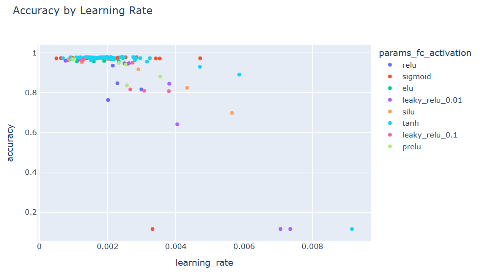

## 목차
* [1. 활성화 함수 (activation function) 란?](#1-활성화-함수-activation-function-란)
* [2. 다양한 활성화 함수](#2-다양한-활성화-함수)
  * [2-1. Sigmoid 함수](#2-1-sigmoid-함수)
  * [2-2. ReLU 함수](#2-2-relu-함수)
  * [2-3. ReLU 파생 함수들](#2-3-relu-파생-함수들)
  * [2-4. tanh 함수](#2-4-tanh-함수)
  * [2-5. softmax 함수](#2-5-softmax-함수)
  * [2-6. SiLU (Swish) 함수](#2-6-silu-swish-함수)
  * [2-7. 기타 활성화 함수들](#2-7-기타-활성화-함수들)
* [3. 탐구: 가장 좋은 활성화 함수는?](#3-탐구-가장-좋은-활성화-함수는)
  * [3-1. 실험 설계](#3-1-실험-설계)
  * [3-2. 실험 결과](#3-2-실험-결과)
* [4. 활성화 함수를 잘못 사용하면?](#4-활성화-함수를-잘못-사용하면)

## 코드

* [MNIST 데이터셋에서 성능이 좋은 활성화 함수 탐구](#3-탐구-가장-좋은-활성화-함수는) 실험 코드 : [code (ipynb)](codes/Activation_Func_experiment.ipynb)

## 1. 활성화 함수 (activation function) 란?

**활성화 함수 (activation function)** 는 [딥 러닝의 신경망](딥러닝_기초_인공신경망.md) 에서 **가중치를 가지고 입력된 데이터들의 총합을 다음 층으로 전달** 하기 전에 사용하는 함수이다.
* 딥 러닝의 **비선형성 그 자체** 를 만드는 역할을 한다.

----


예를 들어 위 예시와 같은 [퍼셉트론](딥러닝_기초_퍼셉트론.md) 에서, x1, x2, x3의 값이 각각 0.5, 0.5, 0.8이고, 가중치 w1, w2, w3의 값이 0.1, 0.4, -0.9, bias=1.0 인 경우를 생각해 보자.

이때, 퍼셉트론을 통해 계산한 y 값은 다음과 같다.
* (0.5 * 0.1) + (0.5 * 0.4) + (0.8 * (-0.9)) + 1.0 = **0.53**

따라서, 이 퍼셉트론의 최종 출력값은 여기에 활성화 함수 **f** 를 적용하면 **f(y) = f(0.53)** 이다.
* 예를 들어 활성화 함수로 sigmoid 함수를 사용하는 경우, f(y) = sigmoid(0.53) = $\displaystyle \frac{1}{1 + e^{-0.53}}$ = **0.629483** 이다.

활성화 함수는 **딥 러닝이 딥 러닝으로서의 진정한 의미를 갖게 하는 함수** 이다.
* 활성화 함수가 없으면 딥러닝 모델이 아무리 학습을 해도 **입력된 데이터에 대한 선형 결합, 즉 선형 함수** 만 학습을 할 수가 있다.
  * 이것은 일반적으로 딥 러닝을 통해 학습해야 하는 비선형적인 함수는 학습할 수 없음을 의미한다.
  * 이는 활성화 함수를 선형 함수로 해도 마찬가지이다.
* 따라서 활성화 함수는 **비선형 함수** 이어야지만 딥 러닝에서 레이어를 깊이 쌓아서 **비선형 결합을 딥 러닝을 통해 학습하는** 의미가 있다.

## 2. 다양한 활성화 함수

딥러닝에서 각 레이어의 특성 및 목적에 따라 다음과 같이 다양한 활성화 함수들이 사용된다.


주요 활성화 함수에 대해 정리하면 다음과 같다.

| 활성화 함수       | 수식                                                                         | 그래프                           |
|--------------|----------------------------------------------------------------------------|-------------------------------|
| Sigmoid      | $\displaystyle sigmoid(x) = \frac{1}{1 + e^{-x}}$                          |  |
| ReLU         | $relu(x) = max(0, x)$                                                      |  |
| Leaky ReLU   | $LeakyRelu(x) = max(0.01x, x)$                                             |  |
| PReLU        | $PRelu(x) = max(0, x) + a \times min(0, x)$                                |  |                           |
| ELU          | - $ELU(x) = x$ if $x \ge 0$<br> - $ELU(x) = a \times (e^x - 1)$ if $x < 0$ |  |                          |
| tanh         | $\displaystyle tanh(x) = \frac{e^x - e^{-x}}{e^x + e^{-x}}$                |  |
| Softmax      | $\displaystyle softmax(x_i) = \frac{e^{x_i}}{\sum_{j=1}^{n} e^{x_j}}$      |                               |
| SiLU (Swish) | $\displaystyle SiLU(x) = x \times sigmoid(x) = \frac{x}{1 + e^{-x}}$       |  |

이들 중 각 함수의 주요 특징은 다음과 같다.

| 활성화 함수       | 함숫값 (Zero-Centered)       | 연산량 | 학습 가능 파라미터 |
|--------------|---------------------------|-----|------------|
| Sigmoid      | 0 ~ 1 (❌)                 | 많음  | 없음         |
| ReLU         | 0 ~ $+\infty$ (❌)         | 적음  | 없음         |
| Leaky ReLU   | $-\infty$ ~ $+\infty$ (❌) | 적음  | 없음         |
| PReLU        | $-\infty$ ~ $+\infty$ (❌) | 적음  | $a$ 학습 가능  |
| ELU          | $-a$ ~ $+\infty$ (✅)      | 많음  | 없음         |
| tanh         | -1 ~ 1 (✅)                | 많음  | 없음         |
| SiLU (Swish) | -0.278 ~ $+\infty$ (✅)    | 많음  | 없음         |
| Softmax      | 0 ~ 1                     | 많음  | 없음         |

* Zero-Centered (함숫값의 평균이 0에 근접한지) 여부는 가중치 업데이트 시 편향 발생 가능성을 의미하므로, [overfitting](딥러닝_기초_Overfitting_Dropout.md) 발생 여부 판단에 있어서 중요하다.

### 2-1. Sigmoid 함수

$$\displaystyle sigmoid(x) = \frac{1}{1 + e^{-x}}$$


출력값은 0부터 1까지이며, 일반적으로 딥러닝 모델의 최종 출력 레이어에서 0부터 1까지의 값을 예측하기 위해 사용한다. 다음과 같은 단점이 있다.
* Vanishing Gradient Problem 발생 (기울기가 최대 0.25 이므로, 신경망을 deep 하게 들어가면서 기울기가 곱해질수록 0에 가까워진다.)
* 함숫값의 중심점이 양의 값이기 때문에 학습 속도가 느리다.

**장단점**

* 장점
  * 출력 범위가 0~1 이므로 확률 값 출력 모델에 사용 가능
* 단점
  * [Vanishing Gradient](딥러닝_기초_Regularization.md#3-gradient-vanishing) 문제 발생 가능
  * $e^{-x}$ 의 포함으로 연산이 다소 복잡함

### 2-2. ReLU 함수

$$relu(x) = max(0, x)$$


$x = 0$ 일 때 미분이 불가능하고, 나머지의 경우 $x < 0$ 이면 미분값은 0, $x > 0$ 이면 미분값은 1이다.
* 연산이 간단해서 빠르다.
* 함숫값의 중심점이 0이 아니므로 학습 속도가 느릴 수 있다.

**장단점**

* 장점
  * Sigmoid 함수의 [Vanishing Gradient](딥러닝_기초_Regularization.md#3-gradient-vanishing) 문제를 일정 부분 해결
  * 연산이 단순함
* 단점
  * weight 의 평균이 + (Positive) 이므로, weight update 시 + (Positive) 방향으로 편향 발생 가능
* Dying ReLU Problem
  * 입력값이 음수일 때 출력값이 항상 0이므로, 이에 해당하는 feature 는 더 이상 역할을 하지 못함 
  * 그 자체로는 단점처럼 보이지만, 이것이 [overfitting](딥러닝_기초_Overfitting_Dropout.md#2-딥러닝에서의-오버피팅-overfitting) 방지의 대표적인 방법인 [Dropout](딥러닝_기초_Overfitting_Dropout.md#3-dropout) 의 역할을 할 수 있음

### 2-3. ReLU 파생 함수들


**Leaky ReLU**

* $LeakyRelu(x) = max(0.01x, x)$
  * ReLU 함수에서 음의 값에 대해 고정적으로 0을 출력하는 부분을 보완할 수 있다.
  * 음의 값에 대해 0.01x가 아닌 다른 배율을 사용할 수도 있다.

**장단점**

* 장점
  * Dying ReLU Problem 이 단점인 경우, 이를 해결 가능
* 단점
  * $max(ax, x)$ 에서의 $a$ 값이 모델 자체적으로 학습 불가능한 하이퍼파라미터임

----


**PReLU (Parametric Leaky ReLU)**

* $PRelu(x) = max(0, x) + a \times min(0, x)$
  * x > 0 이면 max(0, x) = x 가 되어서 x 값이 그대로 사용된다.
  * x < 0 이면 $a \times x$ 가 되어서 x 값이 a 배 되어 적용된다. (즉, 음수에 대한 배율을 파라미터 a로 하여 추가로 학습한다.)
* 이때, $a$ 는 **학습 가능한 매개변수 (parameter)** 이다.

**장단점**

* 장점
  * Dying ReLU Problem 이 단점인 경우, 이를 해결 가능
  * Leaky ReLU 에서 $a$ 값을 학습 가능한 파라미터로 만들어서, 모델 자체적으로 최적화 가능
* 단점
  * $a$ 값의 학습으로 인한 추가적인 연산 발생 

----


**ELU (Exponential Linear Unit)**

* 수식
  * $x < 0$ 이면 $ELU(x) = a \times (e^x - 1)$ 이다.
  * $x \ge 0$ 이면 $ELU(x) = x$ 이다.
* 설명
  * x < 0 일 때 함숫값이 음수이며, 함숫값의 최솟값은 -a 로 음수이다.
  * a = 1인 경우 x = 0 지점에서 좌측 미분값과 우측 미분값이 모두 1인 매끄러운 함수가 된다.

**장단점**

* 장점
  * 함숫값의 평균이 0에 비교적 가까우므로, weight 갱신 시 편향되지 않게 안정적으로 갱신할 수 있음
* 단점
  * $e^{x}$ 의 포함으로 연산이 다소 복잡함

### 2-4. tanh 함수

$$\displaystyle tanh(x) = \frac{e^x - e^{-x}}{e^x + e^{-x}}$$


출력값은 -1부터 1까지이며, **(2 * Sigmoid - 1)** 의 값과 같다.
* Sigmoid 함수처럼 Vanishing Gradient Problem은 존재한다.
* 그러나, 함숫값의 중심점이 0이다. (zero-centered)

**장단점**

* 장점
  * 함숫값의 평균이 0 이므로, weight 갱신 시 편향되지 않게 안정적으로 갱신됨
* 단점
  * $e^{x}$, $e^{-x}$ 의 포함으로 연산이 다소 복잡함
* 참고
  * Sigmoid 에서 발생하는 Vanishing Gradient 문제를 일부 해결 가능
  * 그러나, 완전히 해결되지는 않음

**참고**

* 모든 입력값 x 에 대해 $2 \times sigmoid(2x) - 1 = tanh(x)$ 가 성립한다.

### 2-5. softmax 함수

$$\displaystyle softmax(x_i) = \frac{e^{x_i}}{\sum_{j=1}^{n} e^{x_j}}$$

* $n$: 출력 뉴런 개수, 즉 최종적인 출력값의 개수


다중 분류 (Multi-Class Classification) 문제 등에서 사용하는 활성화 함수이다. 핵심 아이디어는 **n 개의 각 값을 그 합이 1인 확률 값으로 변환** 시키는 것이다.

* 각 확률 값은 Softmax 에 의해 변환되기 전의 값이 **전체 값들 중에서 차지하는 일종의 '비중'** 이라고 할 수 있다.
* 단일 max (max 인 1개만 1.0, 나머지는 모두 0.0) 가 아닌 **Soft 한 Max (확률)** 을 의미한다.

다중 분류 문제에서의 softmax 함수의 활용법은 다음과 같다.

* 실제 출력값 (label) 을 [one-hot encoding](../Machine%20Learning%20Models/머신러닝_방법론_One_Hot.md) 해서 배열로 만든다.
* 각 Class 에 대해, 분류 모델이 출력한 원래 score 를 구한다.
  * 원래 score 의 합은 1이 아닐 수 있다.
* Softmax 활성화 함수를 이용하여 원래 score 를 **그 합이 1인 확률로 변환** 한다.
* 실제 출력값과 Softmax 함수로 변환된 score 값 간의 **[Categorical Cross Entropy Loss](딥러닝_기초_Loss_function.md#2-5-categorical-cross-entropy-loss)** 가 해당 모델의 Loss 값이다.

softmax 함수의 특징은 다음과 같다.

* 각 출력값 $x_j, j=1,2,...,n$ 에 대해 $x_j$ 를 $exp(x_j)$ 로 변환해서 적용하고, 그 값들 중 현재 값 $x_i$ 에 대한 $exp(x_i)$ 가 차지하는 비율을 나타낸다.
  * 예를 들어 $i = 1$일 때, $softmax(x_1) = \frac{e^{x_1}}{e^{x_1} + e^{x_2} + ... + e^{x_n}}$ 이다.
* 모든 값의 합이 1이며, $exp(x_i)$ 의 값은 딥러닝 모델이 예측하는, 해당 object가 class i일 확률을 나타낸다고 할 수 있다.
* Sigmoid 함수와 달리 **각 출력값에 대한 확률에 대해 그 합을 1.0 으로 유지하여 서로 종속적으로** 하고 싶을 때 적용할 수 있다.

### 2-6. SiLU (Swish) 함수

$\displaystyle SiLU(x) = x \times sigmoid(x) = \frac{x}{1 + e^{-x}}$

| SiLU 함수                       | SiLU vs. ReLU                 |
|-------------------------------|-------------------------------|
|  |  |

**sigmoid 함수에 입력값 x를 단순히 곱한** 활성화 함수이다.

ReLU 와 SiLU 의 그래프는 위 그림과 같이 형태가 비슷하지만, **관련 연구에서 SiLU 의 성능이 ReLU 보다 훨씬 좋다** 고 한다. 그 이유는 다음과 같을 것으로 추정된다.

* $x > 0$ 에서 y 의 최댓값이 없는 반면, $x < 0$ 에서는 y 의 최솟값이 있음
  * 이 값은 x가 약 -1.278 일 때 약 -0.278 임
* **단조 증가하지 않고,** x < -1.278 에서 감소, x > -1.278 에서 증가하는 형태
* 미분 불가능점이 없음

### 2-7. 기타 활성화 함수들

* Maxout 함수는 ReLU의 장점과 함께 ReLU에서 x < 0일 때 뉴런의 기울기가 0이 되는 문제를 해결했으나, 계산량이 많다.
* GELU (Gaussion Error Linear Unit)
* SELU (Scaled ELU)
* RReLU (Randomized Leaky ReLU)

## 3. 탐구: 가장 좋은 활성화 함수는?

**실험 목표**
* 본 문서에 나타나 있는 다양한 활성화 함수 중 어떤 것의 효과가 가장 큰지 알아본다.
* 각 레이어 종류 (Conv. 및 Fully Connected) 별로 적용할 활성화 함수의 종류, learning rate를 하이퍼파라미터로 하여, MNIST 데이터셋을 대상으로 하이퍼파라미터 최적화를 실험한다.

### 3-1. 실험 설계

**데이터셋**

* **MNIST 숫자 이미지 분류 데이터셋 (train 60K / test 10K)**
  * 10 개의 Class 가 있는 Classification Task
  * 학습 시간 절약을 위해, train dataset 중 일부만을 샘플링하여 학습
* 선정 이유
  * 데이터셋이 28 x 28 size 의 작은 이미지들로 구성
  * 이로 인해 비교적 간단한 신경망을 설계할 수 있으므로, 간단한 딥러닝 실험에 적합하다고 판단
* 데이터셋 분리

| 학습 데이터  | Valid 데이터 (Epoch 단위) | Valid 데이터 (Trial 단위) | Test 데이터          |
|---------|----------------------|----------------------|-------------------|
| 3,000 장 | 2,000 장              | 5,000 장              | 10,000 장 (원본 그대로) |

**성능 Metric**

* **Accuracy**
* 선정 이유
  * Accuracy 로 성능을 측정해도 될 정도로, [각 Class 간 데이터 불균형](../Data%20Science%20Basics/데이터_사이언스_기초_데이터_불균형.md) 이 적음 

**신경망 구조**

```python
# 신경망 구조 출력 코드

from torchinfo import summary

model = CNN()
print(summary(model, input_size=(BATCH_SIZE, 1, 28, 28)))
```


* [Dropout](딥러닝_기초_Overfitting_Dropout.md#3-dropout) 미 적용
* Early Stopping Rounds = 5 로 고정 (5 epoch 동안 valid set 성능 갱신 없으면 종료)
* Optimizer 는 [AdamW](딥러닝_기초_Optimizer.md#2-3-adamw) 를 사용
  * 해당 Optimizer 가 [동일 데이터셋을 대상으로 한 성능 실험](딥러닝_기초_Optimizer.md#3-탐구-어떤-optimizer-가-적절할까) 에서 최상의 정확도를 기록했기 때문

**상세 학습 방법**

* 다음과 같이 하이퍼파라미터 최적화를 실시하여, **최적화된 하이퍼파라미터를 기준으로 한 성능을 기준** 으로 최고 성능의 Optimizer 를 파악
  * **모든 Conv. Layer 의 활성화 함수** ```conv_activation```
    * Sigmoid
    * ReLU
    * Leaky ReLU ($a = 0.01$)
    * Leaky ReLU ($a = 0.1$)
    * PReLU
    * ELU ($a = 1.0$)
    * tanh
    * SiLU (Swish)
  * **Fully-Connected Layer 의 활성화 함수** ```fc_activation```
    * Sigmoid
    * ReLU
    * Leaky ReLU ($a = 0.01$)
    * Leaky ReLU ($a = 0.1$)
    * PReLU
    * ELU ($a = 1.0$)
    * tanh
    * SiLU (Swish)
  * **learning rate** ```learning_rate```
    * 탐색 범위 : 0.0005 ~ 0.01 (= 5e-4 ~ 1e-2)

* 하이퍼파라미터 최적화
  * [하이퍼파라미터 최적화 라이브러리](../Machine%20Learning%20Models/머신러닝_방법론_HyperParam_Opt.md#4-하이퍼파라미터-최적화-라이브러리) 중 Optuna 를 사용
  * 하이퍼파라미터 탐색 120 회 반복 (= 120 Trials) 실시

### 3-2. 실험 결과

**1. 실험 결론**
* Conv. Layer 의 경우 **PReLU 함수** 가 가장 높은 성능을 보인다.
* Fully-Connected Layer 의 경우 **Tanh 및 Sigmoid 함수** 가 가장 높은 성능을 보인다.
* Learning Rate 가 0.004 이상으로 높은 경우 성능이 떨어진다.
  * 큰 Learning Rate 로 인한 'overshooting' 으로 추정

**2. Best Hyper-param 및 그 성능 (정확도)**

| 구분                | 값                                                                                                                              |
|-------------------|--------------------------------------------------------------------------------------------------------------------------------|
| 최종 테스트셋 정확도       | 98.02%                                                                                                                         |
| HPO Valid set 정확도 | 97.94%                                                                                                                         |
| Best Hyper-param  | ```conv_activation``` : ```prelu``` (PReLU 함수)<br>```fc_activation``` : ```relu``` (ReLU 함수)<br>```learning_rate``` : 0.001988 |

**3. 하이퍼파라미터 최적화 진행에 따른 정확도 추이**


**4. 각 하이퍼파라미터의 값에 따른 성능 분포**

* Conv. Layer 및 Fully Connected Layer 의 활성화 함수 별 최고 정확도
  * Fully-Connected Layer 의 경우, **Tanh 함수가 다른 함수에 비해 높은 정확도를 보인다.**
  * FC Layer 의 활성화 함수로 Sigmoid 함수 역시 정확도 기준으로 상위권에 속하는 함수로 추정된다.


* Learning Rate 에 따른 정확도 (**Conv. Layer** 활성화 함수 별)
  * Learning Rate 가 0.004 이상으로 크면 성능이 떨어진다.
  * 활성화 함수로 **PReLU 함수** 의 성능이 우수하다.


* Learning Rate 에 따른 정확도 (**Fully-Connected Layer** 활성화 함수 별)
  * Learning Rate 가 0.004 이상으로 크면 성능이 떨어진다.
  * 활성화 함수로 **Tanh, sigmoid 함수** 의 성능이 우수하다.




### 3-3. 실험 결과에 대한 이유 분석

**1. Conv. Layer 는 ReLU, PReLU, ELU 등이 좋은 이유**

* 요약
  * **ReLU 의 희소 활성화 + PReLU 의 음수 입력값 기울기 파라미터 추가 학습 (추정)** 
* ReLU 의 경우
  * ReLU 함수는 입력값이 음수이면 출력값이 항상 0이다.
    * 이때, 해당 뉴런들은 그 값이 0이므로 이후의 layer 로 forwarding 하는 데 있어서 더 이상 기여할 수 없게 된다.
    * 이를 **Dying ReLU Problem** 이라고 한다.
  * 이러한 Dying ReLU 가 여러 개의 Conv. Layer 에서 걸쳐 반복되면 **많은 뉴런이 0의 값을 갖는다.**
  * 결국 **활성화되는 뉴런이 많이 줄어들게 되어 sparse 하게** 되는데, 이를 **희소 활성화 (Sparse Activation)** 라고 한다.
  * 희소 활성화는 **CNN을 이용한 이미지 처리 분야에서 일반화 성능의 향상에 도움** 을 준다는 연구 결과가 있다.
* PReLU 의 경우는 여기에서 **입력값이 음수일 때의 기울기를 파라미터로 하여 모델 자체적으로 학습** 하는 것을 추가하기 때문으로 추정된다.
  * ReLU 함수의 장점을 이용하면서도, 기울기 파라미터에 대한 학습을 통한 **추가적인 보정** 이 가능하다.

**2. Fully-Connected Layer 는 Sigmoid, Tanh 등이 좋은 이유**

* 요약
  * **희소 활성화 없이, 각 Class 별 score 를 구하기 위한 최대한 많은 정보 활용 가능 (추정)**
* 상세
  * 본 실험에서 이용한 신경망에서는 Fully-Connected Layer 의 output 이 **Softmax 함수를 통해 확률로 변환하기 위한, 각 Class 별 original score 값** 이다.
  * ReLU 보다 Sigmoid, Tanh 의 성능이 더 좋은 이유는,
    * 희소 활성화를 하는 대신 모든 뉴런을 활성화시켜 이 score 를 구해야 **최대한 많은 정보를 통해 정확한 추론** 을 할 수 있기 때문으로 추정된다.

## 4. 활성화 함수를 잘못 사용하면?

**본인이 2024년 현업 실무에서 중대한 오류를 범한 부분이라 철저히 짚고 넘어가야 한다.**

[Loss Function](딥러닝_기초_Loss_function.md) 과 마찬가지로 활성화 함수 역시 잘못 사용하면 모델 학습이 잘 이루어지지 않는 오류가 발생한다. 자세한 것은 [해당 문서](딥러닝_기초_활성화_함수_Misuse.md) 참고.