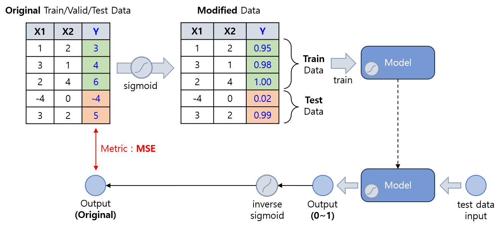

## 목차

* [1. 활성화 함수의 적절한 사용](#1-활성화-함수의-적절한-사용)
  * [1-1. Regression 에서 데이터 자체에 Sigmoid 를 적용하고, 출력에 역함수를 적용하는 방법이 권장되지 않는 이유](#1-1-regression-에서-데이터-자체에-sigmoid-를-적용하고-출력에-역함수를-적용하는-방법이-권장되지-않는-이유) 
  * [1-2. Multi-Class Classification 에서 Sigmoid 가 권장되지 않는 이유](#1-2-multi-class-classification-에서-sigmoid-가-권장되지-않는-이유)
* [2. 실험 설계](#2-실험-설계)
  * [2-1. 데이터셋 및 성능 Metric](#2-1-데이터셋-및-성능-metric)
  * [2-2. 실험 구성](#2-2-실험-구성)
  * [2-3. 신경망 구조](#2-3-신경망-구조)
  * [2-4. 상세 configuration](#2-4-상세-configuration)
* [3. 실험 결과](#3-실험-결과)
  * [3-1. Regression](#3-1-regression)
  * [3-2. Probability Prediction](#3-2-probability-prediction)
  * [3-3. Binary Classification (2 outputs)](#3-3-binary-classification-2-outputs)
  * [3-4. Multi-Class Classification](#3-4-multi-class-classification)
  * [3-5. Multi-Label Classification](#3-5-multi-label-classification)

## 1. 활성화 함수의 적절한 사용

**본인이 2024년 현업 실무에서 중대한 오류를 범한 부분이라 철저히 짚고 넘어가야 한다.**

[Loss Function](딥러닝_기초_Loss_function.md) 과 마찬가지로, [활성화 함수](딥러닝_기초_활성화_함수.md) 를 잘못 사용하면 학습이 잘 되지 않을 수 있다. 따라서 활성화 함수 역시 다음과 같이 **적절히 사용하는 것** 이 중요하다.

| Task                              | Task 설명                                                                  | 활성화 함수                                           |
|-----------------------------------|--------------------------------------------------------------------------|--------------------------------------------------|
| Regression                        |                                                                          | 활성화 함수 미사용<br>(단, 항상 0 이상의 값을 출력할 때는 ReLU 사용 가능) |
| Probability Prediction<br>(0 ~ 1) | 단일 output, 0 ~ 1 사이의 확률                                                  | Sigmoid 함수                                       |
| Classification<br>(Binary)        | 각 Class 에 대한 0 ~ 1 사이의 확률<br>(Class 2개 각각 output, 확률 합산은 1)              | Softmax 함수                                       |
| Classification<br>(Multi-Class)   | 각 Class 에 대한 0 ~ 1 사이의 확률<br>(Class 3개 이상 각각 output, 확률 합산은 1)           | Softmax 함수                                       |
| Classification<br>(Multi-Label)   | 각 Class 에 대한 0 ~ 1 사이의 확률<br>(**각 Class 별 독립적으로 계산** 하며, 합산이 1이 아닐 수 있음) | (각 Class 별 독립적인) Sigmoid 함수                      |

### 1-1. Regression 에서 데이터 자체에 Sigmoid 를 적용하고, 출력에 역함수를 적용하는 방법이 권장되지 않는 이유

Regression Task 에서 다음과 같은 방법을 이용하는 것은 적합하지 않다.

* Train/Valid/Test data 의 출력값 자체에 Sigmoid 함수를 적용하여 0 ~ 1 범위의 값으로 변환
* 모델 최종 출력값에도 Sigmoid 적용
* Sigmoid 가 적용된 모델 출력값에 Sigmoid 의 역함수를 적용하여 원래 값으로 변환



그 이유는 다음과 같다.

* Sigmoid 함수를 통해 **원래 데이터 분포에 비선형성을 추가하여, 데이터 자체를 왜곡** 시키기 때문이다.
* 데이터 자체를 변형하는 것과 Sigmoid 의 역함수를 출력값에 적용하여 변환하는 것 자체가 모델의 복잡성을 증가시킨다.
* 모델의 원래 출력값이 15 이상, -15 이하 등 절댓값이 너무 크면 Sigmoid 적용 시 **컴퓨터가 표현 가능한 자릿수의 한계로 인해 각각 1.0, 0.0 과 동일한 값으로 인식** 하여, 역함수 적용 자체가 어려울 수 있다.
  * Sigmoid(15), Sigmoid(-15) 의 값은 각각 1.0, 0.0 에 매우 가깝다.

### 1-2. Multi-Class Classification 에서 Sigmoid 가 권장되지 않는 이유

Multi-Class Classification (with [Categorical Cross-Entropy](딥러닝_기초_Loss_function.md#2-5-categorical-cross-entropy-loss)) 에서 Sigmoid 함수가 권장되지 않는 이유는 다음과 같다.

* 각 Class 의 확률을 **독립적으로** 계산하는 Sigmoid 의 특성상, Multi-Class Classification task 의 특징인 **각 Class 간 상호 배타적으로 해당함** 을 고려하지 못함
  * 확률의 합이 1이어야 한다는 점을 Softmax 는 반영하지만 Sigmoid 는 반영하지 못함
* Categorical Cross-Entropy 는 **Class 간 상호 배타성** 을 고려한 Loss Function 이지만, 이러한 상호 배타성을 **각 Class의 확률을 독립적으로 계산** 하는 Sigmoid 는 반영하지 못함

## 2. 실험 설계

**실험 목표**

* 다음과 같이 **최종 출력 Layer 에 부적절한 활성화 함수** 를 사용했을 때, 학습 과정에서 어떤 문제가 발생하는지 알아본다.

| Task                              | 최종 출력 Layer 의 "부적절한" 활성화 함수                                                                                        |
|-----------------------------------|--------------------------------------------------------------------------------------------------------------------|
| Regression                        | - Train/Valid/Test data 의 출력값 자체에 Sigmoid 적용<br>- 모델 최종 출력에도 Sigmoid 적용<br>- 모델 출력값에 Sigmoid 의 역함수를 이용하여 원래 값으로 변환 |
| Probability Prediction<br>(0 ~ 1) | - Softmax                                                                                                          |
| Classification<br>(Binary)        | - Sigmoid                                                                                                          |
| Classification<br>(Multi-Class)   | - Sigmoid                                                                                                          |
| Classification<br>(Multi-Label)   | - Softmax                                                                                                          |

### 2-1. 데이터셋 및 성능 Metric

* **MNIST Dataset (60K train / 10K test)** 에 대해, 다음과 같이 데이터를 구분한다.

| Train Data               | Valid Data                | Test Data         |
|--------------------------|---------------------------|-------------------|
| 2,000 장 (Train Set 의 일부) | 3,000 장 (Train set 에서 분리) | 10,000 장 (원본 그대로) |

* 학습 시간 절약을 위해, train dataset 중 일부만을 샘플링하여 학습
* MNIST 선정 이유
  * 데이터셋이 28 x 28 size 의 작은 이미지들로 구성
  * 이로 인해 비교적 간단한 신경망을 설계할 수 있으므로, 간단한 딥러닝 실험에 적합하다고 판단
* 성능 Metric
  * **Mean Squared Error (회귀), Accuracy (분류)**
  * 선정 이유
    * 분류 task의 경우, Accuracy 로 성능을 측정해도 될 정도로, [각 Class 간 데이터 불균형](../Data%20Science%20Basics/데이터_사이언스_기초_데이터_불균형.md) 이 적음 

### 2-2. 실험 구성

실험에 대한 상세 구성은 다음과 같다.

| Task                              | Task 상세                                                                                                                                                                             | 실험을 진행할 "잘못된" 활성화 함수                                                                                               |
|-----------------------------------|-------------------------------------------------------------------------------------------------------------------------------------------------------------------------------------|--------------------------------------------------------------------------------------------------------------------|
| Regression                        | 숫자를 그 복잡도, 즉 '꺾이는 부분' 및 '교점'을 기준으로 잘랐을 때의 선 개수 + '구멍'의 개수의 값을 예측<br>- 1개 : 1<br>- 2개 : 0, 2, 3, 7<br>- 3개 : 5, 6, 9<br>- 4개 : 8<br>- 6개 : 4                                         | - Train/Valid/Test data 의 출력값 자체에 Sigmoid 적용<br>- 모델 최종 출력에도 Sigmoid 적용<br>- 모델 출력값에 Sigmoid 의 역함수를 이용하여 원래 값으로 변환 |
| Probability Prediction<br>(0 ~ 1) | 곡선 숫자 (0, 3, 6, 8, 9) 일 확률이라는 단일 output 출력                                                                                                                                          | - Softmax                                                                                                          |
| Classification<br>(Binary)        | 숫자를 다음과 같이 분류<br>- Class 1: 곡선 숫자 (0, 3, 6, 8, 9) 인 이미지<br>- Class 2: 나머지 숫자인 이미지                                                                                                   | - Sigmoid                                                                                                          |
| Classification<br>(Multi-Class)   | 0~9 의 숫자 분류, 총 10개의 Class                                                                                                                                                           | - Sigmoid                                                                                                          |
| Classification<br>(Multi-Label)   | 숫자를 다음과 같이 4 그룹으로 나누고, 각 그룹에 속할 확률을 **독립적으로** 예측 **<br>(각 그룹에 대한 확률의 합이 1이 아닐 수 있음)**<br>- 짝수 (0, 2, 4, 6, 8)<br>- 소수 (2, 3, 5, 7)<br>- 곡선 숫자 (0, 3, 6, 8, 9)<br>- 제곱수 (0, 1, 4, 9) | - Softmax                                                                                                          |

### 2-3. 신경망 구조

```python
# 신경망 구조 출력 코드

from torchinfo import summary

model = CNN()
print(summary(model, input_size=(BATCH_SIZE, 1, 28, 28)))
```


### 2-4. 상세 configuration

* [활성화 함수](딥러닝_기초_활성화_함수.md) 는 다음과 같이 사용

| Conv. Layers | Fully Connected Layer | Final Layer |
|--------------|-----------------------|-------------|
| ReLU only    | Sigmoid               | 실험에 따라 다름   |

* [Dropout](딥러닝_기초_Overfitting_Dropout.md#3-dropout) 미 적용
* [Early Stopping](딥러닝_기초_Early_Stopping.md) Rounds = 10 으로 고정 (10 epoch 동안 valid set 정확도 최고 기록 갱신 없으면 종료)
* Optimizer 는 [AdamW](딥러닝_기초_Optimizer.md#2-3-adamw) 를 사용
  * 해당 Optimizer 가 [동일 데이터셋을 대상으로 한 성능 실험](딥러닝_기초_Optimizer.md#3-탐구-어떤-optimizer-가-적절할까) 에서 최상의 정확도를 기록했기 때문
* Learning Rate = 0.001 로, [Learning Rate Scheduler](딥러닝_기초_Learning_Rate_Scheduler.md) 를 적용하지 않은 고정값

## 3. 실험 결과

**최종 결론**

* 권장되는 활성화 함수를 사용하면 ...
* 권장되지 않는 활성화 함수를 사용하면 ...

**참고**

* 아래에서 Softmax, Sigmoid 는 별도 언급이 없으면 **최종 output 에 대한 활성화 함수** 를 이렇게 설정했음을 의미한다.

### 3-1. Regression

**모든 데이터의 출력값에 Sigmoid 를 적용해서 0~1로 변환하고, 모델 출력값에도 Sigmoid 적용하여 예측<br>(모델 출력에 Sigmoid 의 역함수를 적용하여 실제 값으로 변환) 적용 시**

* 결론

* 결론에 대한 이유

* 성능 결과
  * Mean-Squared Error (MSE) 는 **원래 실제 값** 기준으로 측정 

| 최종 레이어 활성화 함수               | Valid dataset 최고 MSE | Test dataset MSE |
|-----------------------------|----------------------|------------------|
| ✅ 미 적용                      |                      |                  |
| ✅ ReLU 함수 적용                |                      |                  |
| ❌ Sigmoid 함수를 위와 같은 방법으로 적용 |                      |                  |

### 3-2. Probability Prediction

**Softmax 함수 적용 시**

* 결론

* 결론에 대한 이유

* 성능 결과

| 최종 레이어 활성화 함수                                              | Valid dataset 최고 MSE | Test dataset MSE |
|------------------------------------------------------------|----------------------|------------------|
| ✅ Sigmoid 함수<br>(w/ Binary Cross-Entropy as Loss Function) |                      |                  |
| ❌ Softmax 함수<br>(w/ Binary Cross-Entropy)                  |                      |                  |
| ❌ Softmax 함수<br>(w/ Categorical Cross-Entropy)             |                      |                  |

### 3-3. Binary Classification (2 outputs)

**Sigmoid 함수 적용 시**

* 결론

* 결론에 대한 이유

* 성능 결과

| 최종 레이어 활성화 함수                                                   | Valid dataset 최고 MSE | Test dataset MSE |
|-----------------------------------------------------------------|----------------------|------------------|
| ✅ Softmax 함수<br>(w/ Categorical Cross-Entropy as Loss Function) |                      |                  |
| ❌ Sigmoid 함수<br>(w/ Binary Cross-Entropy)                       |                      |                  |
| ❌ Sigmoid 함수<br>(w/ Categorical Cross-Entropy)                  |                      |                  |

### 3-4. Multi-Class Classification

**Sigmoid 함수 적용 시**

* 결론

* 결론에 대한 이유

* 성능 결과

| 최종 레이어 활성화 함수                                                   | Valid dataset 최고 MSE | Test dataset MSE |
|-----------------------------------------------------------------|----------------------|------------------|
| ✅ Softmax 함수<br>(w/ Categorical Cross-Entropy as Loss Function) |                      |                  |
| ❌ Sigmoid 함수<br>(w/ Binary Cross-Entropy)                       |                      |                  |
| ❌ Sigmoid 함수<br>(w/ Categorical Cross-Entropy)                  |                      |                  |

### 3-5. Multi-Label Classification

**Softmax 함수 적용 시**

* 결론

* 결론에 대한 이유

* 성능 결과

| 최종 레이어 활성화 함수                                                             | Valid dataset 최고 MSE | Test dataset MSE |
|---------------------------------------------------------------------------|----------------------|------------------|
| ✅ 각 Class 별 독립적인 Sigmoid 함수<br>(w/ Binary Cross-Entropy as Loss Function) |                      |                  |
| ❌ Softmax 함수<br>(w/ Binary Cross-Entropy)                                 |                      |                  |
| ❌ Softmax 함수<br>(w/ Categorical Cross-Entropy)                            |                      |                  |
