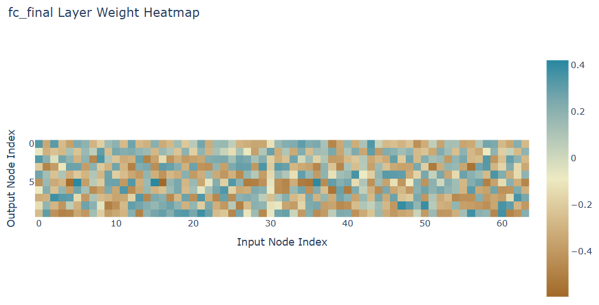
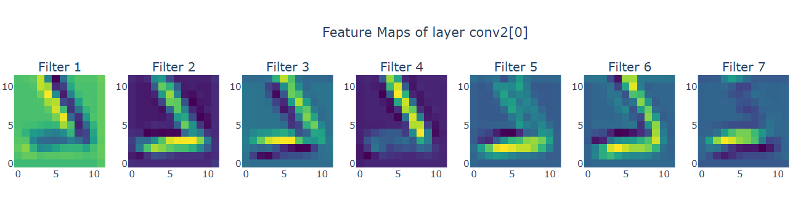

## 목차
* [1. 레이어의 가중치 및 출력 확인의 필요성](#1-레이어의-가중치-및-출력-확인의-필요성)
* [2. 가중치와 출력값을 확인할 레이어 가져오기](#2-가중치와-출력값을-확인할-레이어-가져오기)
* [3. 레이어의 가중치 확인](#3-레이어의-가중치-확인)
  * [3-1. 가중치 확인하기](#3-1-가중치-확인하기)
  * [3-2. 가중치 시각화](#3-2-가중치-시각화)
* [4. 레이어의 출력값 확인](#4-레이어의-출력값-확인)
  * [4-1. 출력값 확인하기](#4-1-출력값-확인하기) 
  * [4-2. 출력값 시각화](#4-2-출력값-시각화)
* [5. 참고하면 좋은 문서](#5-참고하면-좋은-문서)

## 1. 레이어의 가중치 및 출력 확인의 필요성

딥러닝 모델에서 레이어 별 가중치 및 그 출력값을 확인해야 할 필요가 있을 때가 있다. 이는 예를 들어 다음과 같은 필요성에서 기인한다.

* 모델의 학습 과정에 문제 (예: 출력값의 overflow) 가 있을 때, 구체적으로 어떤 레이어에서 발생했는지 확인
  * 특정 데이터에서 오답을 했을 때, 이에 대한 상세한 이유를 분석하려는 경우 
* 모델의 학습 과정에 대한 더욱 깊은 이해를 통해 성능 개선을 시도하는 경우

여기서는 **다음과 같은 모델을 MNIST 숫자 데이터셋으로 학습했을 때** 의 예를 가지고 설명한다.


## 2. 가중치와 출력값을 확인할 레이어 가져오기

레이어의 가중치 또는 출력값을 확인하려면, 먼저 그 레이어를 '가져와야' 한다. 이때 다음과 같은 방법을 이용하면 된다.

* 먼저, 해당 모델을 ```print(model)``` 을 이용하여 출력한다.

```text
CNN(
  (conv1): Sequential(
    (0): Conv2d(1, 32, kernel_size=(3, 3), stride=(1, 1), padding=(1, 1))
    (1): ReLU()
  )
  (pool1): MaxPool2d(kernel_size=2, stride=2, padding=0, dilation=1, ceil_mode=False) ... (A)
  (conv2): Sequential(
    (0): Conv2d(32, 64, kernel_size=(3, 3), stride=(1, 1)) ... (B)
    (1): ReLU()
  )
  (pool2): MaxPool2d(kernel_size=2, stride=2, padding=0, dilation=1, ceil_mode=False)
  (conv3): Sequential(
    (0): Conv2d(64, 64, kernel_size=(3, 3), stride=(1, 1))
    (1): ReLU()
  )
  (fc1): Sequential(
    (0): Linear(in_features=1024, out_features=64, bias=True)
    (1): Sigmoid() ... (C)
  )
  (fc_final): Sequential(
    (0): Linear(in_features=64, out_features=10, bias=True)
    (1): Softmax(dim=None)
  )
)
```

* 그 후, 원하는 레이어를 다음과 같은 방식으로 **그 위치를 이용하여** 참조하면 된다.
  * 위 결과에서 **(A)**, **(B)**, **(C)** 로 표시된 레이어를 예로 들었다.

| 레이어     | 위치                  | 참조 방법                |
|---------|---------------------|----------------------|
| **(A)** | CNN > (pool1)       | ```model.pool1```    |
| **(B)** | CNN > (conv2) > (0) | ```model.conv2[0]``` |
| **(C)** | CNN > (fc1) > (1)   | ```model.fc1[1]```   |

## 3. 레이어의 가중치 확인

PyTorch 에서 각 레이어의 가중치를 확인하고 이를 시각화하는 방법은 다음과 같다. 여기서는 위 모델의 마지막 레이어인 ```(fc_final)``` 의 안에 있는 ```(0): Linear(in_features=64, out_features=10, bias=True)``` 레이어를 예로 든다.

```text
(fc_final): Sequential(
    (0): Linear(in_features=64, out_features=10, bias=True)
    (1): Softmax(dim=None)
)
```

### 3-1. 가중치 확인하기

**1. 가중치 확인하기**

```python
model.fc_final[0].weight
```

* 결과

```text
Parameter containing:
tensor([[     0.3259,     -0.3363,      0.3166,     -0.2598,     -0.3674,      0.2378,      0.1951,     -0.2927,
             -0.1897,      0.1439,      0.1938,     -0.2643,      0.2750,     -0.2722,     -0.3022,      0.2066,
             -0.3244,     -0.2733,      0.1433,     -0.2132,      0.0731,      0.2611,     -0.3208,      0.1557,
              0.1646,      0.0516,     -0.2918,     -0.3169,     -0.3479,     -0.3422,     -0.1175,      0.1620,
              
              ...
              
              0.2245,     -0.4243,     -0.3297,     -0.2310,      0.1654,     -0.3248,     -0.4012,     -0.3519,
             -0.3265,      0.0264,     -0.3892,      0.1527,     -0.4085,     -0.4013,     -0.3063,      0.1313,
              0.3693,      0.2008,      0.1812,     -0.4700,      0.3660,     -0.4805,     -0.4215,      0.2140]],
       requires_grad=True)
```

----

**2. 가중치의 형태 (shape) 확인하기**

```python
model.fc_final[0].weight.shape
```

* 결과
  * 해당 가중치의 바로 앞에 있는 layer 의 node 가 64개, 바로 뒤에 있는 layer 의 node 가 10개이므로 아래와 같다.

```text
torch.Size([10, 64])
```

----

**3. bias (편향) 확인하기**

```python
model.fc_final[0].bias
```

* 결과

```text
Parameter containing:
tensor([ 0.0335, -0.0661, -0.0838,  0.0499,  0.0489,  0.0905, -0.0035,  0.0480,  0.1306, -0.0677], requires_grad=True)
```

----

**4. bias (편향) 의 형태 (shape) 확인하기**

```python
model.fc_final[0].bias.shape
```

* 결과

```text
torch.Size([10])
```

### 3-2. 가중치 시각화

다음과 같이 가중치를 시각화하여 표현하면 가중치의 분포 등에 이상이 있는지를 직관적으로 확인할 수 있다. 여기서는 비교적 깔끔한 디자인으로 표시되는 Plotly를 이용했다.

```python
import plotly.express as px

# NumPy 행렬로 변환하기 위해서, GPU 에 있는 경우 먼저 detach() 를 통해 내려야 함!!
weights = model.fc_final[0].weight.detach().numpy()

# heatmap 표시
fig = px.imshow(weights, 
                color_continuous_scale='earth', 
                labels={'x': 'Input Node Index',
                        'y': 'Output Node Index'},
                title="fc_final Layer Weight Heatmap")

fig.show()
```

* 결과



## 4. 레이어의 출력값 확인

PyTorch 에서 각 레이어의 출력값을 확인하고 이를 시각화하는 방법은 다음과 같다. 여기서는 위 모델의 다음 레이어의 ```(0): Conv2d(32, 64, kernel_size=(3, 3), stride=(1, 1))``` 부분의 출력값을 확인한다.

```text
  (conv2): Sequential(
    (0): Conv2d(32, 64, kernel_size=(3, 3), stride=(1, 1))
    (1): ReLU()
  )
```

### 4-1. 출력값 확인하기

다음과 같이 모델에 데이터를 입력시킬 때 **hook 을 적용해서, 특정 레이어 출력 시 해당 hook 을 통해 해당 레이어의 output feature map을 저장** 한다.

* 먼저, hook function 을 정의한다.
* 모델에 데이터를 입력한다. 이때 hook 이 등록된 레이어를 지나면 hook 함수가 실행된다.
* 모델 출력이 완료된 후, hook 을 제거한다.

```python
output_feature_maps = {}

# feature map (output) 을 출력하는 hook 함수
def hook_fn(module, input, output):
    output_feature_maps['conv2'] = output

hook = model.conv2[0].register_forward_hook(hook_fn)  # 모델의 conv2[0] 레이어에 hook 추가
outputs = model(images)
hook.remove()  # hook 제거

output_feature_maps_ = output_feature_maps['conv2'].detach().numpy()

# conv2[0] 레이어의 feature map 확인
print(np.shape(output_feature_maps_))  # (BATCH_SIZE, FILTER_COUNT, H, W) = (32, 64, 12, 12)
print(output_feature_maps_)
```

* 위 코드에서는 모델의 ```conv2[0]``` 레이어의 출력값이 ```output_feature_maps['conv2']``` 에 저장된다.
* 이를 NumPy 형식으로 바꿔서 ```output_feature_maps_``` 에 저장한다.

### 4-2. 출력값 시각화

위에서 얻은 ```conv2[0]``` 레이어의 출력값을 NumPy 형식으로 저장한 ```output_feature_maps_``` 를 Plotly 를 이용하여 다음과 같이 시각화할 수 있다.

```python
import plotly.graph_objects as go
from plotly.subplots import make_subplots

num_filters = output_feature_maps_.shape[1]  # Filter Count

# figure 정의
fig = make_subplots(rows=1,
                    cols=num_filters,
                    subplot_titles=[f"Filter {i+1}" for i in range(num_filters)])

# 각 필터의 feature map 을 figure 에 추가
for i in range(num_filters):
    fig.add_trace(go.Heatmap(
        z=output_feature_maps_[0, i],  # batch 의 0 번째 항목의 i 번째 필터의 feature map
        colorscale="viridis",
        showscale=False,
        name=f"Filter {i+1}"
    ), row=1, col=i+1)

# figure 의 제목 및 grid, 높이, 너비 설정
fig.update_layout(
    title="Feature Maps of layer conv2[0]",
    grid=dict(rows=1, columns=num_filters),
    height=300, width=150 * num_filters
)

# figure 표시
fig.show()
```

* 결과



## 5. 참고하면 좋은 문서

* [PyTorch 의 state_dict 사용법](딥러닝_실무_PyTorch_state_dict_사용법.md)
