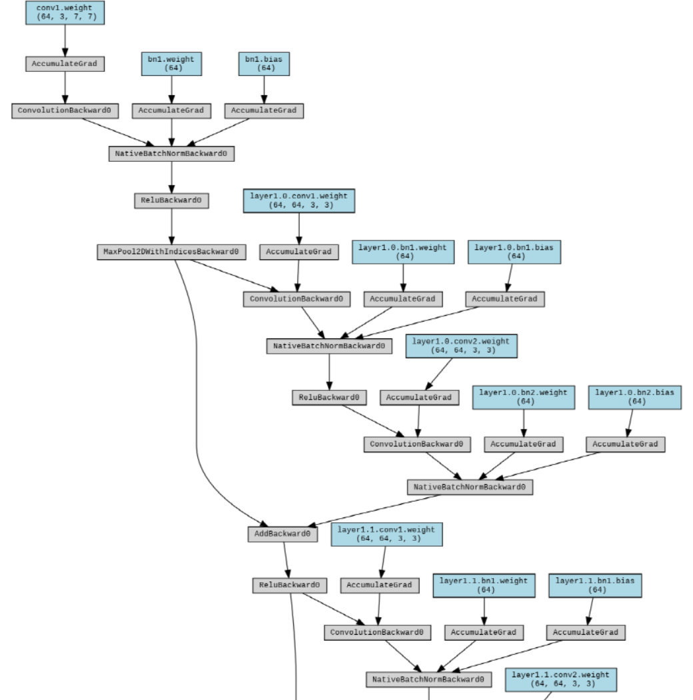
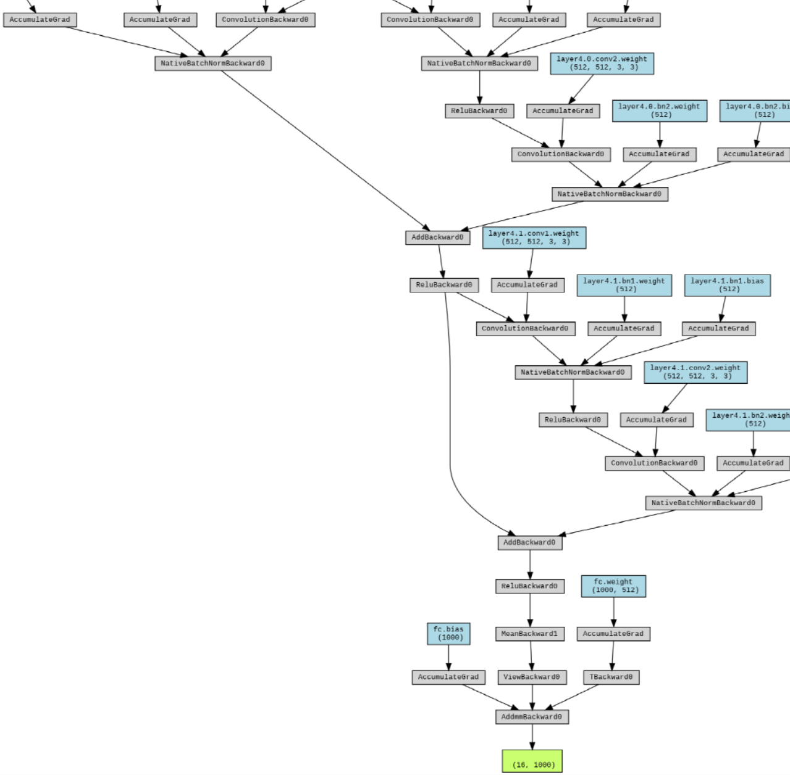
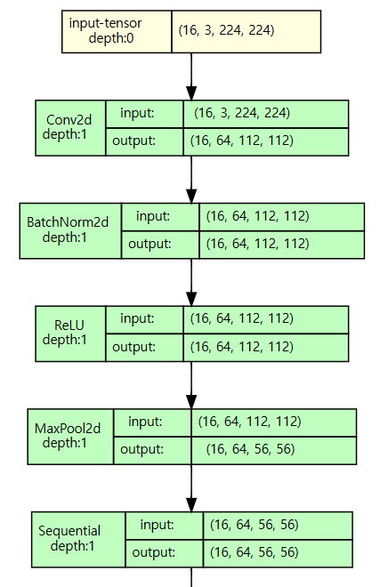
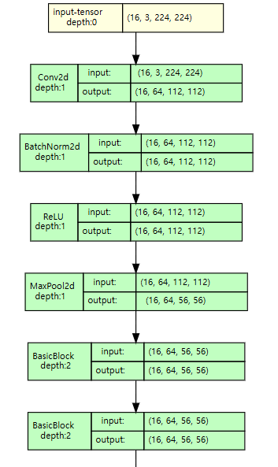
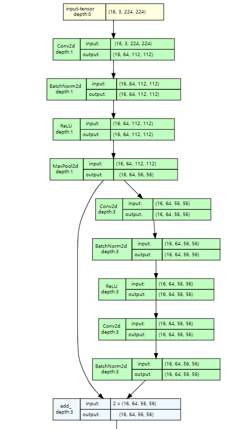
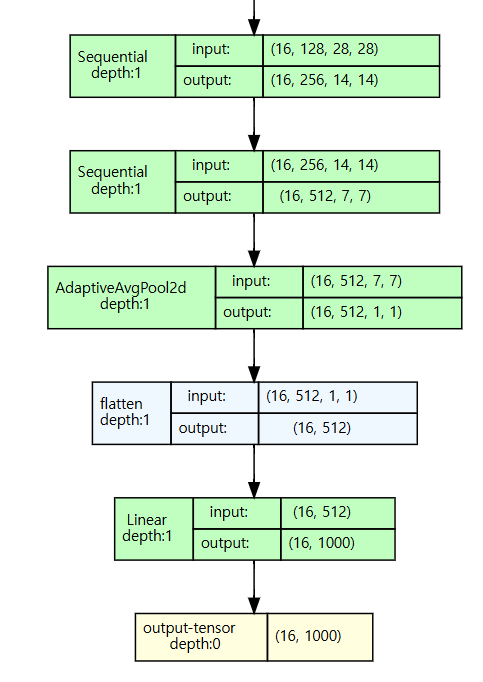
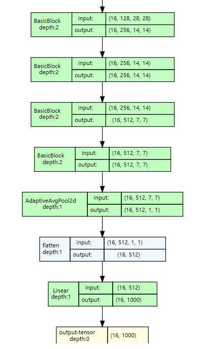
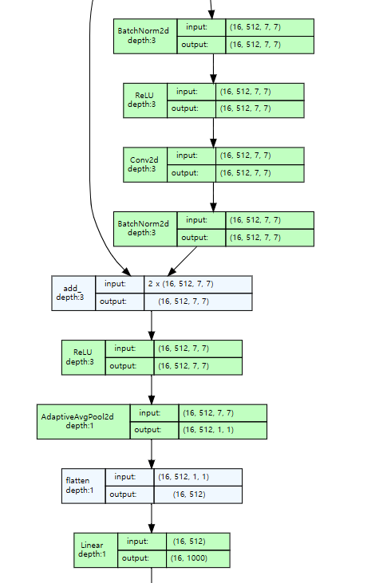

## 목차
* [1. 모델 구조 시각화의 중요성](#1-모델-구조-시각화의-중요성)
* [2. 모델 구조 시각화 방법 (라이브러리)](#2-모델-구조-시각화-방법-라이브러리)
  * [2-1. ```print(model)``` 이용](#2-1-printmodel-이용)
  * [2-2. ```torchinfo.summary()``` 이용](#2-2-torchinfosummary-이용)
  * [2-3. graphviz + torchviz](#2-3-graphviz--torchviz)
  * [2-4. ```torchview.draw_graph()``` 이용](#2-4-torchviewdrawgraph-이용)

## 1. 모델 구조 시각화의 중요성

**모델 구조 시각화** 는 딥러닝 모델의 구조를 시각적으로 나타내는 것을 말한다. 모델 구조 시각화가 중요한 이유는 다음과 같다.

* 모델에 대한 이해 측면
  * 모델의 전체 구조를 한눈에 파악하여 **직관적인 이해** 가능
  * 모델의 **상세 구조에 대해 Deep 하게 파악** 하는 데에 큰 도움이 됨
* 성능 개선 및 문제 해결 측면 
  * 모델을 실무에 적용 중 **문제 (버그 등) 가 발생했을 때,** 어느 부분에서 문제가 발생했는지 파악하거나 이를 위한 계획 수립 가능
  * 모델의 성능을 **추가적으로 향상** 시킬 수 있는 부분을 빠르게 찾고, 이를 통해 효율적인 성능 개선 작업 가능

## 2. 모델 구조 시각화 방법 (라이브러리)

PyTorch 에서 모델 구조를 시각화하기 위한 방법으로 널리 알려진 것은 다음과 같다.

| 방법                                              | 복잡도   | 모델 도식화  | 설명                                     | 설치해야 하는 라이브러리 등                 |
|-------------------------------------------------|-------|---------|----------------------------------------|---------------------------------|
| ```print(model)``` 이용                           | 매우 낮음 | ❌ (텍스트) | 사용법이 가장 간단하지만, 알 수 있는 정보가 제한됨          | 없음                              |
| ```torchinfo.summary()``` 이용                    | 낮음    | ❌ (텍스트) | ```print(model)``` 에 비해 더 많은 정보를 표시한다. | torchinfo                       |
| graphviz + torchviz                             | 보통    | ✅ (이미지) | PyTorch의 autograd 로 추적한 계산 그래프를 시각화    | torchvision, torchviz, graphviz |
| ```torchview.draw_graph()``` 이용<br>**(강력히 추천)** | 낮음    | ✅ (이미지) | 간단한 사용법 & 효과적인 시각화                     | torchview, graphviz             |

* 복잡도 : 사용법의 복잡한 정도
* 모델 도식화 : 모델 구조를 텍스트가 아닌 실제 그림으로 나타내어, **갈라지는 부분 (분기점) 및 합쳐지는 부분** 등을 파악 가능한지의 여부

----

여기에서는 PyTorch를 통해 다음과 같은 방법으로 가져온 ResNet-18 모델을 기준으로 설명한다.

```
import torch
import torchvision.models as models

# ResNet18 모델 가져오기
resnet18 = models.resnet18(pretrained=True)
```

### 2-1. ```print(model)``` 이용

이 방법은 추가적인 라이브러리 설치 없이 PyTorch 라이브러리의 자체적인 모델 print 기능을 사용한 것이다.

* 핵심 아이디어
  * 모델의 구조를 **PyTorch 에서 모델을 만들기 위해 사용하는 함수 구문 형태** 로 **텍스트** 출력
  * 1개의 layer 를 1개의 line 으로 출력
* 장점
  * 사용법이 매우 간단하다.
  * PyTorch 의 모델 함수 및 그 인수를 그대로 표시하기 때문에 PyTorch 를 잘 아는 경우 해석이 쉽다.
* 단점 
  * 그림이 아닌 텍스트 형태이므로 시각적 효과가 떨어진다.
  * 모델의 분기점 및 합쳐지는 부분을 파악하기 어렵다.
* 코드

```python
print(resnet18)
```

* 실행 결과

```text
ResNet(
  (conv1): Conv2d(3, 64, kernel_size=(7, 7), stride=(2, 2), padding=(3, 3), bias=False)
  (bn1): BatchNorm2d(64, eps=1e-05, momentum=0.1, affine=True, track_running_stats=True)
  (relu): ReLU(inplace=True)
  (maxpool): MaxPool2d(kernel_size=3, stride=2, padding=1, dilation=1, ceil_mode=False)
  (layer1): Sequential(
    (0): BasicBlock(
      (conv1): Conv2d(64, 64, kernel_size=(3, 3), stride=(1, 1), padding=(1, 1), bias=False)
      (bn1): BatchNorm2d(64, eps=1e-05, momentum=0.1, affine=True, track_running_stats=True)
      (relu): ReLU(inplace=True)
      
...

      (conv1): Conv2d(512, 512, kernel_size=(3, 3), stride=(1, 1), padding=(1, 1), bias=False)
      (bn1): BatchNorm2d(512, eps=1e-05, momentum=0.1, affine=True, track_running_stats=True)
      (relu): ReLU(inplace=True)
      (conv2): Conv2d(512, 512, kernel_size=(3, 3), stride=(1, 1), padding=(1, 1), bias=False)
      (bn2): BatchNorm2d(512, eps=1e-05, momentum=0.1, affine=True, track_running_stats=True)
    )
  )
  (avgpool): AdaptiveAvgPool2d(output_size=(1, 1))
  (fc): Linear(in_features=512, out_features=1000, bias=True)
)
```

### 2-2. ```torchinfo.summary()``` 이용

이 방법은 ```torchinfo``` 라는 라이브러리를 추가로 설치해야 한다.

* 핵심 아이디어
  * 모델의 구조를 각 레이어 별 **출력되는 데이터의 형태 및 파라미터 개수를 중심** 으로 텍스트 형태로 출력
* 장점
  * 라이브러리 하나만 더 설치하면 되고, 그 사용법 자체는 간단하다.
  * ```print(model)``` 에 비해, 다음과 같은 추가적인 정보를 확인할 수 있다.
    * 전체 파라미터 개수 및 용량
    * 각 레이어 별 출력되는 데이터의 shape 및 파라미터 개수
* 단점
  * 여전히 그림이 아닌 텍스트 형태이므로 시각적 효과가 떨어진다.
  * 여전히 모델의 분기점 및 합쳐지는 부분을 파악하기 어렵다.
* 코드

```python
import torchinfo
torchinfo.summary(resnet18, input_size=(32, 3, 224, 224))
```

* 실행 결과

```text
==========================================================================================
Layer (type:depth-idx)                   Output Shape              Param #
==========================================================================================
ResNet                                   [32, 1000]                --
├─Conv2d: 1-1                            [32, 64, 112, 112]        9,408
├─BatchNorm2d: 1-2                       [32, 64, 112, 112]        128
├─ReLU: 1-3                              [32, 64, 112, 112]        --
├─MaxPool2d: 1-4                         [32, 64, 56, 56]          --
├─Sequential: 1-5                        [32, 64, 56, 56]          --
│    └─BasicBlock: 2-1                   [32, 64, 56, 56]          --

...

│    │    └─Conv2d: 3-49                 [32, 512, 7, 7]           2,359,296
│    │    └─BatchNorm2d: 3-50            [32, 512, 7, 7]           1,024
│    │    └─ReLU: 3-51                   [32, 512, 7, 7]           --
├─AdaptiveAvgPool2d: 1-9                 [32, 512, 1, 1]           --
├─Linear: 1-10                           [32, 1000]                513,000
==========================================================================================
Total params: 11,689,512
Trainable params: 11,689,512
Non-trainable params: 0
Total mult-adds (Units.GIGABYTES): 58.05
==========================================================================================
Input size (MB): 19.27
Forward/backward pass size (MB): 1271.92
Params size (MB): 46.76
Estimated Total Size (MB): 1337.94
=========================================================================================
```

### 2-3. graphviz + torchviz

이 방법은 ```torchvision```, ```torchviz```, ```graphviz``` 라는 3개의 라이브러리를 설치해야 하는 방법이다. 앞에서 소개한 2가지 방법에 비해 설치해야 할 모델이 다소 많으며, 사용법도 다소 복잡하다.

* 핵심 아이디어
  * PyTorch 의 모델 계산 그래프 추적 기능인 ```autograd``` 를 이용하여 계산 그래프를 추적한다.
  * 이 계산 그래프를 ```graphviz``` 를 통해 시각화한다.
* 장점
  * 그래프에 대한 도식화를 제공하며, 모델의 분기점 및 합쳐지는 부분을 파악할 수 있다. 
* 단점
  * 사용법이 다소 복잡하다.
  * 모델의 기본 정보뿐만 아니라 너무 많은 정보를 제공하여 모델 구조 파악이 오히려 어려울 수 있다.
* 코드

```python
# 모델의 계산 그래프를 동적으로 생성하기 위해서 모의 입력을 넣음
dummy_input = torch.randn(16, 3, 224, 224)
output = resnet18(dummy_input)

# 모델 계산 그래프 생성
dot = make_dot(output, params=dict(resnet18.named_parameters()))

# 그래프 렌더링 및 저장 (저장된 resnet18_graph.png 파일을 열면 됨)
dot.render("resnet18_graph", format="png", cleanup=True)
```

* 실행 결과





### 2-4. ```torchview.draw_graph()``` 이용

이 방법은 ```torchview``` 라이브러리만 이용하는 비교적 간단하면서도, 효과적인 시각화가 가능하다. 따라서 **사용을 강력히 추천하는 방법** 이다. (단, 해당 라이브러리를 사용하기 위해 ```graphviz``` 라이브러리를 추가 설치해야 한다.)

* 핵심 아이디어
  * **간단한 사용법으로도 효과적으로 모델을 시각화**
  * 'depth'와 같은 다양한 옵션을 통해서 모델 표시 범위, 시각화된 그림에 표시할 내용 등을 입맛에 맞게 조절 가능
* 장점
  * 사용법이 비교적 간단하다.
  * 그래프에 대한 도식화를 제공하며, 모델의 분기점 및 합쳐지는 부분을 파악할 수 있다.
  * 사용자의 입맛에 맞게 '나무'를 볼지, 아니면 '숲'을 볼지 선택 가능하다.
* 단점
  * 현재까지는 특별한 단점을 느끼지 못하고 있다.
* 코드

```python
from torchview import draw_graph

model_graph = draw_graph(resnet18, input_size=(16, 3, 224, 224), depth=depth)
model_graph.visual_graph
```

* 실행 결과
  * depth 의 값이 작을수록 모델의 전체적인 구조 (숲) 를 간단히 표시한다.
  * depth 의 값이 클수록 모델의 세부 구조 (나무) 를 자세히 표시한다.

|       | depth = 1                                    | depth = 2                                    | depth = 3                                    |
|-------|----------------------------------------------|----------------------------------------------|----------------------------------------------|
| 입력 부분 |  |  |  |
| 출력 부분 |  |  |  |