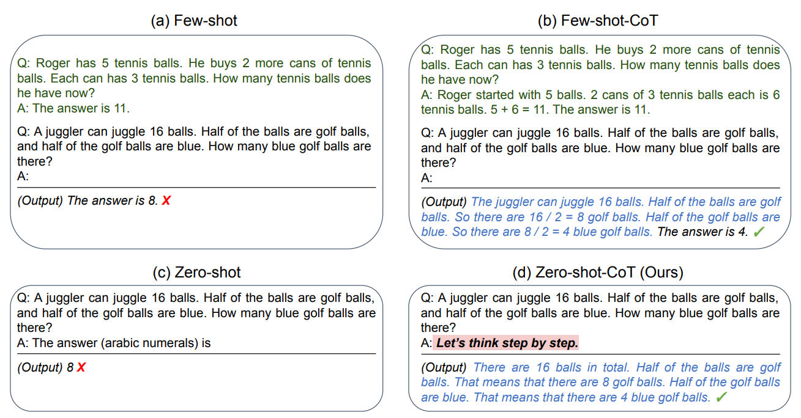

## 목차

* [1. 생각의 사슬 (Chain of Thought)](#1-생각의-사슬-chain-of-thought)
  * [1-1. 예시](#1-1-예시) 
* [2. Chain of Thought 의 중요성](#2-chain-of-thought-의-중요성)
* [3. Chain of Thought 의 역사](#3-chain-of-thought-의-역사)
  * [3-1. Chain of Thought Prompting](#3-1-chain-of-thought-prompting) 
  * [3-2. 추론형 모델 등장 이후](#3-2-추론형-모델-등장-이후)
* [4. Chain of Thought 이 실제로 구현된 모델](#4-chain-of-thought-이-실제로-구현된-모델)

## 1. 생각의 사슬 (Chain of Thought)

**생각의 사슬 (Chain of Thought, CoT)** 은 거대 언어 모델이 사용자의 질문 (프롬프트) 에 대해 **단계적인 사고 과정** 을 거쳐 답변을 내놓는 것을 말한다.

* 즉, 거대 언어 모델이 **문제를 자체적으로 여러 단계로 나누어서 해결하는** 문제 해결 전략이다.

생각의 사슬이 가지고 있는 장단점은 다음과 같다.

* 장점
  * [환각 현상](LLM_기초_환각_현상.md) 과 같은 흔히 알려진 거대 언어 모델의 오류를 줄여서 모델의 신뢰성을 향상시킨다.
  * [추론형 모델](LLM_기초_추론형_모델.md) 의 추론 능력을 구현할 수 있다.
* 단점
  * 모델이 최종 답변을 도출하는 데 걸리는 시간이 길어질 수 있다. 

### 1-1. 예시

```text
2차 방정식 x^2 - 6x + 8 = 0 을 해결하시오.
```

위 문제의 해결에 대해 Chain of Thought 을 적용하면 다음과 같이 해결할 수 있다. **(실제 ChatGPT-o1 에 [질문](https://chatgpt.com/share/67c8f8f6-31ac-8010-a93a-c0849c73983c)한 결과이다.)**

* 인수분해 시도
  * $x^2 - 6x + 8 = (x - 2)(x - 4)$
* 각 인수를 0으로 두어 해를 도출
  * $x - 2 = 0$ 에서 $x = 2$
  * $x - 4 = 0$ 에서 $x = 4$
* 최종 결론 도출
  * 이 방정식의 해는 $x = 2$ 와 $x = 4$ 이다. 

## 2. Chain of Thought 의 중요성

Chain of Thought 은 **최근 LLM의 트렌드 중 하나인 [추론형 모델](LLM_기초_추론형_모델.md) 을 구현하는 데 있어서 필수적** 이다.

일반 거대 언어 모델은 해결하지 못하는 복잡한 문제 (예: 수능 수학의 4점 문제) 의 해결 과정에서는 사람 역시 **대부분 해당 문제를 단계적으로 분해** 하여 해결하고, 이것이 문제 해결에 있어서 거의 필수적이다. Chain of Thought 은 이를 컴퓨터가 수행할 수 있도록 구현한 것이다.

## 3. Chain of Thought 의 역사

Chain of Thought 의 역사는 **일반 거대 언어 모델만 있었을 때** 과 **추론형 모델 이후** 로 나뉜다.

| 시기                           | 설명                                                                 |
|------------------------------|--------------------------------------------------------------------|
| 2022.12. - 2024.09. (일반 LLM) | [프롬프트 엔지니어링](LLM_기초_Prompt_Engineering.md) 을 통해 모델이 단계적으로 사고하도록 유도 |
| 2024.09. - 현재 (추론형 LLM 등장)   | 추론형 모델은 자체적으로 Chain of Thought 을 생성하는 능력이 있음                       |

### 3-1. Chain of Thought Prompting

추론형 LLM의 등장 이전에는 **사람이 직접 [프롬프트 엔지니어링](LLM_기초_Prompt_Engineering.md) 을 통해 모델이 단계적으로 사고하도록 유도** 했다. 그 대표적인 방법으로 **Few-shot CoT** 와 **Zero-shot CoT** 가 있다.



([출처](https://arxiv.org/pdf/2205.11916) : Takeshi Kojima, Shixiang Shane Gu et al, "Large Language Models are Zero-Shot Reasoners", 2022)

**1. Few-shot CoT**

핵심 아이디어

* [Few-shot Learning](../../Others/Others_Zero,One,Few%20Shot%20Learning.md#few-shot-learning) 과 유사하게, 사람의 **단계적 사고 과정이 담긴 몇 개의 예시를 프롬프트에 포함** 하고, 이를 통해 LLM이 단계적 사고를 할 수 있도록 돕는다.

예시

```text
어느 학교의 학생 300명 중 30%는 올해 6월 모의고사 수학 점수가 70점 이상이다. 그 중 80%는 올해 6월 모의고사 영어 점수가 70점 이상이다. 올해 6월 모의고사의 수학과 영어가 모두 70점 이상인 학생은 몇 명인가?
 - 6월 모의고사 수학 점수가 70점 이상인 학생은 300명 x 30% = 90명이다.
 - 이 중 6월 모의고사 영어 점수가 70점 이상인 학생은 90명 x 80% = 72명이다.
 - 따라서 답은 72명이다.

어느 도시의 인구는 100만 명이다. 전체 인구의 50%는 강북에 살고, 그 중 20%는 학생이다. 이 도시의 강북에 사는 학생은 몇 명인가?
```

[ChatGPT 실제 답변](https://chatgpt.com/share/67c8fd3b-3074-8010-b715-e26c954f71f8)

```text
이 문제를 단계별로 해결해 보겠습니다.

전체 인구: 100만 명
강북에 사는 인구: 100만 × 50% = 50만명
강북에 사는 인구 중 학생 비율: 20%
강북에 사는 학생 수: 50만 × 20% = 10만명
따라서, 강북에 사는 학생 수는 10만 명입니다.
```

**2. Zero-Shot CoT**

핵심 아이디어

* [Zero-shot Learning](../../Others/Others_Zero,One,Few%20Shot%20Learning.md#zero-shot-learning) 과 유사하게, 단계적 사고 과정에 대한 예시를 제공하지 않고 **단계적으로 사고하라고 지시** 하여, LLM이 단계적 사고를 할 수 있도록 한다.

예시

```text
어느 도시의 인구는 100만 명이다. 전체 인구의 50%는 강북에 살고, 그 중 20%는 학생이다. 이 도시의 강북에 사는 학생은 몇 명인가? 단계적으로 사고하며 문제를 해결해 줘.
```

[ChatGPT 실제 답변](https://chatgpt.com/share/67c8fe37-da24-8010-8da9-d259bb097ca9)

```text
이 문제를 단계적으로 해결해 보자.

1단계: 전체 인구 확인
이 도시의 전체 인구는 100만 명이다.

2단계: 강북 인구 계산
전체 인구의 50%가 강북에 거주하므로,
강북인구 = 100만 × 0.5 = 50만

3단계: 강북에 사는 학생 수 계산
강북 인구 중 20%가 학생이므로,
강북학생수 = 50만 × 0.2 = 10만

최종 답변:
강북에 사는 학생 수는 10만 명이다. ✅
```

### 3-2. 추론형 모델 등장 이후

2024년 9월 OpenAI의 o1을 필두로 **추론형 LLM이 등장**한 이후에는, 추론형 LLM이 **자체적으로 CoT를 이용한 추론 기능을 포함** 하고 있는 경우가 많다.

추론형 모델을 이용하는 경우, 위와 같은 프롬프트 엔지니어링 방식은 더 이상 불필요할 것으로 보인다.

## 4. Chain of Thought 이 실제로 구현된 모델

많은 [추론형 거대 언어 모델](LLM_기초_추론형_모델.md) 에는 Chain of Thought 이 적용되어 있다.

* 2024년 9월, [OpenAI - o1](../../AI%20Trend/AI_TREND_Sep_2024.md#20240915-일)
* 2025년 1월, [DeepSeek - R1](../../AI%20Trend/AI_Trend_Jan_2025.md#20250122-수)
* 2025년 2월, [OpenAI - o3-mini](../../AI%20Trend/AI_Trend_Feb_2025.md#20250204-화)
* 2025년 2월, [xAI (일론 머스크 스타트업) - Grok-3](../../AI%20Trend/AI_Trend_Feb_2025.md#20250218-화)
* 이 외 다수의 추론형 LLM