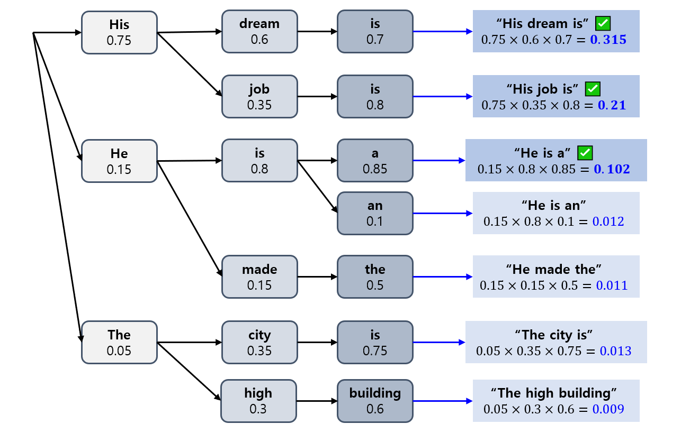

## 목차

* [1. Decoding 이란?](#1-decoding-이란)
* [2. 다양한 Decoding 전략](#2-다양한-decoding-전략)
  * [2-1. Greedy Search](#2-1-greedy-search)
  * [2-2. Beam Search](#2-2-beam-search)
  * [2-3. top-k Sampling](#2-3-top-k-sampling)
  * [2-4. top-p Sampling (Nucleus Sampling)](#2-4-top-p-sampling-nucleus-sampling)
  * [2-5. Temperature 조정](#2-5-temperature-조정)

## 1. Decoding 이란?

**Decoding (디코딩)** 은 언어 모델이 Next Token Prediction 결과의 확률분포로 나온 **Next Token 들 중 어느 것을 선택할지 결정하는 것** 을 말한다.

* GPT 계열 Causal LLM 의 핵심 작동 원리인 [Transformer 모델](../../Natural%20Language%20Processing/Basics_트랜스포머%20모델.md) 의 'Decoder'에서 따온 것으로 추정된다.

## 2. 다양한 Decoding 전략

Decoding 전략들을 간단히 요약하면 다음과 같다.

| Decoding 전략                       | 설명                                                               |
|-----------------------------------|------------------------------------------------------------------|
| Greedy Search                     | 확률이 **가장 높은 token 1개** 를 선택한다.                                   |
| Beam Search                       | 여러 개의 이어지는 next token 생성 → **확률 곱이 가장 높은 조합** K개 선택              |
| top-k Sampling                    | 확률이 **가장 높은 token k 개** 중 1개를 그 확률분포에 따라 선택                      |
| top-p Sampling (Nucleus Sampling) | 확률의 **누적 합이 p 이상인 최소한의 token 집합** 에서 token 1개를 그 확률분포에 따라 선택     |
| temperature 조정                    | **확률분포 자체를 조정** (모든 token 의 확률을 서로 비슷하게 하거나, 확률 차이를 더 크게 할 수 있음) |

### 2-1. Greedy Search

**Greedy Search** 는 **가장 간단한 방법** 으로, Next token prediction 결과 확률분포에서 **확률이 가장 큰 1개의 token 을 선택** 하는 것을 말한다.

### 2-2. Beam Search

**Beam Search** 는 다음과 같이 동작한다.

* Next token prediction 을 **1개의 토큰이 아닌, 여러 개의 이어지는 토큰** 에 대해 실행하여 **next token 의 조합** 을 만든다.
* 이 조합 중 **확률 곱 (또는 로그 확률 곱)** 이 가장 높은 k 개를 선택한다.

### 2-3. top-k Sampling

**top-k Sampling** 은 **확률이 가장 높은 k 개의 token** 중 1개를 **그 확률분포를 기준으로** 선택하는 것이다.

### 2-4. top-p Sampling (Nucleus Sampling)

**top-p Sampling** 은 다음과 같이 동작한다.

* 모든 token 들을 확률이 높은 순서대로 정렬한다.
* 확률이 가장 큰 token 부터 **누적 확률 합이 p 이상이 되는 최초의 token** 까지의 token 중 1개를 **그 확률분포를 기준으로** 선택한다.

### 2-5. Temperature 조정

**Temperature** 는 다음과 같이 **[Softmax 함수](../Deep%20Learning%20Basics/딥러닝_기초_활성화_함수.md#2-5-softmax-함수) 기반으로 분류 문제에서 각 Label (Class) 의 확률을 예측** 할 때, **$e^{value}$ 대신 $e^{value / T}$ 와 같이 지수부분을 특정 값으로 나누는** 개념이다. [(참고)](../Deep%20Learning%20Basics/딥러닝_기초_Knowledge_Distillation.md#4-1-soft-label)

이 Temperature 를 **LLM 의 Decoding 에도 적용** 할 수 있는데, 그때의 방법 및 특징은 다음과 같다.

* Next token 에 대한 분류 문제를 가정하고, **각 next token 을 label (class) 로 간주** 한다.
* 각 next token 에 대해 동일한 방법으로 temperature 를 적용한다.

| 조건                        | 설명                      |
|---------------------------|-------------------------|
| temperature > 1.0 (or 증가) | 다양하고 창의적인 응답이 발생할 확률 증가 |
| temperature = 1.0         | 원본 모델 그대로               |
| temperature < 1.0 (or 감소) | 응답의 다양성이 전반적으로 감소       |