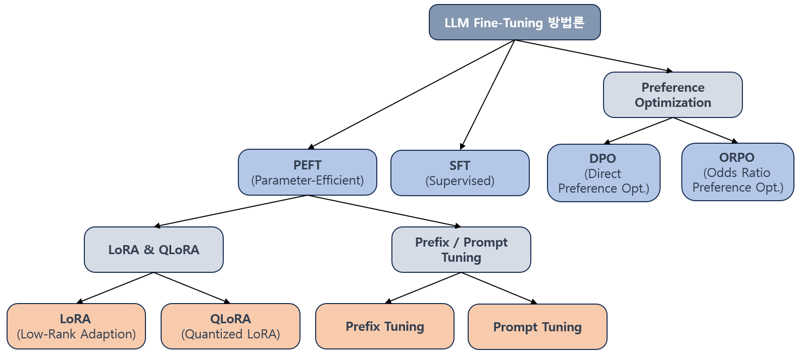
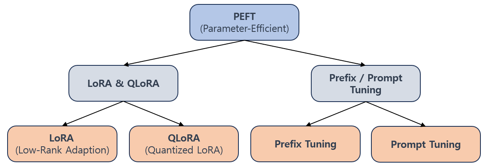

## 목차

* [1. LLM 의 Fine Tuning](#1-llm-의-fine-tuning)
  * [1-1. Prompt Engineering 과의 차이점](#1-1-prompt-engineering-과의-차이점) 
* [2. Fine Tuning 방법론](#2-fine-tuning-방법론)
  * [2-1. PEFT (Parameter-Efficient Fine-Tuning)](#2-1-peft-parameter-efficient-fine-tuning) 
  * [2-2. SFT (Supervised Fine-Tuning)](#2-2-sft-supervised-fine-tuning)
  * [2-3. DPO (Direct Preference Optimization)](#2-3-dpo-direct-preference-optimization)
  * [2-4. ORPO (Odds Ratio Preference Optimization)](#2-4-orpo-odds-ratio-preference-optimization)
* [3. Fine-Tuning 의 과정](#3-fine-tuning-의-과정)
* [4. 적합한 Fine-Tuning 방법 선택](#4-적합한-fine-tuning-방법-선택)

## 1. LLM 의 Fine-Tuning

**거대 언어 모델의 [Fine-Tuning](../Deep%20Learning%20Basics/딥러닝_기초_Transfer_Learning.md#3-2-미세-조정-fine-tuning)** 은 거대 언어 모델을 주어진 목적 (주로 기업에서 LLM 을 자사 서비스에 최적화하기 위함) 에 맞게 **미세 조정 (Fine-tuning) 을 통해 최적화** 하는 것을 의미한다. 즉,

* 일반적인 지식을 탑재한 거대 언어 모델의 능력을 이용하면서도,
* 자사 서비스를 제공하기 위해 필요한 지식을 추가로 학습시켜 자사 서비스에 최적화시키는 것이다.

비유적으로 설명하면, **전반적인 일반 상식을 갖추고 있는 (original LLM) 고객 상담원을 채용하여, 자사 제품에 대한 내용을 추가로 교육 (fine-tuning)** 시키는 것이다. 

### 1-1. Prompt Engineering 과의 차이점

[프롬프트 엔지니어링](LLM_기초_Prompt_Engineering.md) 과는 **근본적으로 다르다.**

* 프롬프트 엔지니어링이 **LLM의 입력인 프롬프트 자체를 LLM이 원하는 답이 나오도록 최적화** 하는 것이라면,
* 모델의 Fine-tuning 은 **Domain-특화된 내용을 사용자가 입력했을 때 알맞은 답이 나오도록** 하는 것이다.

## 2. Fine Tuning 방법론

Fine-tuning 의 방법론에 대해 정리하면 다음과 같다.

| 방법론                                                                                                                   | 설명                                                                                                                                          |
|-----------------------------------------------------------------------------------------------------------------------|---------------------------------------------------------------------------------------------------------------------------------------------|
| [PEFT (Parameter-Efficient Fine-Tuning)](LLM_기초_Fine_Tuning_PEFT)                                                     | LLM 의 대부분의 파라미터를 freeze 하고, 소수의 파라미터만 Fine-tuning 실시 - [LoRA, QLoRA](LLM_기초_Fine_Tuning_LoRA_QLoRA.md) - Prefix Tuning, Prompt Tuning |
| [SFT (Supervised Fine-Tuning)](LLM_기초_Fine_Tuning_SFT)                                                                | 지도 학습 방식의 Fine-tuning                                                                                                                       |
| [DPO (Direct Preference Optimization)](LLM_기초_Fine_Tuning_DPO_ORPO.md#2-dpo-direct-preference-optimization)           | 인간의 선호도에 대한 데이터와 함께 **기존에 학습된 참조 모델을 활용** 하여 학습                                                                                             |
| [ORPO (Odds Ratio Preference Optimization)](LLM_기초_Fine_Tuning_DPO_ORPO.md#3-orpo-odds-ratio-preference-optimization) | 인간의 선호도에 대한 데이터를 **참조 모델 없이** 학습                                                                                                            |

### 2-1. PEFT (Parameter-Efficient Fine-Tuning)

**[PEFT (Parameter-Efficient Fine-Tuning)](LLM_기초_Fine_Tuning_PEFT)** 는 LLM 을 Fine-tuning 시킬 때 **대부분의 파라미터는 추가 학습하지 않고, 소수의 파라미터에 대해서만 Fine-tuning** 을 하는 것을 의미한다.

그 장점은 다음과 같다.

* 학습 시간 절약 및 메모리 사용 효율화 등 **학습에 필요한 자원 절감**

PEFT 의 세부 방법론은 다음과 같다.

* [LoRA (Low-Rank Adaptation)](LLM_기초_Fine_Tuning_LoRA_QLoRA.md#2-lora-low-rank-adaptation)
  * 거대 언어 모델의 파라미터를 분해하여 일부 파라미터만 학습 
* [QLoRA (Quantized LoRA)](LLM_기초_Fine_Tuning_LoRA_QLoRA.md#3-qlora-quantized-lora)
  * [양자화 (Quantization)](LLM_기초_Quantization.md) 가 적용된 LoRA
* Prefix Tuning
  * 사용자 입력 프롬프트의 앞에 "Task 에 특화된 Vector" 를 추가
* Prompt Tuning
  * 학습 가능한 "Prompt Vector" 를 도입하여 LLM을 Fune-tuning 

### 2-2. SFT (Supervised Fine-Tuning)

**[SFT (Supervised Fine-Tuning)](LLM_기초_Fine_Tuning_SFT.md)** 는 지도 학습 방법으로 거대 언어 모델을 Fine-tuning 하는 것을 말한다.

### 2-3. DPO (Direct Preference Optimization)

**[DPO (Direct Preference Optimization)](LLM_기초_Fine_Tuning_DPO_ORPO.md#2-dpo-direct-preference-optimization)** 의 핵심 아이디어는 다음과 같다.

* 거대 언어 모델의 답변에 대한 인간의 선호도 정보와 함께 **참조 모델 (reference model) 을 활용하여** 학습
* 참조 모델을 이용하여 LLM이 사용자의 선호하는 답변을 제공할 확률 향상
* **강화학습 방식을 이용하지 않아도 됨**

### 2-4. ORPO (Odds Ratio Preference Optimization)

**[ORPO (Odds Ratio Preference Optimization)](LLM_기초_Fine_Tuning_DPO_ORPO.md#3-orpo-odds-ratio-preference-optimization)** 의 핵심 아이디어는 다음과 같다.

* LLM 자체적으로 **참조 모델 없이 사용자의 선호도 데이터까지 학습** 한다.
* 사용자가 선호하는 답변과 그렇지 않은 답변을 구분하기 위해 **선호하는 답변과 그렇지 않은 답변의 발생 확률** 의 개념을 이용한다.

## 3. Fine-Tuning 의 과정

LLM Fine-tuning 의 일반적인 과정은 다음과 같다.

* 사전 학습된 거대 언어 모델과 함께 학습 데이터셋을 준비한다.
* [적절한 Fine-tuning 방법을 선택](#4-적합한-fine-tuning-방법-선택) 한다.
* Fine-tuning 성능 최적화를 위해 적절한 하이퍼파라미터를 설정한다.
* **LLM 을 Fine-tuning 한다.**
* Fine-tuning 된 모델의 성능을 평가한다.
* 원하는 성능 수준에 도달한 경우, Fine-tuning 된 모델을 최종 배포한다.

## 4. 적합한 Fine-Tuning 방법 선택

적절한 Fine-tuning 방법을 선택하기 위해서는 다음을 고려해야 한다.

* 자원 제약 (컴퓨팅 파워, 메모리, 시간 등)
* 현재 가지고 있는, Fine-tuning 을 위해 domain 에 특화된 데이터셋 규모
* 거대 언어 모델의 규모 (자원 제약을 고려한 Fine-tuning 범위 결정에 필요)
