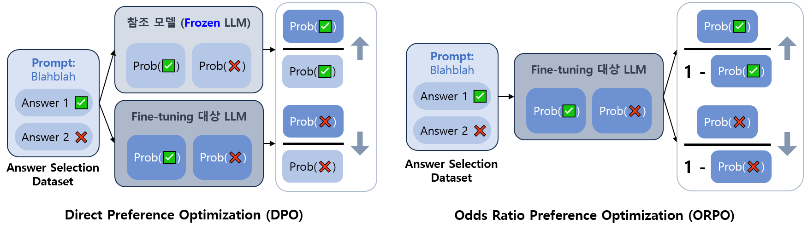
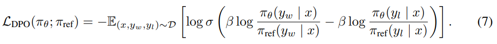
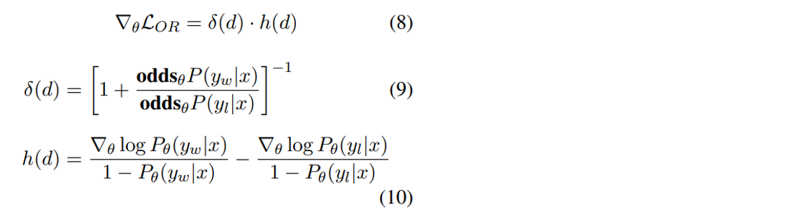

## 목차

* [1. DPO와 ORPO 요약](#1-dpo와-orpo-요약)
  * [1-1. RLHF (Reinforcement Learning from Human Feedback)](#1-1-rlhf-reinforcement-learning-from-human-feedback)
  * [1-2. DPO 와 ORPO 의 비교](#1-2-dpo-와-orpo-의-비교)
* [2. DPO (Direct Preference Optimization)](#2-dpo-direct-preference-optimization)
  * [2-1. DPO의 Loss Function](#2-1-dpo의-loss-function)
* [3. ORPO (Odds Ratio Preference Optimization)](#3-orpo-odds-ratio-preference-optimization)
  * [3-1. ORPO의 Loss Function](#3-1-orpo의-loss-function)
  * [3-2. ORPO의 Loss Function 의 Gradient](#3-2-orpo의-loss-function의-gradient)

## 1. DPO와 ORPO 요약

**DPO (Direct Preference Optimization)** 는 거대 언어 모델을 **참조 모델 (reference model) 이라는 거대 언어 모델** 을 활용하여, LLM이 사용자가 선호하는 답변을 할 확률을 높이도록 [LLM을 Fine-Tuning](LLM_기초_Fine_Tuning.md) 하는 것을 말한다.

* 이때, **RLHF (Reinforcement Learning from Human Feedback)** 와 같은 강화학습 방법론을 이용하지 않아도 된다.
* 참조 모델은 선호하는 답변과 그렇지 않은 답변의 확률의 비율을 적용한 Loss Function 을 이용하여 모델을 최적화하는 데 사용한다.

**ORPO (Odds Ratio Preference Optimization)** 은 거대 언어 모델을 **참조 모델 없이, LLM 자체적으로 사용자의 선호도 데이터까지 학습** 하여 사용자 선호 답변 확률을 높이는 방법이다.

* 이때, 사용자가 선호하는 응답 (선택된 응답) 과 그렇지 않은 응답의 **발생 확률의 비율의 비율** 을 Loss Function 을 이용하여 최적화한다.

### 1-1. RLHF (Reinforcement Learning from Human Feedback)

**RLHF (Reinforcement Learning from Human Feedback)** 는 강화학습을 통해 LLM이 사용자가 선호하는 형태의 답변을 하도록 하는 방법이다.

* 거대 언어 모델은 사용자에게 프롬프트에 대한 여러 개의 답변을 제공하고, 사용자가 더 마음에 드는 것을 선택한다.
* LLM은 이를 바탕으로 **이런 "프롬프트"에서 이런 "답변"을 하면 사용자가 "선택"할 것이다.** 와 같은 강화학습을 한다.
  * 이를 통해 **답변을 생성하기 위한 전략** 을 자동으로 업데이트한다. 

| 구분 (강화학습 관점)     | 해당하는 요소                                                                    |
|------------------|----------------------------------------------------------------------------|
| 환경 (Environment) | 사용자 입력 프롬프트                                                                |
| 행동 (Action)      | 거대 언어 모델이 생성한 답변                                                           |
| 보상 (Reward)      | 각 답변에 대한 사용자의 선호도 - 사용자가 선택한 답변은 선호도를 높게 책정 - 선택되지 않은 답변은 선호도를 낮게 책정 |
| 정책 (Policy)      | 거대 언어 모델이 답변을 생성하기 위한 전략                                                   |

### 1-2. DPO 와 ORPO 의 비교

DPO와 ORPO를 비교하면 다음과 같다.

|          | DPO                                  | ORPO                                                                                     |
|----------|--------------------------------------|------------------------------------------------------------------------------------------|
| 기본 메커니즘  | 사용자가 선택한 응답과 그렇지 않은 응답의 발생 확률 비율을 이용 | DPO 와 동일                                                                                 |
| 참조 모델 사용 | O                                    | X                                                                                        |
| 손실 함수    | 선택된 응답과 그렇지 않은 응답의 **확률의 비율**을 이용    | DPO에서 사용하는 **확률의 비율** 에 대한 비율을 이용 - 선택된 응답에 대해 **큰 보상**, 그렇지 않은 응답에 **작은 페널티**를 주는 방식 |

## 2. DPO (Direct Preference Optimization)

* [(논문) Direct Preference Optimize: Your Language Model is Secretly a Reward Model](https://arxiv.org/pdf/2305.18290)

**DPO (Direct Preference Optimization)** 의 동작 방식은 다음과 같다.

* Fine-tuning 대상 LLM (**target model** 이라 하자.) 외에도 **참조 모델 (reference model)** 이라는 거대 언어 모델을 불러온다. (학습시키지는 않는다.)
* 특정한 프롬프트에 대한 각 응답 별 사용자 선호도 데이터에서 **사용자가 선택한 답변 (✅)** 과 **그렇지 않은 답변 (❌)** 을 각각 모은다.
* 다음과 같이 최적화한다.
  * (**target** model 이 ✅ 를 생성할 확률) / (**reference** model 이 ✅ 를 생성할 확률) 을 **최대화**
  * (**target** model 이 ❌ 를 생성할 확률) / (**reference** model 이 ❌ 를 생성할 확률) 을 **최소화**
  * 이때, **target model 만 학습 가능, reference model 은 Frozen 상태** 
* 이를 통해 target model 이 ✅ 를 생성할 확률을 최대화하고, ❌ 를 생성할 확률을 최소화한다.

### 2-1. DPO의 Loss Function

**DPO 의 Loss Function $L_{DPO}(\pi_\theta; \pi_{ref})$ 은 다음과 같다.**

* 모델의 Policy
  * $\pi_\theta$ : Fine-tuning 대상 모델의 파라미터에 의한 Policy
  * $\pi_{ref}$ : reference model 의 파라미터에 의한 Policy
* 입력 및 출력 데이터
  * $x$ : 사용자의 입력 프롬프트
  * $y_w$ : 사용자의 선택을 받은 답변
  * $y_l$ : 사용자의 선택을 받지 못한 답변
* 답변 출력 확률
  * $\pi_\theta(y|x)$ : Fine-tuning 대상 모델이 $x$ 에 대해 응답 $y$ 를 출력할 확률
  * $\pi_{ref}(y|x)$ : reference model 이 $x$ 에 대해 응답 $y$ 를 출력할 확률
* 기타
  * $\beta$ : reference model 의 Policy 를 따를 것인지의 정도를 나타내는 값
    * 학습 데이터의 품질이 좋을수록 이 값을 낮게 한다. 

여기서 Policy $\pi$, 사용자 프롬프트 $x$, 출력 $y$ 에 대해 답변 출력 확률 $\pi_(y|x)$ 는 전체 token이 $m$ 개라고 할 때 일반적으로 다음과 같이 계산한다.

* $\displaystyle P_\theta (y|x) = \Pi_{t=1}^m P_\theta (y_t|x, y_{<t})$

## 3. ORPO (Odds Ratio Preference Optimization)

* [(논문) ORPO: Monolithic Preference Optimization without Reference Model](https://arxiv.org/pdf/2403.07691)

**ORPO (Odds Ratio Preference Optimization)** 의 동작 방식은 다음과 같다.

* Fine-tuning 대상 LLM (**target model** 이라 하자.) 만을 이용한다.
* 특정한 프롬프트에 대한 각 응답 별 사용자 선호도 데이터에서 **사용자가 선택한 답변 (✅)** 과 **그렇지 않은 답변 (❌)** 을 각각 모은다.
* 다음과 같이 **Odd Ratio (OR, 응답의 생성 확률)** 를 최적화한다.
  * ✅ 에 대한 Odd Ratio
    * 핵심 아이디어 : **✅ 를 생성할 확률 최대화**
    * (**target** model 이 ✅ 를 생성할 확률) / (**target** model 이 ✅ 를 생성하지 않을 확률) 을 **최대화**
  * ❌ 에 대한 Odd Ratio
    * 핵심 아이디어 : **❌ 를 생성할 확률 최대화**
    * (**target** model 이 ❌ 를 생성할 확률) / (**target** model 이 ❌ 를 생성하지 않을 확률) 을 **최소화**
* 이를 통해 target model 이 ✅ 를 생성할 확률을 최대화하고, ❌ 를 생성할 확률을 최소화한다.

### 3-1. ORPO의 Loss Function

**ORPO 의 Loss Function $L_{ORPO}$ 는 다음과 같다.**

* $L_{ORPO} = E_{(x, y_w, y_l)}[L_{SFT} + \lambda L_{OR}]$
  * $L_{SFT}$ : [Supervised Fine-tuning](LLM_기초_Fine_Tuning_SFT.md) 에서 일반적으로 사용하는 Negative Log-Likelihood (NLL) Loss
  * $L_{OR}$ : Odd Ratio 를 이용하여 계산한 Loss Function
  * $\lambda$ : $L_{SFT}$ 와 $L_{OR}$ 사이의 조정 계수
    * 논문의 실험에서는 Phi-2 의 Fine tuning 에서는 0.25, LLAMA-2 (7B) 의 Fine tuning 에서는 0.2 를 적용했다. 

여기서 $L_{OR}$ 은 다음과 같이 계산한다.

* $\displaystyle L_{OR} = - \log \sigma ( \log \frac{odds_\theta (y_w|x)}{odds_\theta (y_l|x)})$
  * 이때, $odds_\theta (y|x) = \frac{\pi_\theta (y|x)}{1 - \pi_\theta (y|x)}$
* $odds_\theta (y|x)$ 는 결국 다음을 의미한다.
  * (model 이 $x$ 에 대해 $y$ 를 생성할 확률) / (model 이 $x$ 에 대해 $y$ 를 생성하지 않을 확률)

### 3-2. ORPO의 Loss Function의 Gradient

한편, ORPO 의 위 Loss Function 에 대한 Gradient 는 다음과 같다.

여기서 $\delta(d)$, $h(d)$ 는 각각 다음과 같이 기능한다.

| 수식          | 기능                                                                                                  |
|-------------|-----------------------------------------------------------------------------------------------------|
| $\delta(d)$ | 사용자가 선택하지 않은 답변을 생성했을 때의 penalty term - 선택되지 않은 답변 생성 확률 $P(y_l \vert x)$ 이 늘어나면 이 값은 0 에 가까워진다. |
| $h(d)$      | 모델의 출력값 분포를 선택된 답변 쪽으로 이동시킴 - 선택된 답변과 그렇지 않은 답변 각각의 gradient 의 차이이다.                             |
