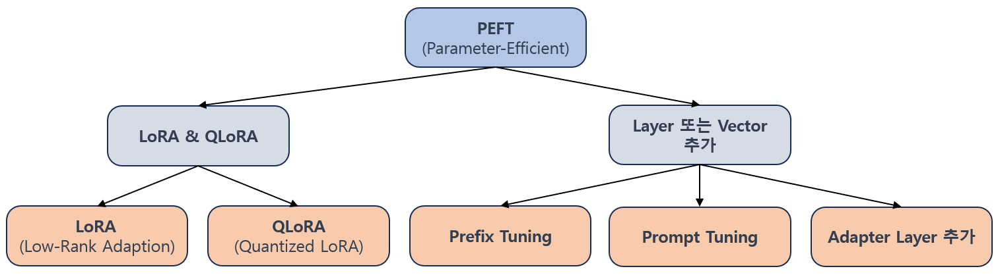
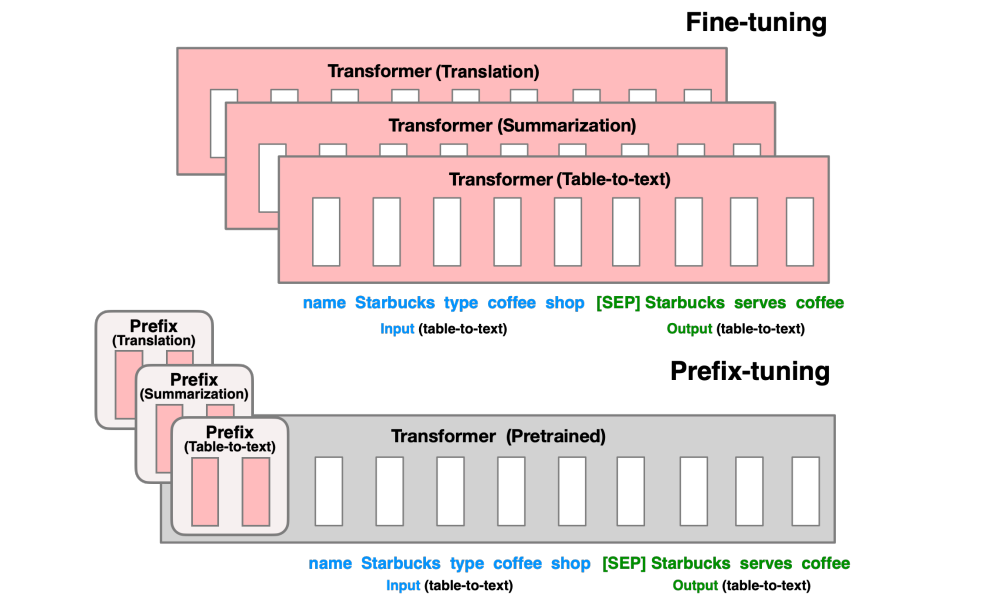
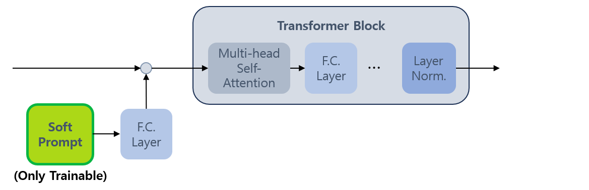
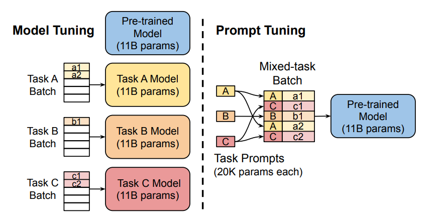
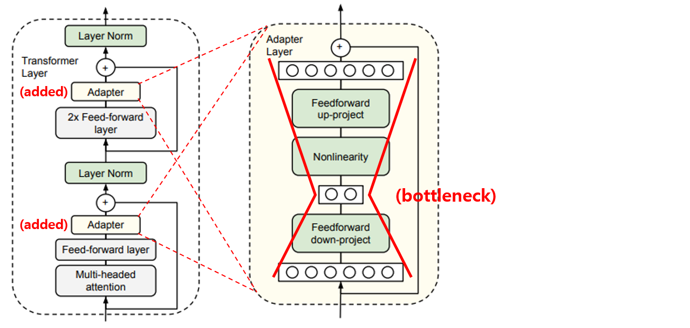

## 목차

* [1. PEFT (Parameter-Efficient Fine-Tuning)](#1-peft-parameter-efficient-fine-tuning)
* [2. PEFT 방법론의 분류](#2-peft-방법론의-분류)
  * [2-1. LoRA (Low-Rank Adaption)](#2-1-lora-low-rank-adaption)
  * [2-2. QLoRA (Quantized LoRA)](#2-2-qlora-quantized-lora)
  * [2-3. Prefix Tuning](#2-3-prefix-tuning)
  * [2-4. Prompt Tuning](#2-4-prompt-tuning)
  * [2-5. Adapter Layer 추가](#2-5-adapter-layer-추가)

## 1. PEFT (Parameter-Efficient Fine-Tuning)

**PEFT (Parameter-Efficient Fine-Tuning)** 는 [LLM 을 Fine-tuning](LLM_기초_Fine_Tuning.md) 시킬 때 **대부분의 파라미터는 추가 학습하지 않고, 소수의 파라미터에 대해서만 Fine-tuning** 을 하는 것을 의미한다.

* 이를 통해 도메인에 최적화된 거대 언어 모델로서의 성능을 보장하면서도, 자원을 절약한다.

PEFT 의 장단점은 다음과 같다.

* 장점
  * 거대 언어 모델의 수많은 파라미터 중 제한된 양의 파라미터 학습을 통한 **학습 시간 및 메모리 절약** 
  * 일반적으로, 각 task 별로 서로 다른 모듈을 Fine-tuning 할 수 있어서 **다수의 task 에 유연하게 적용 가능**
  * 대부분의 매개변수를 Freeze 시킨 채로 학습하기 때문에, **모델이 가지고 있는 일반 상식 등 기존 지식은 유지**
    * 즉, LLM 이 Fine-Tuning 되어 기존 지식마저 잊는 **재앙적 망각 (catastrophic forgetting)** 을 방지
  * [Overfitting](../Deep%20Learning%20Basics/딥러닝_기초_Overfitting_Dropout.md#2-딥러닝에서의-오버피팅-overfitting) 의 위험이 적다.
* 단점
  * 파라미터를 미세 조정할 범위에 따라 성능이 제한될 수 있음

## 2. PEFT 방법론의 분류

PEFT 의 방법론은 세부적으로 다음과 같이 분류할 수 있다.

**1. Low-Rank Adaption (LoRA) 계열**

| 방법론                                                                                       | 설명                                                      |
|-------------------------------------------------------------------------------------------|---------------------------------------------------------|
| [LoRA (Low-Rank Adaptation)](LLM_기초_Fine_Tuning_LoRA_QLoRA.md#2-lora-low-rank-adaptation) | 거대 언어 모델의 파라미터를 분해하여 일부 파라미터만 학습                        |
| [QLoRA (Quantized LoRA)](LLM_기초_Fine_Tuning_LoRA_QLoRA.md#3-qlora-quantized-lora)         | [양자화 (Quantization)](LLM_기초_Quantization.md) 가 적용된 LoRA |

**2. 필요한 Layer 또는 Vector 추가**

| 방법론                                       | 설명                                                                                                                |
|-------------------------------------------|-------------------------------------------------------------------------------------------------------------------|
| [Prefix Tuning](#2-3-prefix-tuning)       | 각각의 [Transformer](../../Natural%20Language%20Processing/Basics_트랜스포머%20모델.md) Layer 의 앞에 "Task 에 특화된 Vector" 를 추가 |
| [Prompt Tuning](#2-4-prompt-tuning)       | 학습 가능한 "Prompt Vector" 를 도입하여 LLM을 Fune-tuning                                                                    |
| [Adapter Layer 추가](#2-5-adapter-layer-추가) | LLM 의 각 Layer 에 "Adapter Layer" 라는 모듈을 추가하고, 해당 모듈만 학습                                                            |

### 2-1. LoRA (Low-Rank Adaption)

* LLM 의 **기존 파라미터 (가중치) 행렬을 저차원 행렬로 분해** 하여 학습한다.
  * 이를 통해 연산량, 메모리 사용량 등 자원을 절약한다.
* 자세한 것은 [LoRA (Low-Rank Adaptation)](LLM_기초_Fine_Tuning_LoRA_QLoRA.md#2-lora-low-rank-adaptation) 참고.

### 2-2. QLoRA (Quantized LoRA)

* LoRA + [양자화 (Quantization)](LLM_기초_Quantization.md) 의 개념이다.
* 자세한 것은 [QLoRA (Quantized LoRA)](LLM_기초_Fine_Tuning_LoRA_QLoRA.md#3-qlora-quantized-lora) 참고.

### 2-3. Prefix Tuning

[(논문) Prefix-tuning: Optimizing continuous prompts for generation](https://arxiv.org/pdf/2101.00190)

**Prefix Tuning** 은 각각의 [Transformer](../../Natural%20Language%20Processing/Basics_트랜스포머%20모델.md) Layer 의 앞에 **학습 가능한 벡터 (prefix)** 를 추가하여, **해당 벡터만 Fine-tuning** 시키는 것이다. 그 장점은 다음과 같다.

* LLM 에 Transformer 가 여러 개 있는 경우, LLM 이 Fine-tuning 을 통해 학습해야 할 서로 다른 task 간에 서로 다른 Prefix 벡터 적용 가능 
* prefix 만 Fine-tuning 하면 되므로 자원 (메모리 및 학습 시간) 이 절약됨

* [(출처)](https://arxiv.org/pdf/2101.00190) : Xiang Lisa Li and Percy Liang, Prefix-Tuning: Optimizing Continuous Prompts for Generation, 2021

### 2-4. Prompt Tuning

[(논문) The Power of Scale for Parameter-Efficient Prompt Tuning](https://arxiv.org/pdf/2104.08691)

**Prompt Tuning** 은 LLM의 입력 부분에 **학습 가능한 "Prompt Vector" 를 도입** 하여, **Prompt 만 Fune-tuning** 하는 것을 말한다. 자연어인 사용자 프롬프트를 조정하는 [Prompt Enginnering](LLM_기초_Prompt_Engineering.md) 과는 **다른 개념** 이다.

* Fine-tuning을 통해 **모델이 프롬프트를 유연하게 학습하며 모델 자체적으로 최적으로 업데이트** 하는 것을 목표로 한다.

그 장점은 다음과 같다.

* Prompt 에 해당하는 입력 부분이 **pre-trained parameter 만에 의해 결정되지 않고** 유연하게 학습 가능 
* 사람이 관여하는 [Prompt Enginnering](LLM_기초_Prompt_Engineering.md) 과 달리 Prompt 부분을 **자동 학습** 하므로, 관련 인력 및 인건비 절감
* Prefix Tuning 과 유사하게, Prompt 만 Fine-tuning 하면 되므로 자원 (메모리 및 학습 시간) 이 절약됨

[(출처)](https://arxiv.org/pdf/2104.08691) : The Power of Scale for Parameter-Efficient Prompt Tuning, 2021

* 핵심 아이디어
  * LLM Fine-Tuning 의 일반적인 [Next-token Prediction Likelihood 기반 Loss Function](LLM_기초_Fine_Tuning.md#5-llm-fine-tuning-의-loss-function) 과 동일하게 **next token 의 조건부 확률의 곱 또는 로그 합**을 이용
* $\max_\pi \log p_{\theta;\theta_P} (y|[P;x])$
  * $\theta$ : pre-trained model parameters
  * $\theta_P$ : 학습 가능한 Prompt Vector 의 하이퍼파라미터
  * $P$ : 모델에 새로 추가된 Prompt Vector

**[참고] Prefix Tuning 과의 차이**

| 구분              | Prefix Tuning                                            | Prompt Tuning                                               |
|-----------------|----------------------------------------------------------|-------------------------------------------------------------|
| 학습 가능한 벡터 추가 위치 | - Transformer 의 **모든 레이어** - **Encoder 와 Decoder** 모두 | - Transformer 의 **입력 레이어** - **Encoder 에만** 학습 가능한 벡터 추가 |
| 학습 파라미터 개수      | 비교적 **많음**                                               | 비교적 **적음**                                                  |
| 참고              | - 구현 복잡도 비교적 **높음** - 성능 비교적 **높음**                   | - 구현 복잡도 비교적 **낮음** - 성능 비교적 **낮음**                      |

### 2-5. Adapter Layer 추가

PEFT 의 방법론 중 **LLM 의 각 Layer 에 "Adapter Layer" 라는 모듈을 추가하고, 해당 모듈만 학습** 시키는 방법이 있다. 그 장점은 다음과 같다.

* Adapter 에 해당하는 특정 부분들만 학습시키므로, Prefix Tuning, Prompt Tuning 과 같이 자원이 절약된다.
* task 별로 서로 다른 Adapter 를 적용하여 **다수의 task 에 LLM 을 유연하게 Fine-tuning** 할 수 있다.

Adapter Layer 를 추가하여 LLM 에 적용하는 방법은 다음과 같다. [(참고 논문)](https://arxiv.org/pdf/1902.00751)

* Transformer Layer 에서 Feed-forward Layer 와 Skip connection 부분 사이에 Adapter Layer 를 추가한다.
* Adapter Layer 는 다음과 같은 **bottleneck 구성** 으로 되어 있다.
  * Layer 1 → feed-forward down projection → Layer 2 → Non-linear → Feed-forward up projection → Layer 3

* [(출처)](https://arxiv.org/pdf/1902.00751) : Parameter-Efficient Transfer Learning for NLP, 2019
