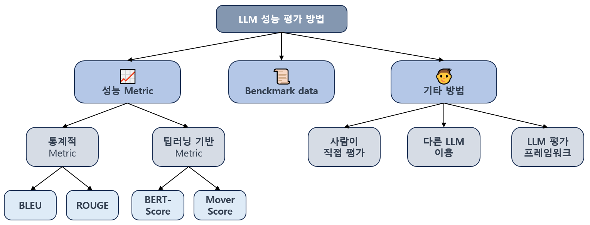
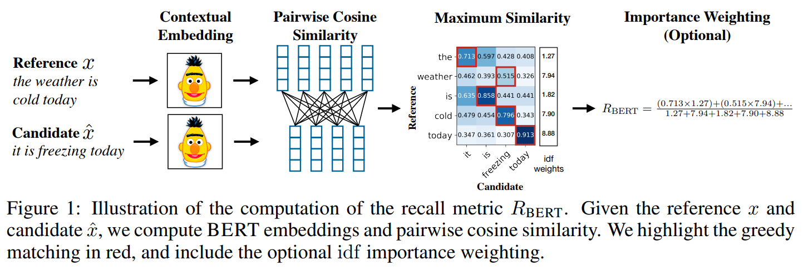

## 목차

* [1. LLM의 성능 평가 방법](#1-llm의-성능-평가-방법)
* [2. LLM 성능 평가 방법의 종류](#2-llm-성능-평가-방법의-종류)
* [3. 성능 Metric](#3-성능-metric)
  * [3-1. BLEU](#3-1-bleu)
  * [3-2. ROUGE](#3-2-rouge)
  * [3-3. 딥러닝 기반 Metric](#3-3-딥러닝-기반-metric)
  * [3-4. 기타 Metric](#3-4-기타-metric)
* [4. LLM 벤치마크 데이터셋](#4-llm-벤치마크-데이터셋)
* [5. 기타 LLM 성능 평가 방법](#5-기타-llm-성능-평가-방법)

## 1. LLM의 성능 평가 방법

거대 언어 모델의 성능을 평가하기 위해서는 여러 가지 방법론이 사용된다. **거대 언어 모델의 경우 입력에 대해 문장을 생성 (Generate) 하는 방식** 이기 때문에, [일반적인 분류, 회귀 모델에 쓰이는 Metric](../Data%20Science%20Basics/데이터_사이언스_기초_Metrics.md) 을 사용하기는 어렵다.

## 2. LLM 성능 평가 방법의 종류

LLM 의 성능을 평가하기 위한 Metric 으로는 다음과 같은 것들이 있다.

| 구분            | 성능 Metric                                                      |
|---------------|----------------------------------------------------------------|
| 성능 Metric 사용  | - 통계적 Metric (BLEU, ROUGE 등)<br>- 딥러닝 기반 Metric (BERT-Score 등) |
| LLM 벤치마크 데이터셋 | - '시험지' 형식의 벤치마크 데이터셋으로 테스트 (MMLU, Ko-MMLU 등)                  |
| 기타 방법         | - 사람이 직접 평가<br>- LLM 을 통해 다른 LLM을 평가<br>- LLM 평가 프레임워크         |



## 3. 성능 Metric

LLM 역시 일반적인 분류 모델 또는 회귀 모델처럼 성능 Metric 을 이용하여 평가할 수 있다. 그 방법은 다음과 같다.

| 성능 Metric                                                 | 설명                                        |
|-----------------------------------------------------------|-------------------------------------------|
| BLEU (BiLingual evaluation understudy)                    | LLM 의 출력과 목표 출력의 일치 정도를 평가<br>- 주로 번역에 사용 |
| ROUGE (Recall-Oriented Understudy for Gisting Evaluation) | LLM 의 출력이 목표 출력의 정보를 얼마나 잘 반영하는지 평가       |
| 딥러닝 기반 (BERT-Score, MoverScore)                           | BERT 모델의 Contextual Embedding 등을 활용       |
| 그 외에도 다양한 성능 Metric 존재                                    |                                           |

이들 중 BLEU, ROUGE 와 같은 **통계적 Metric 의 한계** 는 다음과 같다.

* 단어의 문맥적 의미의 유사성, 통사 구조의 다양성 등을 고려하지 못함
* 이를 해결하기 위해 Embedding 등을 활용하는 딥러닝 기반 Metric 이 사용됨

### 3-1. BLEU

**BLEU (BiLingual evaluation understudy)** 는 **LLM 의 출력과 목표 출력의 일치 정도를 평가** 하는 Metric 이다.

* 평가 방법은 **생성된 문장의 연속된 token sequence 중 목표 문장에도 포함되어 있는 token sequence 의 비율** 을 기반으로 한다. 
* 주로 기계 번역의 품질을 평가하기 위해 사용한다.
* 값의 범위는 **0.0 ~ 1.0** 이며, **1.0 에 가까울수록 좋은 성능** 을 의미한다.

상세 평가 방법은 다음과 같다.

* 생성된 문장의 단일 token 중 목표 문장에도 포함된 단일 token 의 개수의 비율 $R_1$ 을 구한다.
* N = 2, 3, 4 에 대해, 생성된 문장의 N개 token 의 sequence 중 목표 문장에도 동일한 순서로 포함된 token sequence 의 개수의 비율 $R_2$, $R_3$, $R_4$ 를 각각 구한다.
* 이들 값에 각각 로그를 적용한 값의 평균을 구한다.
  * $\displaystyle \frac{\log R_1 + \log R_2 + \log R_3 + \log R_4}{4}$ 
* 마지막으로 최댓값을 1.0 으로 맞추기 위해 여기에 $exp$ 를 적용해서 다음 수식의 값을 구한다.
  * $\displaystyle exp (\frac{\log R_1 + \log R_2 + \log R_3 + \log R_4}{4})$ 

예를 들어 다음과 같다고 하자.

```
생성된 문장 : We use Large Language Model and Vision Model for everything
목표 문장 : We are Large Language Model and Vision Model users
```

이때 BLEU 의 계산 과정은 다음과 같다.

| token 개수 | 생성된 문장의 Sequence                                         | 목표 문장의 일치하는 Sequence                                   | $R_k$ 의 값                  |
|----------|----------------------------------------------------------|--------------------------------------------------------|----------------------------|
| 1        | 10개 (```We``` ```use``` ```Large``` 등)                   | 7개 (```We``` ```Large``` ```Language``` ```Model``` 등) | $R_1$ = 7 / 10 = **0.700** |
| 2        | 9개 (```We use``` ```use Large``` ```Large Language``` 등) | 5개 (```Large Language``` ```Language Model``` 등)       | $R_2$ = 5 / 9 = **0.556**  |
| 3        | 8개 (```We use Large``` ```use Large Language``` 등)       | 4개 (```Large Language Model``` 등)                      | $R_3$ = 4 / 8 = **0.500**  |
| 4        | 7개 (```We use Large Language``` 등)                       | 3개 (```Large Language Model and``` 등)                  | $R_4$ = 3 / 7 = **0.429**  |

* log 값의 평균 계산
  * $\displaystyle \frac{\log R_1 + \log R_2 + \log R_3 + \log R_4}{4} = \frac{\log 0.700 + \log 0.556 + \log 0.500 + \log 0.429}{4} = -0.621$
* 최종 점수
  * $exp (-0.621) = 0.537$

### 3-2. ROUGE

**ROUGE (Recall-Oriented Understudy for Gisting Evaluation)** 는 **LLM 의 출력이 목표 출력의 정보를 얼마나 잘 반영하는지** 를 나타내는 것이다.

* ROUGE Score 가 높을수록 LLM 이 생성한 문장이 목표 문장의 정보를 잘 반영한다.
* 주로 요약 등에 사용된다.
* 단, LLM 출력의 문맥 반영 측면에서는 한계가 있다.
* 값의 범위는 **0.0 ~ 1.0** 이며, **1.0 에 가까울수록 좋은 성능** 을 의미한다.

핵심 아이디어는 **생성 문장의 각 단일 token 에 대해 예측값 = Positive, 목표 문장의 각 단일 token 에 대해 실제 값 = Positive** 라고 했을 때의 [F1 Score](../Data%20Science%20Basics/데이터_사이언스_기초_Metrics.md#1-3-f1-score) 를 구하는 것이다.

* Precision = (생성 문장, 목표 문장에 모두 있는 token 개수) / (**생성 문장** 의 token 개수)
* Recall = (생성 문장, 목표 문장에 모두 있는 token 개수) / (**목표 문장** 의 token 개수)
* F1 Score = 2 * Precision * Recall / (Precision + Recall)

다음 예시에 대해 ROUGE Score 를 계산해 보자.

```
생성된 문장 : We use Large Language Model and Vision Model for everything
목표 문장 : We are Large Language Model and Vision Model users
```

* token 개수 분석 결과

| 구분                           | 값  |
|------------------------------|----|
| 생성 문장, 목표 문장에 모두 있는 token 개수 | 7  |
| **생성 문장**의 전체 token 개수       | 10 |
| **목표 문장**의 전체 token 개수       | 9  |

* Precision, Recall, F1 Score 계산 결과

| 구분        | 계산 결과                                           |
|-----------|-------------------------------------------------|
| Precision | 7 / 10 = **0.700**                              |
| Recall    | 7 / 9 = **0.778**                               |
| F1 Score  | 2 * 0.700 * 0.778 / (0.700 + 0.778) = **0.737** |

따라서 이 경우 **ROUGE Score = 0.737** 이다.

### 3-3. 딥러닝 기반 Metric

딥러닝 기반 Metric 은 **BLEU, ROUGE 등 통계 기반 Metric 이 단어의 유사성 등을 고려하지 못한다** 는 한계를 딥러닝을 통해 극복한 것이다.

* 핵심 아이디어는 **딥러닝 모델의 [Word Embedding](../../Natural%20Language%20Processing/Basics_Word%20Embedding.md) 등을 활용하여 단어 및 문장의 유사성을 평가** 하는 것이다.

딥러닝 기반 Metric 은 대표적으로 **BERT-Score** 와 **MoverScore** 가 있다.

**1. BERT-Score**

[(논문) BERTScore: Evaluating Text Generation with BERT](https://arxiv.org/pdf/1904.09675)

**[BERT](../../Natural%20Language%20Processing/Basics_BERT,%20SBERT%20모델.md) 모델의 Contextual Embedding** 을 통해 LLM이 생성한 문장과 목표 문장의 유사도를 측정한다.

구체적으로는 다음과 같은 방법을 통해 평가한다.

* 생성된 문장의 각 token 과 목표 문장의 각 token 에 대해 유사도를 나타내는 행렬 생성
* 목표 문장의 각 token 에 대해, **생성된 문장에서 유사도가 가장 높은 token** 을 선택
* 목표 문장의 각 token 별 **선택된 token 의 유사도의 가중 평균** 을 계산
  * 이때 가중 평균을 적용하기 위한 가중치는 해당 token 이 가끔 나타날수록 높다.



[(출처)](https://arxiv.org/pdf/1904.09675) : Tianyi Zhang, Varsha Kishore et al., "BERTScore: Evaluating Text Generation with BERT", ICLR 2020

**2. MOVERScore**

[(논문) MoverScore: Text Generation Evaluating with Contextualized Embeddings and Earth Mover Distance](https://arxiv.org/pdf/1909.02622)

핵심 아이디어는 다음과 같다.

* 기본적으로 BERT-Score 의 메커니즘을 사용한다.
* 단, 다음과 같은 것을 추가로 적용한다.
  * 각 token 간 **Soft Alignment** 를 통해 그 **유사도를 보다 유연하게** 측정
  * **Earth Mover's Distance (EMD)** 를 통해 LLM 이 생성한 문장과 목표 문장 사이의 **'의미적 거리'** 를 측정

### 3-4. 기타 Metric

이외에도 다양한 Metric 이 있다.

**1. METEOR (통계적 방법)**

**BLEU 가 단어의 통사적 변형 등을 고려하지 못한다는 한계점을 극복** 하고자 만들어진 방법이다. 핵심 아이디어는 다음과 같다.

* 어간 추출, 동의어 처리 등 언어학적 요소 고려
* 단어의 순서 고려
* 값의 범위는 **0.0 ~ 1.0** 이며, **1.0 에 가까울수록 좋은 성능** 을 의미한다.

**2. Perplexity**

핵심 아이디어는 **언어 모델이 next token prediction을 할 때의 평균적인 '선택지'의 수** 를 성능지표로 하자는 것이다.

* 정답에 해당하는 token 에 대한 **예측 확률의 역수** + Entropy (또는 Log-likelihood) 의 개념을 이용한다.
* 다른 평가 지표들과 달리 **값이 낮을수록 성능이 좋은** 것을 의미한다.

**3. 전통적인 Classification Metrics**

LLM 의 task 에 따라 [Recall, Precision](../Data%20Science%20Basics/데이터_사이언스_기초_Metrics.md#1-2-accuracy-recall-precision) 이나 [F1 Score](../Data%20Science%20Basics/데이터_사이언스_기초_Metrics.md#1-3-f1-score) 와 같은 전통적인 Metric 을 이용하기도 한다.

## 4. LLM 벤치마크 데이터셋

LLM 의 성능 테스트, 특히 **일반적인 지식 및 추론 능력** 을 평가하기 위해, **객관식 시험지** 형태의 데이터셋을 사용하여 정답률을 측정하는 것이다.

다음과 같이 최신 LLM 을 평가하는 데에도 사용되고 있다.

* [네이버 하이퍼클로바를 MMLU 로 평가 (2025.02.)](../../AI%20Trend/AI_Trend_Feb_2025.md#20250220-목)
* [모레 (MOREH) 의 한국어 LLM 을 KMMLU 로 평가 (2024.12.)](../../AI%20Trend/AI_Trend_Dec_2024.md#20241203-화)

대표적으로 잘 알려진 LLM 벤치마크 데이터셋은 다음과 같다.

* 성능 평가

| 데이터셋                                            | 평가 영역                                   | 설명                                                                                |
|-------------------------------------------------|-----------------------------------------|-----------------------------------------------------------------------------------|
| ARC (AI2 Reasoning Challenge)                   | 지식 및 추론                                 | 과학 관련 주제를 이용한 문제 해결력 측정                                                           |
| MMLU (Massive Multitask Language Understanding) | 지식 및 추론                                 | 일반적이고 광범위한 지식 및 추론                                                                |
| MMLU Pro                                        | 지식 및 추론                                 | MMLU 의 업그레이드 버전                                                                   |
| GSM8k (Grade School Math 8K)                    | 수학적 추론                                  | 비교적 복잡한 초등학교 수학 문제                                                                |
| Ko-MMLU                                         | 지식 및 추론                                 | MMLU 의 한국어 버전                                                                     |
| KMMLU                                           | 지식 및 추론                                 | [네이버 클라우드, 원라인에이아이 협업으로 만들어진 한국어판 MMLU](https://www.ncloud-forums.com/topic/225/) |

* 안전성 평가

| 데이터셋       | 평가 영역                                   | 설명                        |
|------------|-----------------------------------------|---------------------------|
| ToxiGen    | 혐오 발언 가능성 평가                            | 각종 SNS에서 수집한 데이터 포함       |
| PolitiFact | [오류 및 허위 정보 생성 가능성](LLM_기초_환각_현상.md) 평가 | 뉴스 기사 데이터                 |
| FLUID      | LLM 악용 가능성 평가                           | 스팸 메일, 악성코드 등 악의적 목적의 데이터 |
| SHIELD     | LLM 안전성 종합 평가                           | 다양한 윤리적 / 안전 문제가 있는 데이터   |

## 5. 기타 LLM 성능 평가 방법

이외에도 다음과 같은 방법들이 LLM의 성능 평가에 사용될 수 있다.

* 사람이 직접 LLM을 평가 (**정성적 평가**, Human Evaluation)
* 다른 LLM을 이용하여 평가
* LLM 평가 프레임워크를 이용
  * 예: [GIST 에서 개발한 LLM 평가 프레임워크 (2025.02.)](../../AI%20Trend/AI_Trend_Feb_2025.md#20250213-목)