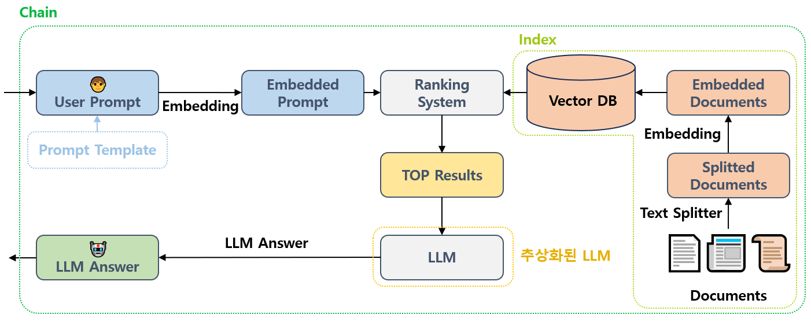
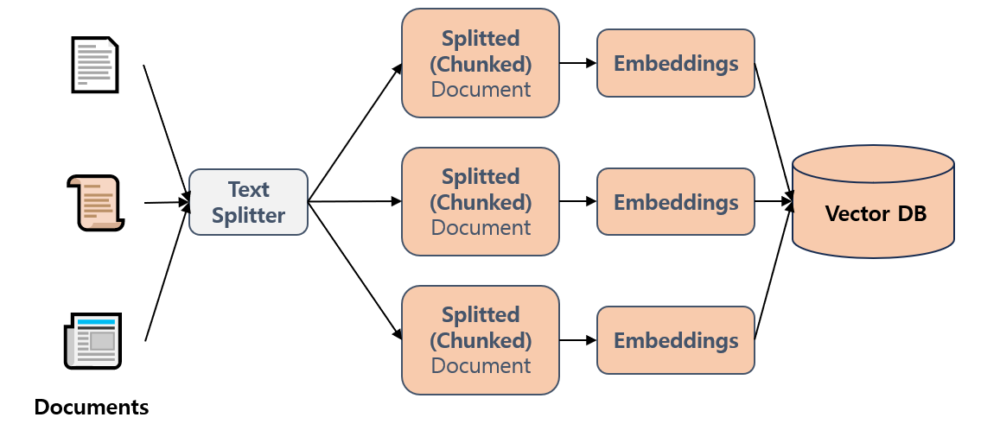

## 목차

* [1. Langchain 이란?](#1-langchain-이란)
* [2. Langchain 의 구성 요소](#2-langchain-의-구성-요소)
  * [2-1. Chain (체인)](#2-1-chain-체인)
  * [2-2. 프롬프트 템플릿](#2-2-프롬프트-템플릿)
  * [2-3. 인덱스 (DB 검색)](#2-3-인덱스-db-검색)
  * [2-4. 추상화된 거대 언어 모델 (LLM)](#2-4-추상화된-거대-언어-모델-llm)
  * [2-5. 기타 요소](#2-5-기타-요소)

## 1. Langchain 이란?

**LangChain (랭체인) = Language Model (언어 모델) + Chain (체인)** 은 거대 언어 모델을 이용한 애플리케이션을 개발하기 위한 오픈 소스 프레임워크로, 2022년 10월 출시되었다.

* [LangChain Github](https://github.com/langchain-ai/langchain)

핵심 아이디어는 다음과 같다.

* 거대 언어 모델과 여러 가지 관련 요소들을 **Chain (체인)** 처럼 결합하여, 실제 사용자가 LLM 을 사용할 수 있는 애플리케이션 구축
* **LLM 추상화** 를 통해, 모델 구조에 대한 복잡한 이해 없이 편리하게 로직 구현 가능
* task domain 에 맞춤형으로 만들기 위한 여러 가지 도구

## 2. Langchain 의 구성 요소

LangChain 은 다음과 같이 구성되어 있다.

| 구성 요소               | 설명                                                                                                 |
|---------------------|----------------------------------------------------------------------------------------------------|
| Chain (체인)          | LLM 및 이와 결합한 **다양한 요소 간의 연결고리**<br>- 경우에 따라 여러 개의 LLM이 사용될 수 있음                                    |
| 프롬프트 템플릿            | Ranking System 이 의도에 맞는 데이터를 검색할 수 있도록 **User Prompt 의 템플릿을 지정**                                   |
| 인덱스 (DB 검색)         | LLM 내부적으로 domain 에 맞는 지식이 부족하다는 것을 보충하기 위한, **LLM 외부의 데이터 소스**<br>- 출처 정보를 포함하여 LLM 답변의 **신뢰성 증가** |
| 추상화된 거대 언어 모델 (LLM) | LLM 을 추상화 (Abstraction) 시켜 **LLM 구조의 이해 없이도** 해당 LLM을 이용한 개발 가능                                    |



### 2-1. Chain (체인)

**Chain (체인)** 은 LLM 및 이와 결합한 **다양한 요소 간의 연결고리** 그 자체를 의미한다. LLM 은 1개일 수도 있지만, 비교적 복잡한 Task 의 경우 2개 이상의 LLM을 사용할 수도 있다.

예를 들어, 다음과 같은 경우를 생각할 수 있다.

* 고객이 특정 상황에서 가장 적합한 옷을 추천해 달라는 프롬프트를 시스템으로 전송
* 임베딩된 사용자 프롬프트와 가장 matching 되는 데이터를 벡터화된 DB 에서 검색
* 검색된 결과를 사용자가 이해하기 쉽도록 표로 정리하기 위해 LLM 사용
* LLM 을 통해 사용자에게 최종 답변 제공

위 경우는 비교적 단순한 task 이므로, LLM 을 1개만 사용해도 된다.

### 2-2. 프롬프트 템플릿

**프롬프트 템플릿 (User Prompt Template)** 은 사용자 프롬프트를 구조화된 템플릿을 통해 정형화하는 것을 의미한다.

* 이를 통해 Ranking System 이 의도에 맞는 데이터를 검색하여 사용자에게 제공할 수 있게 한다.

프롬프트 템플릿의 예를 들면 다음과 같다.

* ```{weather} 날씨에 가장 적합한 옷을 추천해 줘.```
* ```{weather} 한 날 {situation} 상황에 가장 적절한 옷을 골라 줘.```
* ```{situation} 상황에 적합한 옷을 "옷 1: 디자인 정보 1, 가격 정보 1, ..." 와 같은 형식으로 알려줘.```

### 2-3. 인덱스 (DB 검색)

**인덱스 (Indexes)** 는 거대 언어 모델이 domain에 특화된 지식이 부족하기 때문에 **이를 보충하기 위한 DB 와 같은 요소 (LLM 외부의 데이터)** 이다.

인덱스를 사용할 때의 장점은 다음과 같다.

* 인덱스는 그 출처가 표시되어 있기 때문에 **LLM 이 답변과 함께 그 출처를 제시** 하여 LLM 답변의 신뢰성을 높일 수 있다.
* 기존 LLM이 학습하지 못한 최신 정보를 DB에 추가하는 경우, 최신 정보를 기반으로 답변할 수 있다.



인덱스는 일반적으로 다음과 같이 구성되어 있다.

| 구성 요소                     | 설명                                                                                                                                      |
|---------------------------|-----------------------------------------------------------------------------------------------------------------------------------------|
| Document Loader (도큐먼트 로더) | 데이터 소스에서 문서를 load 한다.                                                                                                                   |
| Vector DB (벡터 DB)         | 관계형 DB와 달리, **Vector 를 DB에 저장**<br> - 고정된 크기의 vector 는 **하나의 data point** 를 의미하기 때문에, 검색 **(Search 보다는 Retrieval 이라는 표현이 적절)** 이 비교적 용이 |
| Text Splitter             | 문서의 텍스트를 적절한 방법을 통해 chunk / token 으로 분할                                                                                                 |

인덱스에 저장된 데이터 중 임베딩된 User Prompt 와 가장 적합한 벡터를 **Ranking System 을 통해 검색** 하여, 이를 바탕으로 사용자에게 답변을 제공한다.

더 자세한 것은 [RAG의 구성 요소](LLM_기초_RAG.md#3-rag의-구성-요소) 참고.

### 2-4. 추상화된 거대 언어 모델 (LLM)

**Langchain 에서는 거대 언어 모델 (LLM) 을 추상화** 하여, 개발자가 해당 LLM 에 대한 **깊은 이해 없이도** 해당 LLM을 이용한 개발이 가능하게 한다. 

* 추상화 (Abstraction) 의 기본 의미는 **사용자가 알지 않아도 되는 세부 사항을 숨기는** 것이다.

LLM 추상화의 중요성은 다음과 같다.

* 경우에 따라 여러 개의 거대 언어 모델을 chain 으로 연결해야 하는데, 이들 LLM에 대해 이해하려면 **시간이 오래 걸릴 수** 있다.
* LLM 을 최적화하기 위한 복잡한 NLP 관련 코드를 최소화하여 **코드의 간결성** 에 도움이 된다.

### 2-5. 기타 요소

**메모리 (Memory)**

* Langchain 을 적용한 애플리케이션이 **사용자와 LLM 간의 대화를 장기적으로 기억** 한다.
* 이를 통해 **사용자에게 더욱 매력적인, 맞춤형 서비스** 를 제공할 수 있게 한다.

**에이전트 (Agent)**

* 일반적으로 Langchain 애플리케이션에 적용되는 챗봇 (Chatbot) 을 의미한다.
* 최근 (2024년 11월 이후) 에는 **행동을 생성** 하는 **행동형 AI (AI 에이전트)** 가 생성형 AI를 이을, 에이전트의 최신 트렌드로 떠오르고 있다.
