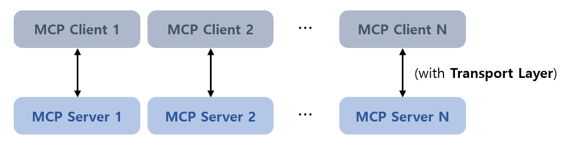
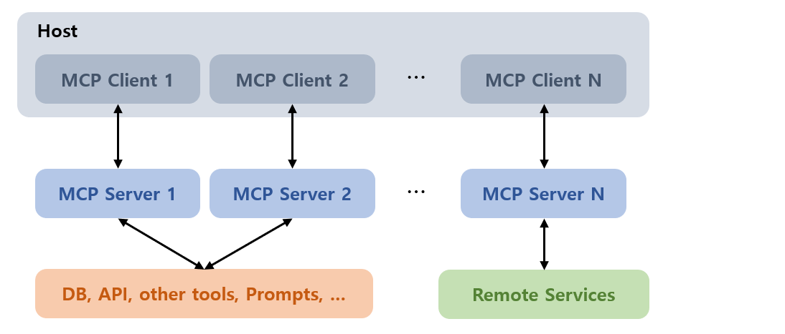
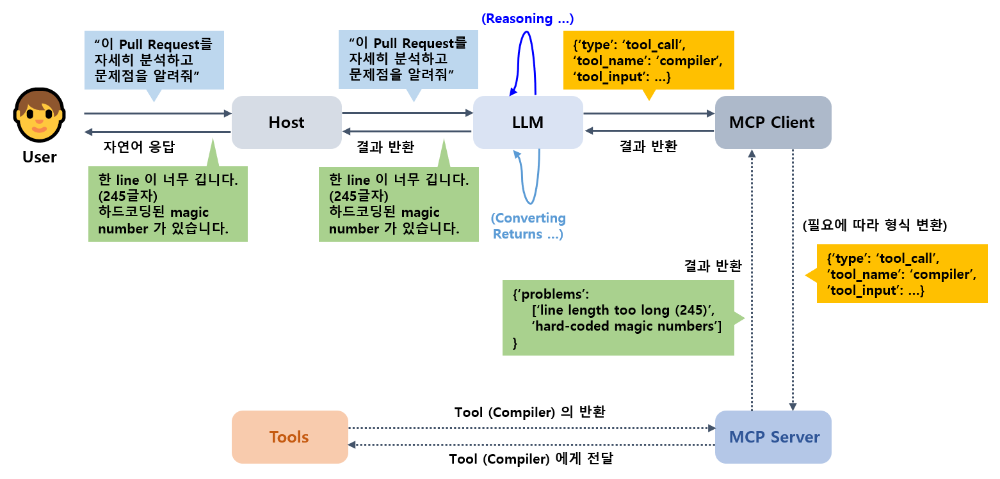

## 목차

* [1. MCP (Model Context Protocol) 개요](#1-mcp-model-context-protocol-개요)
  * [1-1. LLM 과 LLM Agent 의 차이](#1-1-llm-과-llm-agent-의-차이) 
* [2. MCP의 구성 요소](#2-mcp의-구성-요소) 
  * [2-1. Host (호스트)](#2-1-host-호스트)
  * [2-2. MCP Client (클라이언트)](#2-2-mcp-client-클라이언트)
  * [2-3. MCP Server (서버)](#2-3-mcp-server-서버)
* [3. MCP의 작동 방법](#3-mcp의-작동-방법)

## 참고 자료

* [MCP (Model Context Protocol) 이 뭐길래? - DEV.DY, 2025.03.20](https://dytis.tistory.com/112)
* [MCP란 무엇인가: LLM Agent 동작 흐름으로 이해하는 MCP - 한컴 기술블로그, 2025.04.28](https://tech.hancom.com/mcp-llm-agent/)

## 1. MCP (Model Context Protocol) 개요

**MCP (Model Context Protocol)** 는 **거대 언어 모델과 외부 데이터 및 시스템이 더 잘 연결되도록 하는 프로토콜** 이다.

* AI 모델과 DB / 시스템 간의 **표준화된 연결 방식** 이라고 할 수 있다.
* **LLM Agent** 를 구현하기 위한 표준 규격이라고 할 수 있다.

### 1-1. LLM 과 LLM Agent 의 차이

* LLM 과 LLM Agent 의 일반적인 차이점은 다음과 같다.

|       | LLM           | LLM Agent                                                |
|-------|---------------|----------------------------------------------------------|
| 목적    | 일회성 언어 처리     | **비교적 복잡한 task** 처리                                      |
| 추가 도구 | -             | **메모리** 기록, **도구 사용** (API 등), 도구 사용 **플래너 (Planner)** 등 |
| 동작 방식 | 단일 입력 → 단일 출력 | ```{입력 → 관련 도구 사용 → 결과 해석 → 출력}``` 등의 절차를 반복 가능          |

## 2. MCP의 구성 요소

MCP의 구성 요소는 다음과 같다.

| 구성 요소                                       | 설명                                     |
|---------------------------------------------|----------------------------------------|
| [Host (호스트)](#2-1-host-호스트)                 | 여러 개의 **MCP Client 를 관리**              |
| [MCP Client (클라이언트)](#2-2-mcp-client-클라이언트) | 각 **MCP Server 와 독립적으로 연결** 된 클라이언트    |
| [MCP Server (서버)](#2-3-mcp-server-서버)       | 데이터가 저장된 **DB**, 각종 **도구, 프롬프트** 등을 제공 |

### 2-1. Host (호스트)

**Host (호스트)** 는 여러 개의 **MCP Client 를 관리** 하는 역할을 하며, **LLM 을 사용한 애플리케이션 그 자체** 라고 할 수 있다.

* 다음과 같이 1개의 호스트가 여러 개의 MCP Client 를 각각의 인스턴스처럼 관리할 수 있다.
* **사용자와 LLM 을 연결하는 일종의 다리** 역할을 한다.


### 2-2. MCP Client (클라이언트)

**MCP Client (클라이언트)** 는 **MCP Server 와 연결되어 서버와 일정한 프로토콜에 따라 정보를 교환** 한다.

* 각 MCP Client 는 **1개의 MCP Server 와 독립적으로 연결** 되어 있다.
* 각각의 Client 는 **특정 목적** 에 따라 작동한다.



### 2-3. MCP Server (서버)

**MCP Server (서버)** 는 LLM에게 **데이터가 저장된 DB, 각종 도구, 프롬프트 등을 제공** 한다. 즉 LLM이 외부 세계와 연동할 수 있도록 한다.

* MCP Server 가 제공하는 도구는 **LLM이 직접 호출할 수 있다.**
* Client 로부터의 요청을 처리하여 그 응답을 반환한다.



## 3. MCP의 작동 방법

MCP 프로토콜의 작동 방법은 다음과 같다.

* **실선** 은 필수 과정, **점선** 은 도구 호출 시에만 사용하는 선택적 과정이다.



* 사용자 → MCP Client (또는 Tool)
  * 사용자가 **요청을 Host 에 전달** 하고, Host 는 **그 요청을 LLM 에게 전달** 한다.
  * LLM 은 그 요청을 **분석 (Reasoning)** 한 후, 그 출력값을 MCP Client 에 전달한다.
  * MCP Client 는 그것을 필요에 따라 변환 후 **MCP Server 에 전달** 한다.
  * (선택) MCP Server 는 **Tool 을 호출** 하고 Tool 로부터 결과를 받아온다.
* MCP Client (또는 Tool) 의 결과물을 지금까지 경로의 역순을 따라 사용자에게 다시 전달
  * 이때 **LLM은 Client 로부터 반환된 결과를 변환** 하는 역할을 한다. 