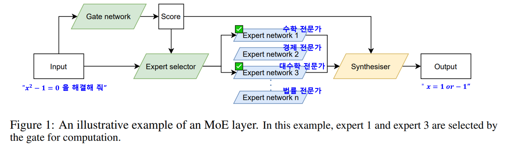
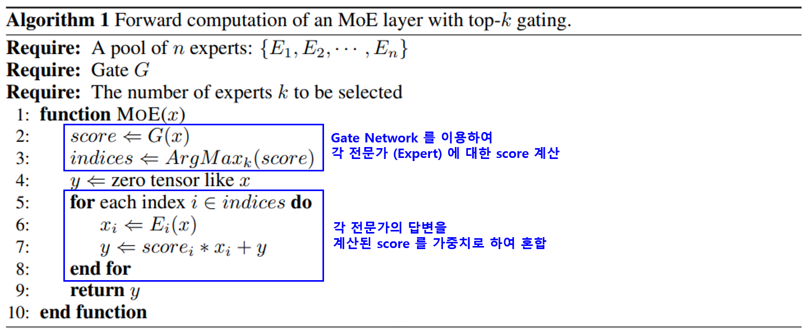

## 목차

* [1. Mixture of Experts (MoE) 란?](#1-mixture-of-experts-moe-란)
* [2. MoE 의 장점](#2-moe-의-장점)
* [3. MoE 의 작동 원리](#3-moe-의-작동-원리)
* [4. 실제 MoE 를 사용한 LLM](#4-실제-moe-를-사용한-llm)

참고 문헌 : [Jiaao He and Jiezhong Qiu et al., "FastMoE: A Fast Mixture-of-Expert Training System" (2021.03)](https://arxiv.org/pdf/2103.13262)

## 1. Mixture of Experts (MoE) 란?

**Mixture of Experts (MoE, 전문가 혼합)** 은 **LLM 에 입력되는 user prompt 에 따라 최적의 Feed-Forward Network (= Expert) 를 선택적으로 활성화** 하는 것이다.

* 예를 들어, '수학' 관련 사용자 질문이 들어오면, '수학 전문가'에 해당하는 Feed-Forward Network 를 활성화시켜 답변을 출력하는 것이다.

[(출처)](https://arxiv.org/pdf/2103.13262) : Jiaao He and Jiezhong Qiu et al., "FastMoE: A Fast Mixture-of-Expert Training System"

## 2. MoE 의 장점

**Mixture of Experts (MoE)** 이 대표적인 장점은 다음과 같다.

* **특정 전문가에 해당하는 Feed-Forward Network 만 선택** 하여, 메모리 및 추론 시간 절약
* 모든 분야를 골고루 잘 하는 단일 거대 LLM이 아닌 **특정 분야에 특화된 Feed-Forward Network 에 해당 분야의 지식** 이 들어가므로, 경우에 따라서는 **단일 거대 LLM 보다 성능이 좋을** 수 있음

## 3. MoE 의 작동 원리

**Mixture of Experts (MoE)** 의 작동 원리는 다음과 같다.

[(출처)](https://arxiv.org/pdf/2103.13262) : Jiaao He and Jiezhong Qiu et al., "FastMoE: A Fast Mixture-of-Expert Training System"

**1. Expert Scoring**

* 먼저, **Gate Network $G$** 을 이용하여 입력 $x$ 에 대해 각 전문가 네트워크 $E_1, E_2, ..., E_n$ 에 대한 점수 $score$ 를 구한다.
* 구한 점수 $score$ 가 가장 높은 $k$ 개의 전문가 네트워크를 선택하고, 그 인덱스를 $indices$ 라고 한다.

**2. 전문가 답변 혼합**

* 최종 답변 $y$ 를 zero-tensor 로 초기화한다.
* $indices$ 에 속한 각 인덱스 $i$에 대해,
  * 답변 $E_i(x)$ 을 출력한다.
  * 해당 답변을 **$i$ 번째 전문가 네트워크에 대한 점수 $score_i$ 를 가중치** 로 하여 $y$ 에 더한다. 즉 $y := score_i * x_i + y$
* 최종 답변 $y$ 를 반환한다.

## 4. 실제 MoE 를 사용한 LLM

실제 **Mixture of Experts (MoE)** 기술이 적용된 LLM은 다음과 같다.

* [DeepSeek-R1 (2025.01)](../../AI%20Trend/AI_Trend_Jan_2025.md#20250122-수)
* [Qwen-3 시리즈 (2025.05)](../../AI%20Trend/AI_Trend_May_2025.md#20250507-수)
* [삼성전자의 자체 생성형 AI '가우스2' 중 Supreme 모델 (2024.11)](../../AI%20Trend/AI_Trend_Nov_2024.md#20241121-목)
* [Microsoft 의 Phi-3.5 (2024.08)](../../AI%20Trend/AI_Trend_Aug_2024.md#20240830-금)