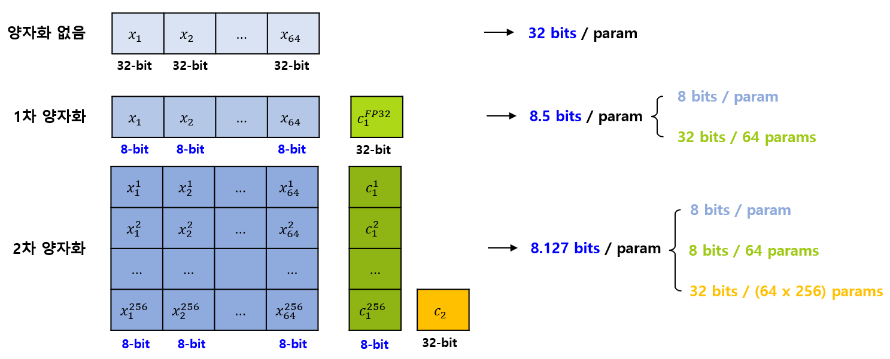

## 목차

* [1. Quantization (양자화)](#1-quantization-양자화)
* [2. 양자화의 방법론](#2-양자화의-방법론)
  * [2-1. PTQ vs. QAT](#2-1-ptq-vs-qat)
  * [2-2. Bitsandbytes](#2-2-bitsandbytes)
  * [2-3. AWQ (Activation-aware Weight Quantization)](#2-3-awq-activation-aware-weight-quantization)
  * [2-4. GPTQ (Post-Training Quantization for GPT Models)](#2-4-gptq-post-training-quantization-for-gpt-models)
* [3. 양자화 이후의 자료형](#3-양자화-이후의-자료형)
* [4. Double Quantization](#4-double-quantization)
* [5. Paged Optimizer](#5-paged-optimizer)

## 1. Quantization (양자화)

**Quantization (양자화)** 는 거대 언어 모델의 가중치 및 기타 활성화 값들의 **자료형 등을 변경** 하여 **모델의 크기를 감소** 시키는 것이다.

양자화의 중요성은 다음과 같다.

* 모델의 크기 자체를 줄인다.
* 모델을 학습하거나 모델을 이용하여 추론할 때 사용하는 **메모리 양** 을 줄인다.
* 모델의 학습, 추론 **시간을 단축** 시킨다.
* 모델이 **에너지 효율적으로** 학습, 추론할 수 있게 한다.

양자화의 기본 원리는 다음과 같다.

* 원본 데이터의 자료형을 **값 1개 당 bit 수가 비교적 작은 자료형으로 변환** 한다.
* 이때 기존 값들의 표현 능력이 감소하기 때문에, **일정 부분의 정보 손실** 이 있다.
  * 정보 손실은 **양자화 후의 자료형의 bit 수가 적을수록** 크다.

이때 발생하는, 가장 가까운 표현 가능한 값으로의 반올림/올림/내림에 의한 정보 손실을 **양자화 오류 (Quantization Error)** 라고 한다.

## 2. 양자화의 방법론

양자화의 방법론은 크게 다음과 같이 나눌 수 있다.

| 방법론                                         | 설명                  | 예시                                                                 |
|---------------------------------------------|---------------------|--------------------------------------------------------------------|
| PTQ (Post-training Quantization, 학습 후 양자화)  | LLM 의 학습 후에 양자화를 실시 | - GPTQ (Post-Training Quantization for GPT Models) - GGUF, GGML |
| QAT (Quantization-Aware Training, 학습 중 양자화) | LLM 의 학습 중 양자화 실시   | - AWQ (Activation-aware Weight Quantization)                       |

### 2-1. PTQ vs. QAT

**PTQ (Post-training Quantization)**, **QAT (Quantization-Aware Training)** 는 LLM 의 학습 **중에** 양자화하는지, 아니면 학습 **후에** 양자화하는지의 차이이다.

PTQ 와 QAT 의 특징을 비교하면 다음과 같다.

| 구분     | PTQ                                                                          | QAT                                                                                                                                    |
|--------|------------------------------------------------------------------------------|----------------------------------------------------------------------------------------------------------------------------------------|
| 기본 설명  | 이미 학습된 모델의 weight 및 활성화 값에 대해 양자화를 실시한다. - 즉, 양자화를 **학습 후에만 실시** 하는 방법이다. | 학습 진행 중, 모델을 양자화한 후 **inference 할 때의 결과값에 대한 영향 시뮬레이션** 을 미리 진행하며 양자화를 한다. - weight의 양자화 결과를 고려하여 학습하기 때문에, **양자화된 모델의 정확도가 덜 감소함** |
| 자원 소비  | **적음** (추가 학습 불필요)                                                           | **많음** (추가 학습 필요)                                                                                                                      |
| 적합한 모델 | - 비교적 큰, 이미 학습된 LLM 의 Fine-tuning                                            | - 규모가 작은 LLM - 새로운 LLM을 학습하는 경우                                                                                                     |

### 2-2. Bitsandbytes

**Bitsandbytes** 는 모델을 4비트 또는 8비트로 양자화하는 방법 중 하나이다.

* [Bitsandbytes Github](https://github.com/bitsandbytes-foundation/bitsandbytes)

### 2-3. AWQ (Activation-aware Weight Quantization)

[(논문) AWQ: Activation-aware Weight Quantization for On-Device LLM Compression and Acceleration](https://arxiv.org/pdf/2306.00978)

**AWQ (Activation-aware Weight Quantization)** 는 2023년 MIT에서 개발한 양자화 방법으로, 핵심 아이디어는 다음과 같다.

* **중요하지 않은 가중치를 양자화** 하고, 이를 통해 기존 모델의 성능을 최대한 유지한다.
* 중요한 가중치에만 scaler 값을 곱해서 양자화 오류를 최소한으로 줄인다.
  * 이때, 중요한 가중치를 찾기 위해서 **활성화 값 (Activation Value)** 이라는 개념을 이용한다.

논문에서는 활성화 값이 **상위 1%** 인 경우에만 Scaler 를 이용해서 weight matrix 의 해당 행에 scaler 를 곱한다.

### 2-4. GPTQ (Post-Training Quantization for GPT Models)

[(논문) GPTQ: Accurate Post-Training Quantization for Generative Pre-trained Transformers](https://arxiv.org/pdf/2210.17323)

**GPTQ (Post-Training Quantization for GPT Models)** 는 PTQ (학습 후 양자화) 방법론 중 하나로, 핵심 아이디어는 다음과 같다.

* 해결할 문제
  * **수십억 개 이상의 파라미터가 있는 거대 언어 모델** 에 대해 QAT (학습 중 양자화) 를 적용하려면 자원이 너무 많이 소비됨
* 해결 아이디어
  * Hessian 행렬의 역행렬을 삼각형 형태의 안정적인 행렬인 **Cholesky from 으로 변환**
  * weight matrix 에서 **일부 block 지정** → 해당 block에 대해 column 단위로 양자화 & **나머지 weight 을 갱신** 하여 오차 보정
* 효과
  * 학습 효율성이 높음 (빠른 학습) 
  * 3, 4 bit 양자화를 적용해도 손실이 거의 없고, 2 bit 양자화 시에도 성능이 안정적임 

[(출처)](https://arxiv.org/pdf/2210.17323) : Elias Frantar, Saleh Ashkboos et al., "GPTQ: Accurate Post-Training Quantization for Generative Pre-trained Transformers", ICLR 2023

GPTQ 의 상세 알고리즘은 다음과 같다.

* 먼저, **Hessian 행렬의 역행렬** 을 **Cholesky from 으로 변환** 한다.
* 다음을 **모든 weight을 양자화할 때까지 반복** 한다.
  * 지정된 Block size 크기의 각 Block 에 대해 다음을 수행
    * 해당 weight matrix 에 대해 **Column 단위 양자화** 실시
    * 이때의 Quantization Error 를 고려하여 나머지 weight 을 갱신 (오차 보정)
  * Block 단위 양자화 종료 후, 나머지 weight 을 갱신

[(출처)](https://arxiv.org/pdf/2210.17323) : Elias Frantar, Saleh Ashkboos et al., "GPTQ: Accurate Post-Training Quantization for Generative Pre-trained Transformers", ICLR 2023

## 3. 양자화 이후의 자료형

양자화 이후에 모델의 가중치 행렬 등에 적용되는 자료형에는 다음과 같은 것들이 있다.

| 자료형  | 설명                                                                  |
|------|---------------------------------------------------------------------|
| FP16 | **2바이트로 표현** 되는, 모델 경량화를 위해 쉽게 사용할 수 있는 자료형 중 하나                    |
| BF16 | 16비트 부동 소수점 자료형 - **8비트 지수, 7비트 가수 (Mantissa)** 를 사용             |
| INT8 | 8-bit integer, 즉 **8비트 정수 자료형** - 메모리 사용량이 크게 감소하지만, **정밀도가 낮음** |
| NF4  | 4-bit NormalFloat, 즉 4비트 양자화<b>- 비트 수가 기존 32비트에서 대폭 감소              |

## 4. Double Quantization

**Double Quantization (이중 양자화)** 는 [Quantized LoRA (QLoRA)](LLM_기초_Fine_Tuning_LoRA_QLoRA.md#3-qlora-quantized-lora) 에서 쓰이는 양자화 방법으로, 말 그대로 **양자화를 2번 실시** 하는 것이다.

* 1번째 양자화에서는 모든 parameter 를 양자화하되, 32 bit 의 양자화되지 않은 scaling factor 를 1개 추가한다.
* **2번째 양자화** 에서는 이 scaling factor 마저 8 bit 로 양자화하고, 일정 개수의 scaling factor 마다 그 scaling factor 들을 scaling 하기 위한, 양자화되지 않은 새로운 quantization factor 를 1개 추가한다.

Scaling Factor 를 64 개의 parameter 마다 추가하고, 이 Scaling Factor 256 개마다 2차 양자화를 위한 Quantization factor 를 추가할 때, 각 양자화 별 parameter 당 bit 수를 비교하면 다음과 같다.

| 양자화 단계 | parameter 당 비트 수       |
|--------|------------------------|
| 양자화 없음 | 32 bits / param        |
| 1차 양자화 | **8.5 bits** / param   |
| 2차 양자화 | **8.127 bits** / param |

## 5. Paged Optimizer

**Paged Optimizer** 는 [Quantized LoRA (QLoRA)](LLM_기초_Fine_Tuning_LoRA_QLoRA.md#3-qlora-quantized-lora) 에서 쓰이는 기술로, **GPU 에서 Out-of Memory (OOM) 오류 발생** 시 [Optimizer](../Deep%20Learning%20Basics/딥러닝_기초_Optimizer.md) 가 자동으로 CPU에서 동작하게 하는 기술이다. 즉 다음과 같이 동작한다.

* Optimizer 의 현재 state가 CPU RAM 으로 이동
* Optimizer 의 갱신을 위해 GPU 에서 필요로 할 때 다시 자동으로 GPU 로 optimizer state 를 이동
