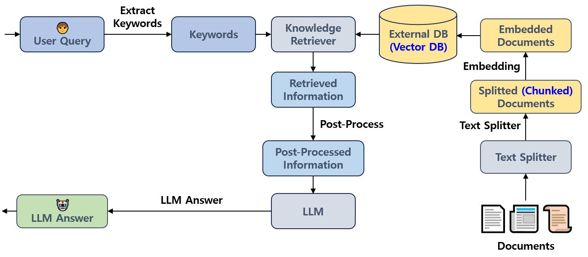

## 목차

* [1. RAG (Retrieval-Augmented Generation)](#1-rag-retrieval-augmented-generation)
* [2. RAG의 기본 작동 원리](#2-rag의-기본-작동-원리)
* [3. RAG의 구성 요소](#3-rag의-구성-요소)
  * [3-1. Text Splitter](#3-1-text-splitter)
  * [3-2. Knowledge Retriever](#3-2-knowledge-retriever)
  * [3-3. Vector Store](#3-3-vector-store)
* [4. RAG 을 위한 임베딩 기법](#4-rag-을-위한-임베딩-기법)
* [5. 모듈형 검색 증강 생성 (Modular RAG)](#5-모듈형-검색-증강-생성-modular-rag)

## 1. RAG (Retrieval-Augmented Generation)

**RAG (Retrieval-Augmented Generation)** 은 거대 언어 모델 (LLM) 과 **외부 지식 DB를 연결하여, LLM이 해당 DB를 참고하여 데이터를 생성** 할 수 있게 하는 기술이다.

* LLM 이 특정 domain 에는 **지식이 부족할 수 있다는 등의 한계점** 을 극복하기 위해 만들어진 기술이다.

RAG 의 개발 배경이 된 기존 LLM 의 한계점은 다음과 같다.

* 특정 전문화된 domain 에 대한 지식 부족 (일반적인 지식은 많지만)
* [LLM의 환각 현상 (잘못된 정보 생성)](LLM_기초_환각_현상.md)
* 출처 미표시 (또는 출처 불분명) 로 신뢰성 보장 어려움

RAG 의 주요 특징은 다음과 같다.

* 외부 DB를 활용하여, 특정 domain 에 대한 지식 부족 및 출처 불분명 문제 해결
* DB에 기반한 답변으로 환각 현상 가능성 감소

RAG 의 장단점은 다음과 같다.

* 장점
  * DB와 연동해 최신 정보 반영 가능
  * 환각 현상의 해결
* 단점
  * 검색 (Retrieval) 프로세스 추가로 인해 과정이 복잡해짐
  * 외부 DB 접속으로 인한 보안 문제

## 2. RAG의 기본 작동 원리

RAG 의 기본 작동 원리는 다음과 같다.

| 단계                | 설명                                                                   |
|-------------------|----------------------------------------------------------------------|
| 검색 (Retrieval)    | - 사용자의 쿼리로부터 관련 키워드 추출<br> - 이 키워드를 바탕으로 외부 DB에서 정보 검색               |
| 증강 (Augmentation) | - DB로부터 검색된 정보를 LLM 의 입력에 추가<br>- 검색 결과를 LLM 에 입력해야 하므로 가공이 필요할 수 있음 |
| 생성 (Generation)   | - DB의 정보가 추가된 입력을 받은 LLM 이 최종 답변 생성                                  |



## 3. RAG의 구성 요소

RAG 의 대표적인 구성 요소로 다음과 같은 것들이 있다.

| 구성 요소               | 설명                                              |
|---------------------|-------------------------------------------------|
| Text Splitter       | 문서를 작은 단위인 Chunk 로 분리                           |
| Knowledge Retriever | Vector Store 에서 문서를 검색 (Retrieve) 하여 적절한 결과를 반환 |
| Vector Store        | 외부 지식이 **벡터 형태로 저장** 되어 있는 DB                   |

### 3-1. Text Splitter

**Text Splitter** 는 문서를 작은 단위인 'chunk'로 분리 (chunking) 하는 도구이다. 그 필요성은 다음과 같다.

* LLM 별로 제한되어 있는, **프롬프트의 입력 token 개수 제한** 을 초과하지 않게 한다.
  * 문서 전체가 LLM 의 입력으로 들어가지 못할 수 있다. 
* 긴 문서일수록 불필요한 정보가 많기 때문에 **핵심 정보만 남기는** 것이 중요하다.

[LangChain](LLM_기초_Langchain.md) 에서는 다음과 같은 종류의 Text Splitter 를 제공한다.

| Text Splitter                  | 설명                                                        |
|--------------------------------|-----------------------------------------------------------|
| CharacterTextSplitter          | 텍스트 문서를 separator, chunk의 크기 등을 기준으로 chunking             |
| RecursiveCharacterTextSplitter | 텍스트를 ```\n\n```, ```\n```, ``` ``` 의 순서를 기준으로 하여 재귀적으로 분할 |

### 3-2. Knowledge Retriever

**Knowledge Retriever (지식 검색기)** 는 Vector Store 에서 문서를 검색 (Retrieve) 하여 적절한 결과를 반환하는 도구이다.

[LangChain](LLM_기초_Langchain.md) 에서는 다음과 같은 종류의 Retriever 를 제공한다.

| Retriever              | 설명                                      |
|------------------------|-----------------------------------------|
| Vector Store Retriever | **Vector Store 에서** 의 문서 검색에 사용         |
| Multi Query Retriever  | 사용자 쿼리의 의미를 **여러 측면** 에서 파악하여 검색 효율성 증가 |
| Contextual Compression | 검색된 문서에서 **쿼리와 관련된 정보** 만을 찾아서 반환       |

### 3-3. Vector Store

**Vector Store** 는 외부 지식이 **벡터 형태로 저장** 되어 있는 DB로, **지식이 임베딩된 벡터** 로 이루어져 있어서 알고리즘 관점에서 **검색 (Retrieval) 이 편리** 하다.

* Knowledge Retriever 가 최대한 빠른 속도로 사용자 쿼리와 가장 관련된 항목들을 찾을 수 있게 도와준다.
  * 이는 사용자 쿼리와의 유사도 점수에 기반한다.

Vector Store 를 구현하기 위한 프레임워크 중 널리 알려진 것으로 **Chroma** 와 **FAISS** 가 있다.

## 4. RAG 을 위한 임베딩 기법

RAG 에서는 **Vector 형태로 이루어진 데이터를 DB에 저장** 해야 하기 때문에 임베딩이 필요하다. 임베딩은 다음과 같이 활용된다.

* 텍스트 유사도 계산
* 문서 분류
* 그 외의 다양한 NLP 관련 작업

[LangChain](LLM_기초_Langchain.md) 에서는 다음과 같이 임베딩 벡터로의 변환을 지원한다.

| 지원 방법 (Class Name)           | 설명                                        |
|------------------------------|-------------------------------------------|
| OpenAIEmbeddings             | OpenAI의 API를 이용한 임베딩                      |
| HuggingFaceEmbeddings        | HuggingFace 의 pre-train 된 임베딩 모델을 이용한 임베딩 |
| GoogleGenerativeAIEmbeddings | Google 에서 제공하는 생성형 AI 모델을 이용한 임베딩         |

## 5. 모듈형 검색 증강 생성 (Modular RAG)

**모듈형 검색 증강 생성 (Modular RAG)** 은 RAG 시스템을 서로 독립적이면서도 상호 정보 교환이 가능한 여러 개의 모듈로 나누는 것이다.

Modular RAG 의 장점은 다음과 같다.

* 모듈의 독립적 설계
  * 모듈이 종속되지 않고 서로 독립적이므로, 필요할 때마다 모듈의 추가 및 교체 가능
* 유연성 및 확장성
  * 모듈의 독립적 설계에 의해 발생하는 장점 
* 성능 개선을 위한 지속적인 전체 구조 개선 시도 가능
  * 예를 들어 현재보다 더 좋은 임베딩 모델 발견 시, 해당 모델을 빠르게 적용 가능 