## 목차
* [1. Decision Tree란?](#1-decision-tree란)
* [2. Gini vs. Entropy](#2-gini-vs-entropy)
  * [2-1. Gini](#2-1-gini)
  * [2-2. Entropy](#2-2-entropy)
* [3. Decision Tree 알고리즘 동작 예시](#3-decision-tree-알고리즘-동작-예시)
* [4. 탐구 (Gini vs. Entropy, 무엇이 좋을까?)](#4-탐구-gini-vs-entropy-무엇이-좋을까)
  * [4-1. 실험 진행](#4-1-실험-진행)
  * [4-2. 실험 결과](#4-2-실험-결과)

## 코드
* [Gini vs. Entropy 성능 비교](#4-탐구-gini-vs-entropy-무엇이-좋을까) 실험 코드 : [code (ipynb)](codes/Decision_Tree_example.ipynb)

## 1. Decision Tree란?

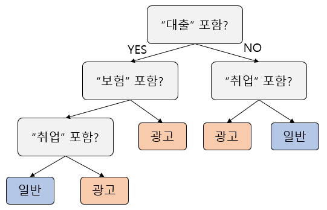

**Decision Tree (의사결정 나무)** 는 위와 같이 학습 데이터의 feature에 대한 조건에 따라 가지치기를 하여 Tree를 생성하고, 그 Tree에 기반하여 판단하는 모델이다.
* 핵심 아이디어 : **feature에 대한 조건 중 target의 값을 가장 잘 구분할 수 있는 것을 선택** 한다.
* 학습 데이터셋을 통해 Tree를 먼저 만든 후, 예측할 데이터가 입력되면 해당 데이터의 Class를 이 Tree를 기반으로 예측한다.

----

머신러닝 모델이므로, **가급적 적은 개수의 분류 기준으로 분류가 가장 잘 되는 적절한 Tree를 다음과 같은 알고리즘에 기반하여 자동으로 생성**한다.

예를 들어 위 그림과 같은 광고 메일 여부 판단 모델의 경우, 메일 내용에 "대출"이 포함되어 있으면 왼쪽 sub-tree로 이동하여 그 다음으로 "보험"이 포함되어 있는지 검사한다. 그리고 "보험"이 포함되어 있으면, "취업"이 포함되어 있는지 검사한다. 이때 포함되어 있으면 일반 메일, 없으면 광고 메일로 분류한다.

만약 메일 내용에 "대출"이 없으면, 오른쪽 sub-tree로 이동하여 "취업"이 포함되어 있는지 검사하고, 포함되어 있으면 광고, 그렇지 않으면 일반 메일로 분류한다.

Decision Tree의 알고리즘은 다음과 같다.

* 1. 각 node에 대해서 다음을 재귀적으로 반복한다.
  * 1-1. max depth (최대 깊이) 에 이르지 않았으면서 모든 데이터에 대해 target 값이 동일하지는 않은 경우,
    * 1-1-1. 해당 node의 조건에 해당하는 모든 데이터의 target 값을 가장 잘 구분할 수 있는 feature 조건을 찾는다.
    * 1-1-2. 해당 조건이 True인 데이터만 따로 뽑아서 left sub-tree를 생성하고, 이 left sub-tree에 대해 1. 을 반복한다.
    * 1-1-3. 해당 조건이 False인 데이터만 따로 뽑아서 right sub-tree를 생성하고, 이 right sub-tree에 대해 1. 을 반복한다.
  * 1-2. 최대 깊이에 이르거나 모든 데이터에 대해 target 값이 동일한 경우, 해당 node 또는 sub-tree에 대해서는 알고리즘의 실행을 중지한다.

## 2. Gini vs. Entropy
Decision Tree에서 **target의 값을 가장 잘 구분할 수 있는** feature 조건을 찾기 위해서 Gini 또는 Entropy를 이용한다.

이를 이용하여 새로운 subtree를 생성할 때는, 각 조건 (입력 데이터의 feature) 별로 다음 수식을 이용하여 target 값을 가장 잘 구분하는 조건을 찾는다.
* **(조건의 값이 A인 데이터 비율) * (조건의 값이 A인 데이터의 Gini 또는 Entropy) + (조건의 값이 B인 데이터 비율) * (조건의 값이 B인 데이터의 Gini 또는 Entropy) + ...**

| 구분                    | Gini                                  | Entropy                                                          |
|-----------------------|---------------------------------------|------------------------------------------------------------------|
| 수식                    | $$(Gini) = 1 - \sum_{i=1}^n {p_i^2}$$ | $$(Entropy) = - \displaystyle \sum_{i=1}^n (p_i * log_2 (p_i))$$ |
| 최댓값                   | 0.25 (p=0.5일 때)                       | 1 (p=0.5일 때)                                                     |
| 그래프<br>(Class가 2개일 때) | 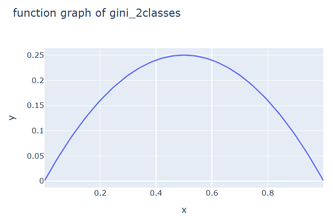  | 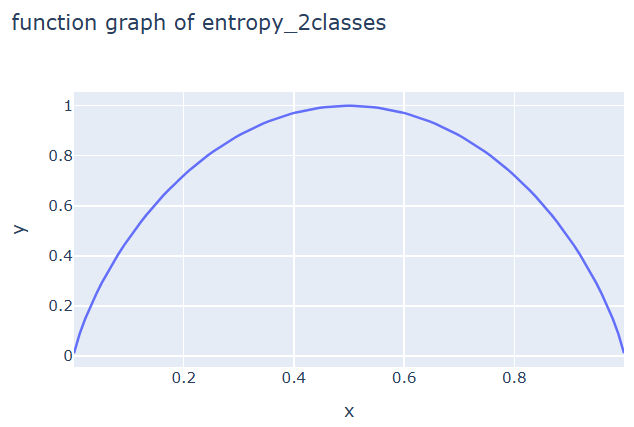                             |

### 2-1. Gini
먼저 Gini는 다음과 같은 수식을 이용하여 target 값을 잘 구분할 수 있는지를 파악하기 위한 척도를 계산한다. (단, $n$은 전체 데이터의 서로 다른 target 값의 개수, $p_i$는 target 값이 (전체 n개 중 i번째 target 값)일 확률을 의미한다.)
* $$(Gini) = 1 - \sum_{i=1}^n {p_i^2}$$

예를 들어, target 값이 A인 데이터가 2개, B인 데이터가 3개, C인 데이터가 5개인 경우,
* $$\displaystyle (Gini) = 1 - (\frac{2}{10})^2 - (\frac{3}{10})^2 - (\frac{5}{10})^2 = 0.62$$

target 값이 A인 데이터만 10개 있는 경우,
* $$\displaystyle (Gini) = 1 - (\frac{10}{10})^2 = 0.0$$

이다.

이때 **Gini 값이 작을수록 불순도가 낮으므로 target 값에 대한 더 적합한 구분 기준**이라고 할 수 있다.

### 2-2. Entropy
Entropy도 Gini처럼 target 값을 구분할 수 있는지를 파악하는 척도이며, 다음과 같은 수식으로 나타낼 수 있다.
* $$(Entropy) = - \displaystyle \sum_{i=1}^n (p_i * log_2 (p_i))$$

예를 들어, target 값이 A인 데이터가 2개, B인 데이터가 2개, C인 데이터가 4개, D인 데이터가 8개인 경우,
* $$\displaystyle (Entropy) = - (0.125 * log_2 (0.125) + 0.125 * log_2 (0.125) + 0.25 * log_2 (0.25) + 0.5 * log_2 (0.5)) = 1.75$$

target 값이 A인 데이터만 10개 있는 경우,
* $$\displaystyle (Entropy) = - (1.0 * log_2 (1.0)) = 0.0$$

**Entropy 값 역시 작을수록 불순도가 낮은 더 적합한 구분 기준**이다.

## 3. Decision Tree 알고리즘 동작 예시

| "대출" 포함 | "보험" 포함 | "취업" 포함 | 분류 |
|---------|---------|---------|----|
| True    | True    | False   | 광고 |
| True    | False   | False   | 광고 |
| False   | True    | True    | 광고 |
| True    | True    | False   | 광고 |
| False   | False   | True    | 일반 |
| False   | False   | True    | 광고 |
| False   | True    | False   | 광고 |
| True    | False   | True    | 일반 |
| False   | False   | False   | 일반 |
| False   | False   | True    | 일반 |

위 데이터에서 광고 메일과 일반 메일을 구분하기 위한 Decision Tree를 만들면 다음과 같다. (단, Gini를 사용하며, max depth = 2 이다.)

* **조건 feature가 "대출" 포함 여부일 때**
  * 계산값 : **("대출" 포함 비율) * ("대출" 포함 데이터의 Gini) + ("대출" 미포함 비율) + ("대출" 미포함 데이터의 Gini)**
  * = (4/10) * (1 - (3/4)^2 - (1/4)^2) + (6/10) * (1 - (3/6)^2 - (3/6)^2)
  * = (0.4 * 0.375) + (0.6 * 0.5)
  * = **0.45**

* **조건 feature가 "보험" 포함 여부일 때**
  * 계산값 : **("보험" 포함 비율) * ("보험" 포함 데이터의 Gini) + ("보험" 미포함 비율) + ("보험" 미포함 데이터의 Gini)**
  * = (4/10) * (1 - (4/4)^2) + (6/10) * (1 - (2/6)^2 - (4/6)^2)
  * = (0.4 * 0.0) + (0.6 * 0.555556)
  * = **0.333333**

* **조건 feature가 "취업" 포함 여부일 때**
  * 계산값 : **("취업" 포함 비율) * ("취업" 포함 데이터의 Gini) + ("취업" 미포함 비율) + ("취업" 미포함 데이터의 Gini)**
  * = (5/10) * (1 - (2/5)^2 - (3/5)^2) + (5/10) * (1 - (4/5)^2 - (1/5)^2)
  * = (0.5 * 0.48) + (0.5 * 0.32)
  * = **0.4**

따라서 맨 처음 기준으로는 아래 그림과 같이 **Gini 값이 가장 작아서** 불순도가 가장 낮다고 판단되는, **"보험"이라는 키워드가 포함되어 있는지의 여부**를 가지고 데이터를 나누어야 한다.

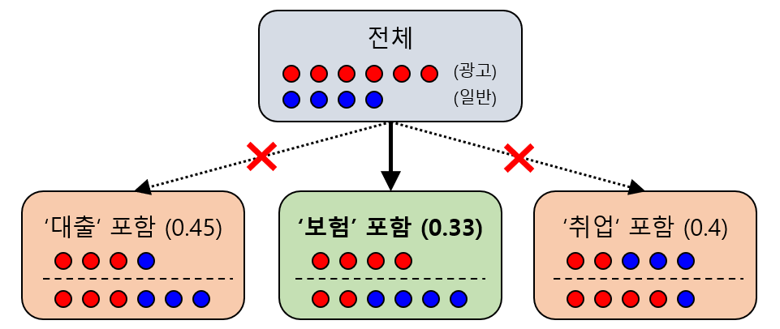

----

한편, "보험"이라는 키워드가 포함되어 있는 데이터는 다음과 같다.

| "대출" 포함 | "보험" 포함 | "취업" 포함 | 분류 |
|---------|---------|---------|----|
| True    | True    | False   | 광고 |
| False   | True    | True    | 광고 |
| True    | True    | False   | 광고 |
| False   | True    | False   | 광고 |

target 값이 모두 "광고"로 동일하기 때문에, **"보험" 키워드 포함 시 무조건 광고**인 것으로 "보험"이라는 키워드가 포함된 경우의 sub-tree를 종결한다.

또한, "보험"이라는 키워드가 포함되어 있지 않은 데이터는 다음과 같다.

| "대출" 포함 | "보험" 포함 | "취업" 포함 | 분류 |
|---------|---------|---------|----|
| True    | False   | False   | 광고 |
| False   | False   | True    | 일반 |
| False   | False   | True    | 광고 |
| True    | False   | True    | 일반 |
| False   | False   | False   | 일반 |
| False   | False   | True    | 일반 |

여기서 "보험" 포함 여부는 모두 False로 동일하므로 조건 feature로 더 이상 사용할 수 없기 때문에, 조건 feature로는 "대출" 포함 여부와 "취업" 포함 여부를 사용할 수 있다.

* **조건 feature가 "대출" 포함 여부일 때**
  * 계산값 : **("대출" 포함 비율) * ("대출" 포함 데이터의 Gini) + ("대출" 미포함 비율) + ("대출" 미포함 데이터의 Gini)**
  * = (2/6) * (1 - (1/2)^2 - (1/2)^2) + (4/6) * (1 - (1/4)^2 - (3/4)^2)
  * = (0.333333 * 0.5) + (0.666667 * 0.375)
  * = **0.416667**

* **조건 feature가 "취업" 포함 여부일 때**
  * 계산값 : **("취업" 포함 비율) * ("취업" 포함 데이터의 Gini) + ("취업" 미포함 비율) + ("취업" 미포함 데이터의 Gini)**
  * = (4/6) * (1 - (1/4)^2 - (3/4)^2) + (2/6) * (1 - (1/2)^2 - (1/2)^2)
  * = (0.666667 * 0.375) + (0.333333 * 0.5)
  * = **0.416667**

따라서 **두 조건 feature에 대한 Gini 값이 서로 같으므로**, 두 조건 feature 중 아무 것이나 다음 구분 기준으로 선택할 수 있다. 한편 이렇게 구분을 한 후에는 depth가 2로 max depth에 도달하므로 더 이상 Decision Tree의 node를 추가로 생성할 수 없다.

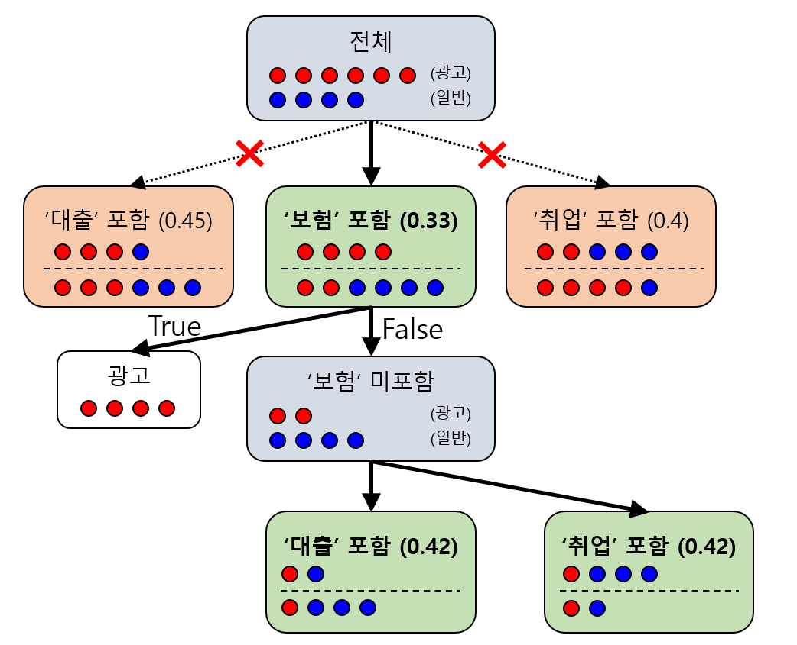

따라서 최종 Decision Tree는 다음 두 가지가 가능하다.

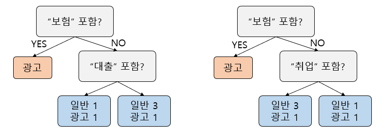

## 4. 탐구 (Gini vs. Entropy, 무엇이 좋을까?)

* 실험 목적
  * Decision Tree에서 새로운 subtree를 생성하기 위한 metric 으로 Gini 와 Entropy를 이용한다.
  * **Gini와 Entropy 중 성능이 좋은 metric은 무엇인지 탐구한다.**
* 참고 
  * Class가 2개일 때, 두 metric의 그래프 형태를 비교하면 다음과 같다.

| 원래 그래프로 비교                           | Gini 를 4배 하여 최댓값 일치 시                |
|--------------------------------------|--------------------------------------|
| 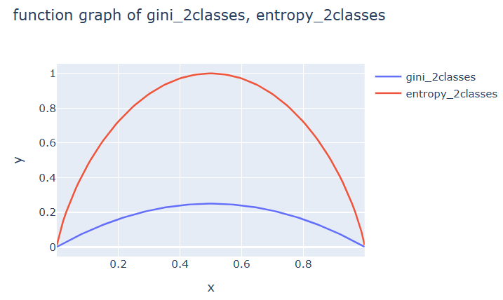 | 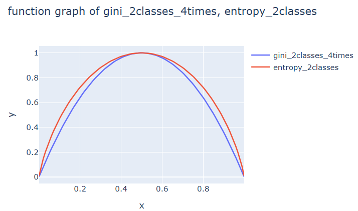 |

### 4-1. 실험 진행
* 데이터셋
  * ```sklearn.datasets``` 에 있는 데이터셋 중 **Breast Cancer 데이터셋** 선정
  * 선정 이유
    * 샘플 개수가 569개로, Iris, Wine 보다 훨씬 많아서 테스트 데이터를 통해 Gini vs. Entropy 의 성능을 변별하기에 보다 적합
    * 8x8 이미지 데이터셋인 digits 와 달리, 각 feature가 그 자체로 특성으로서 의미가 있음

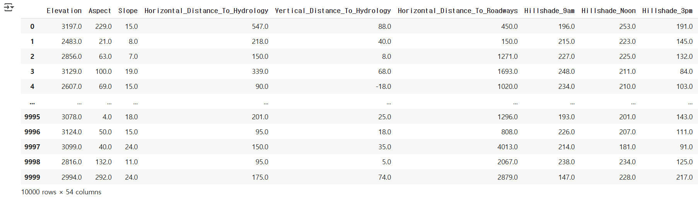

* 모델 configuration
  * Decision Tree
  * subtree 생성을 위한 metric은 'Gini' 와 'Entropy' 로 실험
  * max_depth는 1, 2, 3, ..., 12 로 실험
* 성능 metric
  * Accuracy (정확도)
  * F1 Score
  * Recall
    * 암세포를 암세포로 정확히 분류하는 비율
    * 해당 비율이 낮으면 암 치료가 늦어지는 중대한 문제가 발생하므로, Recall과 Precision 중 Recall을 선정

### 4-2. 실험 결과

**요약**
* 모든 성능 metric에 대해서 Gini와 Entropy 간 큰 차이가 없다.

**상세**

* Accuracy

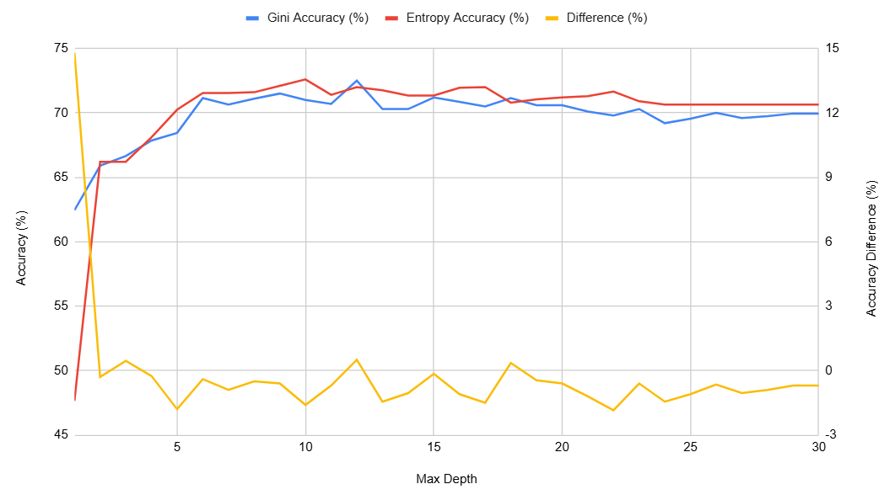

* Recall

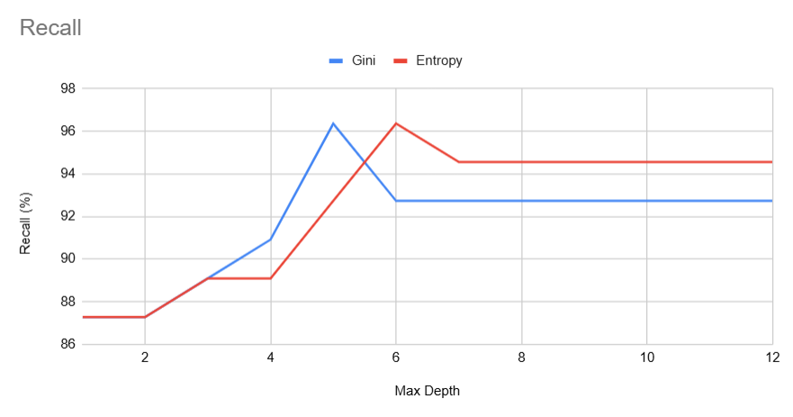

* F1 Score

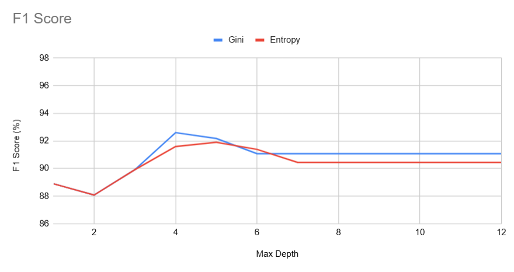

* subtree 생성 metric이 **Gini** 일 때

| Max Depth | Accuracy (%) | Recall (%) | F1-score (%) |
|-----------|--------------|------------|--------------|
| 1         | 91.61        | 87.27      | 88.89        |
| 2         | 90.91        | 87.27      | 88.07        |
| 3         | 92.31        | 89.09      | 89.91        |
| 4         | 94.41        | 90.91      | 92.59        |
| 5         | 93.71        | 96.36      | 92.17        |
| 6         | 93.01        | 92.73      | 91.07        |
| 7         | 93.01        | 92.73      | 91.07        |
| 8         | 93.01        | 92.73      | 91.07        |
| 9         | 93.01        | 92.73      | 91.07        |
| 10        | 93.01        | 92.73      | 91.07        |
| 11        | 93.01        | 92.73      | 91.07        |
| 12        | 93.01        | 92.73      | 91.07        |

* subtree 생성 metric이 **Entropy** 일 때

| Max Depth | Accuracy (%) | Recall (%) | F1-score (%) |
|-----------|--------------|------------|--------------|
| 1         | 91.61        | 87.27      | 88.89        |
| 2         | 90.91        | 87.27      | 88.07        |
| 3         | 92.31        | 89.09      | 89.91        |
| 4         | 93.71        | 89.09      | 91.59        |
| 5         | 93.71        | 92.73      | 91.89        |
| 6         | 93.01        | 96.36      | 91.38        |
| 7         | 92.31        | 94.55      | 90.43        |
| 8         | 92.31        | 94.55      | 90.43        |
| 9         | 92.31        | 94.55      | 90.43        |
| 10        | 92.31        | 94.55      | 90.43        |
| 11        | 92.31        | 94.55      | 90.43        |
| 12        | 92.31        | 94.55      | 90.43        |