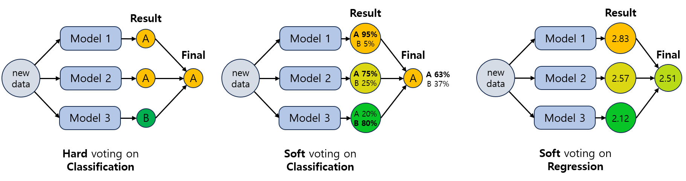
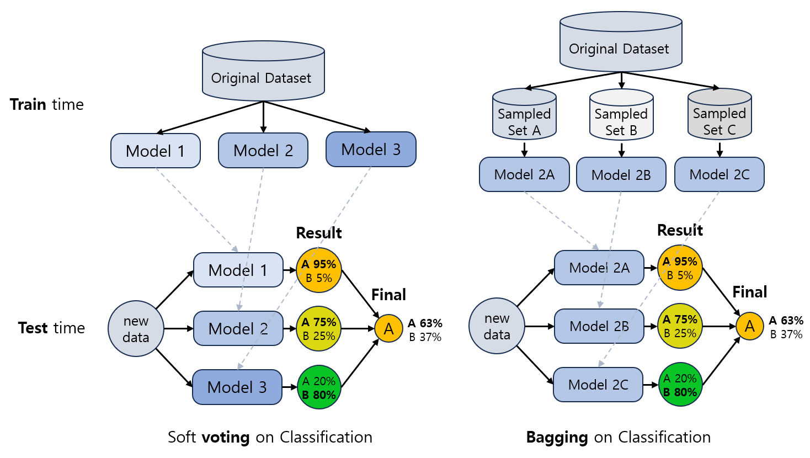
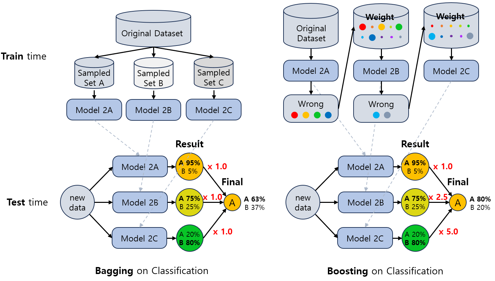
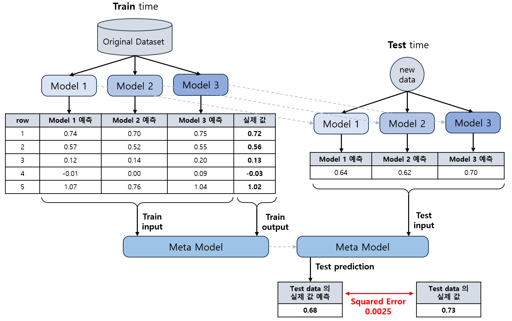

## 목차
* [1. Ensemble (앙상블)](#1-ensemble-앙상블)
* [2. Ensemble 의 방법론](#2-ensemble-의-방법론)
  * [2-1. Voting](#2-1-voting)
  * [2-2. Bagging](#2-2-bagging)
  * [2-3. Boosting](#2-3-boosting)
  * [2-4. Stacking](#2-4-stacking)

## 1. Ensemble (앙상블)
**Ensemble (앙상블)** 은 머신러닝을 할 때 여러 알고리즘을 결합하여 학습하는 것을 의미한다.

머신러닝에서 Ensemble 을 하는 이유는 여러 개의 모델을 사용함으로써 **1개의 모델로 학습할 때보다 더 좋은 성능을 발휘** 할 수 있기 때문이다.
* 단, 여러 개의 모델을 학습함으로써 발생하는 **추가 비용 및 알고리즘의 복잡성 증가** 는 trade-off 로서 고려해야 한다.

## 2. Ensemble 의 방법론
Ensemble 의 방법론에는 **Voting (보팅)**, **Bagging (배깅)**, **Boosting (부스팅)**, **Stacking (스태킹)** 이 있다.

각각의 방법론에 대한 설명은 다음과 같다.

| 방법론            | 설명                                                                                                                                     | 장/단점                                                           | 모델                                                                                   |
|----------------|----------------------------------------------------------------------------------------------------------------------------------------|----------------------------------------------------------------|--------------------------------------------------------------------------------------|
| Voting (보팅)    | - 여러 가지 모델이 예측한 결과를 종합 - **Hard Voting** 과 **Soft Voting** 으로 구분                                                                    | **[장]** 모델의 강/약점 보완 가능                                         |                                                                                      |
| Bagging (배깅)   | - 원본 데이터셋으로부터 **random sampling을 통해 새로운 데이터셋** 생성 - 각각의 새로운 데이터셋으로 학습한 결과를 종합                                                       | **[장]** overfitting, underfitting 방지                           | [Random Forest](머신러닝_모델_Random_Forest.md) 등                                          |
| Boosting (부스팅) | - Bagging 과 유사 - 단, 모델을 **순차적으로 학습하여 성능 개선** (이전 모델의 오답에 가중치를 두어 학습)                                                                | **[장]** 오답을 해결하므로 정확도 높음 **[단]** 오답의 높은 가중치로 인해 outlier에 취약 | - [XGBoost](머신러닝_모델_XGBoost.md)  - AdaBoost  - [LightGBM](머신러닝_모델_LightGBM.md) |
| Stacking (스태킹) | - [Cross Validation](머신러닝_방법론_Cross_Validation.md) 을 통해 개별 모델의 예측 생성 - 최종적으로 이들 예측을 학습 데이터로 하는 **메타 모델 (Meta Model) 을 학습** 하여 결과 도출 | **[장]** 모델의 강/약점 보완 가능                                         |                                                                                      |

* 성능이 낮은 모델의 처리
  * 성능이 낮은 모델은 Voting 등의 특정 방법론에서는 가중치를 낮게 줄 수 있다. 
  * 성능이 지나치게 낮아서 Ensemble을 통해 성능을 개선하는 데 기여할 수 없을 것으로 예상되는 모델은 제외 처리할 수도 있다.

### 2-1. Voting
**Voting (보팅)** 은 머신러닝 모델의 예측 결과를 종합하여 최종 예측 결과를 도출하는 것이다.

* **Hard Voting**
  * 각 모델의 예측 결과에 대한 다수결 투표를 통해 최종 class prediction 결정
* **Soft Voting**
  * 각 모델의 예측 결과를 평균하여 최종 결과값 예측
* 적용 방법 예시

| 구분             | Hard Voting         | Soft Voting                                                 |
|----------------|---------------------|-------------------------------------------------------------|
| Classification | 다수결 투표 결과로 최종 분류 결정 | - 각 Class에 대한 예측 확률값들을 합산 또는 평균 - 예측값이 가장 큰 Class로 최종 결정 |
| Regression     | -                   | 각 모델의 예측 결과를 평균 (또는 가중 평균)                                  |

### 2-2. Bagging
**Bagging (배깅)** 의 핵심 아이디어는 다음과 같다.
* 원본 데이터셋에 대한 random sampling 된 각각의 데이터를 학습하여, 같은 유형의 여러 개의 모델을 학습한다.
* 이렇게 학습된 여러 모델의 결과를 종합한다.

Voting 과 마찬가지로 모델의 예측 결과를 종합하여 최종 결과를 도출하며, Voting 과의 차이점은 다음과 같다.

| 구분    | Voting                                                                                                | Bagging                                                 |
|-------|-------------------------------------------------------------------------------------------------------|---------------------------------------------------------|
| 데이터셋  | 원본 데이터셋                                                                                               | 원본 데이터셋에서 **random sampling (복원추출)** 한 여러 개의 서로 다른 데이터셋 |
| 모델 구성 | 서로 다른 유형의 모델 (예: [K-Nearest-Neighbors](머신러닝_모델_KNN.md), [Decision Tree](머신러닝_모델_Decision_Tree.md)) | **서로 같은 유형** 의 모델 (학습 데이터만 서로 다른 모델)                 |

* Bagging의 장점은 다음과 같다.
  * 원본 데이터셋에 대한 서로 다른 random sampling에 의해, 더 많은 데이터를 학습하는 효과가 있음 (학습 데이터 부족을 보완 가능)
  * 학습 데이터 증가 효과로 인한 overfitting, underfitting 방지
  * 특히, 예측의 변동성이 큰 모델 (Decision Tree) 의 변동성 해결 가능

### 2-3. Boosting
**Boosting (부스팅)** 의 핵심 아이디어는 다음과 같다.

* Bagging 과 유사하게 **동일한 유형의 모델** 을 여러 개 학습 후, 이 모델들을 조합하여 강력한 모델 생성
* 단, 각 모델은 **직전 모델이 오답을 한 학습 데이터에 높은 가중치를 두어** 학습하여, **오류를 최소화** 하는 것이 목표
  * 첫 번째 모델은 가중치 없이 학습
* 학습 완료 후, 테스트 데이터에 대한 예측 시에는 **후반부의 성능 좋은 모델로 갈수록 높은 가중치** 를 두는 weighted voting 과 유사한 방법

### 2-4. Stacking
**Stacking (스태킹)** 의 핵심 아이디어는 다음과 같다.

* 학습 데이터에 대한 개별 모델의 예측값을 입력, 학습 데이터의 실제 출력값을 출력으로 하는 **메타 모델 (Meta Model)** 의 예측값을 최종 예측값으로 한다.
* **전체 학습 데이터에 대한** 개별 모델의 예측값을 생성하기 위해, [Cross Validation](머신러닝_방법론_Cross_Validation.md) 을 사용한다.

메타 모델의 입/출력 및 학습/테스트 데이터는 다음과 같다.
* 각 모델별 예측값을 입력으로, 실제 label을 출력으로 하기 때문에 **메타 모델** 이라고 한다.
* column 구성에서 개수는 Regression task 를 가정한 것이며, [One-hot 방법](머신러닝_방법론_One_Hot.md) 을 사용하는 Classification task의 경우 여기에 Class 개수만큼을 곱해야 한다.

|                          | 입력 데이터 (x, Feature)                             | 출력 데이터 (y, Label)                   |
|--------------------------|-------------------------------------------------|-------------------------------------|
| column 구성 (column 개수) | 각 모델 별 예측값 (개별 모델의 개수만큼)                     | 실제 출력값 (1개)                      |
| 학습 데이터                   | **학습** 데이터셋에 속한 각 데이터 (row) 에 대한 **각 모델의 예측값**  | 해당 각 **학습** 데이터 (row) 의 **실제 출력값**  |
| 테스트 데이터                  | **테스트** 데이터셋에 속한 각 데이터 (row) 에 대한 **각 모델의 예측값** | 해당 각 **테스트** 데이터 (row) 의 **실제 출력값** |

