## 목차
* [1. Gaussian Mixture Model](#1-gaussian-mixture-model)
  * [1-1. Gaussian Mixture Model 의 학습](#1-1-gaussian-mixture-model-의-학습) 
* [2. Gaussian Mixture의 알고리즘 (EM Algorithm)](#2-gaussian-mixture의-알고리즘-em-algorithm)
  * [2-1. 예측 (Expectation)](#2-1-예측-expectation)
  * [2-2. 최대화 (Maximization)](#2-2-최대화-maximization)
  * [2-3. 수렴 여부 검사](#2-3-수렴-여부-검사)
* [3. 각종 문제에서의 적용](#3-각종-문제에서의-적용)
* [4. 실험 - Gaussian Mixture vs. k-NN 분류 성능 비교](#4-실험---gaussian-mixture-vs-k-nn-분류-성능-비교)
  * [4-1. 실험 설계](#4-1-실험-설계)
  * [4-2. 실험 결과](#4-2-실험-결과)
* [5. 실험 - Gaussian Mixture vs. K-means 클러스터링 성능 비교](#5-실험---gaussian-mixture-vs-k-means-클러스터링-성능-비교)
  * [5-1. 실험 설계](#5-1-실험-설계)
  * [5-2. 실험 결과](#5-2-실험-결과)

## 코드
* [Gaussian Mixture vs. k-NN / K-means 성능 비교 실험 코드 (ipynb)](codes/Gaussian_Mixture_experiment.ipynb)

## 1. Gaussian Mixture Model
**Gaussian Mixture Model (GMM, 가우시안 혼합 모델)** 은 정규분포라고 하는 Gaussian Distribution의 혼합을 통해 데이터의 분포를 근사하는 머신러닝 방법론이다.

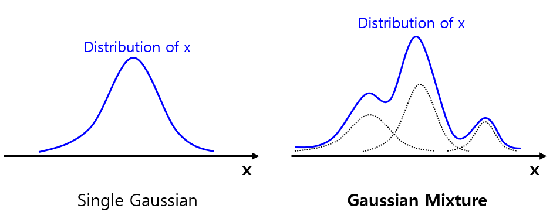

GMM에서 데이터 값 x가 나타날 확률은 다음과 같이 **가우시안 확률밀도함수의 합산** 으로 표현한다.

* **[수식]** $p(x) = \Sigma_{k=1}^K \pi_k N(x; \mu_k, \Sigma_k)$
  * $p(x)$ : 데이터 값 $x$ 의 확률
  * $K$ : Gaussian Distribution 의 개수
  * $pi_k$ : 각각의 Gaussian Distribution 의 반영 비율을 나타내는 **mixing coefficient**
  * $\mu_k$ : 해당 Gaussian Distribution 의 평균
  * $\Sigma_k$ : 해당 Gaussian Distribution 의 Covariance Matrix (표준편차 역할)

정규분포 $N(x; \mu_k, \Sigma_k)$ 는 다음과 같은 수식으로 나타낸다.

* $\displaystyle N(x; \mu_k, \Sigma_k) = \frac{1}{(2 \pi)^{D/2} \times |\Sigma|^{1/2}} exp(-\frac{1}{2} (x - \mu)^T \Sigma^{-1} (x - \mu))$

이때, mixing coefficient 를 **모두 합하면 1** 이 된다. 즉 다음과 같다.

* $\Sigma_{k=1}^K \pi_k = 1$
* $0 \le pi_k \le 1$

### 1-1. Gaussian Mixture Model 의 학습

GMM을 학습시키는 것은 다음을 의미한다.

* 주어진 데이터셋 X 에 대해 **확률 $p(X; \theta)$ 를 최대화** 하는, 각 Distribution 에 대한 다음 매개변수 ($\theta) 를 추정한다.
  * mixing coefficient, $\pi_1, \pi_2, ..., \pi_k$ 
  * 평균, $\mu_1, \mu_2, ..., \mu_k$
  * Covariance Matrix, $\Sigma_1, \Sigma_2, ..., \Sigma_k$ 

이때, 다음과 같이 **로그 가능도 (Log-likelihood, L(X))** 라는 개념을 이용한다. 즉, **L(X; \theta) = \log p(X; \theta) 의 $\mu_k$ 에 대한 미분값이 0이 되는 지점** 을 찾는다.
* **[로그 가능도]** $L(X, \theta) = \log p(X, \theta) = \log \Pi_{n=1}^N p(x_n; \theta)$
  * $X$ : 전체 데이터셋, $X = {x_1, x_2, ..., x_n}$
  * $\theta$ : 매개변수의 집합
  * $N$ : 전체 데이터의 개수
* **[목표]** $\displaystyle \frac{\delta L(X, \theta)}{\delta \mu_k} = \frac{\delta}{\delta \mu_k} \log \Pi_{n=1}^N p(x_n; \theta) = 0$ 인 매개변수를 찾는다.

----

**Gaussian Mixture 학습 상세**

GMM을 학습시키기 위해 $\displaystyle \frac{\delta L(X, \theta)}{\delta \mu_k} = \frac{\delta}{\delta \mu_k} \log \Pi_{n=1}^N p(x_n; \theta) = 0$ 인 매개변수를 찾는 과정은 다음과 같다.

먼저 Log Likelihood 의 수식은 다음과 같다.

* $L(X, \theta) = \log p(X, \theta) = \log \Pi_{n=1}^N p(x_n; \theta)$
* $= \Sigma_{n=1}^N \log (\Sigma_{k=1}^K \pi_k N(x_n; \mu_k, \Sigma_k))$

따라서, 이것을 $\mu_k$ 에 대해 미분했을 때 0이 되려면 다음과 같아야 한다.

* $\displaystyle \frac{\delta L(X; \theta)}{\delta \mu_k} = 0$
* $\displaystyle \frac{\delta}{\delta \mu_k} [\Sigma_{n=1}^N \log (\Sigma_{j=1}^K \pi_j N(x_n; \mu_j, \Sigma_j))] = 0$
* $\displaystyle [\Sigma_{n=1}^N \frac{\delta}{\delta \mu_k} \log (\Sigma_{j=1}^K \pi_j N(x_n; \mu_j, \Sigma_j))] = 0$

이 수식을 정리하면 다음과 같다.

* $\displaystyle \Sigma_{n=1}^N \frac{\pi_k N(x_n; \mu_k, \Sigma_k)}{\Sigma_{j=1}^K \pi_j N(x_j; \mu_j, \Sigma_j)} \times \Sigma_k^{-1} (x_n - \mu_k) = 0$

여기서 다음 부분을 **responsibility (책임값, $\gamma(z_{nk}$))** 이라고 한다.

* $\displaystyle \frac{\pi_k N(x_n; \mu_k, \Sigma_k)}{\Sigma_{j=1}^K \pi_j N(x_j; \mu_j, \Sigma_j)}$

따라서, 위 수식은 다음과 같이 표현할 수 있다.

* $\Sigma_{n=1}^N \gamma(z_{nk}) \Sigma_k^{-1} (x_n - \mu_k) = 0$

## 2. Gaussian Mixture의 알고리즘 (EM Algorithm)

Gaussian Mixture Model 의 학습 알고리즘은 다음과 같이 **Expectation (E step)** 과 **Maximization (M step)** 으로 구성된다.
* E Step 과 M Step 을 **수렴할 때까지 계속 반복** 한다.

| Step                  | 설명                                                                                                                                                            |
|-----------------------|---------------------------------------------------------------------------------------------------------------------------------------------------------------|
| Expectation (E step)  | - data point $x_n$ 이 특정 $k$ 번째 Gaussian 에서 온 것일 확률 **responsibility = $\gamma(z_{nk})$ 계산** - 이를 통해 각 data point 를 **responsibility 가 가장 큰 Gaussian 에 할당** |
| Maximization (M step) | - E step에서 구한 responsibility 를 이용하여 **매개변수의 집합 $\theta$ 를 업데이트**                                                                                              |
| 수렴 여부 판정              | - Log Likelihood 와 파라미터의 수렴 여부를 검사한다. - 수렴하면 학습을 종료한다.                                                                                                     |

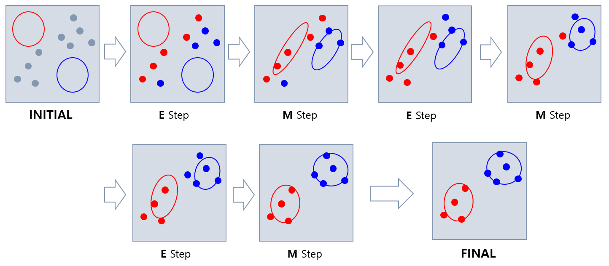

### 2-1. 예측 (Expectation)

**Expectation (E step)** 의 핵심 아이디어는 다음과 같다.

* **data point $x_n$ 이 특정 $k$ 번째 Gaussian 에서 온 것일 확률** 인 **책임값 (responsibility)** 계산
  * $\displaystyle \gamma(z_{nk}) = \frac{\pi_k N(x_n; \mu_k, \Sigma_k)}{\Sigma_{j=1}^K \pi_j N(x_j; \mu_j, \Sigma_j)}$
* 이를 통해 **각 data point 를 responsibility 가 가장 큰 Gaussian 에 할당** 한다.

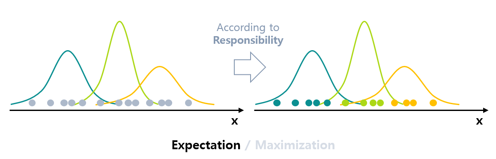

### 2-2. 최대화 (Maximization)

**Maximization (M step)** 의 핵심 아이디어는 다음과 같다.

* E step 에서 구한 **responsibility $\gamma(z_{nk})$ 를 이용하여 매개변수를 갱신** 한다.
  * mixing coefficient, $\pi_1, \pi_2, ..., \pi_k$ 
  * 평균, $\mu_1, \mu_2, ..., \mu_k$
  * Covariance Matrix, $\Sigma_1, \Sigma_2, ..., \Sigma_k$ 

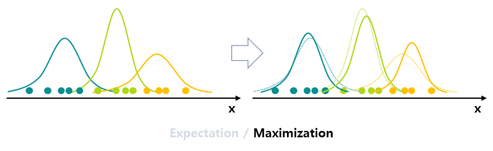

파라미터 $\theta$ 의 갱신 수식은 다음과 같다.

* 갱신 수식
  * $\displaystyle \mu_k^{new} = \frac{1}{N_k} \Sigma_{n=1}^N \gamma(z_{nk}) x_n$
  * $\displaystyle \Sigma_k^{new} = \frac{1}{N_k} \Sigma_{n=1}^N [\gamma (z_{nk}) (x_n - \mu_k^{new})(x_n - \mu_k^{new})^T]$
  * $\displaystyle \pi_k^{new} = \frac{N_k}{N}$
* 수식 설명
  * $N_k = \Sigma_{n=1}^N \gamma(z_{nk})$ 

이 값들은 다음과 같이 **Log likelihood 를 각 매개변수로 편미분한 값을 0으로 만든다. 즉 Likelihood 를 최대화 (GMM 학습의 목표)** 를 할 수 있다.

* $\displaystyle \frac{\delta L(X; \theta)}{\delta \mu_k^{new}} = 0$
* $\displaystyle \frac{\delta L(X; \theta)}{\delta \Sigma_k^{new}} = 0$
* $\displaystyle \frac{\delta L(X; \theta)}{\delta \pi_k^{new}} = 0$

### 2-3. 수렴 여부 검사

* 알고리즘이 수렴했는지를 판단하기 위해, Log Likelihood 와 파라미터 값들이 수렴했는지를 검사한다.
* 수렴했다고 판단되면 모델 학습을 종료한다.

## 3. 각종 문제에서의 적용

Gaussian Mixture Model 은 다음과 같이 여러 가지 문제에 적용할 수 있다.

| 문제                  | 분류    | 적용 방법                                                                                                                                                                                  |
|---------------------|-------|----------------------------------------------------------------------------------------------------------------------------------------------------------------------------------------|
| 분류 (Classification) | 지도학습  | - Class가 K개 있을 때, 입력 데이터 $x$ 에 대해 **responsibility $\gamma_k (x)$ 가 최대가 되는 class $k$** 를 찾는다.                                                                                          |
| 클러스터링 (Clustering)  | 비지도학습 | - 클러스터링에서는 [K-means](머신러닝_모델_K-means_Clustering.md) 와 같은 hard clustering 대신, **확률 정보가 있는 Clustering** 을 위해 사용한다.  - **responsibility $\gamma_k (x)$ 가 최대가 되는 class $k$** 로 클러스터링한다. |

## 4. 실험 - Gaussian Mixture vs. k-NN 분류 성능 비교

**실험 목적**

* Gaussian Mixture Model 과 [k-NN (K Nearest Neighbors)](머신러닝_모델_KNN.md) 의 **분류 (지도 학습)** 성능을 비교한다.

### 4-1. 실험 설계

**데이터셋 선정**

* 선정한 데이터셋
  * **Kaggle 의 [Credit Card Dataset for Clustering](https://www.kaggle.com/datasets/arjunbhasin2013/ccdata) 데이터셋**
  * 특정 column 을 target column 으로 설정
  * target column 의 숫자 값을 4 개의 구간으로 나누어 분류 문제로 변환 
* 선정 이유
  * 10개 이상의 feature 가 있는, 저차원은 아닌 데이터셋 **(실무에서 만나는 고차원 데이터셋과 거리가 멀지 않음)**
  * target 값이 3~7 개의 Class 로, 분류 및 클러스터링 성능 평가에 적절한 Classification task 데이터셋임
  * 양쪽 모델의 성능 비교가 가능할 만큼 충분히 큰 데이터셋
  * CC-0: Public Domain 으로 라이선스 이슈가 없음
* 추가 전처리
  * k-NN 에 적용하기 위해, [각 feature를 표준정규분포로 표준화](../Data%20Science%20Basics/데이터_사이언스_기초_Normalization.md#2-2-standarization-z-score-normalization)

**성능 metric**

* 선정한 성능 metric
  * **Accuracy**
  * **Macro F1 Score**
  * **Weighted F1 Score**
* 선정 이유
  * 4개의 각 Class 간에 [데이터 불균형](../Data%20Science%20Basics/데이터_사이언스_기초_데이터_불균형.md) 이 있기는 하지만, 가장 직관적인 성능지표로 Accuracy 를 선정
  * **3개 이상의 Multi-Class + 데이터 불균형** 상황에 적합한 것으로 [Macro, Weighted F1 Score](../Data%20Science%20Basics/데이터_사이언스_기초_Metrics_MultiClass.md#4-f1-score) 를 선정
  * [Micro F1 Score 는 Accuracy와 계산값이 항상 같으므로](../Data%20Science%20Basics/데이터_사이언스_기초_Metrics_MultiClass.md#4-4-accuracy--micro-f1-score--micro-precision--micro-recall-증명) 중복으로 판단하여 제외

### 4-2. 실험 결과

**결론 요약**

* Gaussian Mixture Model 은 k-NN 에 비해 **분류 문제** 에서의 **성능이 훨씬 떨어진다.**
* 다른 데이터셋에서도 k-NN 보다 분류 성능이 비교적 떨어질 것으로 예상된다.

**상세 결과**

| Metric            | Gaussian Mixture Model (Cluster 4개로 고정) | k-Nearest Neighbors (neighbor 1~50개) |
|-------------------|--------------------------------------------|-----------------------------------------|
| Accuracy          | 49.93%                                     | 80.50% - 85.36%                         |
| Macro F1 Score    | 45.66%                                     | 77.23% - 82.15%                         |
| Weighted F1 Score | 49.22%                                     | 80.15% - 84.67%                         |

* k-NN 의 Number of Neighbors 에 따른 **Accuracy, Macro F1 Score, Weighted F1 Score** 추이

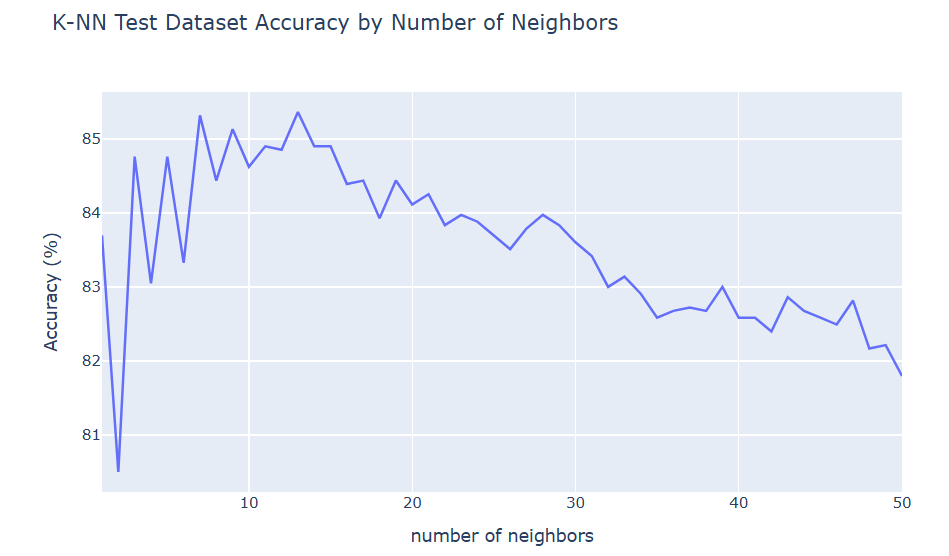

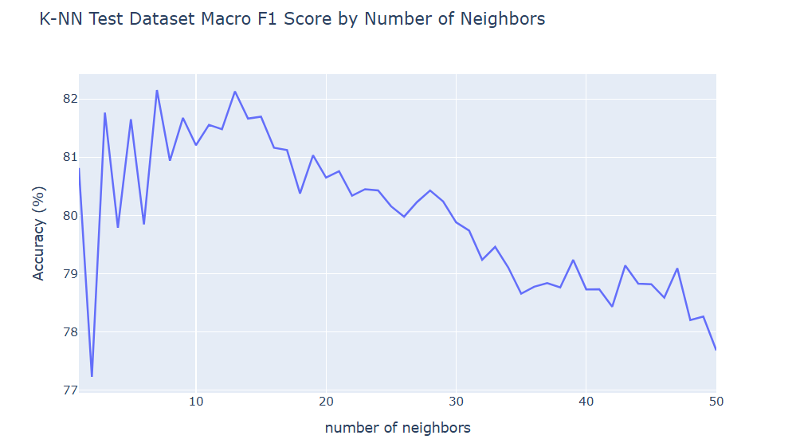

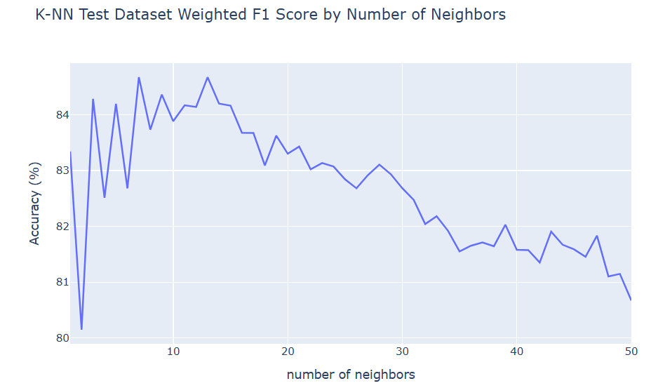

## 5. 실험 - Gaussian Mixture vs. K-means 클러스터링 성능 비교

**실험 목적**

* Gaussian Mixture Model 과 [K-means Clustering](머신러닝_모델_K-means_Clustering.md) 의 **Clustering (비지도 학습)** 성능을 비교한다.

### 5-1. 실험 설계

**데이터셋 선정**

* [Gaussian Mixture vs. k-NN 분류 성능 비교 실험](#4-실험---gaussian-mixture-vs-k-nn-분류-성능-비교) 과 동일

**성능 metric**

* 선정한 성능 metric
  * **[Silhouette Score](머신러닝_모델_K-means_Clustering.md#4-2-실루엣-silhouette-기법)**
* 선정 이유
  * K-means 등 Clustering 기법들의 성능 측정을 위한 널리 알려진 성능 metric 
  * [Elbow 기법](머신러닝_모델_K-means_Clustering.md#4-1-엘보우-elbow-기법) 은 Cluster 의 개수를 다양하게 조절해 가면서 하는데, 본 task 에서는 Cluster 의 개수가 Class의 개수, 즉 4개로 고정되어 있으므로 이 방법은 적절하지 않음

### 5-2. 실험 결과

**결론 요약**

* Gaussian Mixture Model 은 K-means 에 비해 **Clustering 성능이 훨씬 떨어진다.**
* 다른 데이터셋에서도 K-means 보다 Clustering 성능이 비교적 떨어질 것으로 예상된다.

**상세 결과**

| Metric           | Gaussian Mixture Model (Cluster 4개) | K-means Clustering (Cluster 4개) |
|------------------|----------------------------------------|------------------------------------|
| Silhouette Score | 0.0517                                 | 0.2481                             |

* **Principal Component Analysis** 시각화 결과 비교 (원본 데이터셋 vs. GMM vs. K-means)

|         | Principal Component Analysis             |
|---------|------------------------------------------|
| 원본      | 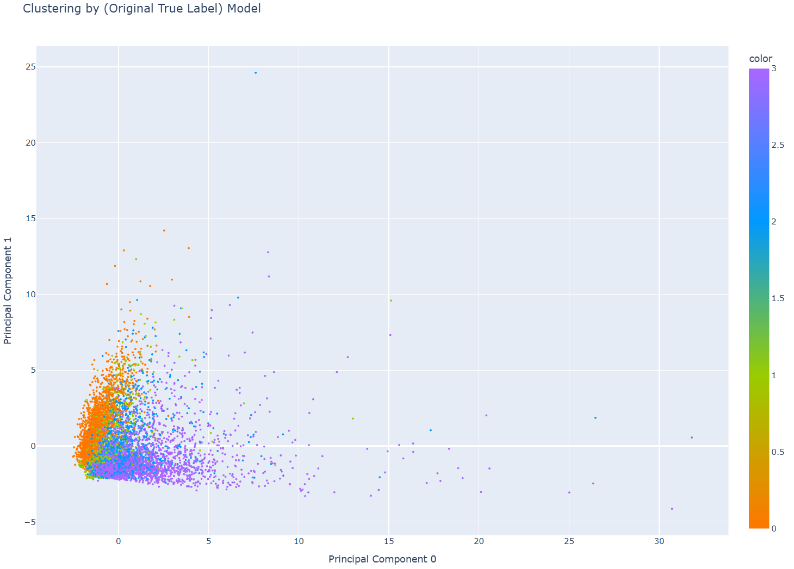  |
| GMM     | 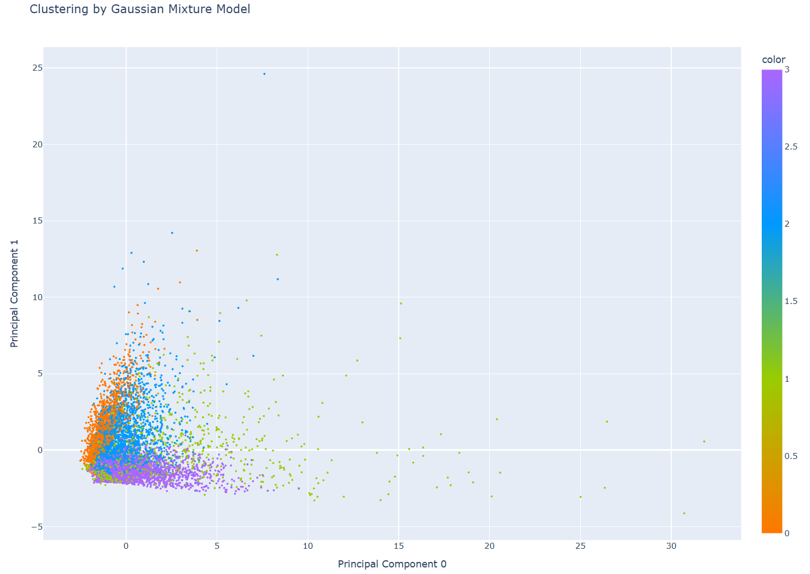 |
| K-means | 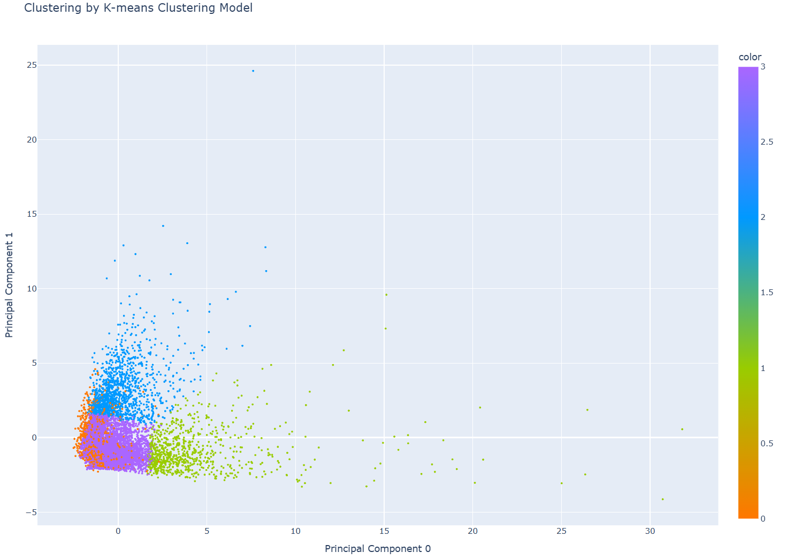 |

* **t-SNE** 시각화 결과 비교 (원본 데이터셋 vs. GMM vs. K-means)

|         | t-SNE                                    |
|---------|------------------------------------------|
| 원본      | 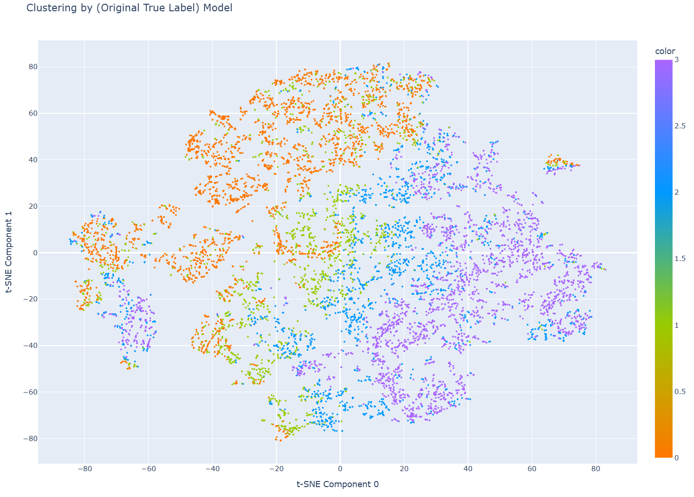  |
| GMM     | 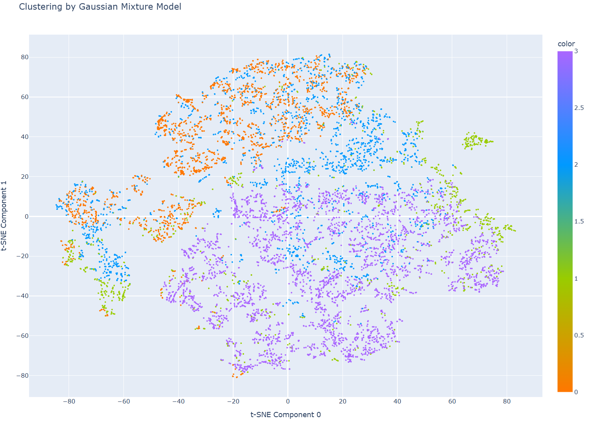 |
| K-means | 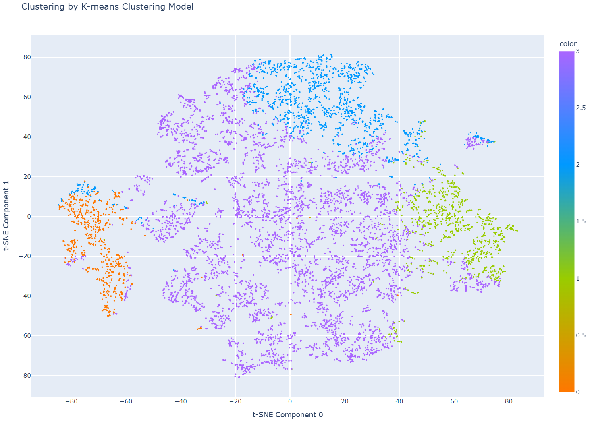 |
