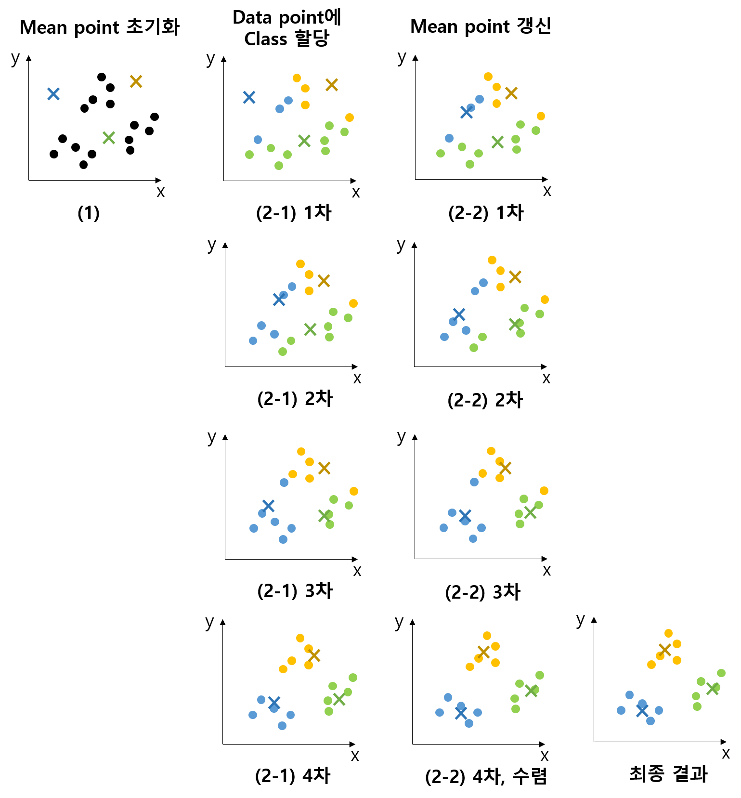

## 목차
* [1. K-means Clustering 이란?](#1-k-means-clustering-이란)
* [2. K-means Clustering 알고리즘 동작 원리](#2-k-means-clustering-알고리즘-동작-원리)
* [3. K-means Clustering 알고리즘 예시](#3-k-means-clustering-알고리즘-예시)
* [4. 최적의 K 값 선택 방법](#4-최적의-k-값-선택-방법)
  * [4-1. 엘보우 (Elbow) 기법](#4-1-엘보우-elbow-기법) 
  * [4-2. 실루엣 (Silhouette) 기법](#4-2-실루엣-silhouette-기법)

## 1. K-means Clustering 이란?
**K-means Clustering 알고리즘** 은 데이터를 K개의 cluster (집단) 으로 나누는 비지도학습 (Unsupervised Learning) 알고리즘이다.

예를 들어 다음의 데이터 (왼쪽 그림) 를 K=3인 K-means Clustering 알고리즘을 이용하여 오른쪽 그림과 같이 분류할 수 있다.

이 알고리즘을 이용하여 outlier를 찾을 수도 있다.

## 2. K-means Clustering 알고리즘 동작 원리
K-means Clustering은 다음과 같은 방식으로 동작한다.

* 1. 각 feature 변수들의 값을 랜덤하게 초기화한 mean point를 K개 만든다.
* 2. 다음을 수렴할 때까지 반복한다.
  * 2-1. 데이터셋에 있는 각 data point의 class를 가장 가까운 mean point에 해당하는 class로 assign 시킨다.
  * 2-2. 각 mean point를, 전체 데이터셋에서 해당 class로 assign된 data point들의 좌표의 각 feature 별 평균값으로 갱신한다.

여기서 수렴한다는 것은, 2-1, 2-2를 한번 더 반복했을 때 data point들의 assign이 더 이상 갱신되지 않는 것을 의미한다.

## 3. K-means Clustering 알고리즘 예시
위 그림을 예로 들어서 K-means Clustering을 실시하면 다음과 같다. (K=3)

* 초기 단계
  * **(1)** : mean point 3개를 랜덤으로 초기화한다.
* 1차 갱신
  * **(2-1) 1차** : 초기화된 mean point 중 가장 가까운 point로 각 data point의 class를 assign한다.
  * **(2-2) 1차** : mean point를 해당 class의 모든 data point들의 각 좌표 (feature 값) 의 평균값으로 갱신한다. (각 feature별로)
* 2차 갱신
  * **(2-1) 2차** : green class의 점 2개를 blue class로 re-assign한다.
  * **(2-2) 2차** : re-assign이 발생한 class인 green, blue의 mean point를 각각 갱신한다.
* 3차 갱신
  * **(2-1) 3차** : green class의 점 2개를 blue class로, blue class의 점 1개를 yellow class로 각각 re-assign한다.
  * **(2-2) 3차** : 모든 class에 re-assign (해당 class의 점 추가 또는 기존 점이 다른 class로 이동) 이 발생했으므로, 모든 mean point를 갱신한다.
* 4차 갱신
  * **(2-1) 4차** : blue -> yellow (점 1개), yellow -> green (점 1개) 로 data point의 class를 갱신한다.
  * **(2-2) 4차** : 모든 class에 re-assign이 발생했으므로, 모든 mean point를 갱신한다.
* 최종 결과
  * **최종 결과** : 이후 re-assign은 더 이상 일어나지 않으므로, 이것이 최종 수렴한 K-means Clustering의 결과이다.

## 4. 최적의 K 값 선택 방법

K-means Clustering 에서 최적의 클러스터링을 위한 K 값을 선택하기 위하여 다음의 방법을 사용할 수 있다.

| 방법                  | 설명                                                                                                                                                      |
|---------------------|---------------------------------------------------------------------------------------------------------------------------------------------------------|
| 엘보우 (Elbow) 기법      | - **Cluster의 data point들이 가깝게 모여 있는 정도**를 나타내는, Cluster의 중심과 해당 Cluster의 data point의 거리 제곱의 합 (SSE) 를 이용 - Cluster 개수와 SSE를 좌표로 하여 연결한 곡선에서 최적 지점 선택 |
| 실루엣 (Silhouette) 기법 | **Cluster의 일관성**을 수식으로 나타내고, 해당 수식의 값이 큰 K 값 탐색. 일관성이 높다는 것은 다음을 의미한다. - Cluster 의 샘플 간 거리의 평균이 짧음 - 가장 가까운 다른 Cluster와의 거리가 큼                    |

* 위 2가지 방법을 함께 이용하는 것이 최적의 K 값을 결정하는 좋은 방법으로 여겨진다.

### 4-1. 엘보우 (Elbow) 기법
**엘보우 (Elbow) 기법** 의 핵심 아이디어 및 방법론은 다음과 같다.
* **각 Cluster 내에 있는 data point들이 가깝게 모여 있는 정도** 를 **Cluster의 중심과 각 원소들 간의 거리 제곱의 합 (SSE)** 를 이용하여 측정
  * SSE 를 **inertia (관성)** 또는 **distortion (왜곡)** 으로 부르기도 함
* Cluster 개수에 따른 SSE의 값을 평면상의 그래프로 나타냄
* 이 그래프의 양 끝을 연결한 직선과의 거리가 최대가 되는 지점을 **최적 지점인 엘보우 (Elbow)** 로 간주
* **Elbow에 해당하는 Cluster 개수** 가 최적의 K 값임

### 4-2. 실루엣 (Silhouette) 기법
**실루엣 (Silhouette) 기법** 의 핵심 아이디어 및 방법론은 다음과 같다.
* **각 Cluster의 일관성** 을 다음을 고려하여 수식으로 정의한다.
  * 고려 대상
    * 동일 Cluster 내의 샘플 간 거리 (짧을수록 좋음)
    * 가장 가까운 다른 Cluster와의 거리 (길수록 좋음)
  * **[수식]** $S_i = \frac{b_i - a_i}{\max(a_i, b_i)}$
    * 각 샘플마다 계산 
    * $S_i$ : **실루엣 계수 (Silhouette Coef.) (클수록 좋음)**
    * $a_i$ : 동일 cluster 내의 다른 샘플과의 거리의 평균
    * $b_i$ : 가장 가까운 다른 cluster 에 있는 모든 샘플과의 거리의 평균
* 모든 data point에 대해 위와 같이 계산한 **실루엣 계수의 평균** 을 계산한다.
* 이 **실루엣 계수의 평균값이 가장 큰 K의 값이 최적의 K 값임**

참고로, 실루엣 계수는 일반적으로 0.0 ~ 1.0 의 범위 내에 있다.
* 위 수식에서 $b_i - a_i < b_i$ 가 항상 성립하므로 1.0 을 초과할 수 없다.
* 클러스터링이 정상적으로 이루어졌다면 $b_i > a_i$ 일 것이므로 0.0 미만일 수도 없다.

