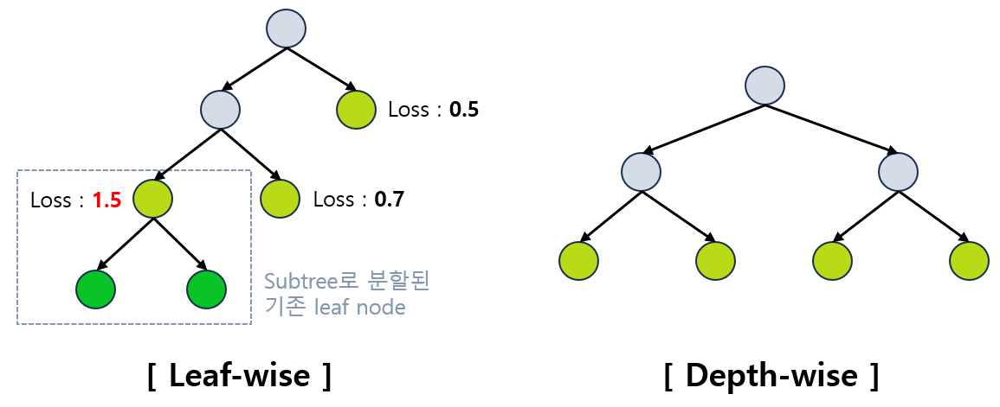
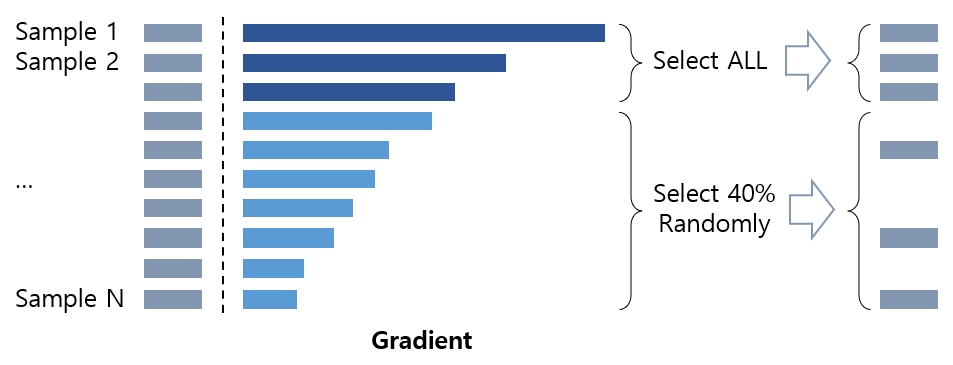
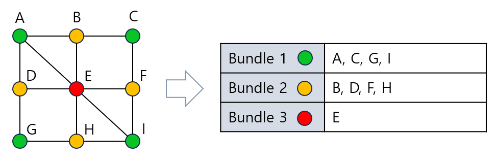
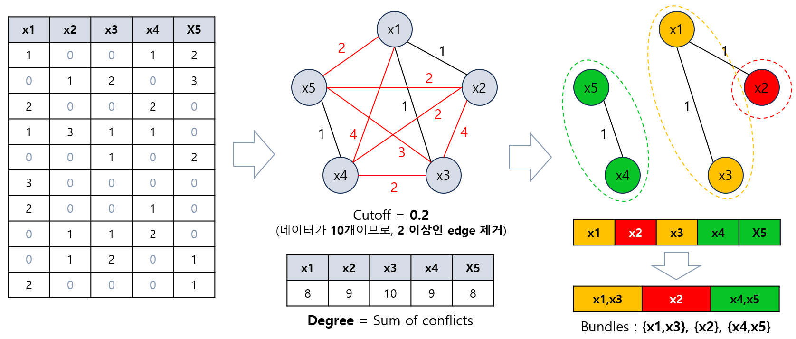
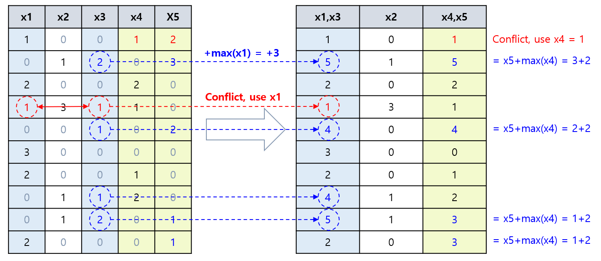

## 목차
* [1. LightGBM (Light Gradient Boosting Machine)](#1-lightgbm-light-gradient-boosting-machine)
* [2. LightGBM의 장단점](#2-lightgbm의-장단점)
* [3. Leaf-wise vs. Depth-wise](#3-leaf-wise-vs-depth-wise)
* [4. 알고리즘 상세](#4-알고리즘-상세)
  * [4-1. GOSS (Gradient-based One-Side Sampling)](#4-1-goss-gradient-based-one-side-sampling)
  * [4-2. EFB (Exclusive Feature Bundling)](#4-2-efb-exclusive-feature-bundling)
* [5. 하이퍼파라미터 (Python 라이브러리 기준)](#5-하이퍼파라미터-python-라이브러리-기준)
  * [5-1. 모델 기본 설정값 관련](#5-1-모델-기본-설정값-관련)
  * [5-2. 트리 구조 관련](#5-2-트리-구조-관련)
  * [5-3. overfitting 관련](#5-3-overfitting-관련)
  * [5-4. 기타 하이퍼파라미터](#5-4-기타-하이퍼파라미터)

## 1. LightGBM (Light Gradient Boosting Machine)
**LightGBM (Light Gradient Boosting Machine)** 은 [Ensemble (앙상블)](머신러닝_모델_Ensemble.md) 기법 중 [Boosting (부스팅)](머신러닝_모델_Ensemble.md#2-3-boosting) 방법을 적용한 모델 중 하나로, 핵심 아이디어는 다음과 같다.
* [Decision Tree](머신러닝_모델_Decision_Tree.md) 기반 모델
* Tree를 균형적으로 만들기보다는 **Loss를 최소화하는 방향으로 Tree를 확장하는 [leaf-wise](#3-leaf-wise-vs-depth-wise)** 알고리즘
  * 이를 통해 학습의 효율성이 향상되고, 결과적으로 학습 속도가 빨라진다. 
  * Loss를 최소화하기 위해, **loss가 최대인 leaf node** 를 분할한다.
* 추가적으로, [GOSS](#4-1-goss-gradient-based-one-side-sampling) 및 [EFB](#4-2-efb-exclusive-feature-bundling) 알고리즘을 통해, 각각 **일부 데이터, 일부 feature를 효율적으로 선택하여 학습** 한다.

LightGBM은 **큰 규모의 데이터셋 (1만 개 이상의 데이터)** 에 사용하기에 보다 적합하다.

외부 링크 : [LightGBM 공식 논문](https://papers.nips.cc/paper/2017/file/6449f44a102fde848669bdd9eb6b76fa-Paper.pdf)

## 2. LightGBM의 장단점

LightGBM의 장단점은 다음과 같다.

* 장점
  * 실행 속도가 빠름 (학습 시간 짧음)
  * 메모리 사용량이 적음
  * Categorical feature 를 그대로 학습 가능하며, [One-hot Encoding](머신러닝_방법론_One_Hot.md) 보다도 성능이 좋음
    * 이는 LightGBM이 Categorical feature를 자동으로 변환하기 때문 
* 단점
  * 데이터 크기가 작은 경우 overfitting 되기 쉬움

## 3. Leaf-wise vs. Depth-wise

Tree를 확장하는 방법으로는 **Leaf-wise 와 Depth-wise (Level-wise)** 가 있다.

|     | Leaf-wise (LightGBM 방식)                                                                  | Depth-wise                                             |
|-----|------------------------------------------------------------------------------------------|--------------------------------------------------------|
| 핵심  | - Loss가 가장 큰 leaf node를 subtree로 분할<br>- **성능 손실에 가장 크게 기여하는 leaf node를 분할** 하여 Loss 최소화 | Tree를 수평적으로 분할<br>- Tree의 균등화를 위한 **추가 연산 필요 → 속도 느림** |
| 속도  | 비교적 빠름                                                                                   | 비교적 느림                                                 |
| 정확도 | 비교적 높음                                                                                   | 비교적 낮음                                                 |



## 4. 알고리즘 상세
LightGBM에서는 다음과 같은 2가지 알고리즘을 사용한다.

| 알고리즘                                        | 목적                                    | 설명                                                                                                   |
|---------------------------------------------|---------------------------------------|------------------------------------------------------------------------------------------------------|
| **GOSS** (Gradient-based One-Side Sampling) | **sample 개수 축소**<br>(최적의 sample 선택)   | 값의 변화가 **Loss Function에 얼마나 큰 변화** 를 가져오는지 **(Gradient)** 를 기준으로, **일부 데이터만 sampling** 하여 데이터셋 크기 감소 |
| **EFB** (Exclusive Feature Bundling)        | **feature 개수 축소**<br>(최적의 feature 선택) | 0이 아닌 값을 동시에 가질 확률이 매우 낮은 **상호 배타적인 feature를 bundle로 묶어서** feature 개수를 줄임                            |

### 4-1. GOSS (Gradient-based One-Side Sampling)

**GOSS (Gradient-based One-Side Sampling, sample 개수 축소 목적)** 의 핵심 아이디어는 다음과 같다.

* 아래의 **가중치에 따라 일부 sample만을 학습 대상으로 선정** 한다.
  * 학습이 잘 이루어지지 않은 (under-trained) sample에 높은 가중치를 둔다.
  * 학습이 잘 이루어진 (well-trained) sample에는 낮은 가중치를 둔다.

여기서 **학습이 잘 이루어졌는지** 는 다음과 같이 판단한다.

* **sample의 값의 변화가 Loss Function에 영향을 주는 정도 (Gradient)** 가 클수록 학습이 잘 이루어지지 않은 것으로 판단한다.
  * Gradient가 클수록 Tree 분기에서의 information gain (모델의 출력값을 변별할 수 있는 정도) 에 대한 영향이 크기 때문이다.

GOSS가 **학습 데이터셋의 크기를 줄이는** 실제 동작 방식은 다음과 같다.

* 동작 방식
  * Gradient 기준으로 sample을 정렬한다.
  * Gradient가 상위 일정 비율인 sample은 **학습 대상으로 모두** 선정한다.
  * 나머지 하위 일정 비율의 sample은 **그 일부만 학습 대상** 으로 선정한다. **(일정 비율만큼 랜덤하게)**
* 효과
  * 학습 데이터셋 크기 감소로 모델 실행 속도 향상
  * 데이터셋 크기를 줄이면서도 이를 구성하는 학습 데이터를 최적으로 선정



### 4-2. EFB (Exclusive Feature Bundling)

**EFB (Exclusive Feature Bundling, feature 개수 축소 목적)** 의 핵심 아이디어는 다음과 같다.

* 상호 배타적인 feature (0이 아닌 값을 동시에 가질 확률이 매우 낮은) 를 bundle 로 묶고, 이를 **단일 feature 로 합친다.**
* feature가 아주 많은 데이터셋은 이러한 상호 배타적인 feature가 있을 가능성이 높다.
* feature 개수의 축소를 통해 **tree의 overfitting을 방지** 할 수 있다.

EFB가 **학습 데이터셋의 feature 개수를 줄이는** 실제 동작 방식은 다음과 같다.

**1. Bundle로 묶을 feature 선정**

* 기본 배경
  * 배타적인 feature의 bundle을 선정하는 문제는 **그래프 색칠 문제 (Graph Coloring Problem)** 으로 바꿀 수 있다.
    * vertex : 각 feature를 나타냄
    * color : 같은 color 의 **서로 연결되지 않는 (conflict가 적은)** feature (vertex) 끼리 bundle 로 묶어야 함
  * 그래프 색칠 문제는 **NP-hard (해답이 여러 가지일 수 있으며, 다항식 시간 내 해결 불가)** 문제임
  * 따라서, **Greedy 방식의 근사 알고리즘** 을 이용



* 근사 알고리즘
  * 각 feature 간 **0이 아닌 값을 동시에 갖는 sample의 개수 (=conflict)** 를 edge의 가중치로 한 그래프를 만든다.
    * vertex : 각 feature를 나타냄
    * edge : 2개의 모든 vertex 간에 존재
  * 이 그래프에서 가중치가 **(전체 sample 개수) * (cutoff)** 이상인 edge 를 모두 제거한다.
  * 남은 edge로 연결된 각 그룹끼리 묶어서 feature 의 bundle 을 만든다.



* 위 이미지에서 edge의 값이 '1'인 feature 끼리 같은 색으로 연결되었는데, 이것은 **edge의 값이 낮음 → conflict가 적음 → 위 그래프 색칠 문제에서는 서로 연결되지 않음** 을 의미한다.

**2. 선정한 feature를 Bundle로 구성**

Bundle로 단일화된 feature의 값은 다음과 같이 구성한다.

* 모든 feature의 값이 0인 경우
  * 0을 사용 
* 1개의 feature만 0이 아닌 경우
  * 첫번째 feature이면, 그 feature의 값을 사용 
  * 첫번째 feature가 아니면, 이전 모든 feature들의 최댓값의 합 + 그 feature의 값을 사용
* 2개 이상의 feature가 0이 아닌 경우
  * 기준 feature 등 특정한 1개의 feature의 값 사용 
  * **정보 손실 발생**
  * 그러나, **feature 선정 과정에서 해당 케이스를 최소화했음**



## 5. 하이퍼파라미터 (Python 라이브러리 기준)

[Python의 LightGBM 라이브러리](https://github.com/microsoft/LightGBM/tree/master/python-package) 를 기준으로, LightGBM을 구성하는 하이퍼파라미터는 다음과 같다.
* Scikit-learn 라이브러리의 LightGBM 에서는 아래와 이름이 다를 수 있다.

| 구분             | 하이퍼파라미터                                                                                                   | 의미                                                                                                                                                                                |
|----------------|-----------------------------------------------------------------------------------------------------------|-----------------------------------------------------------------------------------------------------------------------------------------------------------------------------------|
| 모델 기본 설정값 관련   | - num_iterations<br>- learning_rate<br>- boosting<br> - objective<br> - metric<br> - early_stopping_round | - [Boosting (부스팅)](머신러닝_모델_Ensemble.md#2-3-boosting) 에서의 모델 학습 반복 횟수<br>- 학습률<br>- 알고리즘 종류<br>- 해결할 문제의 유형<br>- loss 측정용 metric<br>- 해당 반복 횟수만큼 연속으로 성능 신기록이 없으면 학습 종료            |
| 트리 구조 관련       | - max_depth<br>- num_leaves<br>- min_gain_to_split                                                        | - 트리의 최대 깊이<br>- 1개의 tree의 최대 leaf node 개수<br>- Tree 분기를 위한 최소 information gain                                                                                                   |
| Overfitting 관련 | - min_data_in_leaf<br>- lambda_l1 <br>- lambda_l2                                                         | - 각 leaf node가 최소 이 값만큼의 row를 의미<br>- L1 [Regularization](../Deep%20Learning%20Basics/딥러닝_기초_Regularization.md#2-l1-l2-regularization)의 Lambda 값<br>- L2 Regularization의 Lambda 값 | 
| 기타             | - bagging_freq<br>- bagging_fraction<br>- feature_fraction                                                | - 몇 번의 모델 학습마다 [Bagging](머신러닝_모델_Ensemble.md#2-2-bagging)을 진행할 것인지의 값<br>- 각 Tree에서 샘플링되는 데이터의 비율<br>- 각 Tree에서 선택되는 feature의 비율                                                  |                                                                                                                                                           

### 5-1. 모델 기본 설정값 관련

모델 기본 설정값 관련 하이퍼파라미터는 **num_iterations, learning rate, boosting, objective, metric, early_stopping_round** 등이 있다.

* num_iterations
  * LightGBM은 기본적으로 [Boosting (부스팅)](머신러닝_모델_Ensemble.md#2-3-boosting) 에 기반한 방법이다.
  * Boosting 에서는 기본 모델을 여러 번 반복 학습하여 강력한 모델을 만드는데, 이때의 반복 횟수이다.
* learning rate
  * **학습률 (학습의 진행 속도)** 로, 딥러닝에서와 유사한 의미
  * 범위는 0 ~ 1
  * 클수록 학습 속도는 빨라지지만 overfitting 의 위험이 있음
* boosting
  * 알고리즘 종류

| 값    | 알고리즘                                                                                             |
|------|--------------------------------------------------------------------------------------------------|
| gdbt | Gradient Boosting [Decision Tree](머신러닝_모델_Decision_Tree.md)                                      |
| rf   | [Random Forest](머신러닝_모델_Random_Forest.md)                                                        |
| dart | DART (Dropouts meet Multiple Additive Regression Trees) [(논문)](https://arxiv.org/pdf/1505.01866) |
| goss | [GOSS (Gradient-based One-Side Sampling)](#4-1-goss-gradient-based-one-side-sampling)            |

* metric
  * [Loss 측정용 metric (= Loss Function)](../Deep%20Learning%20Basics/딥러닝_기초_Loss_function.md#2-다양한-loss-function)
  * MSE (Mean Squared Error), MAE (Mean Absolute Error) 등
* early stopping round
  * ```num_iterations``` 횟수만큼 반복 학습 도중, 해당 횟수만큼 연속으로 성능 신기록이 나오지 않으면 학습을 종료한다.
  * 딥러닝에서의 early stopping patience와 유사하다.

### 5-2. 트리 구조 관련

트리 구조 관련 하이퍼파라미터에는 **max_depth, num_leaves, min_gain_to_split** 등이 있다.

* max_depth
  * 각 Tree의 최대 깊이
  * Tree가 너무 깊어지면 overfitting, 너무 얕으면 underfitting 발생 가능
  * 0으로 지정하면 깊이 제한 없음
* num_leaves
  * 각 Tree가 가질 수 있는 leaf node의 개수의 최댓값
* min_gain_to_split
  * leaf node를 분기하여 subtree를 생성하기 위한 최소한의 information gain 

### 5-3. Overfitting 관련

Overfitting을 조절하기 위한 목적의 하이퍼파라미터로는 **min_data_in_leaf, lambda_l1, lambda_l2** 등이 있다.

* min_data_in_leaf
  * 각 leaf node가 최소 이 값만큼의 row를 나타내고 있어야 한다.
  * 즉, 각 leaf node가 나타내야 하는 최소한의 sample 개수를 의미한다.
  * leaf node가 나타내는 **sample 개수가 너무 적으면 overfitting의 위험** 이 있다.
* lambda_l1, lambda_l2
  * [L1, L2 Regularization](../Deep%20Learning%20Basics/딥러닝_기초_Regularization.md#2-l1-l2-regularization) 에서 각각 사용되는 Lambda 값

### 5-4. 기타 하이퍼파라미터

* bagging_freq
  * 몇 번의 모델 학습 (iteration, [Boosting](머신러닝_모델_Ensemble.md#2-3-boosting) 관점) 마다 [Bagging](머신러닝_모델_Ensemble.md#2-2-bagging)을 진행할 것인지를 나타내는 '주기'의 값
  * 0이면 bagging을 실시하지 않음
* bagging_fraction
  * bagging을 실시할 때, 전체 학습 데이터 중 랜덤하게 선택하여 학습에 사용할 데이터의 비율
* feature_fraction
  * 각 회차의 모델 학습 (iteration) 에서, 전체 feature 중 랜덤하게 선택하여 학습에 사용할 feature의 비율